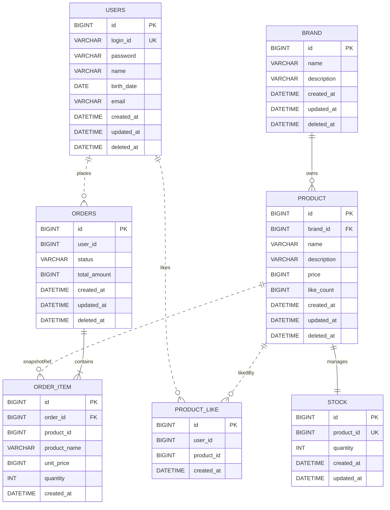

# 04. ERD

> **스코프**: 영속화 스키마. 컨텍스트 경계는 03 클래스 다이어그램 참조.
> **표기 규칙**: 실선 `||--`은 FK 강제(같은 컨텍스트), 점선 `||..`은 FK 미강제 논리 참조(외부/스냅샷).

- Stock은 동시성 제어가 필수이고 변경 패턴이 Product 본체와 크게 달라 별 엔티티로 분리. 단, 트랜잭션 일관성을 위해 Product Aggregate 내부에 둠 (@OneToOne 또는 별 테이블 + 같은 트랜잭션). like_count는 약한 일관성으로 충분해 Product 컬럼으로 유지.
