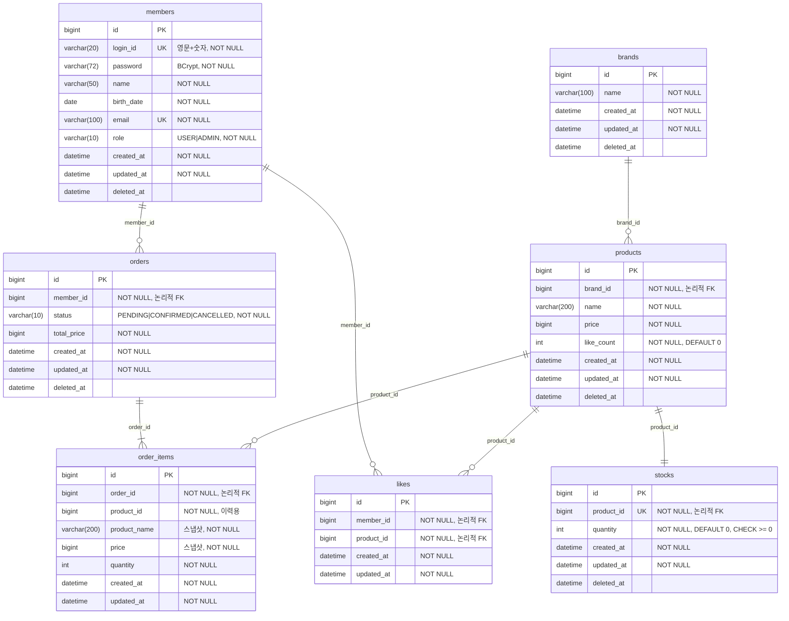

# 04. ERD

> 작성일: 2026-05-21
> DB: MySQL
> 컬럼 네이밍: snake_case
> FK 제약조건: 없음 (애플리케이션 레벨에서 관계 관리)
> Soft Delete: `deleted_at` 컬럼으로 처리 (Like 제외)

---

## ERD 다이어그램

---

## 제약조건 및 인덱스

### Unique 제약

| 테이블 | 컬럼 | 이유 |
|--------|------|------|
| members | login_id | 중복 로그인 ID 방지 |
| members | email | 중복 이메일 방지 (탈퇴 계정 포함) |
| stocks | product_id | Product : Stock = 1:1 |
| likes | (member_id, product_id) | 동일 상품 중복 좋아요 방지 |

### 인덱스

| 테이블 | 컬럼 | 이유 |
|--------|------|------|
| products | brand_id | 브랜드별 상품 목록 조회 |
| products | like_count | 좋아요 많은 순 정렬 |
| products | created_at | 최신순 정렬 (기본) |
| orders | (member_id, created_at) 복합 | 내 주문 목록 날짜 범위 필터 — 두 컬럼을 같이 쓰는 쿼리라 복합 인덱스가 효율적 |
| order_items | order_id | 주문 상세 조회 |
| members | deleted_at | @SQLRestriction 자동 조건 (`deleted_at IS NULL`) |
| brands | deleted_at | @SQLRestriction 자동 조건 |
| products | deleted_at | @SQLRestriction 자동 조건 |
| stocks | deleted_at | @SQLRestriction 자동 조건 |
| orders | deleted_at | @SQLRestriction 자동 조건 |

---

## 설계 결정 사항

### FK 제약조건을 사용하지 않는 이유
DB FK 제약은 INSERT/UPDATE/DELETE 시 참조 무결성 검사로 인한 성능 저하가 발생합니다.
대신 애플리케이션 레벨에서 존재 여부를 검증하고 관계를 관리합니다.

### Soft Delete 정책

| 테이블 | 정책 | 이유 |
|--------|------|------|
| members | Soft Delete | 탈퇴 후 이메일/로그인 ID 재가입 차단, 주문 이력 보존 |
| brands | Soft Delete | 브랜드 삭제 시 연결 상품 연쇄 처리 |
| products | Soft Delete | 삭제 후 주문 내역에서 상품명 조회 가능 |
| stocks | Soft Delete | 상품 삭제 시 재고 이력 보존 |
| orders | Soft Delete | 취소 주문 이력 보존 |
| likes | Hard Delete | 좋아요 취소 시 레코드 불필요, 재입점 시 초기화 |
| order_items | 삭제 없음 | 주문 당시 스냅샷 영구 보존 |

### 스냅샷 컬럼 (order_items)
`product_name`, `price`는 주문 시점의 값을 복사 저장합니다.
`total_price`는 주문 생성 시 `sum(order_item.price * order_item.quantity)`로 계산하며, Product 현재 가격이 아닌 **OrderItem 스냅샷 기준**입니다.
`product_id`는 이력 추적용으로만 사용하며 `@SQLRestriction` 필터를 적용하지 않습니다.

### likeCount 역정규화
`products.like_count`는 Like 테이블 COUNT 쿼리 없이 목록 조회 성능을 높이기 위한 역정규화 컬럼입니다.
좋아요 등록/취소 시 단일 트랜잭션으로 동기화합니다.

---

## 잠재 리스크
- `members.deleted_at`이 있어도 `login_id`, `email` Unique 제약으로 인해 탈퇴 후 재가입 불가 → 의도된 정책
- `products.like_count` 동시 요청 시 순간적 오차 가능 → 좋아요 수 1~2개 오차는 비즈니스에 영향 없으므로 허용
- `order_items`에 `deleted_at` 없음 → 삭제 불가, 영구 이력 보존이 목적
