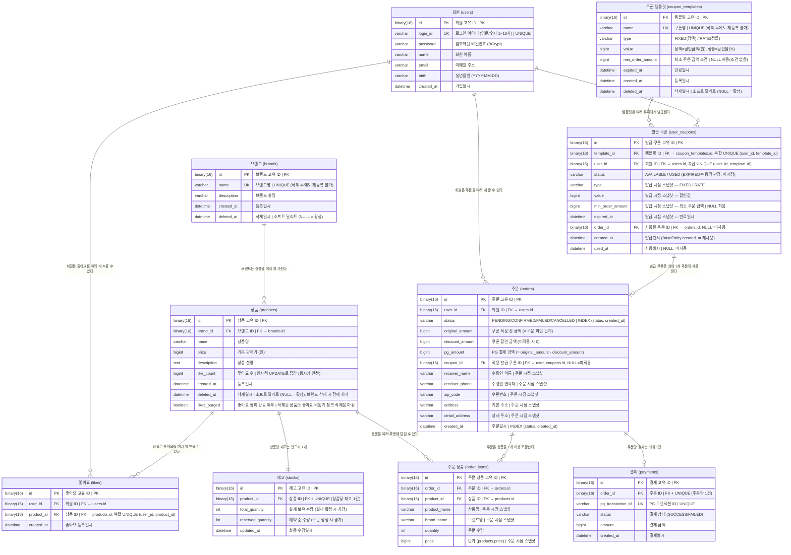

# ERD

## 목적
영속성 구조에서 관계의 주인, 유니크 제약, 정규화 여부를 검증한다.

## 관계 표기 범례 (Crow's Foot)

| 표기 | 의미 | 이 ERD에서 사용 위치 |
|---|---|---|
| `\|\|--\|\|` | 1 : 1 (양쪽 반드시 1개) | products → stocks |
| `\|\|--o\|` | 1 : 0 or 1 (오른쪽 없을 수도 있음) | orders → payments |
| `\|\|--o{` | 1 : 0 or N (오른쪽 없거나 여러 개) | users → orders, products → likes 등 |
| `\|\|--\|{` | 1 : 1 or N (오른쪽 반드시 1개 이상) | _(현재 미사용)_ |

```
기호 단위 의미
  ||  →  정확히 1개
  o|  →  0 또는 1개
  o{  →  0개 이상 (없을 수도)
  |{  →  1개 이상 (반드시 존재)
```


## 다이어그램



## 테이블 설계 상세

### users
- `login_id`: 유니크 제약. 중복 가입 방지
- 포인트 기능 제거로 `point` 컬럼 및 `point_histories` 테이블 삭제됨

### brands
- 상품과 독립된 엔티티. 브랜드 단독 조회 가능
- 상품이 brand_id를 외래키로 참조
- `name`: UNIQUE. 활성 브랜드명 중복 금지 + **삭제(소프트 딜리트)된 브랜드명도 재등록 불가**
  - 정책: 삭제된 브랜드명을 제3자가 재등록하면 브랜드 사칭/이미지 편승 위험 → 영구 차단
  - 삭제 행이 유니크 슬롯을 점유하는 것이 의도된 동작 (deleted_seq 트릭/아카이브 테이블 불필요)
- `deleted_at`: 소프트 딜리트. 브랜드 삭제 시 기록하며, 조회는 `deleted_at IS NULL` 조건으로 필터링
- 브랜드 삭제 시 소속 상품도 함께 소프트 딜리트 (cascade)

### products
- `brand_id`: brands 테이블 외래키
- `like_count`: 좋아요 수. 빠른 조회를 위해 비정규화
  - 좋아요 등록 시 likes INSERT + **원자적 UPDATE**(`SET like_count = like_count + 1 WHERE id=?`) (같은 트랜잭션)
  - 좋아요 취소 시 likes DELETE + **원자적 UPDATE**(`SET like_count = like_count - 1 WHERE id=? AND like_count > 0`) (같은 트랜잭션)
  - 동시 좋아요/취소 시 Lost Update를 원자적 UPDATE로 방지 (인메모리 read-modify-write 미사용)
  - 삭제(소프트 딜리트)된 상품은 노출되지 않으므로 좋아요 비동기 물리삭제 시 `like_count`를 보정하지 않는다
- 가격은 주문 시점 스냅샷이 order_items에 저장되므로 변경되어도 과거 주문에 영향 없음
- `deleted_at`: 소프트 딜리트. 상품/브랜드 삭제 시 기록. 복구 대상(브랜드 복구 시 함께 복구)
- `likes_purged`: 삭제된 상품의 좋아요(고용량, 복구 가치 없음)를 비동기 배치로 청크 삭제하기 위한 마킹
  - 대상 조회: `deleted_at IS NOT NULL AND likes_purged = false`
  - 배치가 `likes.product_id` 단위로 청크 DELETE 후 `likes_purged = true`로 마킹 (반복 스캔 방지)

### 삭제·복구 정책 (요약)
- **소프트 딜리트 (복구 가능)**: brands, products — 저용량, 복구 가치 있음
- **상품에 종속되어 자동 처리**: stocks — 플래그 없음. 상품 삭제 시 자동으로 도달 불가(숨김), 상품 복구 시 자동으로 도달 가능(복구). 저용량이라 정리 불필요
- **비동기 물리 삭제 (복구 제외)**: likes — 고용량(수천만~수억), 삭제된 상품의 좋아요는 의미 없음 → 배치 청크 삭제
- 브랜드 삭제 트랜잭션은 brands/products의 `deleted_at`만 기록(즉시 노출 차단). 좋아요 대량 삭제는 비동기 배치가 수행

### stocks
- 옵션 개념 없음 — 재고는 **상품 단위**(상품당 재고 1건)
- `product_id`: UK — 상품당 재고 1개 보장
- `total_quantity`: 실제 보유 재고 (결제 확정 시 차감, 관리자가 수정 가능)
- `reserved_quantity`: 예약 중인 수량 (주문 생성 시 증가, 시스템 관리값 — 관리자 직접 수정 불가)
- 가용 재고 = `total_quantity - reserved_quantity`
- **불변식**: `total_quantity >= reserved_quantity` (가용 ≥ 0). 항상 성립해야 함
  - 예약: `UPDATE ... SET reserved += qty WHERE (total - reserved) >= qty` (조건부, 오버셀 방지)
  - 관리자 재고 수정: `UPDATE ... SET total = :newTotal WHERE :newTotal >= reserved` (reserved 미만이면 거부)
- `updated_at`: 재고 변경 추적용

### likes
- `(user_id, product_id)` 복합 유니크 제약 필요 → 중복 좋아요 DB 레벨 방어
- 등록(`POST`)/취소(`DELETE`) 분리, 각각 멱등: 이미 있으면 INSERT 생략, 없으면 DELETE no-op

### orders
- `status`: PENDING / CONFIRMED / FAILED / CANCELLED
- `original_amount`: 쿠폰 적용 전 금액. order_items의 `SUM(price × quantity)` 와 일치
- `discount_amount`: 쿠폰 할인 금액. 쿠폰 미적용 시 0
- `pg_amount`: 최종 PG 결제 금액 = `original_amount - discount_amount`. payments.amount 와 일치
  - 쿠폰 미적용 시 `original_amount = pg_amount`, `discount_amount = 0`
- `coupon_id`: 적용된 발급 쿠폰(`user_coupons`) ID. 미적용 시 NULL. 주문↔쿠폰 양방향 추적용(쿠폰의 `order_id`와 상호 참조)
- 배송지 컬럼 (`receiver_name`, `receiver_phone`, `zip_code`, `address`, `detail_address`): 주문 시점 스냅샷
- `expires_at` 없음 (재시도 없음, 스케줄러가 created_at 기준 **15분 초과** 시 만료 판단)
- 인덱스: `(status, created_at)` → 스케줄러의 만료 PENDING 주문 조회 성능 보장

### order_items
- 주문 생성 시점에 INSERT되는 라인 아이템 테이블 (한 주문에 1개 이상)
- `product_name`: 당시 상품명 스냅샷
- `brand_name`: 당시 브랜드명 스냅샷
- `price`: 당시 단가 스냅샷 (`products.price`)
- 상품이 소프트 딜리트되어도 스냅샷이 보존되어 과거 주문 조회에 영향 없음

### payments
- `order_id`: UK — 주문당 결제 1건 (재시도 없음)
- `pg_transaction_id`: UK — PG 트랜잭션 ID 중복 방지
- `status`: SUCCESS / FAILED

### coupon_templates
- 관리자가 관리하는 쿠폰 할인 규칙. 발급의 원본
- `name`: UNIQUE. 활성 쿠폰명 중복 금지 + **삭제(소프트 딜리트)된 쿠폰명도 재등록 불가** (브랜드 정책 ⑧과 동일)
- `type`: `FIXED`(정액, `value`=원) / `RATE`(정률, `value`=%)
- `min_order_amount`: 최소 주문 금액 조건. NULL이면 조건 없음
- `expired_at`: 만료일시. 발급 쿠폰의 만료 판정 기준이 발급 시점에 복사됨
- `deleted_at`: 소프트 딜리트. 삭제해도 이미 발급된 `user_coupons`는 스냅샷이라 영향 없음
- 조회는 `deleted_at IS NULL` 필터(관리자 목록/상세는 정책에 따라 포함 여부 결정)

### user_coupons
- 유저에게 발급된 쿠폰 단위. 발급 시점에 템플릿의 할인 규칙(`type`/`value`/`min_order_amount`/`expired_at`)을 **스냅샷**으로 복사 보관 → 템플릿 수정/삭제와 독립
- `(user_id, template_id)` 복합 UNIQUE — 동일 템플릿 유저당 1회 발급 보장
- `status`: `AVAILABLE` / `USED` 만 저장. `EXPIRED`는 조회/사용 시 `expired_at < now`로 동적 판정(미저장)
- 사용 처리: `UPDATE ... SET status='USED', order_id=:orderId, used_at=now WHERE id=:id AND status='AVAILABLE'` (조건부, affected=0이면 이미 사용 → 409)
- 복구 처리(결제 실패/만료): `UPDATE ... SET status='AVAILABLE', order_id=NULL, used_at=NULL WHERE id=:id AND status='USED'`
- `order_id`: 사용된 주문. orders.coupon_id와 상호 참조(1:1)
- 발급일시는 BaseEntity `created_at`을 재사용한다 (별도 `issued_at` 컬럼 없음)

## 제약 조건 요약

| 테이블 | 제약 | 목적 |
|---|---|---|
| users.login_id | UNIQUE | 중복 가입 방지 |
| brands.name | UNIQUE | 브랜드명 중복 방지 (삭제 후 재등록도 차단) |
| stocks.product_id | UNIQUE | 상품당 재고 1개 보장 |
| likes.(user_id, product_id) | 복합 UNIQUE | 중복 좋아요 방지 |
| payments.order_id | UNIQUE | 주문당 결제 1건 |
| payments.pg_transaction_id | UNIQUE | PG 트랜잭션 중복 방지 |
| coupon_templates.name | UNIQUE | 쿠폰명 중복 방지 (삭제 후 재등록도 차단) |
| user_coupons.(user_id, template_id) | 복합 UNIQUE | 동일 템플릿 유저당 1회 발급 |

## 인덱스 요약

| 테이블 | 인덱스 | 목적 |
|---|---|---|
| orders | `(status, created_at)` | 스케줄러의 만료 PENDING 주문 조회 풀스캔 방지 |
| products | `(brand_id, deleted_at)` | 관리자 브랜드별 상품 목록 조회 + 활성 상품 필터 |
| brands | `(deleted_at)` | 활성 브랜드 목록 조회 필터 |
| user_coupons | `(user_id)` | 내 쿠폰 목록 조회 |
| user_coupons | `(template_id)` | 관리자 템플릿별 발급 내역 조회 |
| coupon_templates | `(deleted_at)` | 활성 템플릿 목록 조회 필터 |
