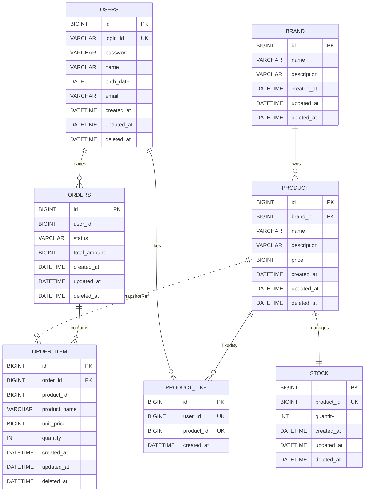

# 04. ERD

```mermaid
erDiagram
    USERS ||--o{ ORDERS : places
    USERS ||--o{ PRODUCT_LIKE : likes
    BRAND ||--o{ PRODUCT : owns
    PRODUCT ||--|| STOCK : manages
    PRODUCT ||--o{ PRODUCT_LIKE : likedBy
    PRODUCT ||..o{ ORDER_ITEM : snapshotRef
    ORDERS ||--|{ ORDER_ITEM : contains

    USERS {
        BIGINT id PK
        VARCHAR login_id UK
        VARCHAR password
        VARCHAR name
        DATE birth_date
        VARCHAR email
        DATETIME created_at
        DATETIME updated_at
        DATETIME deleted_at
    }

    BRAND {
        BIGINT id PK
        VARCHAR name
        VARCHAR description
        DATETIME created_at
        DATETIME updated_at
        DATETIME deleted_at
    }

    PRODUCT {
        BIGINT id PK
        BIGINT brand_id FK
        VARCHAR name
        VARCHAR description
        BIGINT price
        DATETIME created_at
        DATETIME updated_at
        DATETIME deleted_at
    }

    STOCK {
        BIGINT id PK
        BIGINT product_id UK
        INT quantity
        DATETIME created_at
        DATETIME updated_at
        DATETIME deleted_at
    }

    PRODUCT_LIKE {
        BIGINT id PK
        BIGINT user_id UK
        BIGINT product_id UK
        DATETIME created_at
    }

    ORDERS {
        BIGINT id PK
        BIGINT user_id
        VARCHAR status
        BIGINT total_amount
        DATETIME created_at
        DATETIME updated_at
        DATETIME deleted_at
    }

    ORDER_ITEM {
        BIGINT id PK
        BIGINT order_id FK
        BIGINT product_id
        VARCHAR product_name
        BIGINT unit_price
        INT quantity
        DATETIME created_at
        DATETIME updated_at
        DATETIME deleted_at
    }
```
