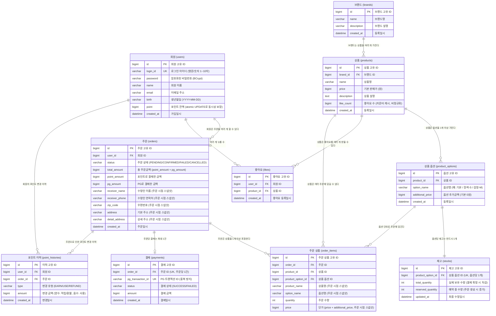

# ERD

## 목적
영속성 구조에서 관계의 주인, 유니크 제약, 정규화 여부를 검증한다.

## 관계 표기 범례 (Crow's Foot)

| 표기 | 의미 | 이 ERD에서 사용 위치 |
|---|---|---|
| `\|\|--\|\|` | 1 : 1 (양쪽 반드시 1개) | product_options → stocks |
| `\|\|--o\|` | 1 : 0 or 1 (오른쪽 없을 수도 있음) | orders → payments |
| `\|\|--o{` | 1 : 0 or N (오른쪽 없거나 여러 개) | users → orders, products → likes 등 |
| `\|\|--\|{` | 1 : 1 or N (오른쪽 반드시 1개 이상) | _(현재 미사용)_ |

```
기호 단위 의미
  ||  →  정확히 1개
  o|  →  0 또는 1개
  o{  →  0개 이상 (없을 수도)
  |{  →  1개 이상 (반드시 존재)
```


## 다이어그램



## 테이블 설계 상세

### users
- `point`: 포인트 잔액. `UPDATE ... WHERE point >= ?` atomic UPDATE로 동시성 보장
- `login_id`: 유니크 제약. 중복 가입 방지

### brands
- 상품과 독립된 엔티티. 브랜드 단독 조회 가능
- 상품이 brand_id를 외래키로 참조

### products
- `brand_id`: brands 테이블 외래키
- `like_count`: 좋아요 수 카운터 캐시. 빠른 조회를 위해 비정규화
  - 좋아요 등록 시 likes INSERT + like_count +1 (같은 트랜잭션)
  - 좋아요 취소 시 likes DELETE + like_count -1 (같은 트랜잭션)
  - 정합성 보정: 주기적 배치로 `COUNT(*) FROM likes` 와 동기화
- 가격은 주문 시점 스냅샷이 order_items에 저장되므로 변경되어도 과거 주문에 영향 없음

### product_options
- `option_name`: 옵션명 (ex. "기본", "흰색/S", "검정/M")
- `additional_price`: 옵션 추가금액 (기본 0원). 실제 가격 = `products.price + additional_price`
- 옵션 없는 상품은 `option_name = "기본"`, `additional_price = 0` 인 옵션 1개 자동 생성

### stocks
- `product_option_id`: UK — 옵션당 재고 1개 (product_id → product_option_id로 변경)
- `total_quantity`: 실제 보유 재고 (결제 확정 시 차감)
- `reserved_quantity`: 예약 중인 수량 (주문 생성 시 증가)
- 가용 재고 = `total_quantity - reserved_quantity`
- `updated_at`: 재고 변경 추적용

### likes
- `(user_id, product_id)` 복합 유니크 제약 필요 → 중복 좋아요 DB 레벨 방어
- 멱등 토글: 존재하면 DELETE, 없으면 INSERT

### orders
- `status`: PENDING / CONFIRMED / FAILED / CANCELLED
- `total_amount`: 총 결제 금액 (point_amount + pg_amount)
- `point_amount`: 포인트로 결제한 금액
- `pg_amount`: PG로 결제한 금액
- 배송지 컬럼 (`receiver_name`, `receiver_phone`, `zip_code`, `address`, `detail_address`): 주문 시점 스냅샷
- `expires_at` 없음 (재시도 없음, 스케줄러가 created_at 기준으로 만료 판단)
- 인덱스: `(status, created_at)` → 스케줄러의 만료 PENDING 주문 조회 성능 보장

### order_items
- 주문 생성 시점에 INSERT되는 라인 아이템 테이블
- `product_name`: 당시 상품명 스냅샷
- `option_name`: 당시 옵션명 스냅샷 (ex. "기본", "흰색/S")
- `price`: 당시 단가 스냅샷 (`products.price + additional_price` 계산값)

### payments
- `order_id`: UK — 주문당 결제 1건 (재시도 없음)
- `pg_transaction_id`: UK — PG 트랜잭션 ID 중복 방지
- `status`: SUCCESS / FAILED

### point_histories
- append-only 이력 테이블
- `type`: EARN (적립) / USE (사용) / REFUND (환불)
- `amount`: 양수(적립/환불) / 음수(사용)
- `order_id`: 주문으로 인한 포인트 변경 추적

## 제약 조건 요약

| 테이블 | 제약 | 목적 |
|---|---|---|
| users.login_id | UNIQUE | 중복 가입 방지 |
| stocks.product_option_id | UNIQUE | 옵션당 재고 1개 보장 |
| likes.(user_id, product_id) | 복합 UNIQUE | 중복 좋아요 방지 |
| payments.order_id | UNIQUE | 주문당 결제 1건 |
| payments.pg_transaction_id | UNIQUE | PG 트랜잭션 중복 방지 |

## 인덱스 요약

| 테이블 | 인덱스 | 목적 |
|---|---|---|
| orders | `(status, created_at)` | 스케줄러의 만료 PENDING 주문 조회 풀스캔 방지 |
