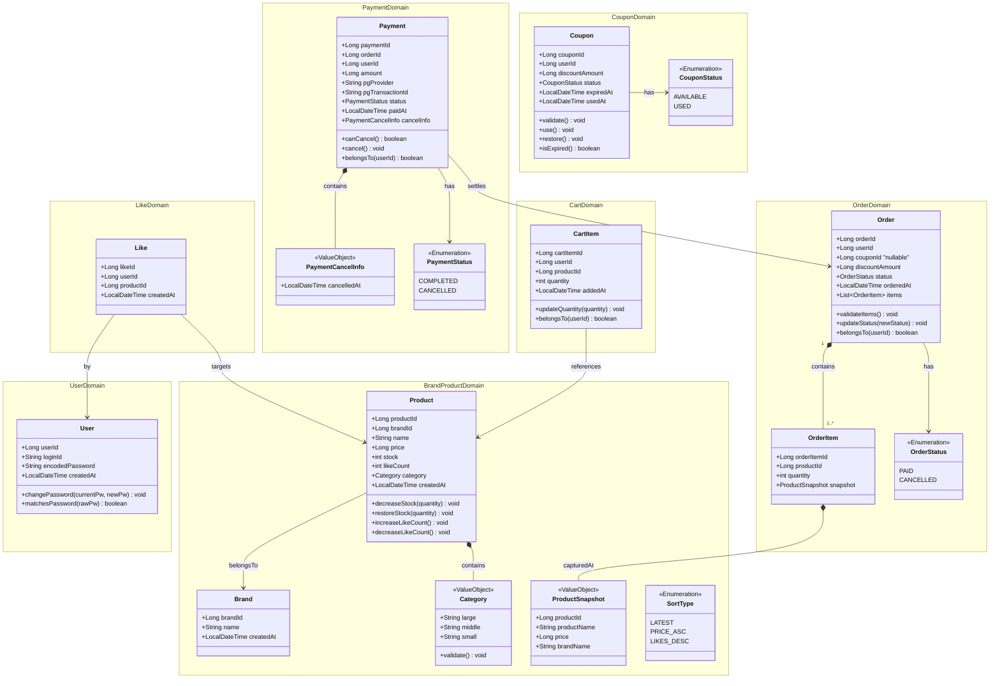

# 클래스 다이어그램 (Domain Object Design)

## 설계 원칙

| 원칙 | 적용 기준 |
|------|-----------|
| Entity vs VO | ID 존재 여부 + 독립적 생명 주기 보유 여부 |
| 연관 관계 | 단방향 기본. 양방향은 도메인 탐색이 반드시 필요한 경우에만 허용 |
| 비즈니스 책임 | 상태 변경·불변식 검증·생명 주기 전이는 도메인 객체 내부에 위치 |

---

## 클래스 다이어그램

---

## Entity / VO 분류 근거

### Entity (ID + 독립 생명 주기 보유)

| 클래스 | ID | 생명 주기 근거 |
|--------|----|----------------|
| User | userId | 회원가입 → 탈퇴. 독립적으로 생성·수정·삭제 |
| Brand | brandId | 어드민이 등록·수정·삭제. 독립 생존 |
| Product | productId | 브랜드와 독립적으로 등록·수정·삭제 가능 |
| Like | likeId | 유저가 등록·취소. 독립 식별 필요 |
| Order | orderId | 주문 생성 → 결제 → 취소. 상태 기계 보유 |
| OrderItem | orderItemId | 주문 내 개별 항목. 재고 차감·복원의 단위 |
| CartItem | cartItemId | 개별 담기·수량변경·제거 가능. 독립 식별 필요 |
| Payment | paymentId | 결제 처리·취소의 주체. 단일 생명 주기 보유 |
| Coupon | couponId | 발급·사용·복원의 독립 상태 기계 보유 |

### Value Object (ID 없음, 소유 객체에 종속)

| 클래스 | 소유 Entity | 근거 |
|--------|------------|------|
| Category | Product | 대/중/소 분류는 상품의 속성이며 독립 식별 불필요. 상품 삭제 시 함께 소멸 |
| ProductSnapshot | OrderItem | 주문 시점 상품 정보의 사본. 불변이며 원본과 분리. 독립 생명 주기 없음 |
| PaymentCancelInfo | Payment | 취소 시점에 생성되는 취소 정보 묶음. ID 없음. 전액 환불만 지원하므로 취소 일시만 보유. Payment 단일 테이블에 컬럼으로 저장 |

---

## 비즈니스 책임 배치 근거

### User
- `changePassword`: 현재 비밀번호 일치 검증 + 새 비밀번호 동일성 검증 + 업데이트를 한 흐름으로 처리. 외부에서 User 상태를 직접 조작하지 못하도록 캡슐화.
- `matchesPassword`: 비밀번호 검증 규칙(인코딩 비교)을 User 외부에 두면 User 내부 표현(인코딩 방식)이 노출됨.

### Product
- `decreaseStock` / `restoreStock`: 재고는 Product의 핵심 불변식(stock ≥ 0)을 가짐. Service에서 직접 조작하면 불변식 보장 불가.
- `increaseLikeCount` / `decreaseLikeCount`: likeCount는 Like 도메인이 발생시키는 이벤트의 결과지만, Product의 정렬·표시 상태이므로 Product가 직접 관리.

> **Trade-off 기록**: likeCount를 Product에 두면 Like 도메인과 Product 도메인이 결합됨. 규모가 커지면 별도 카운터 테이블 + 이벤트 방식으로 분리 검토.

### Order
- `validateItems`: 주문 항목이 비어 있으면 안 된다는 규칙은 Order 자신이 알아야 함.
- `updateStatus`: 상태 전이 유효성(예: CANCELLED → PAID 불가)을 Order가 보유. 외부에서 status 필드를 직접 수정하면 불법 상태 전이 발생 가능.
- `belongsTo`: 소유권 검증 로직을 Service에 두면 User ID 비교 로직이 여러 Service에 흩어짐.

### Payment
- `canCancel`: `PaymentStatus`가 이미 CANCELLED인지, 취소 불가 상태인지를 Payment가 자신의 상태로 판단.
- `cancel()`: status를 CANCELLED로 전이하고 `PaymentCancelInfo`를 생성해 내부에 보유. 전액 환불만 지원하므로 환불 금액은 `Payment.amount`에서 그대로 읽으면 되어 별도 파라미터 불필요.
- `belongsTo`: Order와 동일한 이유.

### Coupon
- `isExpired`: `expiredAt < now` 여부를 Coupon이 직접 판단. 호출부에서 날짜 비교 로직이 흩어지는 것을 방지.
- `validate`: `isExpired()`와 status=AVAILABLE 두 조건을 동시에 검증. 결제 시 쿠폰 적용 전 반드시 호출.
- `use` / `restore`: CouponStatus 전이를 Coupon 외부에서 하면 상태 기계가 Facade/Service로 누출됨.

### CartItem
- `updateQuantity`: 수량 ≥ 1 불변식을 CartItem이 직접 강제.
- `belongsTo`: 타 유저 접근 방지 로직의 위치.

---

## 책임 집중 점검 (God Object 방지)

| 객체 | 메서드 수 | 판정 | 비고 |
|------|-----------|------|------|
| User | 2 | 적절 | 인증 관련에만 집중 |
| Brand | 0 | 적절 | CRUD 중심, 비즈니스 규칙 최소 |
| Product | 4 | 적절 | 재고·좋아요 수는 모두 Product 핵심 상태. likeCount 분리 시 재검토 |
| Like | 0 | 적절 | 관계 기록용 엔티티 |
| Order | 3 | 적절 | 상태 기계 + 소유권 + 항목 검증으로 역할 명확 |
| OrderItem | 0 | 적절 | 스냅샷 보관 컨테이너 |
| CartItem | 2 | 적절 | 수량 관리 + 소유권 |
| Payment | 3 | 적절 | 취소 가능 여부 + 취소 처리 + 소유권. PaymentCancelInfo를 내부에서 관리하므로 응집도 높음 |
| Coupon | 4 | 적절 | 상태 기계(AVAILABLE ↔ USED) + 만료 판단으로 역할 명확 |

**결론: 책임 집중 없음.** 각 도메인 객체가 자신의 상태와 불변식만 관리하며, 크로스 도메인 조율은 Facade 계층이 담당한다.

### 향후 분리 검토 지점
- `Product.likeCount`: 트래픽 증가 시 좋아요 이벤트 → 비동기 카운터 갱신 패턴으로 전환 고려
- `Order.items (List<OrderItem>)`: 주문 항목 수가 많아지면 Lazy Loading 또는 별도 조회 분리 고려
