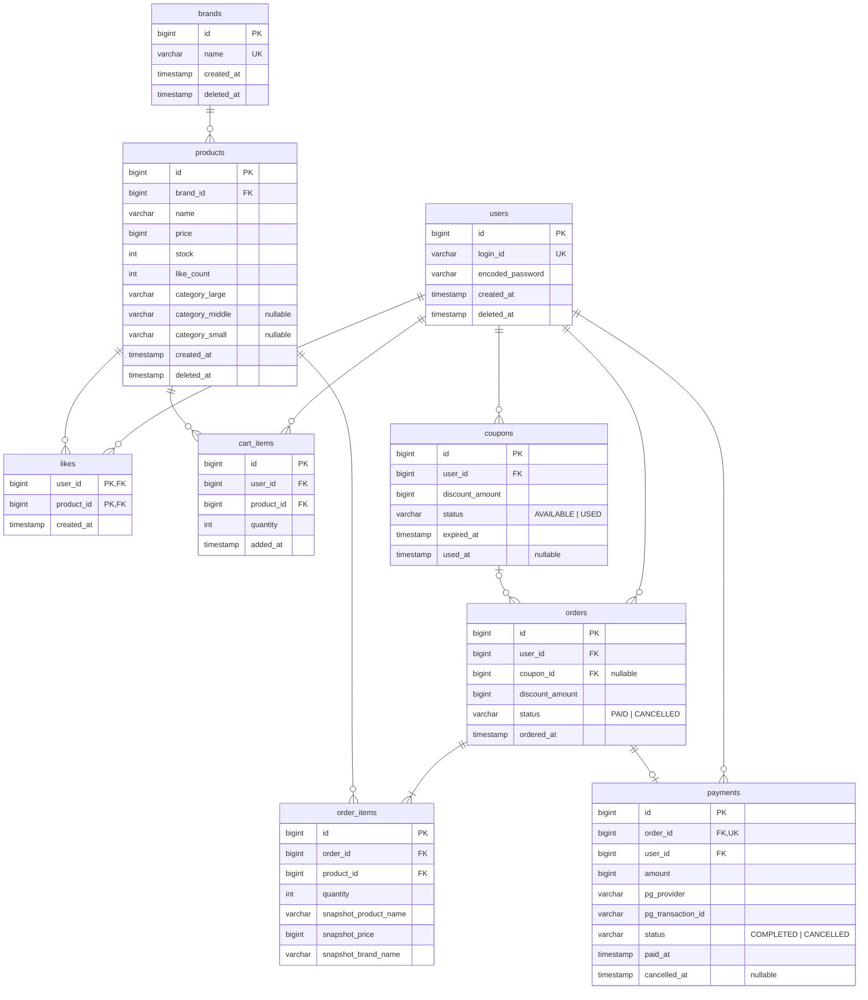

# ERD (Entity Relationship Diagram)

---

---

## 설계 결정 사항

### Soft Delete 적용 대상

| 테이블 | 방식 | 이유 |
|--------|------|------|
| users | `deleted_at` | 탈퇴 유저의 주문·결제 이력 보존 필요 |
| brands | `deleted_at` | 삭제된 브랜드 상품도 함께 soft delete. order_items 스냅샷과 연결성 유지 |
| products | `deleted_at` | 삭제된 상품도 기존 주문 내역에서 조회 가능해야 함. 좋아요·장바구니 조회 시 `deleted_at IS NULL` 필터링 |
| orders | 미적용 | 주문은 취소돼도 이력 보존. status로 상태 관리 |
| payments | 미적용 | 결제 이력은 삭제 없음. status + cancelled_at으로 상태 관리 |
| coupons | 미적용 | status(AVAILABLE/USED)로 상태 관리 |
| likes | 미적용 | 취소 시 행 자체를 삭제 |
| cart_items | 미적용 | 제거 시 행 자체를 삭제 |
| order_items | 미적용 | 주문 이력이므로 삭제 없음 |

---

### Enum → VARCHAR

| 테이블 | 컬럼 | 값 |
|--------|------|----|
| orders | status | `PAID`, `CANCELLED` |
| payments | status | `COMPLETED`, `CANCELLED` |
| coupons | status | `AVAILABLE`, `USED` |

---

### Unique 제약

| 테이블 | 대상 | 이유 |
|--------|------|------|
| users | `login_id` | 중복 로그인 ID 불가 |
| brands | `name` | 브랜드명 중복 불가 |
| payments | `order_id` | 주문 1건에 결제 1건만 허용 |
| cart_items | `(user_id, product_id)` 복합 UK | 동일 상품 중복 담기 시 수량 증가로 처리. 행 중복 방지 |
| likes | `(user_id, product_id)` 복합 PK | 동일 상품 중복 좋아요 방지 |

---

### ProductSnapshot 저장 방식

`order_items`에 컬럼으로 직접 비정규화 저장. 주문 이후 상품 정보가 변경되거나 삭제돼도 주문 당시 데이터를 보존하기 위함.

| 컬럼 | 원본 출처 |
|------|-----------|
| `snapshot_product_name` | `products.name` |
| `snapshot_price` | `products.price` |
| `snapshot_brand_name` | `brands.name` |

---

### orders.coupon_id (nullable FK) / discount_amount

쿠폰은 주문 시점에 확정되므로 `orders`에 보관. 쿠폰 없이 주문하면 `coupon_id = NULL`, `discount_amount = 0`.
결제(`payments`)는 VAN/PG사와의 거래 정보(실제 청구 금액, 거래 ID 등)만 담는다.

### payments.pg_provider / pg_transaction_id

PG사(결제대행사) 연동 정보. 실제 구현 시 VAN사 요구 스펙에 따라 컬럼이 추가될 수 있음.

---

### payments.cancelled_at (nullable)

`PaymentCancelInfo` VO를 단일 컬럼으로 표현. 취소 전에는 `NULL`, 취소 시 취소 일시가 기록됨. 전액 환불이므로 환불 금액은 별도 저장 없이 `amount`를 그대로 사용.
