# 시퀀스 다이어그램 (컴포넌트 상세)

---

## 1. 유저 (Users)

### 1-1. 비밀번호 변경

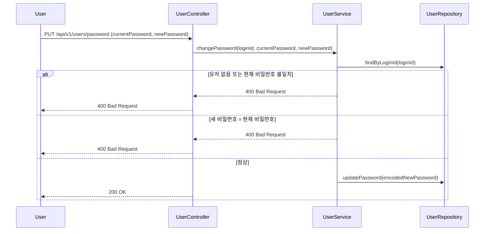
```mermaid
sequenceDiagram
    participant User
    participant UserController
    participant UserService
    participant UserRepository

    User->>UserController: PUT /api/v1/users/password (currentPassword, newPassword)
    UserController->>UserService: changePassword(loginId, currentPassword, newPassword)
    UserService->>UserRepository: findByLoginId(loginId)

    alt 유저 없음 또는 현재 비밀번호 불일치
        UserService-->>UserController: 400 Bad Request
        UserController-->>User: 400 Bad Request
    else 새 비밀번호 = 현재 비밀번호
        UserService-->>UserController: 400 Bad Request
        UserController-->>User: 400 Bad Request
    else 정상
        UserService->>UserRepository: updatePassword(encodedNewPassword)
        UserController-->>User: 200 OK
    end
```

---

## 2. 브랜드 & 상품 (Brands / Products)

### 2-1. 상품 목록 조회

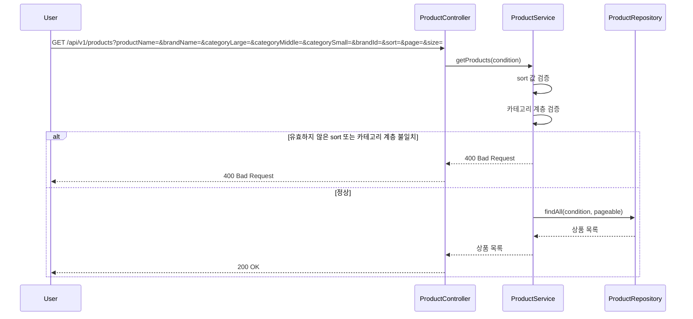
```mermaid
sequenceDiagram
    participant User
    participant ProductController
    participant ProductService
    participant ProductRepository

    User->>ProductController: GET /api/v1/products?productName=&brandName=&categoryLarge=&categoryMiddle=&categorySmall=&brandId=&sort=&page=&size=
    ProductController->>ProductService: getProducts(condition)
    ProductService->>ProductService: sort 값 검증
    ProductService->>ProductService: 카테고리 계층 검증

    alt 유효하지 않은 sort 또는 카테고리 계층 불일치
        ProductService-->>ProductController: 400 Bad Request
        ProductController-->>User: 400 Bad Request
    else 정상
        ProductService->>ProductRepository: findAll(condition, pageable)
        ProductRepository-->>ProductService: 상품 목록
        ProductService-->>ProductController: 상품 목록
        ProductController-->>User: 200 OK
    end
```

---

### 2-2. 브랜드 목록 조회

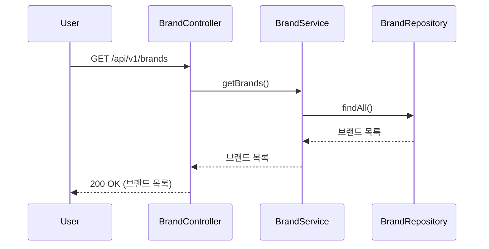
```mermaid
sequenceDiagram
    participant User
    participant BrandController
    participant BrandService
    participant BrandRepository

    User->>BrandController: GET /api/v1/brands
    BrandController->>BrandService: getBrands()
    BrandService->>BrandRepository: findAll()
    BrandRepository-->>BrandService: 브랜드 목록
    BrandService-->>BrandController: 브랜드 목록
    BrandController-->>User: 200 OK (브랜드 목록)
```

---

### 2-3. 브랜드 정보 조회

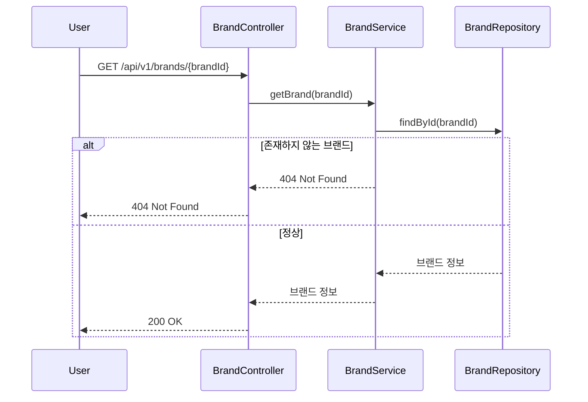
```mermaid
sequenceDiagram
    participant User
    participant BrandController
    participant BrandService
    participant BrandRepository

    User->>BrandController: GET /api/v1/brands/{brandId}
    BrandController->>BrandService: getBrand(brandId)
    BrandService->>BrandRepository: findById(brandId)

    alt 존재하지 않는 브랜드
        BrandService-->>BrandController: 404 Not Found
        BrandController-->>User: 404 Not Found
    else 정상
        BrandRepository-->>BrandService: 브랜드 정보
        BrandService-->>BrandController: 브랜드 정보
        BrandController-->>User: 200 OK
    end
```

---

### 2-4. 상품 정보 조회

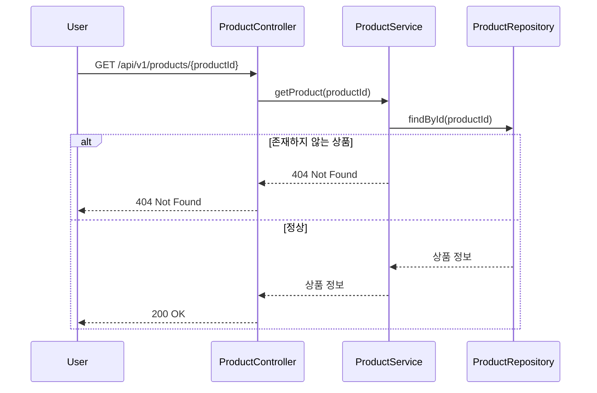
```mermaid
sequenceDiagram
    participant User
    participant ProductController
    participant ProductService
    participant ProductRepository

    User->>ProductController: GET /api/v1/products/{productId}
    ProductController->>ProductService: getProduct(productId)
    ProductService->>ProductRepository: findById(productId)

    alt 존재하지 않는 상품
        ProductService-->>ProductController: 404 Not Found
        ProductController-->>User: 404 Not Found
    else 정상
        ProductRepository-->>ProductService: 상품 정보
        ProductService-->>ProductController: 상품 정보
        ProductController-->>User: 200 OK
    end
```

---

## 2-ADMIN. 브랜드 & 상품 ADMIN

### 2-ADMIN-1. 등록된 브랜드 목록 조회

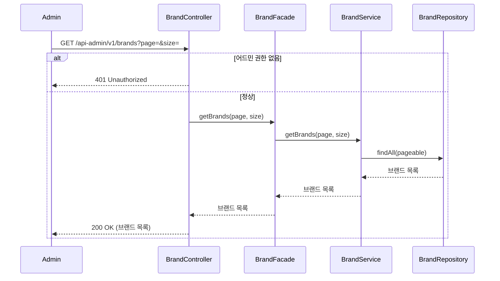
```mermaid
sequenceDiagram
    participant Admin
    participant BrandController
    participant BrandFacade
    participant BrandService
    participant BrandRepository

    Admin->>BrandController: GET /api-admin/v1/brands?page=&size=
    alt 어드민 권한 없음
        BrandController-->>Admin: 401 Unauthorized
    else 정상
        BrandController->>BrandFacade: getBrands(page, size)
        BrandFacade->>BrandService: getBrands(page, size)
        BrandService->>BrandRepository: findAll(pageable)
        BrandRepository-->>BrandService: 브랜드 목록
        BrandService-->>BrandFacade: 브랜드 목록
        BrandFacade-->>BrandController: 브랜드 목록
        BrandController-->>Admin: 200 OK (브랜드 목록)
    end
```

---

### 2-ADMIN-2. 브랜드 상세 조회

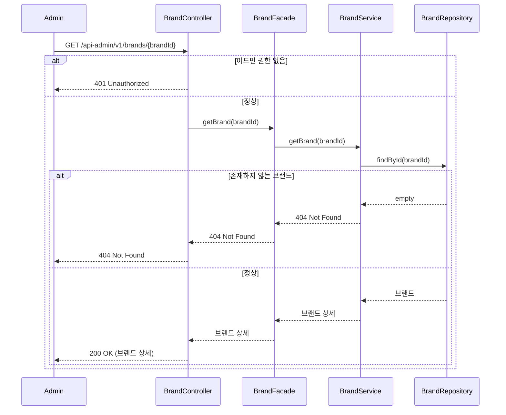
```mermaid
sequenceDiagram
    participant Admin
    participant BrandController
    participant BrandFacade
    participant BrandService
    participant BrandRepository

    Admin->>BrandController: GET /api-admin/v1/brands/{brandId}
    alt 어드민 권한 없음
        BrandController-->>Admin: 401 Unauthorized
    else 정상
        BrandController->>BrandFacade: getBrand(brandId)
        BrandFacade->>BrandService: getBrand(brandId)
        BrandService->>BrandRepository: findById(brandId)
        alt 존재하지 않는 브랜드
            BrandRepository-->>BrandService: empty
            BrandService-->>BrandFacade: 404 Not Found
            BrandFacade-->>BrandController: 404 Not Found
            BrandController-->>Admin: 404 Not Found
        else 정상
            BrandRepository-->>BrandService: 브랜드
            BrandService-->>BrandFacade: 브랜드 상세
            BrandFacade-->>BrandController: 브랜드 상세
            BrandController-->>Admin: 200 OK (브랜드 상세)
        end
    end
```

---

### 2-ADMIN-3. 브랜드 등록

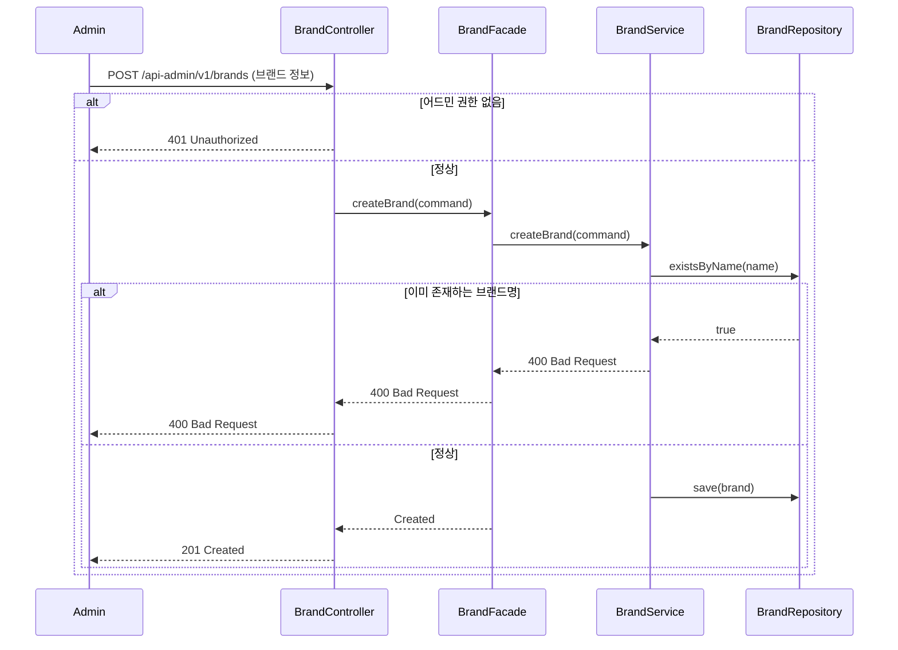
```mermaid
sequenceDiagram
    participant Admin
    participant BrandController
    participant BrandFacade
    participant BrandService
    participant BrandRepository

    Admin->>BrandController: POST /api-admin/v1/brands (브랜드 정보)
    alt 어드민 권한 없음
        BrandController-->>Admin: 401 Unauthorized
    else 정상
        BrandController->>BrandFacade: createBrand(command)
        BrandFacade->>BrandService: createBrand(command)
        BrandService->>BrandRepository: existsByName(name)
        alt 이미 존재하는 브랜드명
            BrandRepository-->>BrandService: true
            BrandService-->>BrandFacade: 400 Bad Request
            BrandFacade-->>BrandController: 400 Bad Request
            BrandController-->>Admin: 400 Bad Request
        else 정상
            BrandService->>BrandRepository: save(brand)
            BrandFacade-->>BrandController: Created
            BrandController-->>Admin: 201 Created
        end
    end
```

---

### 2-ADMIN-4. 브랜드 수정

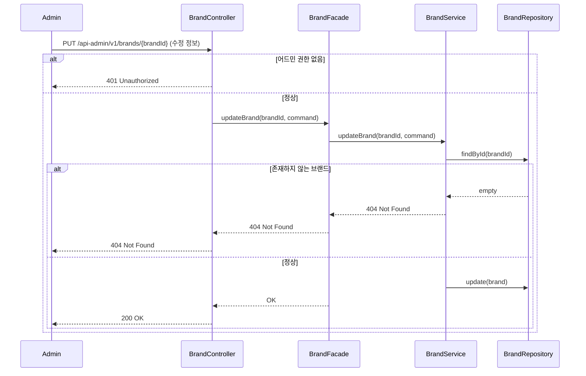
```mermaid
sequenceDiagram
    participant Admin
    participant BrandController
    participant BrandFacade
    participant BrandService
    participant BrandRepository

    Admin->>BrandController: PUT /api-admin/v1/brands/{brandId} (수정 정보)
    alt 어드민 권한 없음
        BrandController-->>Admin: 401 Unauthorized
    else 정상
        BrandController->>BrandFacade: updateBrand(brandId, command)
        BrandFacade->>BrandService: updateBrand(brandId, command)
        BrandService->>BrandRepository: findById(brandId)
        alt 존재하지 않는 브랜드
            BrandRepository-->>BrandService: empty
            BrandService-->>BrandFacade: 404 Not Found
            BrandFacade-->>BrandController: 404 Not Found
            BrandController-->>Admin: 404 Not Found
        else 정상
            BrandService->>BrandRepository: update(brand)
            BrandFacade-->>BrandController: OK
            BrandController-->>Admin: 200 OK
        end
    end
```

---

### 2-ADMIN-5. 브랜드 삭제

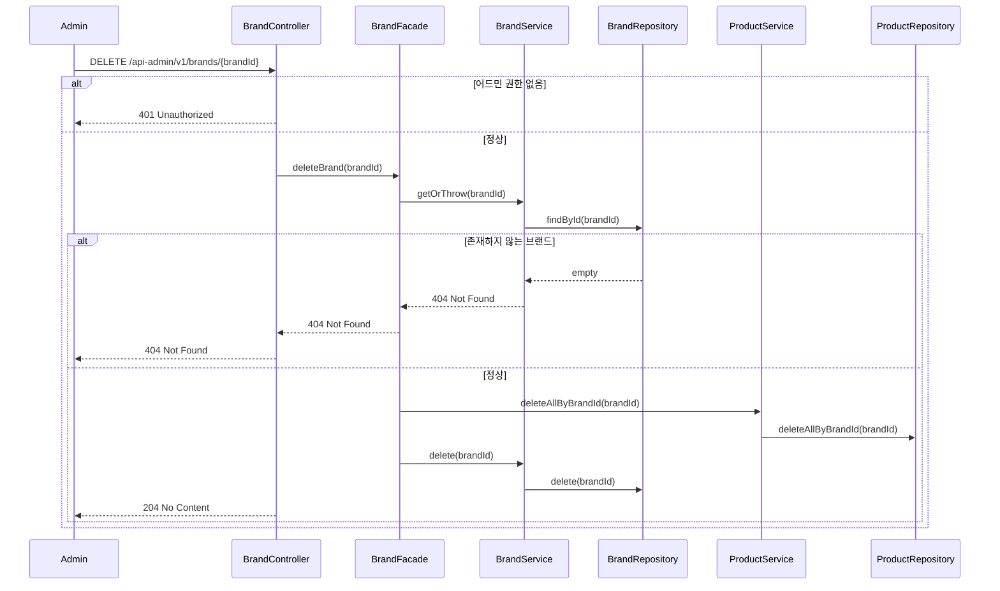
```mermaid
sequenceDiagram
    participant Admin
    participant BrandController
    participant BrandFacade
    participant BrandService
    participant BrandRepository
    participant ProductService
    participant ProductRepository

    Admin->>BrandController: DELETE /api-admin/v1/brands/{brandId}
    alt 어드민 권한 없음
        BrandController-->>Admin: 401 Unauthorized
    else 정상
        BrandController->>BrandFacade: deleteBrand(brandId)
        BrandFacade->>BrandService: getOrThrow(brandId)
        BrandService->>BrandRepository: findById(brandId)
        alt 존재하지 않는 브랜드
            BrandRepository-->>BrandService: empty
            BrandService-->>BrandFacade: 404 Not Found
            BrandFacade-->>BrandController: 404 Not Found
            BrandController-->>Admin: 404 Not Found
        else 정상
            BrandFacade->>ProductService: deleteAllByBrandId(brandId)
            ProductService->>ProductRepository: deleteAllByBrandId(brandId)
            BrandFacade->>BrandService: delete(brandId)
            BrandService->>BrandRepository: delete(brandId)
            BrandController-->>Admin: 204 No Content
        end
    end
```

---

### 2-ADMIN-6. 등록된 상품 목록 조회

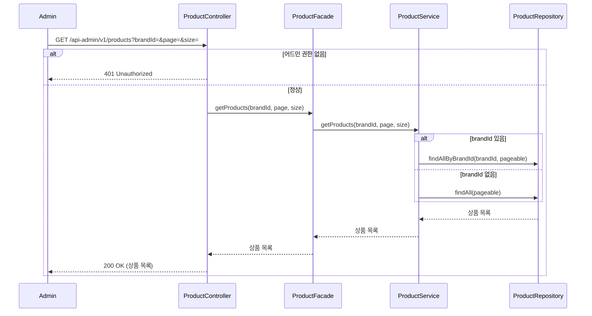
```mermaid
sequenceDiagram
    participant Admin
    participant ProductController
    participant ProductFacade
    participant ProductService
    participant ProductRepository

    Admin->>ProductController: GET /api-admin/v1/products?brandId=&page=&size=
    alt 어드민 권한 없음
        ProductController-->>Admin: 401 Unauthorized
    else 정상
        ProductController->>ProductFacade: getProducts(brandId, page, size)
        ProductFacade->>ProductService: getProducts(brandId, page, size)
        alt brandId 있음
            ProductService->>ProductRepository: findAllByBrandId(brandId, pageable)
        else brandId 없음
            ProductService->>ProductRepository: findAll(pageable)
        end
        ProductRepository-->>ProductService: 상품 목록
        ProductService-->>ProductFacade: 상품 목록
        ProductFacade-->>ProductController: 상품 목록
        ProductController-->>Admin: 200 OK (상품 목록)
    end
```

---

### 2-ADMIN-7. 상품 상세 조회

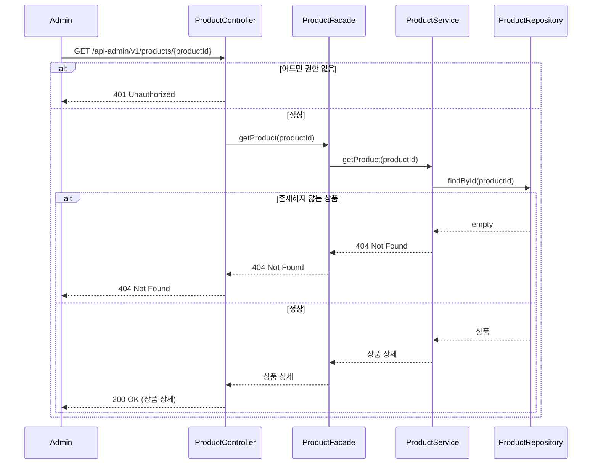
```mermaid
sequenceDiagram
    participant Admin
    participant ProductController
    participant ProductFacade
    participant ProductService
    participant ProductRepository

    Admin->>ProductController: GET /api-admin/v1/products/{productId}
    alt 어드민 권한 없음
        ProductController-->>Admin: 401 Unauthorized
    else 정상
        ProductController->>ProductFacade: getProduct(productId)
        ProductFacade->>ProductService: getProduct(productId)
        ProductService->>ProductRepository: findById(productId)
        alt 존재하지 않는 상품
            ProductRepository-->>ProductService: empty
            ProductService-->>ProductFacade: 404 Not Found
            ProductFacade-->>ProductController: 404 Not Found
            ProductController-->>Admin: 404 Not Found
        else 정상
            ProductRepository-->>ProductService: 상품
            ProductService-->>ProductFacade: 상품 상세
            ProductFacade-->>ProductController: 상품 상세
            ProductController-->>Admin: 200 OK (상품 상세)
        end
    end
```

---

### 2-ADMIN-8. 상품 등록

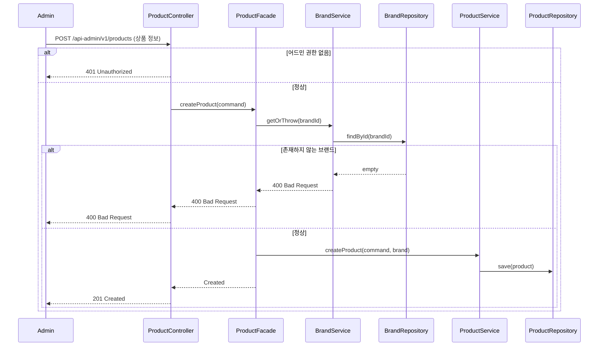
```mermaid
sequenceDiagram
    participant Admin
    participant ProductController
    participant ProductFacade
    participant BrandService
    participant BrandRepository
    participant ProductService
    participant ProductRepository

    Admin->>ProductController: POST /api-admin/v1/products (상품 정보)
    alt 어드민 권한 없음
        ProductController-->>Admin: 401 Unauthorized
    else 정상
        ProductController->>ProductFacade: createProduct(command)
        ProductFacade->>BrandService: getOrThrow(brandId)
        BrandService->>BrandRepository: findById(brandId)
        alt 존재하지 않는 브랜드
            BrandRepository-->>BrandService: empty
            BrandService-->>ProductFacade: 400 Bad Request
            ProductFacade-->>ProductController: 400 Bad Request
            ProductController-->>Admin: 400 Bad Request
        else 정상
            ProductFacade->>ProductService: createProduct(command, brand)
            ProductService->>ProductRepository: save(product)
            ProductFacade-->>ProductController: Created
            ProductController-->>Admin: 201 Created
        end
    end
```

---

### 2-ADMIN-9. 상품 수정

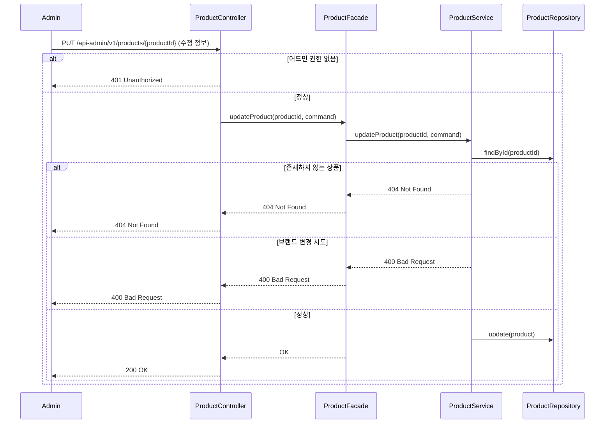
```mermaid
sequenceDiagram
    participant Admin
    participant ProductController
    participant ProductFacade
    participant ProductService
    participant ProductRepository

    Admin->>ProductController: PUT /api-admin/v1/products/{productId} (수정 정보)
    alt 어드민 권한 없음
        ProductController-->>Admin: 401 Unauthorized
    else 정상
        ProductController->>ProductFacade: updateProduct(productId, command)
        ProductFacade->>ProductService: updateProduct(productId, command)
        ProductService->>ProductRepository: findById(productId)
        alt 존재하지 않는 상품
            ProductService-->>ProductFacade: 404 Not Found
            ProductFacade-->>ProductController: 404 Not Found
            ProductController-->>Admin: 404 Not Found
        else 브랜드 변경 시도
            ProductService-->>ProductFacade: 400 Bad Request
            ProductFacade-->>ProductController: 400 Bad Request
            ProductController-->>Admin: 400 Bad Request
        else 정상
            ProductService->>ProductRepository: update(product)
            ProductFacade-->>ProductController: OK
            ProductController-->>Admin: 200 OK
        end
    end
```

---

### 2-ADMIN-10. 상품 삭제

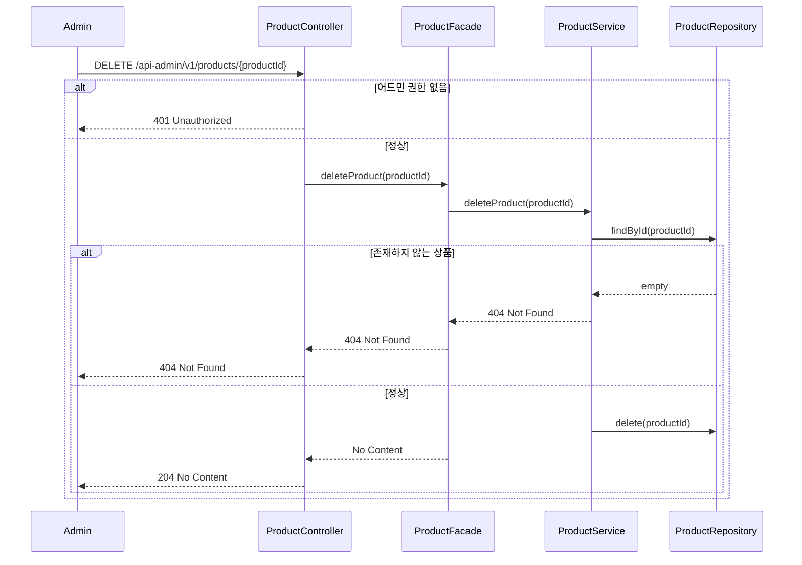
```mermaid
sequenceDiagram
    participant Admin
    participant ProductController
    participant ProductFacade
    participant ProductService
    participant ProductRepository

    Admin->>ProductController: DELETE /api-admin/v1/products/{productId}
    alt 어드민 권한 없음
        ProductController-->>Admin: 401 Unauthorized
    else 정상
        ProductController->>ProductFacade: deleteProduct(productId)
        ProductFacade->>ProductService: deleteProduct(productId)
        ProductService->>ProductRepository: findById(productId)
        alt 존재하지 않는 상품
            ProductRepository-->>ProductService: empty
            ProductService-->>ProductFacade: 404 Not Found
            ProductFacade-->>ProductController: 404 Not Found
            ProductController-->>Admin: 404 Not Found
        else 정상
            ProductService->>ProductRepository: delete(productId)
            ProductFacade-->>ProductController: No Content
            ProductController-->>Admin: 204 No Content
        end
    end
```

---

## 3. 좋아요 (Likes)

### 3-1. 좋아요 등록

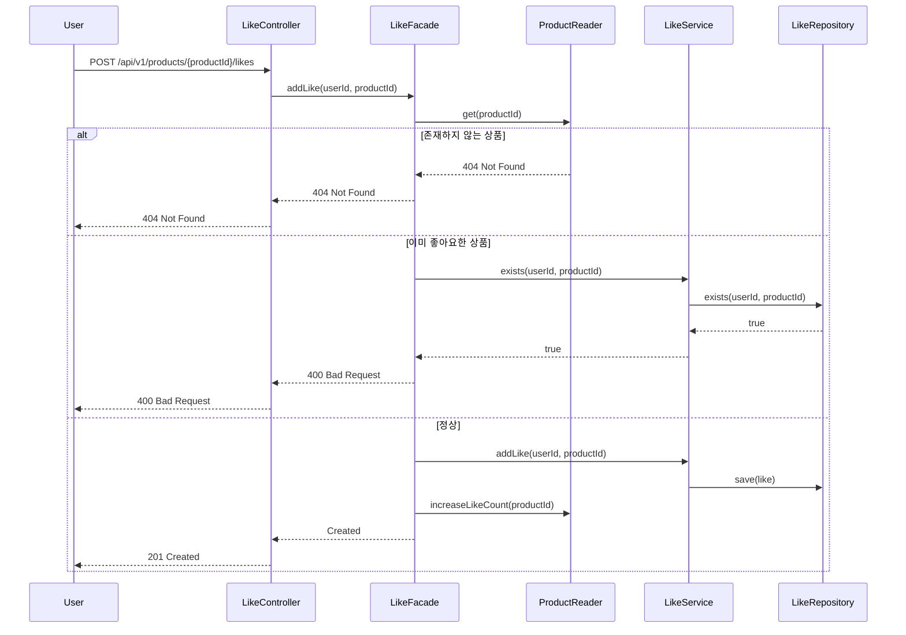
```mermaid
sequenceDiagram
    participant User
    participant LikeController
    participant LikeFacade
    participant ProductReader
    participant LikeService
    participant LikeRepository

    User->>LikeController: POST /api/v1/products/{productId}/likes
    LikeController->>LikeFacade: addLike(userId, productId)
    LikeFacade->>ProductReader: get(productId)

    alt 존재하지 않는 상품
        ProductReader-->>LikeFacade: 404 Not Found
        LikeFacade-->>LikeController: 404 Not Found
        LikeController-->>User: 404 Not Found
    else 이미 좋아요한 상품
        LikeFacade->>LikeService: exists(userId, productId)
        LikeService->>LikeRepository: exists(userId, productId)
        LikeRepository-->>LikeService: true
        LikeService-->>LikeFacade: true
        LikeFacade-->>LikeController: 400 Bad Request
        LikeController-->>User: 400 Bad Request
    else 정상
        LikeFacade->>LikeService: addLike(userId, productId)
        LikeService->>LikeRepository: save(like)
        LikeFacade->>ProductReader: increaseLikeCount(productId)
        LikeFacade-->>LikeController: Created
        LikeController-->>User: 201 Created
    end
```

---

### 3-2. 좋아요 취소

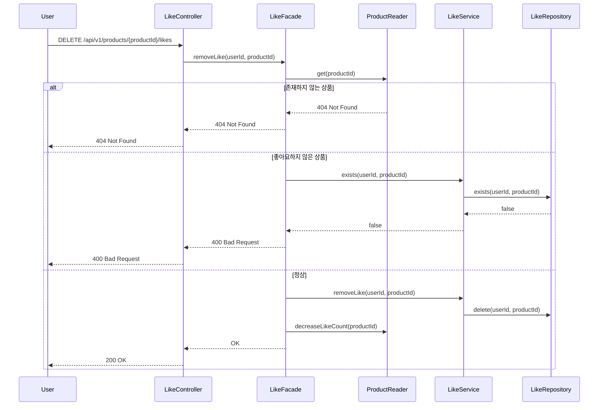
```mermaid
sequenceDiagram
    participant User
    participant LikeController
    participant LikeFacade
    participant ProductReader
    participant LikeService
    participant LikeRepository

    User->>LikeController: DELETE /api/v1/products/{productId}/likes
    LikeController->>LikeFacade: removeLike(userId, productId)
    LikeFacade->>ProductReader: get(productId)

    alt 존재하지 않는 상품
        ProductReader-->>LikeFacade: 404 Not Found
        LikeFacade-->>LikeController: 404 Not Found
        LikeController-->>User: 404 Not Found
    else 좋아요하지 않은 상품
        LikeFacade->>LikeService: exists(userId, productId)
        LikeService->>LikeRepository: exists(userId, productId)
        LikeRepository-->>LikeService: false
        LikeService-->>LikeFacade: false
        LikeFacade-->>LikeController: 400 Bad Request
        LikeController-->>User: 400 Bad Request
    else 정상
        LikeFacade->>LikeService: removeLike(userId, productId)
        LikeService->>LikeRepository: delete(userId, productId)
        LikeFacade->>ProductReader: decreaseLikeCount(productId)
        LikeFacade-->>LikeController: OK
        LikeController-->>User: 200 OK
    end
```

---

### 3-3. 좋아요한 상품 목록 조회

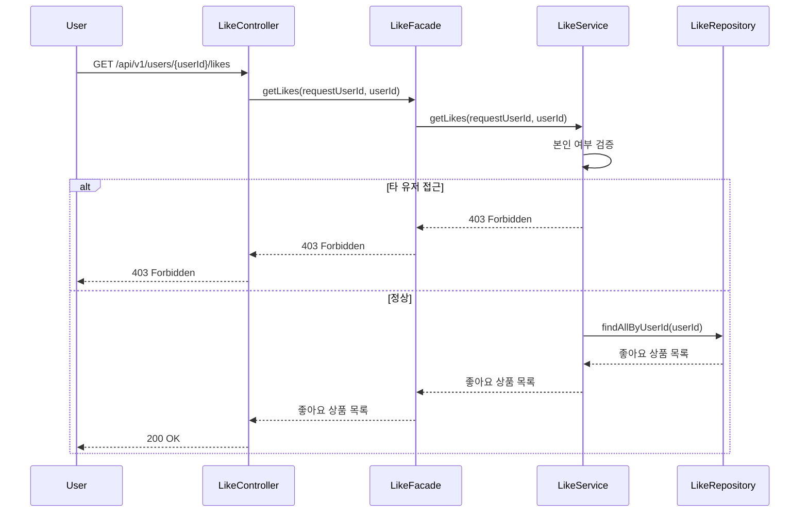
```mermaid
sequenceDiagram
    participant User
    participant LikeController
    participant LikeFacade
    participant LikeService
    participant LikeRepository

    User->>LikeController: GET /api/v1/users/{userId}/likes
    LikeController->>LikeFacade: getLikes(requestUserId, userId)
    LikeFacade->>LikeService: getLikes(requestUserId, userId)
    LikeService->>LikeService: 본인 여부 검증

    alt 타 유저 접근
        LikeService-->>LikeFacade: 403 Forbidden
        LikeFacade-->>LikeController: 403 Forbidden
        LikeController-->>User: 403 Forbidden
    else 정상
        LikeService->>LikeRepository: findAllByUserId(userId)
        LikeRepository-->>LikeService: 좋아요 상품 목록
        LikeService-->>LikeFacade: 좋아요 상품 목록
        LikeFacade-->>LikeController: 좋아요 상품 목록
        LikeController-->>User: 200 OK
    end
```

---

## 4. 장바구니 (Cart)

### 4-1. 장바구니 상품 추가

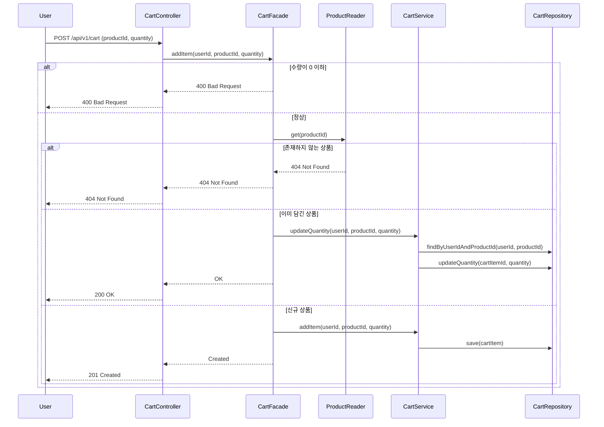
```mermaid
sequenceDiagram
    participant User
    participant CartController
    participant CartFacade
    participant ProductReader
    participant CartService
    participant CartRepository

    User->>CartController: POST /api/v1/cart (productId, quantity)
    CartController->>CartFacade: addItem(userId, productId, quantity)

    alt 수량이 0 이하
        CartFacade-->>CartController: 400 Bad Request
        CartController-->>User: 400 Bad Request
    else 정상
        CartFacade->>ProductReader: get(productId)
        alt 존재하지 않는 상품
            ProductReader-->>CartFacade: 404 Not Found
            CartFacade-->>CartController: 404 Not Found
            CartController-->>User: 404 Not Found
        else 이미 담긴 상품
            CartFacade->>CartService: updateQuantity(userId, productId, quantity)
            CartService->>CartRepository: findByUserIdAndProductId(userId, productId)
            CartService->>CartRepository: updateQuantity(cartItemId, quantity)
            CartFacade-->>CartController: OK
            CartController-->>User: 200 OK
        else 신규 상품
            CartFacade->>CartService: addItem(userId, productId, quantity)
            CartService->>CartRepository: save(cartItem)
            CartFacade-->>CartController: Created
            CartController-->>User: 201 Created
        end
    end
```

---

### 4-2. 장바구니 목록 조회

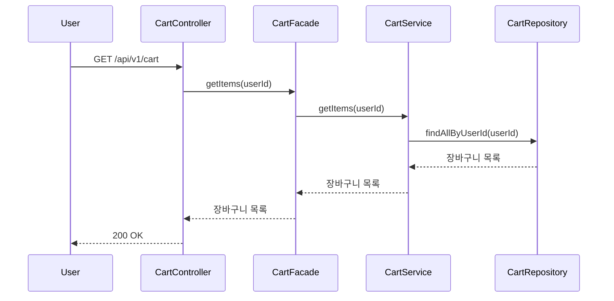
```mermaid
sequenceDiagram
    participant User
    participant CartController
    participant CartFacade
    participant CartService
    participant CartRepository

    User->>CartController: GET /api/v1/cart
    CartController->>CartFacade: getItems(userId)
    CartFacade->>CartService: getItems(userId)
    CartService->>CartRepository: findAllByUserId(userId)
    CartRepository-->>CartService: 장바구니 목록
    CartService-->>CartFacade: 장바구니 목록
    CartFacade-->>CartController: 장바구니 목록
    CartController-->>User: 200 OK
```

---

### 4-3. 장바구니 수량 변경

```mermaid
sequenceDiagram
    participant User
    participant CartController
    participant CartFacade
    participant CartService
    participant CartRepository

    User->>CartController: PUT /api/v1/cart/{cartItemId} (quantity)
    CartController->>CartFacade: updateQuantity(userId, cartItemId, quantity)
    CartFacade->>CartService: updateQuantity(userId, cartItemId, quantity)
    CartService->>CartRepository: findById(cartItemId)

    alt 존재하지 않는 항목
        CartService-->>CartFacade: 404 Not Found
        CartFacade-->>CartController: 404 Not Found
        CartController-->>User: 404 Not Found
    else 수량이 0 이하
        CartService-->>CartFacade: 400 Bad Request
        CartFacade-->>CartController: 400 Bad Request
        CartController-->>User: 400 Bad Request
    else 정상
        CartService->>CartRepository: updateQuantity(cartItemId, quantity)
        CartFacade-->>CartController: OK
        CartController-->>User: 200 OK
    end
```

---

### 4-4. 장바구니 상품 제거

```mermaid
sequenceDiagram
    participant User
    participant CartController
    participant CartFacade
    participant CartService
    participant CartRepository

    User->>CartController: DELETE /api/v1/cart/{cartItemId}
    CartController->>CartFacade: removeItem(userId, cartItemId)
    CartFacade->>CartService: removeItem(userId, cartItemId)
    CartService->>CartRepository: findById(cartItemId)

    alt 존재하지 않는 항목
        CartService-->>CartFacade: 404 Not Found
        CartFacade-->>CartController: 404 Not Found
        CartController-->>User: 404 Not Found
    else 타 유저 항목 접근
        CartService-->>CartFacade: 403 Forbidden
        CartFacade-->>CartController: 403 Forbidden
        CartController-->>User: 403 Forbidden
    else 정상
        CartService->>CartRepository: delete(cartItemId)
        CartFacade-->>CartController: No Content
        CartController-->>User: 204 No Content
    end
```

---

## 5. 쿠폰 (Coupons)

### 5-1. 쿠폰 목록 조회

```mermaid
sequenceDiagram
    participant User
    participant CouponController
    participant CouponFacade
    participant CouponService
    participant CouponRepository

    User->>CouponController: GET /api/v1/coupons
    CouponController->>CouponFacade: getCoupons(userId)
    CouponFacade->>CouponService: getAvailableCoupons(userId)
    CouponService->>CouponRepository: findAvailableByUserId(userId, now)
    Note right of CouponRepository: status=AVAILABLE AND expired_at > now
    CouponRepository-->>CouponService: 쿠폰 목록
    CouponService-->>CouponFacade: 쿠폰 목록
    CouponFacade-->>CouponController: 쿠폰 목록
    CouponController-->>User: 200 OK
```

---

## 5-ADMIN. 쿠폰 ADMIN

### 5-ADMIN-1. 쿠폰 발급

```mermaid
sequenceDiagram
    participant Admin
    participant CouponController
    participant CouponFacade
    participant UserService
    participant UserRepository
    participant CouponService
    participant CouponRepository

    Admin->>CouponController: POST /api-admin/v1/coupons (userId, discountAmount)
    alt 어드민 권한 없음
        CouponController-->>Admin: 401 Unauthorized
    else 정상
        CouponController->>CouponFacade: issueCoupon(userId, discountAmount)
        CouponFacade->>UserService: getOrThrow(userId)
        UserService->>UserRepository: findById(userId)
        alt 존재하지 않는 유저
            UserRepository-->>UserService: empty
            UserService-->>CouponFacade: 404 Not Found
            CouponFacade-->>CouponController: 404 Not Found
            CouponController-->>Admin: 404 Not Found
        else 정상
            CouponFacade->>CouponService: issueCoupon(userId, discountAmount)
            CouponService->>CouponRepository: save(coupon)
            CouponFacade-->>CouponController: Created
            CouponController-->>Admin: 201 Created
        end
    end
```

---

### 5-ADMIN-2. 쿠폰 목록 조회

```mermaid
sequenceDiagram
    participant Admin
    participant CouponController
    participant CouponFacade
    participant CouponService
    participant CouponRepository

    Admin->>CouponController: GET /api-admin/v1/coupons?userId=&page=&size=
    alt 어드민 권한 없음
        CouponController-->>Admin: 401 Unauthorized
    else 정상
        CouponController->>CouponFacade: getCoupons(userId, pageable)
        CouponFacade->>CouponService: getCoupons(userId, pageable)
        alt userId 있음
            CouponService->>CouponRepository: findAllByUserId(userId, pageable)
        else userId 없음
            CouponService->>CouponRepository: findAll(pageable)
        end
        CouponRepository-->>CouponService: 쿠폰 목록
        CouponService-->>CouponFacade: 쿠폰 목록
        CouponFacade-->>CouponController: 쿠폰 목록
        CouponController-->>Admin: 200 OK
    end
```

---

## 6. 주문 (Orders)

### 6-1. 주문 요청

```mermaid
sequenceDiagram
    participant User
    participant OrderController
    participant OrderFacade
    participant ProductService
    participant ProductRepository
    participant CouponService
    participant CouponRepository
    participant CartService
    participant CartRepository
    participant OrderService
    participant OrderRepository
    participant PaymentService
    participant PaymentRepository

    User->>OrderController: POST /api/v1/orders (items, cardInfo, couponId?)
    OrderController->>OrderFacade: createOrder(userId, items, cardInfo, couponId?)
    Note over OrderFacade: @Transactional 시작

    alt 주문 목록이 비어 있음
        OrderFacade-->>OrderController: 400 Bad Request
        OrderController-->>User: 400 Bad Request
    else 정상
        loop 각 상품
            OrderFacade->>ProductService: getProduct(productId)
            ProductService->>ProductRepository: findById(productId)
            alt 존재하지 않는 상품
                ProductRepository-->>ProductService: empty
                ProductService-->>OrderFacade: 404 Not Found
                OrderFacade-->>OrderController: 404 Not Found
                OrderController-->>User: 404 Not Found
            else 재고 부족
                ProductService-->>OrderFacade: 400 Bad Request (부족한 상품 정보)
                OrderFacade-->>OrderController: 400 Bad Request
                OrderController-->>User: 400 Bad Request
            end
        end

        alt 쿠폰 있음
            OrderFacade->>CouponService: validateAndGetDiscount(couponId)
            CouponService->>CouponRepository: findById(couponId)
            alt 유효하지 않거나 만료된 쿠폰
                CouponService-->>OrderFacade: 400 Bad Request
                OrderFacade-->>OrderController: 400 Bad Request
                OrderController-->>User: 400 Bad Request
            else 정상
                CouponRepository-->>CouponService: 쿠폰
                CouponService-->>OrderFacade: 할인 금액
            end
        end

        OrderFacade->>ProductService: decreaseStock(items)
        ProductService->>ProductRepository: decreaseStock(productId, quantity)
        OrderFacade->>CartService: deleteItems(userId, productIds)
        CartService->>CartRepository: deleteItems(userId, productIds)
        OrderFacade->>OrderService: createOrder(userId, items, snapshot)
        OrderService->>OrderRepository: save(order)
        OrderFacade->>PaymentService: processPayment(orderId, cardInfo, discountAmount)
        alt 결제 실패
            PaymentService-->>OrderFacade: 400 Bad Request
            OrderFacade-->>OrderController: 400 Bad Request
            OrderController-->>User: 400 Bad Request
        else 결제 성공
            PaymentService->>PaymentRepository: save(payment)
            alt 쿠폰 사용한 경우
                OrderFacade->>CouponService: markAsUsed(couponId)
                CouponService->>CouponRepository: markAsUsed(couponId)
            end
            OrderFacade->>OrderService: updateStatus(orderId, PAID)
            OrderService->>OrderRepository: updateStatus(orderId, PAID)
            OrderController-->>User: 201 Created (orderId)
        end
    end
```

---

### 6-2. 주문 목록 조회

```mermaid
sequenceDiagram
    participant User
    participant OrderController
    participant OrderFacade
    participant OrderService
    participant OrderRepository

    User->>OrderController: GET /api/v1/orders?startAt=&endAt=
    OrderController->>OrderFacade: getOrders(userId, startAt, endAt)
    OrderFacade->>OrderService: getOrders(userId, startAt, endAt)
    OrderService->>OrderService: 날짜 유효성 검증

    alt 날짜 형식 오류 또는 startAt > endAt
        OrderService-->>OrderFacade: 400 Bad Request
        OrderFacade-->>OrderController: 400 Bad Request
        OrderController-->>User: 400 Bad Request
    else 정상
        OrderService->>OrderRepository: findAllByUserIdAndPeriod(userId, startAt, endAt)
        OrderRepository-->>OrderService: 주문 목록
        OrderService-->>OrderFacade: 주문 목록
        OrderFacade-->>OrderController: 주문 목록
        OrderController-->>User: 200 OK
    end
```

---

### 6-3. 주문 상세 조회

```mermaid
sequenceDiagram
    participant User
    participant OrderController
    participant OrderFacade
    participant OrderService
    participant OrderRepository

    User->>OrderController: GET /api/v1/orders/{orderId}
    OrderController->>OrderFacade: getOrder(userId, orderId)
    OrderFacade->>OrderService: getOrder(userId, orderId)
    OrderService->>OrderRepository: findById(orderId)

    alt 존재하지 않는 주문
        OrderService-->>OrderFacade: 404 Not Found
        OrderFacade-->>OrderController: 404 Not Found
        OrderController-->>User: 404 Not Found
    else 타 유저 주문 접근
        OrderService-->>OrderFacade: 403 Forbidden
        OrderFacade-->>OrderController: 403 Forbidden
        OrderController-->>User: 403 Forbidden
    else 정상
        OrderRepository-->>OrderService: 주문 상세 (상품 스냅샷 포함)
        OrderService-->>OrderFacade: 주문 상세
        OrderFacade-->>OrderController: 주문 상세
        OrderController-->>User: 200 OK
    end
```

---

### 6-4. 주문 결제 내역 조회

```mermaid
sequenceDiagram
    participant User
    participant OrderController
    participant OrderFacade
    participant OrderService
    participant OrderRepository
    participant PaymentService
    participant PaymentRepository

    User->>OrderController: GET /api/v1/orders/{orderId}/payments
    OrderController->>OrderFacade: getOrderPayments(userId, orderId)
    OrderFacade->>OrderService: getOrder(userId, orderId)
    OrderService->>OrderRepository: findById(orderId)

    alt 존재하지 않는 주문
        OrderService-->>OrderFacade: 404 Not Found
        OrderFacade-->>OrderController: 404 Not Found
        OrderController-->>User: 404 Not Found
    else 타 유저 주문 접근
        OrderService-->>OrderFacade: 403 Forbidden
        OrderFacade-->>OrderController: 403 Forbidden
        OrderController-->>User: 403 Forbidden
    else 정상
        OrderFacade->>PaymentService: getPayment(orderId)
        PaymentService->>PaymentRepository: findByOrderId(orderId)
        PaymentRepository-->>PaymentService: 결제 내역
        PaymentService-->>OrderFacade: 결제 내역 (취소 정보 포함)
        OrderFacade-->>OrderController: 결제 내역
        OrderController-->>User: 200 OK
    end
```

---

### 6-5. 주문 취소

```mermaid
sequenceDiagram
    participant User
    participant OrderController
    participant OrderFacade
    participant OrderService
    participant OrderRepository
    participant PaymentService
    participant PaymentRepository
    participant ProductService
    participant ProductRepository
    participant CouponService
    participant CouponRepository
    participant CartService
    participant CartRepository

    User->>OrderController: POST /api/v1/orders/{orderId}/cancel
    OrderController->>OrderFacade: cancelOrder(userId, orderId)
    Note over OrderFacade: @Transactional 시작
    OrderFacade->>OrderService: getOrder(userId, orderId)
    OrderService->>OrderRepository: findById(orderId)

    alt 존재하지 않는 주문
        OrderService-->>OrderFacade: 404 Not Found
        OrderFacade-->>OrderController: 404 Not Found
        OrderController-->>User: 404 Not Found
    else 타 유저 주문 접근
        OrderService-->>OrderFacade: 403 Forbidden
        OrderFacade-->>OrderController: 403 Forbidden
        OrderController-->>User: 403 Forbidden
    else 이미 취소된 주문
        OrderService-->>OrderFacade: 400 Bad Request
        OrderFacade-->>OrderController: 400 Bad Request
        OrderController-->>User: 400 Bad Request
    else 정상
        OrderFacade->>PaymentService: getPaymentByOrderId(orderId)
        PaymentService->>PaymentRepository: findByOrderId(orderId)
        PaymentRepository-->>PaymentService: payment
        PaymentService-->>OrderFacade: payment
        OrderFacade->>PaymentService: cancel(paymentId)
        PaymentService->>PaymentRepository: saveCancel(payment)
        OrderFacade->>ProductService: restoreStock(items)
        ProductService->>ProductRepository: restoreStock(items)
        alt 쿠폰 사용한 경우
            OrderFacade->>CouponService: restore(couponId)
            CouponService->>CouponRepository: restore(couponId)
        end
        OrderFacade->>CartService: restoreItems(items)
        CartService->>CartRepository: restoreItems(items)
        OrderFacade->>OrderService: updateStatus(orderId, CANCELLED)
        OrderService->>OrderRepository: updateStatus(orderId, CANCELLED)
        OrderFacade-->>OrderController: OK
        OrderController-->>User: 200 OK
    end
```

---

## 6-ADMIN. 주문 ADMIN

### 6-ADMIN-1. 전체 주문 목록 조회

```mermaid
sequenceDiagram
    participant Admin
    participant OrderController
    participant OrderFacade
    participant OrderService
    participant OrderRepository

    Admin->>OrderController: GET /api-admin/v1/orders?page=&size=
    alt 어드민 권한 없음
        OrderController-->>Admin: 401 Unauthorized
    else 정상
        OrderController->>OrderFacade: getOrders(pageable)
        OrderFacade->>OrderService: getOrders(pageable)
        OrderService->>OrderRepository: findAll(pageable)
        OrderRepository-->>OrderService: 전체 주문 목록
        OrderService-->>OrderFacade: 전체 주문 목록
        OrderFacade-->>OrderController: 전체 주문 목록
        OrderController-->>Admin: 200 OK
    end
```

---

### 6-ADMIN-2. 전체 수익 조회

```mermaid
sequenceDiagram
    participant Admin
    participant StatsController
    participant StatsFacade
    participant StatsService
    participant PaymentService
    participant PaymentRepository

    Admin->>StatsController: GET /api-admin/v1/stats/revenue?startAt=&endAt=
    alt 어드민 권한 없음
        StatsController-->>Admin: 401 Unauthorized
    else 정상
        StatsController->>StatsFacade: getRevenue(startAt, endAt)
        StatsFacade->>StatsService: validate(startAt, endAt)
        alt 날짜 형식 오류 또는 startAt > endAt
            StatsService-->>StatsFacade: 400 Bad Request
            StatsFacade-->>StatsController: 400 Bad Request
            StatsController-->>Admin: 400 Bad Request
        else 정상
            StatsFacade->>PaymentService: sumByPeriod(startAt, endAt)
            PaymentService->>PaymentRepository: sumByPeriod(startAt, endAt)
            PaymentRepository-->>PaymentService: 총 결제액, 총 할인액
            PaymentService-->>StatsFacade: 총 결제액, 총 할인액
            StatsFacade->>StatsService: calculateRevenue(총 결제액, 총 할인액)
            StatsService-->>StatsFacade: 수익 통계
            StatsFacade-->>StatsController: 수익 통계
            StatsController-->>Admin: 200 OK
        end
    end
```

---

### 6-ADMIN-3. 유저 목록 조회

```mermaid
sequenceDiagram
    participant Admin
    participant UserController
    participant UserOrderFacade
    participant UserService
    participant UserRepository

    Admin->>UserController: GET /api-admin/v1/users?page=&size=
    alt 어드민 권한 없음
        UserController-->>Admin: 401 Unauthorized
    else 정상
        UserController->>UserOrderFacade: getUsers(pageable)
        UserOrderFacade->>UserService: getUsers(pageable)
        UserService->>UserRepository: findAll(pageable)
        UserRepository-->>UserService: 유저 목록
        UserService-->>UserOrderFacade: 유저 목록
        UserOrderFacade-->>UserController: 유저 목록
        UserController-->>Admin: 200 OK
    end
```

---

### 6-ADMIN-4. 유저 상세 조회

```mermaid
sequenceDiagram
    participant Admin
    participant UserController
    participant UserOrderFacade
    participant UserService
    participant UserRepository

    Admin->>UserController: GET /api-admin/v1/users/{userId}
    alt 어드민 권한 없음
        UserController-->>Admin: 401 Unauthorized
    else 정상
        UserController->>UserOrderFacade: getUser(userId)
        UserOrderFacade->>UserService: getUser(userId)
        UserService->>UserRepository: findById(userId)
        alt 존재하지 않는 유저
            UserService-->>UserOrderFacade: 404 Not Found
            UserOrderFacade-->>UserController: 404 Not Found
            UserController-->>Admin: 404 Not Found
        else 정상
            UserRepository-->>UserService: 유저 상세
            UserService-->>UserOrderFacade: 유저 상세
            UserOrderFacade-->>UserController: 유저 상세
            UserController-->>Admin: 200 OK
        end
    end
```

---

### 6-ADMIN-5. 특정 유저의 주문 내역 조회

```mermaid
sequenceDiagram
    participant Admin
    participant UserController
    participant UserOrderFacade
    participant UserService
    participant UserRepository
    participant OrderService
    participant OrderRepository

    Admin->>UserController: GET /api-admin/v1/users/{userId}/orders?page=&size=
    alt 어드민 권한 없음
        UserController-->>Admin: 401 Unauthorized
    else 정상
        UserController->>UserOrderFacade: getUserOrders(userId, pageable)
        UserOrderFacade->>UserService: getUser(userId)
        UserService->>UserRepository: findById(userId)
        alt 존재하지 않는 유저
            UserRepository-->>UserService: empty
            UserService-->>UserOrderFacade: 404 Not Found
            UserOrderFacade-->>UserController: 404 Not Found
            UserController-->>Admin: 404 Not Found
        else 정상
            UserOrderFacade->>OrderService: getOrdersByUserId(userId, pageable)
            OrderService->>OrderRepository: findAllByUserId(userId, pageable)
            OrderRepository-->>OrderService: 주문 목록
            OrderService-->>UserOrderFacade: 주문 목록
            UserOrderFacade-->>UserController: 주문 목록
            UserController-->>Admin: 200 OK
        end
    end
```
