# 시퀀스 다이어그램

---

## 1. 유저 (Users)

### 1-1. 비밀번호 변경

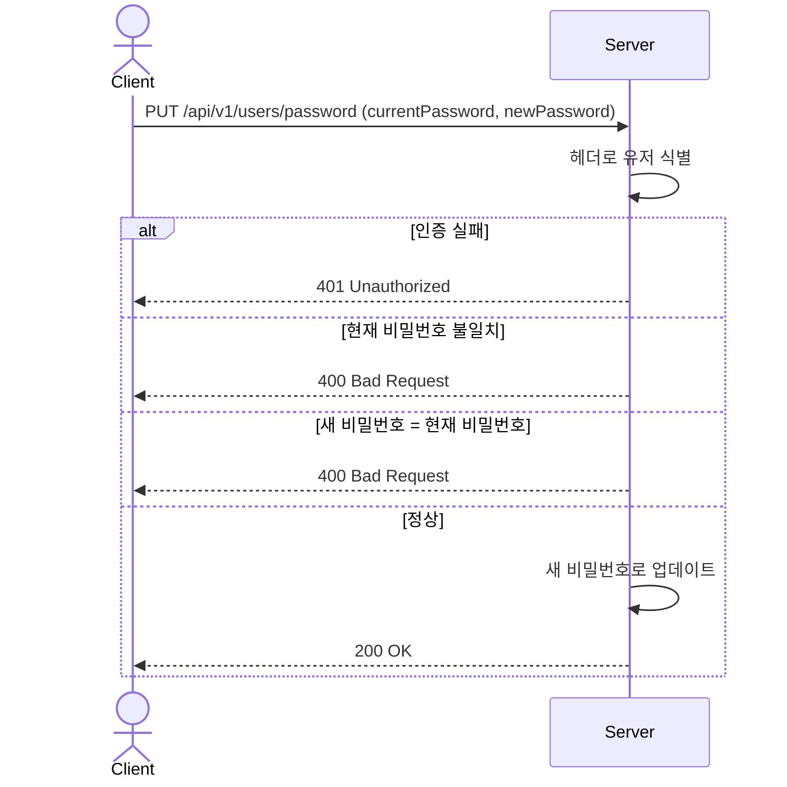
```mermaid
sequenceDiagram
    actor Client
    participant Server

    Client->>Server: PUT /api/v1/users/password (currentPassword, newPassword)
    Server->>Server: 헤더로 유저 식별
    alt 인증 실패
        Server-->>Client: 401 Unauthorized
    else 현재 비밀번호 불일치
        Server-->>Client: 400 Bad Request
    else 새 비밀번호 = 현재 비밀번호
        Server-->>Client: 400 Bad Request
    else 정상
        Server->>Server: 새 비밀번호로 업데이트
        Server-->>Client: 200 OK
    end
```

---

## 2. 브랜드 & 상품 (Brands / Products)

### 2-1. 상품 목록 조회

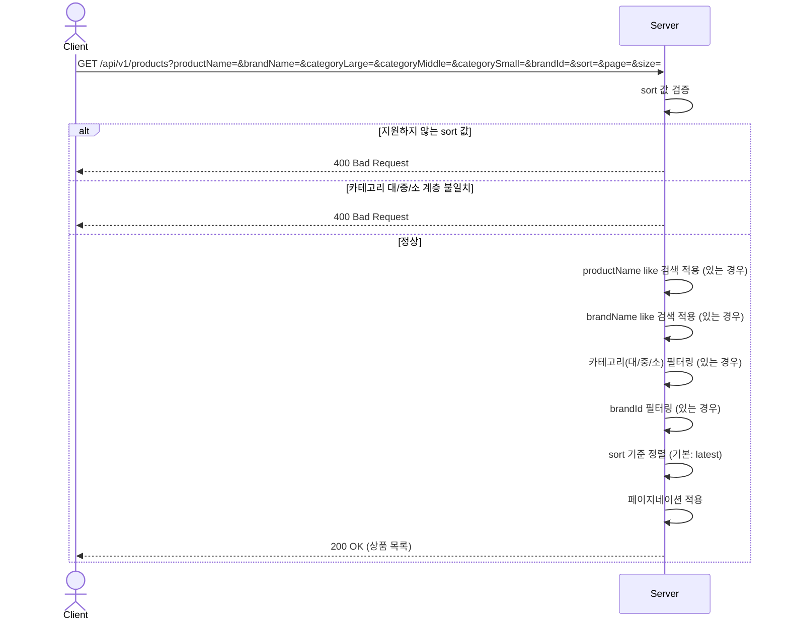
```mermaid
sequenceDiagram
    actor Client
    participant Server

    Client->>Server: GET /api/v1/products?productName=&brandName=&categoryLarge=&categoryMiddle=&categorySmall=&brandId=&sort=&page=&size=
    Server->>Server: sort 값 검증
    alt 지원하지 않는 sort 값
        Server-->>Client: 400 Bad Request
    else 카테고리 대/중/소 계층 불일치
        Server-->>Client: 400 Bad Request
    else 정상
        Server->>Server: productName like 검색 적용 (있는 경우)
        Server->>Server: brandName like 검색 적용 (있는 경우)
        Server->>Server: 카테고리(대/중/소) 필터링 (있는 경우)
        Server->>Server: brandId 필터링 (있는 경우)
        Server->>Server: sort 기준 정렬 (기본: latest)
        Server->>Server: 페이지네이션 적용
        Server-->>Client: 200 OK (상품 목록)
    end
```

---

### 2-2. 브랜드 삭제 (어드민)

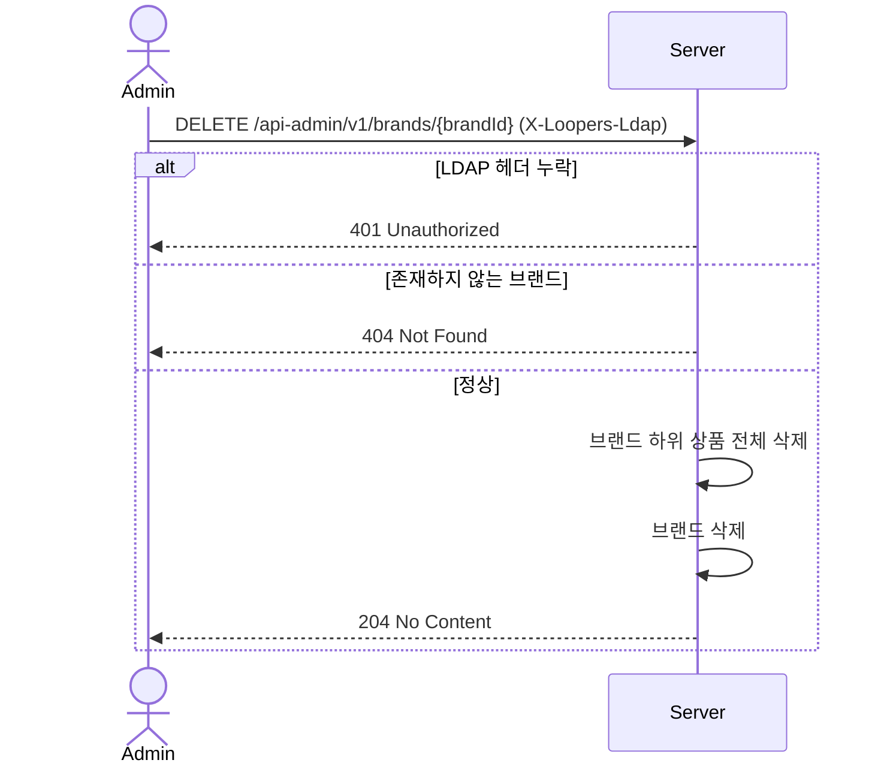
```mermaid
sequenceDiagram
    actor Admin
    participant Server

    Admin->>Server: DELETE /api-admin/v1/brands/{brandId} (X-Loopers-Ldap)
    alt LDAP 헤더 누락
        Server-->>Admin: 401 Unauthorized
    else 존재하지 않는 브랜드
        Server-->>Admin: 404 Not Found
    else 정상
        Server->>Server: 브랜드 하위 상품 전체 삭제
        Server->>Server: 브랜드 삭제
        Server-->>Admin: 204 No Content
    end
```

---

### 2-3. 상품 등록 (어드민)

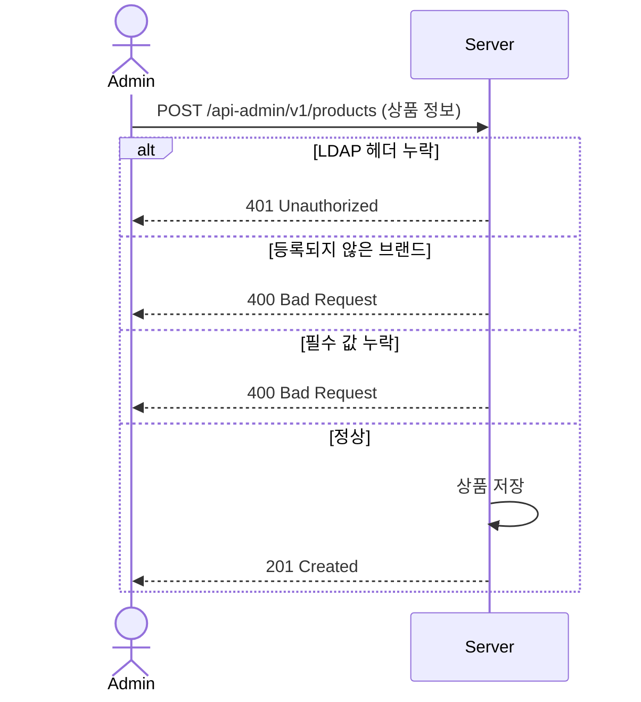
```mermaid
sequenceDiagram
    actor Admin
    participant Server

    Admin->>Server: POST /api-admin/v1/products (상품 정보)
    alt LDAP 헤더 누락
        Server-->>Admin: 401 Unauthorized
    else 등록되지 않은 브랜드
        Server-->>Admin: 400 Bad Request
    else 필수 값 누락
        Server-->>Admin: 400 Bad Request
    else 정상
        Server->>Server: 상품 저장
        Server-->>Admin: 201 Created
    end
```

---

### 2-4. 상품 수정 (어드민)

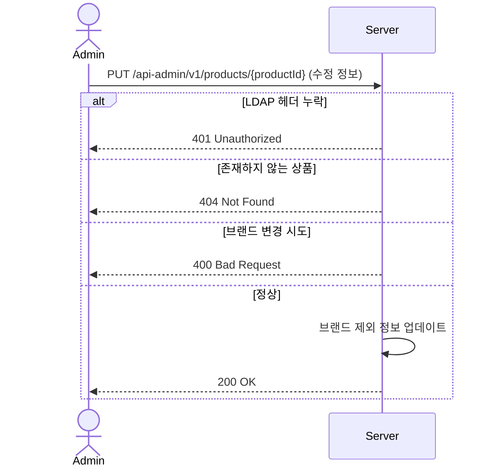
```mermaid
sequenceDiagram
    actor Admin
    participant Server

    Admin->>Server: PUT /api-admin/v1/products/{productId} (수정 정보)
    alt LDAP 헤더 누락
        Server-->>Admin: 401 Unauthorized
    else 존재하지 않는 상품
        Server-->>Admin: 404 Not Found
    else 브랜드 변경 시도
        Server-->>Admin: 400 Bad Request
    else 정상
        Server->>Server: 브랜드 제외 정보 업데이트
        Server-->>Admin: 200 OK
    end
```

---

## 3. 좋아요 (Likes)

### 3-1. 상품 좋아요 / 취소

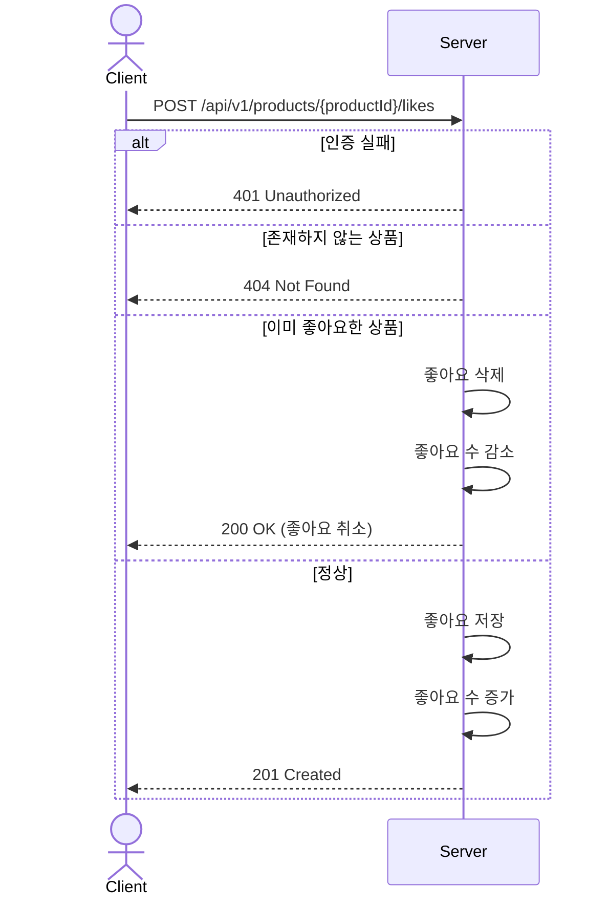
```mermaid
sequenceDiagram
    actor Client
    participant Server

    Client->>Server: POST /api/v1/products/{productId}/likes
    alt 인증 실패
        Server-->>Client: 401 Unauthorized
    else 존재하지 않는 상품
        Server-->>Client: 404 Not Found
    else 이미 좋아요한 상품
        Server->>Server: 좋아요 삭제
        Server->>Server: 좋아요 수 감소
        Server-->>Client: 200 OK (좋아요 취소)
    else 정상
        Server->>Server: 좋아요 저장
        Server->>Server: 좋아요 수 증가
        Server-->>Client: 201 Created
    end
```

---

### 3-2. 좋아요한 상품 목록 조회

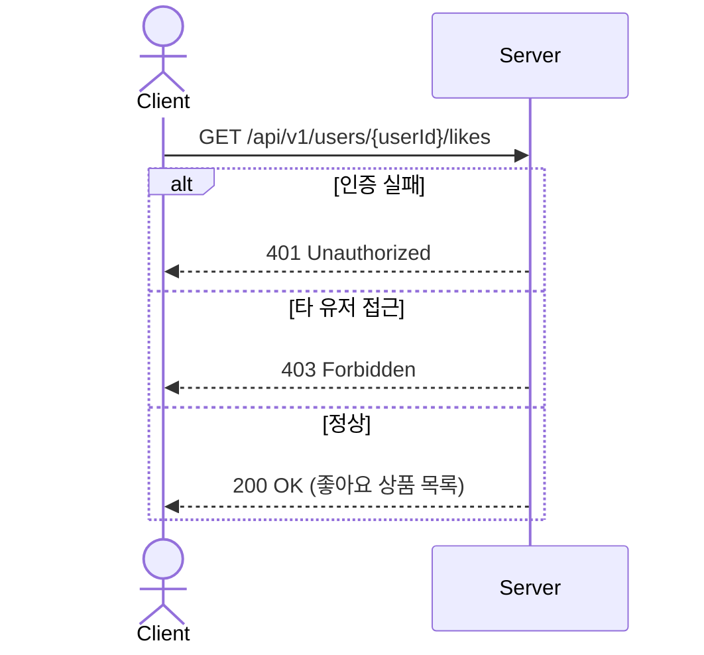
```mermaid
sequenceDiagram
    actor Client
    participant Server

    Client->>Server: GET /api/v1/users/{userId}/likes
    alt 인증 실패
        Server-->>Client: 401 Unauthorized
    else 타 유저 접근
        Server-->>Client: 403 Forbidden
    else 정상
        Server-->>Client: 200 OK (좋아요 상품 목록)
    end
```

---

## 4. 주문 (Orders)

### 4-1. 주문 요청

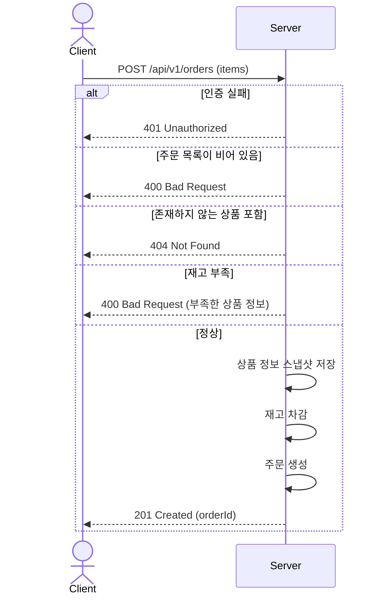
```mermaid
sequenceDiagram
    actor Client
    participant Server

    Client->>Server: POST /api/v1/orders (items)
    alt 인증 실패
        Server-->>Client: 401 Unauthorized
    else 주문 목록이 비어 있음
        Server-->>Client: 400 Bad Request
    else 존재하지 않는 상품 포함
        Server-->>Client: 404 Not Found
    else 재고 부족
        Server-->>Client: 400 Bad Request (부족한 상품 정보)
    else 정상
        Server->>Server: 상품 정보 스냅샷 저장
        Server->>Server: 재고 차감
        Server->>Server: 주문 생성
        Server-->>Client: 201 Created (orderId)
    end
```

---

### 4-2. 주문 목록 조회

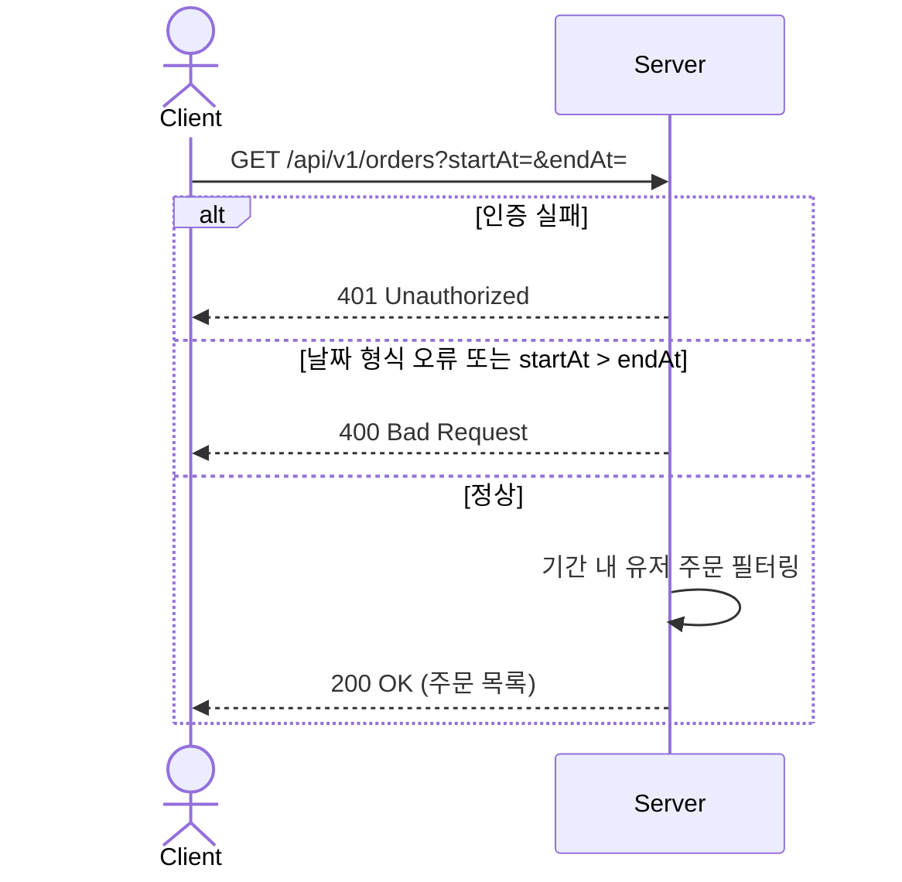
```mermaid
sequenceDiagram
    actor Client
    participant Server

    Client->>Server: GET /api/v1/orders?startAt=&endAt=
    alt 인증 실패
        Server-->>Client: 401 Unauthorized
    else 날짜 형식 오류 또는 startAt > endAt
        Server-->>Client: 400 Bad Request
    else 정상
        Server->>Server: 기간 내 유저 주문 필터링
        Server-->>Client: 200 OK (주문 목록)
    end
```

---

### 4-3. 주문 상세 조회

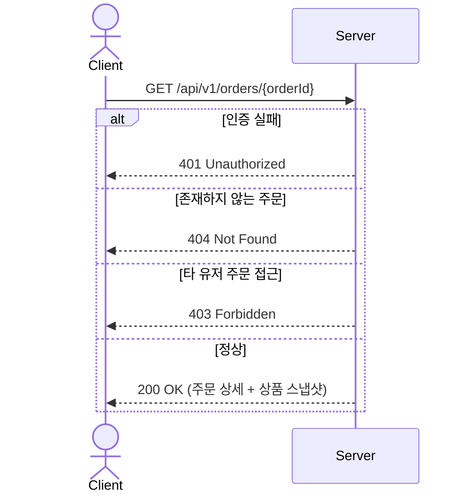
```mermaid
sequenceDiagram
    actor Client
    participant Server

    Client->>Server: GET /api/v1/orders/{orderId}
    alt 인증 실패
        Server-->>Client: 401 Unauthorized
    else 존재하지 않는 주문
        Server-->>Client: 404 Not Found
    else 타 유저 주문 접근
        Server-->>Client: 403 Forbidden
    else 정상
        Server-->>Client: 200 OK (주문 상세 + 상품 스냅샷)
    end
```

---

### 4-4. 주문 결제 내역 조회

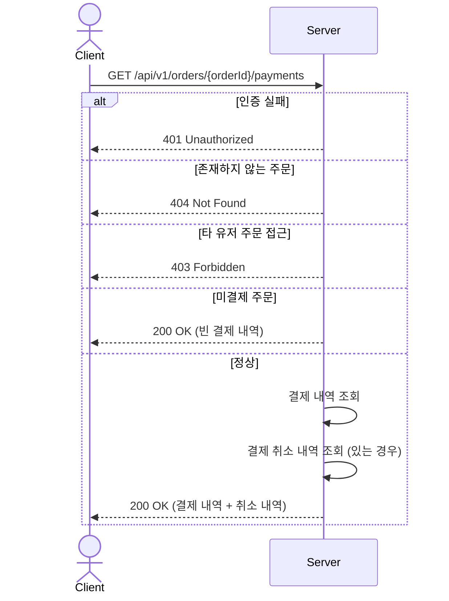
```mermaid
sequenceDiagram
    actor Client
    participant Server

    Client->>Server: GET /api/v1/orders/{orderId}/payments
    alt 인증 실패
        Server-->>Client: 401 Unauthorized
    else 존재하지 않는 주문
        Server-->>Client: 404 Not Found
    else 타 유저 주문 접근
        Server-->>Client: 403 Forbidden
    else 미결제 주문
        Server-->>Client: 200 OK (빈 결제 내역)
    else 정상
        Server->>Server: 결제 내역 조회
        Server->>Server: 결제 취소 내역 조회 (있는 경우)
        Server-->>Client: 200 OK (결제 내역 + 취소 내역)
    end
```

---

## 5. 장바구니 (Cart)

### 5-1. 장바구니 상품 추가

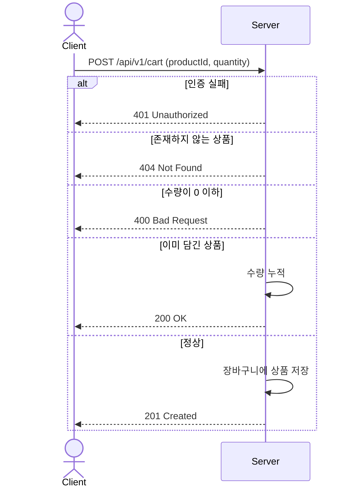
```mermaid
sequenceDiagram
    actor Client
    participant Server

    Client->>Server: POST /api/v1/cart (productId, quantity)
    alt 인증 실패
        Server-->>Client: 401 Unauthorized
    else 존재하지 않는 상품
        Server-->>Client: 404 Not Found
    else 수량이 0 이하
        Server-->>Client: 400 Bad Request
    else 이미 담긴 상품
        Server->>Server: 수량 누적
        Server-->>Client: 200 OK
    else 정상
        Server->>Server: 장바구니에 상품 저장
        Server-->>Client: 201 Created
    end
```

---

### 5-2. 장바구니 목록 조회

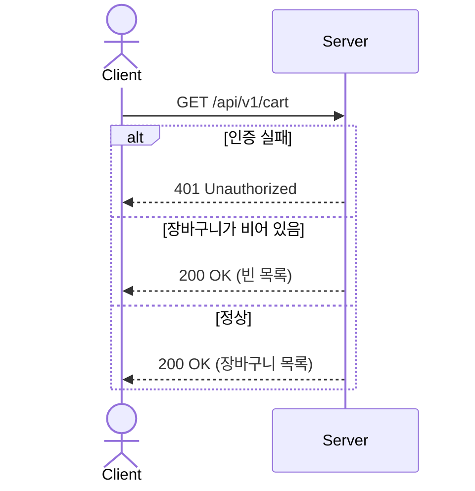
```mermaid
sequenceDiagram
    actor Client
    participant Server

    Client->>Server: GET /api/v1/cart
    alt 인증 실패
        Server-->>Client: 401 Unauthorized
    else 장바구니가 비어 있음
        Server-->>Client: 200 OK (빈 목록)
    else 정상
        Server-->>Client: 200 OK (장바구니 목록)
    end
```

---

### 5-3. 장바구니 수량 변경

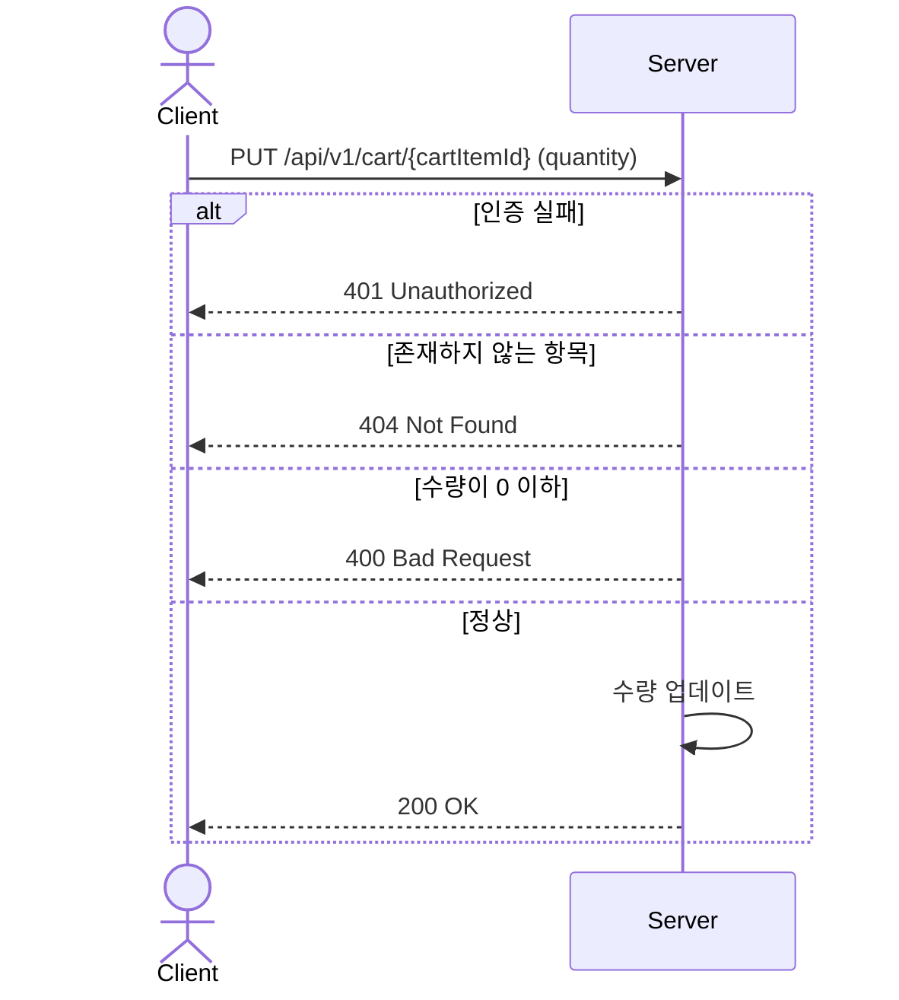
```mermaid
sequenceDiagram
    actor Client
    participant Server

    Client->>Server: PUT /api/v1/cart/{cartItemId} (quantity)
    alt 인증 실패
        Server-->>Client: 401 Unauthorized
    else 존재하지 않는 항목
        Server-->>Client: 404 Not Found
    else 수량이 0 이하
        Server-->>Client: 400 Bad Request
    else 정상
        Server->>Server: 수량 업데이트
        Server-->>Client: 200 OK
    end
```

---

### 5-4. 장바구니 상품 제거

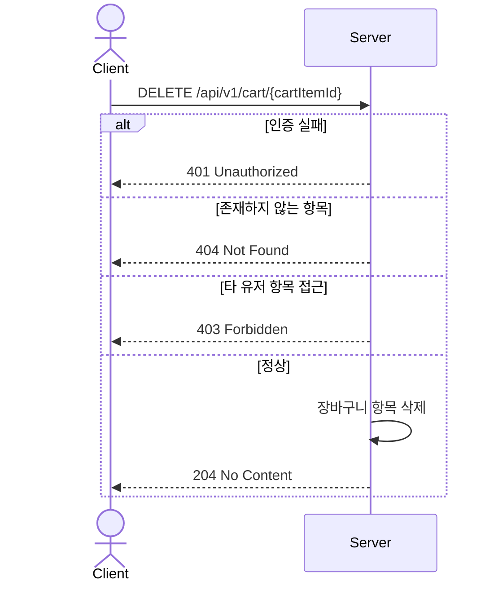
```mermaid
sequenceDiagram
    actor Client
    participant Server

    Client->>Server: DELETE /api/v1/cart/{cartItemId}
    alt 인증 실패
        Server-->>Client: 401 Unauthorized
    else 존재하지 않는 항목
        Server-->>Client: 404 Not Found
    else 타 유저 항목 접근
        Server-->>Client: 403 Forbidden
    else 정상
        Server->>Server: 장바구니 항목 삭제
        Server-->>Client: 204 No Content
    end
```

---

## 6. 결제 (Payment)

### 6-1. 결제 요청

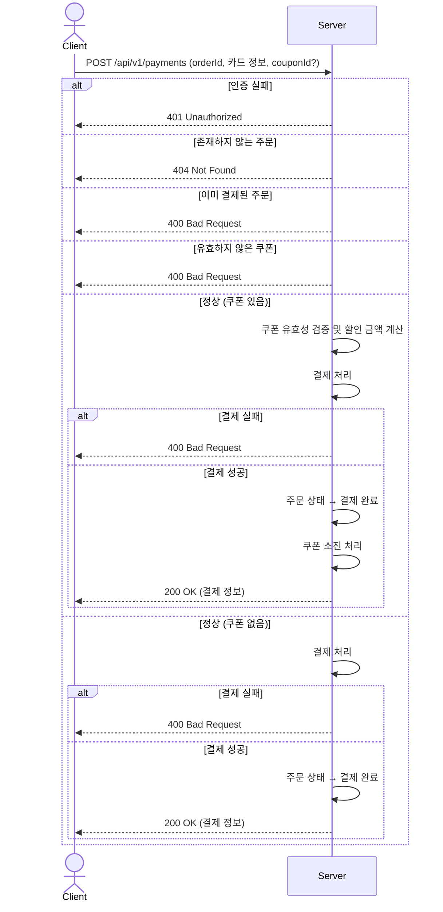
```mermaid
sequenceDiagram
    actor Client
    participant Server

    Client->>Server: POST /api/v1/payments (orderId, 카드 정보, couponId?)
    alt 인증 실패
        Server-->>Client: 401 Unauthorized
    else 존재하지 않는 주문
        Server-->>Client: 404 Not Found
    else 이미 결제된 주문
        Server-->>Client: 400 Bad Request
    else 유효하지 않은 쿠폰
        Server-->>Client: 400 Bad Request
    else 정상 (쿠폰 있음)
        Server->>Server: 쿠폰 유효성 검증 및 할인 금액 계산
        Server->>Server: 결제 처리
        alt 결제 실패
            Server-->>Client: 400 Bad Request
        else 결제 성공
            Server->>Server: 주문 상태 → 결제 완료
            Server->>Server: 쿠폰 소진 처리
            Server-->>Client: 200 OK (결제 정보)
        end
    else 정상 (쿠폰 없음)
        Server->>Server: 결제 처리
        alt 결제 실패
            Server-->>Client: 400 Bad Request
        else 결제 성공
            Server->>Server: 주문 상태 → 결제 완료
            Server-->>Client: 200 OK (결제 정보)
        end
    end
```

---

### 6-2. 결제 취소

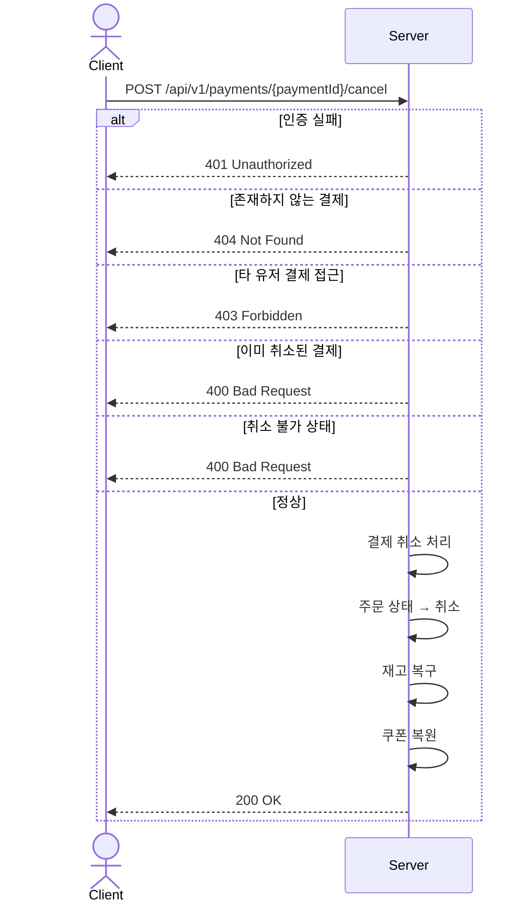
```mermaid
sequenceDiagram
    actor Client
    participant Server

    Client->>Server: POST /api/v1/payments/{paymentId}/cancel
    alt 인증 실패
        Server-->>Client: 401 Unauthorized
    else 존재하지 않는 결제
        Server-->>Client: 404 Not Found
    else 타 유저 결제 접근
        Server-->>Client: 403 Forbidden
    else 이미 취소된 결제
        Server-->>Client: 400 Bad Request
    else 취소 불가 상태
        Server-->>Client: 400 Bad Request
    else 정상
        Server->>Server: 결제 취소 처리
        Server->>Server: 주문 상태 → 취소
        Server->>Server: 재고 복구
        Server->>Server: 쿠폰 복원
        Server-->>Client: 200 OK
    end
```

---

## 7. 어드민 (Admin)

### 7-1. 유저 목록 조회

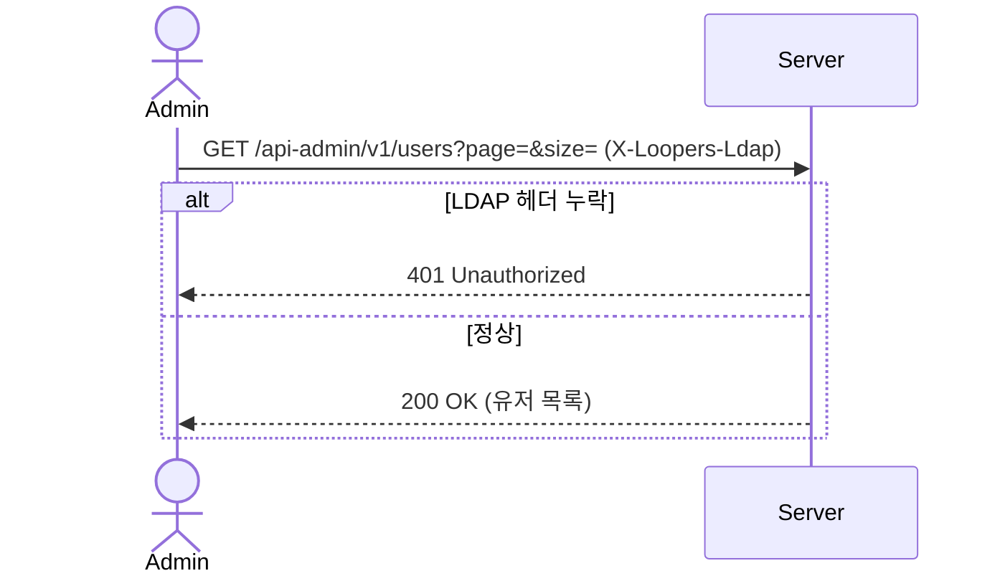
```mermaid
sequenceDiagram
    actor Admin
    participant Server

    Admin->>Server: GET /api-admin/v1/users?page=&size= (X-Loopers-Ldap)
    alt LDAP 헤더 누락
        Server-->>Admin: 401 Unauthorized
    else 정상
        Server-->>Admin: 200 OK (유저 목록)
    end
```

---

### 7-2. 유저 상세 조회

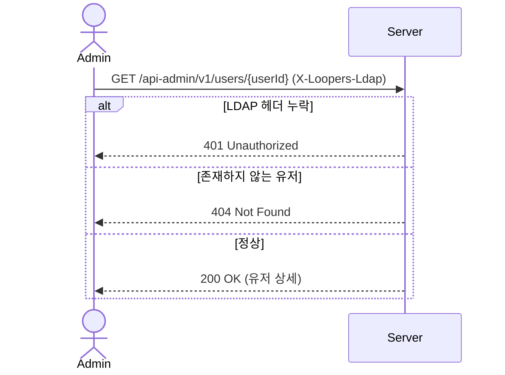
```mermaid
sequenceDiagram
    actor Admin
    participant Server

    Admin->>Server: GET /api-admin/v1/users/{userId} (X-Loopers-Ldap)
    alt LDAP 헤더 누락
        Server-->>Admin: 401 Unauthorized
    else 존재하지 않는 유저
        Server-->>Admin: 404 Not Found
    else 정상
        Server-->>Admin: 200 OK (유저 상세)
    end
```

---

### 7-3. 특정 유저의 주문 내역 조회

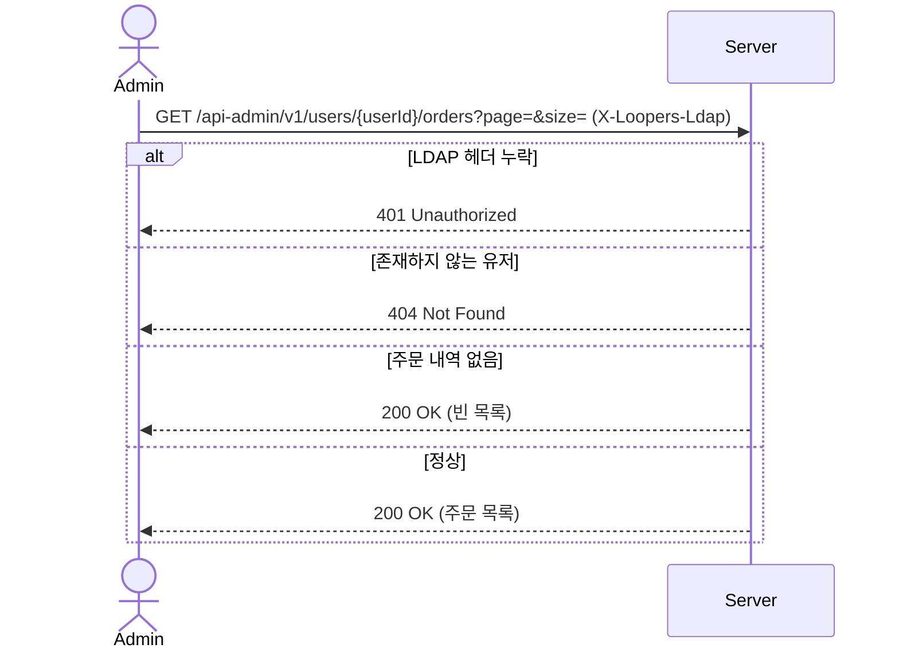
```mermaid
sequenceDiagram
    actor Admin
    participant Server

    Admin->>Server: GET /api-admin/v1/users/{userId}/orders?page=&size= (X-Loopers-Ldap)
    alt LDAP 헤더 누락
        Server-->>Admin: 401 Unauthorized
    else 존재하지 않는 유저
        Server-->>Admin: 404 Not Found
    else 주문 내역 없음
        Server-->>Admin: 200 OK (빈 목록)
    else 정상
        Server-->>Admin: 200 OK (주문 목록)
    end
```

---

### 7-4. 전체 수익 조회

```mermaid
sequenceDiagram
    actor Admin
    participant Server

    Admin->>Server: GET /api-admin/v1/stats/revenue?startAt=&endAt= (X-Loopers-Ldap)
    alt LDAP 헤더 누락
        Server-->>Admin: 401 Unauthorized
    else 날짜 형식 오류 또는 startAt > endAt
        Server-->>Admin: 400 Bad Request
    else 결제 내역 없음
        Server-->>Admin: 200 OK (총액 0원)
    else 정상
        Server->>Server: 기간 내 결제 완료 주문 집계
        Server-->>Admin: 200 OK (총 결제액, 총 할인액, 순 수익)
    end
```

---

### 7-5. 상품별 판매 통계 조회

```mermaid
sequenceDiagram
    actor Admin
    participant Server

    Admin->>Server: GET /api-admin/v1/stats/products?startAt=&endAt= (X-Loopers-Ldap)
    alt LDAP 헤더 누락
        Server-->>Admin: 401 Unauthorized
    else 날짜 형식 오류
        Server-->>Admin: 400 Bad Request
    else 정상
        Server->>Server: 기간 내 상품별 판매 집계
        Server-->>Admin: 200 OK (상품별 판매 수량, 금액)
    end
```

---

### 7-6. 전체 주문 목록 조회

```mermaid
sequenceDiagram
    actor Admin
    participant Server

    Admin->>Server: GET /api-admin/v1/orders?page=&size= (X-Loopers-Ldap)
    alt LDAP 헤더 누락
        Server-->>Admin: 401 Unauthorized
    else 정상
        Server-->>Admin: 200 OK (전체 주문 목록)
    end
```
