# 시퀀스 다이어그램 (컴포넌트 상세)

---

## 1. 유저 (Users)

### 1-1. 비밀번호 변경

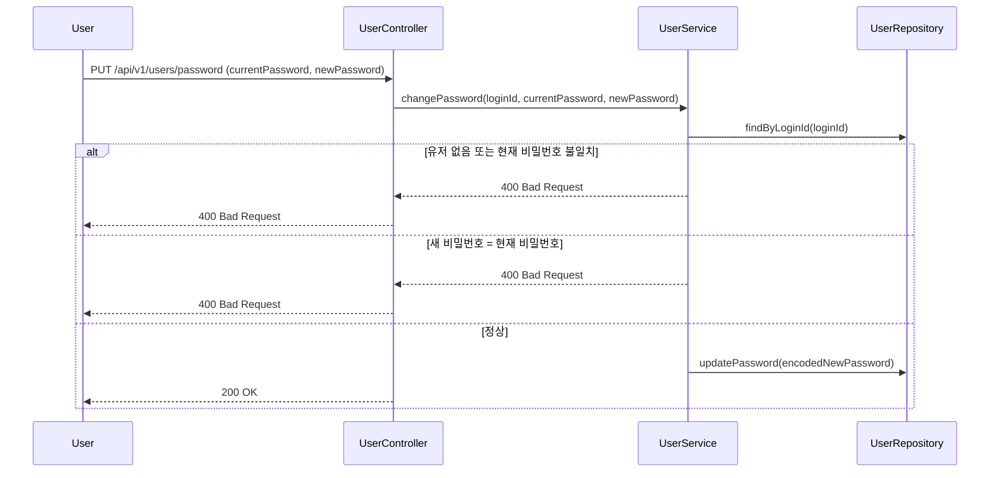
```mermaid
sequenceDiagram
    participant User
    participant UserController
    participant UserService
    participant UserRepository

    User->>UserController: PUT /api/v1/users/password (currentPassword, newPassword)
    UserController->>UserService: changePassword(loginId, currentPassword, newPassword)
    UserService->>UserRepository: findByLoginId(loginId)

    alt 유저 없음 또는 현재 비밀번호 불일치
        UserService-->>UserController: 400 Bad Request
        UserController-->>User: 400 Bad Request
    else 새 비밀번호 = 현재 비밀번호
        UserService-->>UserController: 400 Bad Request
        UserController-->>User: 400 Bad Request
    else 정상
        UserService->>UserRepository: updatePassword(encodedNewPassword)
        UserController-->>User: 200 OK
    end
```

---

## 2. 브랜드 & 상품 (Brands / Products)

### 2-1. 상품 목록 조회

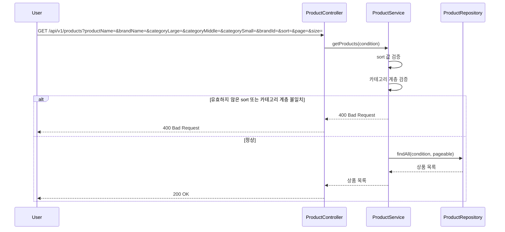
```mermaid
sequenceDiagram
    participant User
    participant ProductController
    participant ProductService
    participant ProductRepository

    User->>ProductController: GET /api/v1/products?productName=&brandName=&categoryLarge=&categoryMiddle=&categorySmall=&brandId=&sort=&page=&size=
    ProductController->>ProductService: getProducts(condition)
    ProductService->>ProductService: sort 값 검증
    ProductService->>ProductService: 카테고리 계층 검증

    alt 유효하지 않은 sort 또는 카테고리 계층 불일치
        ProductService-->>ProductController: 400 Bad Request
        ProductController-->>User: 400 Bad Request
    else 정상
        ProductService->>ProductRepository: findAll(condition, pageable)
        ProductRepository-->>ProductService: 상품 목록
        ProductService-->>ProductController: 상품 목록
        ProductController-->>User: 200 OK
    end
```

---

### 2-2. 브랜드 목록 조회

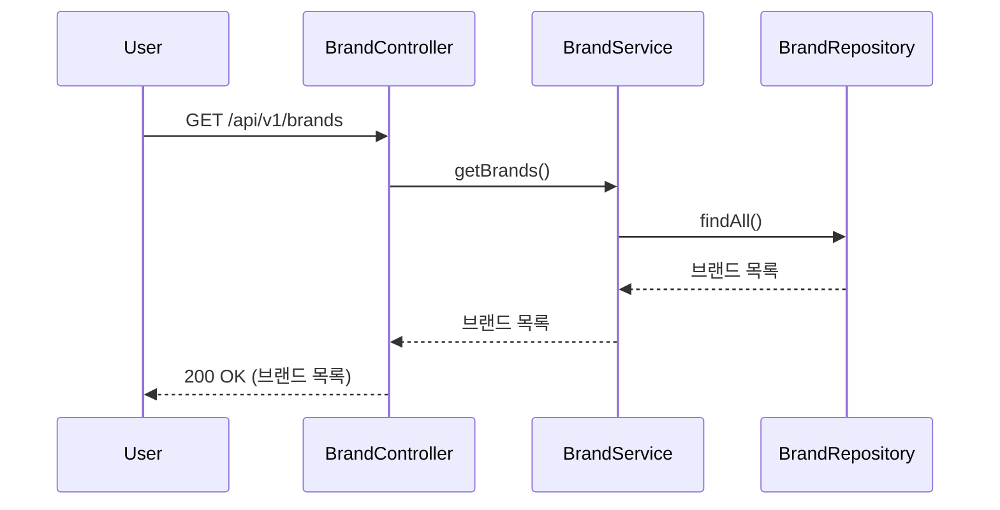
```mermaid
sequenceDiagram
    participant User
    participant BrandController
    participant BrandService
    participant BrandRepository

    User->>BrandController: GET /api/v1/brands
    BrandController->>BrandService: getBrands()
    BrandService->>BrandRepository: findAll()
    BrandRepository-->>BrandService: 브랜드 목록
    BrandService-->>BrandController: 브랜드 목록
    BrandController-->>User: 200 OK (브랜드 목록)
```

---

### 2-3. 브랜드 정보 조회

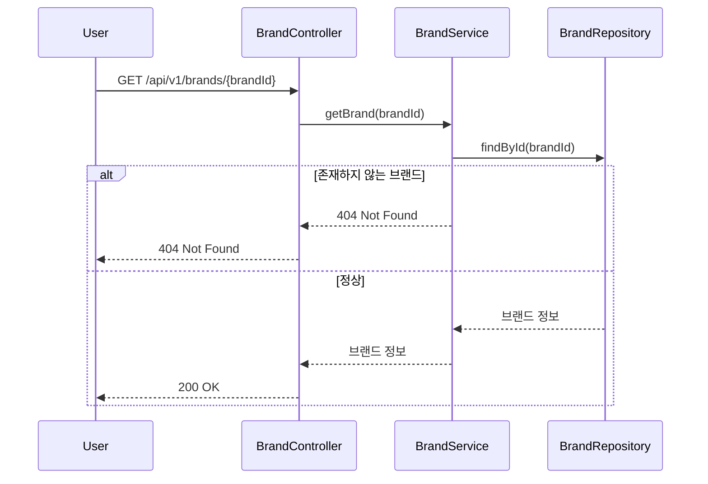
```mermaid
sequenceDiagram
    participant User
    participant BrandController
    participant BrandService
    participant BrandRepository

    User->>BrandController: GET /api/v1/brands/{brandId}
    BrandController->>BrandService: getBrand(brandId)
    BrandService->>BrandRepository: findById(brandId)

    alt 존재하지 않는 브랜드
        BrandService-->>BrandController: 404 Not Found
        BrandController-->>User: 404 Not Found
    else 정상
        BrandRepository-->>BrandService: 브랜드 정보
        BrandService-->>BrandController: 브랜드 정보
        BrandController-->>User: 200 OK
    end
```

---

### 2-4. 상품 정보 조회

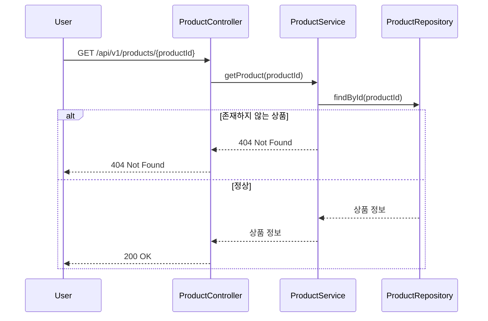
```mermaid
sequenceDiagram
    participant User
    participant ProductController
    participant ProductService
    participant ProductRepository

    User->>ProductController: GET /api/v1/products/{productId}
    ProductController->>ProductService: getProduct(productId)
    ProductService->>ProductRepository: findById(productId)

    alt 존재하지 않는 상품
        ProductService-->>ProductController: 404 Not Found
        ProductController-->>User: 404 Not Found
    else 정상
        ProductRepository-->>ProductService: 상품 정보
        ProductService-->>ProductController: 상품 정보
        ProductController-->>User: 200 OK
    end
```

---

## 2-ADMIN. 브랜드 & 상품 ADMIN

### 2-ADMIN-1. 등록된 브랜드 목록 조회

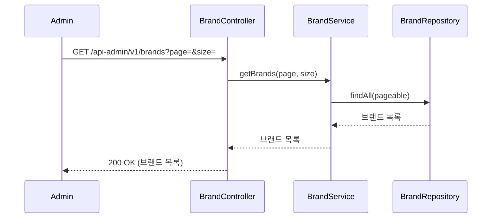
```mermaid
sequenceDiagram
    participant Admin
    participant BrandController
    participant BrandService
    participant BrandRepository

    Admin->>BrandController: GET /api-admin/v1/brands?page=&size=
    BrandController->>BrandService: getBrands(page, size)
    BrandService->>BrandRepository: findAll(pageable)
    BrandRepository-->>BrandService: 브랜드 목록
    BrandService-->>BrandController: 브랜드 목록
    BrandController-->>Admin: 200 OK (브랜드 목록)
```

---

### 2-ADMIN-2. 브랜드 상세 조회

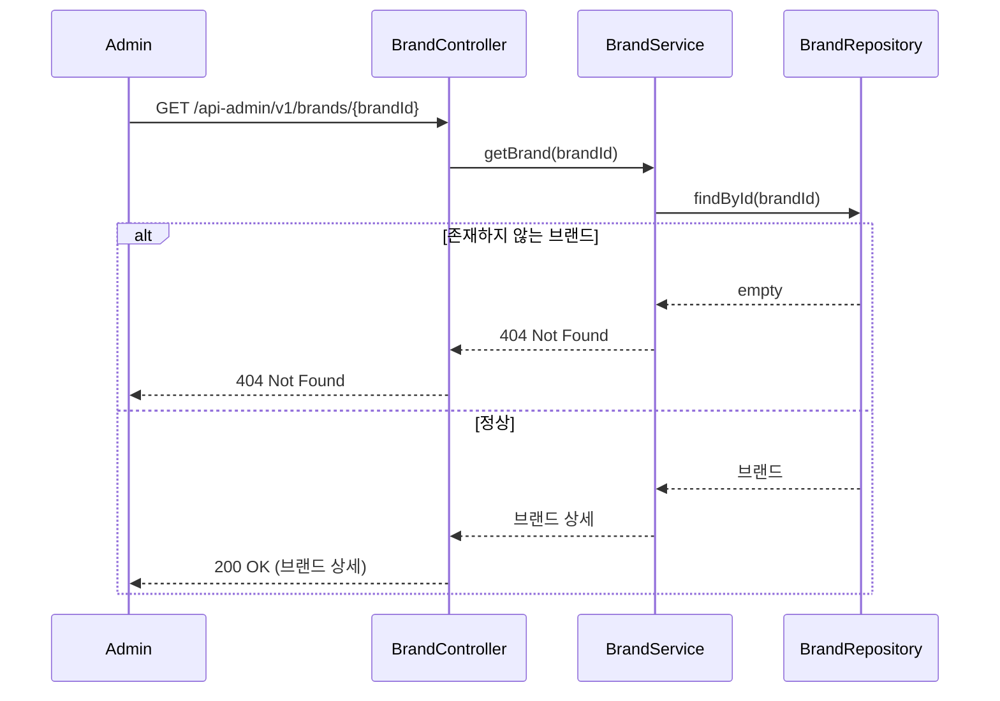
```mermaid
sequenceDiagram
    participant Admin
    participant BrandController
    participant BrandService
    participant BrandRepository

    Admin->>BrandController: GET /api-admin/v1/brands/{brandId}
    BrandController->>BrandService: getBrand(brandId)
    BrandService->>BrandRepository: findById(brandId)

    alt 존재하지 않는 브랜드
        BrandRepository-->>BrandService: empty
        BrandService-->>BrandController: 404 Not Found
        BrandController-->>Admin: 404 Not Found
    else 정상
        BrandRepository-->>BrandService: 브랜드
        BrandService-->>BrandController: 브랜드 상세
        BrandController-->>Admin: 200 OK (브랜드 상세)
    end
```

---

### 2-ADMIN-3. 브랜드 등록

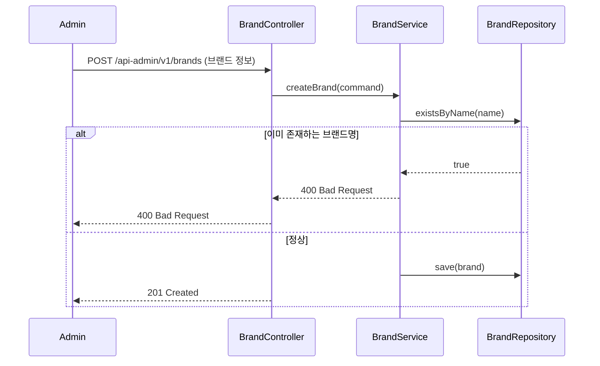
```mermaid
sequenceDiagram
    participant Admin
    participant BrandController
    participant BrandService
    participant BrandRepository

    Admin->>BrandController: POST /api-admin/v1/brands (브랜드 정보)
    BrandController->>BrandService: createBrand(command)
    BrandService->>BrandRepository: existsByName(name)

    alt 이미 존재하는 브랜드명
        BrandRepository-->>BrandService: true
        BrandService-->>BrandController: 400 Bad Request
        BrandController-->>Admin: 400 Bad Request
    else 정상
        BrandService->>BrandRepository: save(brand)
        BrandController-->>Admin: 201 Created
    end
```

---

### 2-ADMIN-4. 브랜드 수정

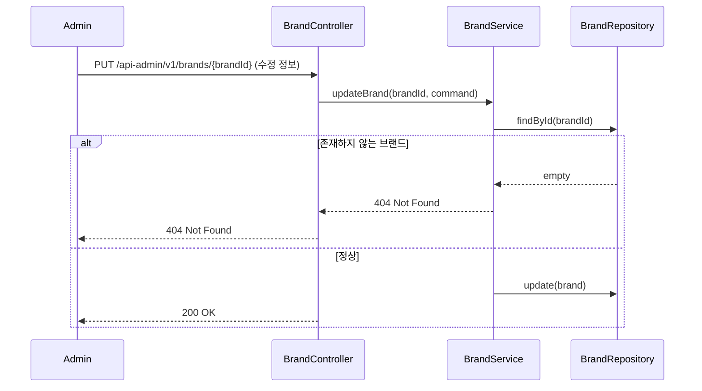
```mermaid
sequenceDiagram
    participant Admin
    participant BrandController
    participant BrandService
    participant BrandRepository

    Admin->>BrandController: PUT /api-admin/v1/brands/{brandId} (수정 정보)
    BrandController->>BrandService: updateBrand(brandId, command)
    BrandService->>BrandRepository: findById(brandId)

    alt 존재하지 않는 브랜드
        BrandRepository-->>BrandService: empty
        BrandService-->>BrandController: 404 Not Found
        BrandController-->>Admin: 404 Not Found
    else 정상
        BrandService->>BrandRepository: update(brand)
        BrandController-->>Admin: 200 OK
    end
```

---

### 2-ADMIN-5. 브랜드 삭제

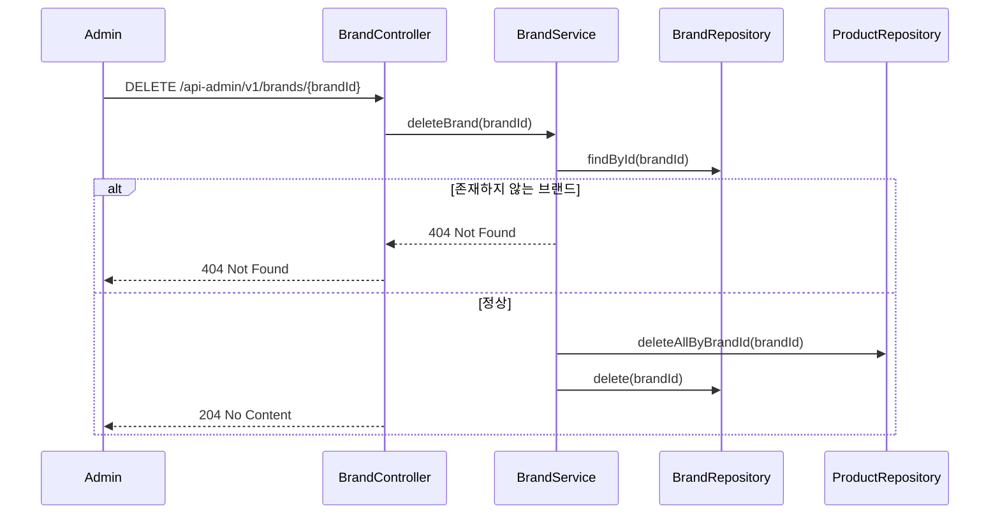
```mermaid
sequenceDiagram
    participant Admin
    participant BrandController
    participant BrandService
    participant BrandRepository
    participant ProductRepository

    Admin->>BrandController: DELETE /api-admin/v1/brands/{brandId}
    BrandController->>BrandService: deleteBrand(brandId)
    BrandService->>BrandRepository: findById(brandId)

    alt 존재하지 않는 브랜드
        BrandService-->>BrandController: 404 Not Found
        BrandController-->>Admin: 404 Not Found
    else 정상
        BrandService->>ProductRepository: deleteAllByBrandId(brandId)
        BrandService->>BrandRepository: delete(brandId)
        BrandController-->>Admin: 204 No Content
    end
```

---

### 2-ADMIN-6. 등록된 상품 목록 조회

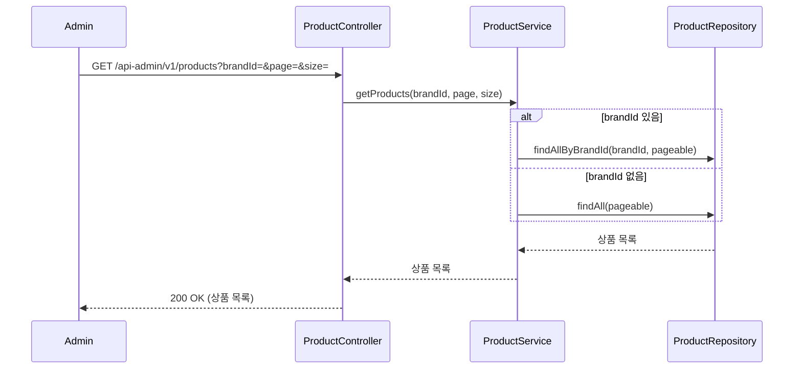
```mermaid
sequenceDiagram
    participant Admin
    participant ProductController
    participant ProductService
    participant ProductRepository

    Admin->>ProductController: GET /api-admin/v1/products?brandId=&page=&size=
    ProductController->>ProductService: getProducts(brandId, page, size)

    alt brandId 있음
        ProductService->>ProductRepository: findAllByBrandId(brandId, pageable)
    else brandId 없음
        ProductService->>ProductRepository: findAll(pageable)
    end

    ProductRepository-->>ProductService: 상품 목록
    ProductService-->>ProductController: 상품 목록
    ProductController-->>Admin: 200 OK (상품 목록)
```

---

### 2-ADMIN-7. 상품 상세 조회

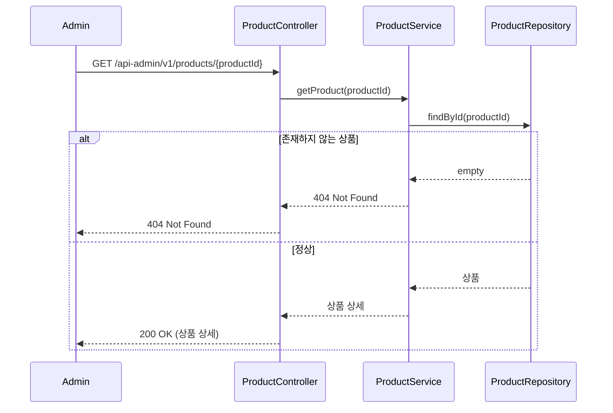
```mermaid
sequenceDiagram
    participant Admin
    participant ProductController
    participant ProductService
    participant ProductRepository

    Admin->>ProductController: GET /api-admin/v1/products/{productId}
    ProductController->>ProductService: getProduct(productId)
    ProductService->>ProductRepository: findById(productId)

    alt 존재하지 않는 상품
        ProductRepository-->>ProductService: empty
        ProductService-->>ProductController: 404 Not Found
        ProductController-->>Admin: 404 Not Found
    else 정상
        ProductRepository-->>ProductService: 상품
        ProductService-->>ProductController: 상품 상세
        ProductController-->>Admin: 200 OK (상품 상세)
    end
```

---

### 2-ADMIN-8. 상품 등록

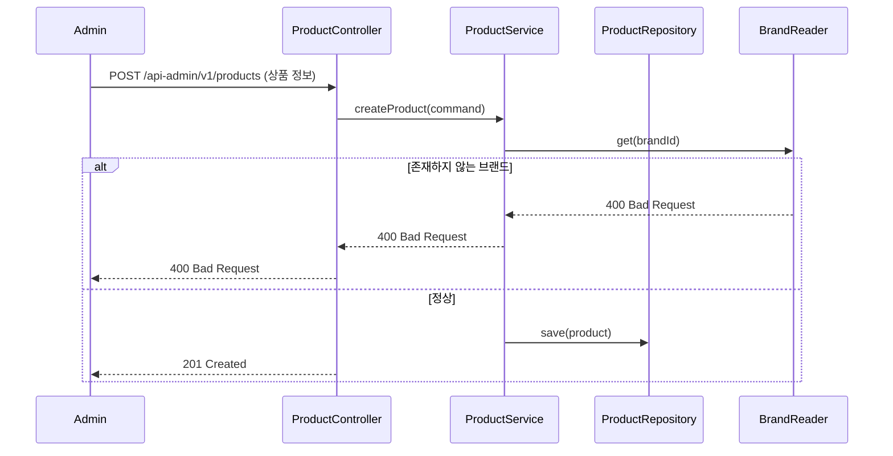
```mermaid
sequenceDiagram
    participant Admin
    participant ProductController
    participant ProductService
    participant ProductRepository
    participant BrandReader

    Admin->>ProductController: POST /api-admin/v1/products (상품 정보)
    ProductController->>ProductService: createProduct(command)
    ProductService->>BrandReader: get(brandId)

    alt 존재하지 않는 브랜드
        BrandReader-->>ProductService: 400 Bad Request
        ProductService-->>ProductController: 400 Bad Request
        ProductController-->>Admin: 400 Bad Request
    else 정상
        ProductService->>ProductRepository: save(product)
        ProductController-->>Admin: 201 Created
    end
```

---

### 2-ADMIN-9. 상품 수정

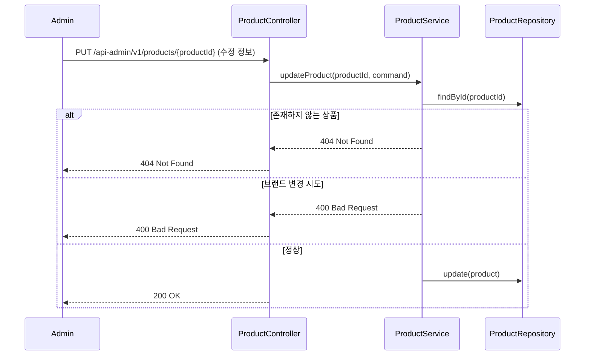
```mermaid
sequenceDiagram
    participant Admin
    participant ProductController
    participant ProductService
    participant ProductRepository

    Admin->>ProductController: PUT /api-admin/v1/products/{productId} (수정 정보)
    ProductController->>ProductService: updateProduct(productId, command)
    ProductService->>ProductRepository: findById(productId)

    alt 존재하지 않는 상품
        ProductService-->>ProductController: 404 Not Found
        ProductController-->>Admin: 404 Not Found
    else 브랜드 변경 시도
        ProductService-->>ProductController: 400 Bad Request
        ProductController-->>Admin: 400 Bad Request
    else 정상
        ProductService->>ProductRepository: update(product)
        ProductController-->>Admin: 200 OK
    end
```

---

### 2-ADMIN-10. 상품 삭제

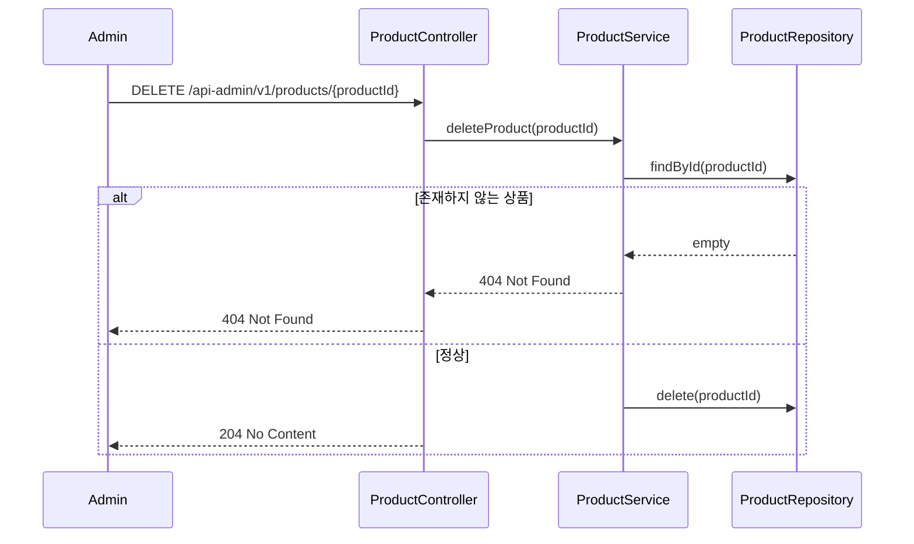
```mermaid
sequenceDiagram
    participant Admin
    participant ProductController
    participant ProductService
    participant ProductRepository

    Admin->>ProductController: DELETE /api-admin/v1/products/{productId}
    ProductController->>ProductService: deleteProduct(productId)
    ProductService->>ProductRepository: findById(productId)

    alt 존재하지 않는 상품
        ProductRepository-->>ProductService: empty
        ProductService-->>ProductController: 404 Not Found
        ProductController-->>Admin: 404 Not Found
    else 정상
        ProductService->>ProductRepository: delete(productId)
        ProductController-->>Admin: 204 No Content
    end
```

---

### 2-ADMIN-11. 상품별 판매 통계 조회

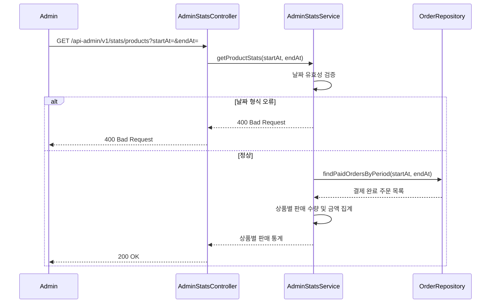
```mermaid
sequenceDiagram
    participant Admin
    participant AdminStatsController
    participant AdminStatsService
    participant OrderRepository

    Admin->>AdminStatsController: GET /api-admin/v1/stats/products?startAt=&endAt=
    AdminStatsController->>AdminStatsService: getProductStats(startAt, endAt)
    AdminStatsService->>AdminStatsService: 날짜 유효성 검증

    alt 날짜 형식 오류
        AdminStatsService-->>AdminStatsController: 400 Bad Request
        AdminStatsController-->>Admin: 400 Bad Request
    else 정상
        AdminStatsService->>OrderRepository: findPaidOrdersByPeriod(startAt, endAt)
        OrderRepository-->>AdminStatsService: 결제 완료 주문 목록
        AdminStatsService->>AdminStatsService: 상품별 판매 수량 및 금액 집계
        AdminStatsService-->>AdminStatsController: 상품별 판매 통계
        AdminStatsController-->>Admin: 200 OK
    end
```

---

## 3. 좋아요 (Likes)

### 3-1. 좋아요 등록

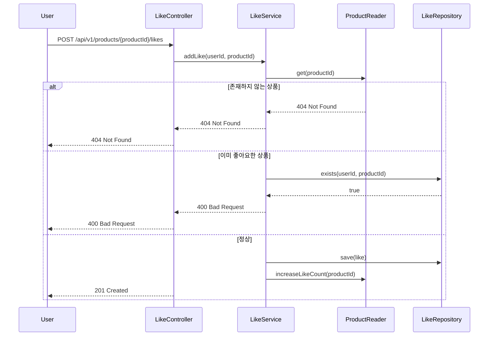
```mermaid
sequenceDiagram
    participant User
    participant LikeController
    participant LikeService
    participant ProductReader
    participant LikeRepository

    User->>LikeController: POST /api/v1/products/{productId}/likes
    LikeController->>LikeService: addLike(userId, productId)
    LikeService->>ProductReader: get(productId)

    alt 존재하지 않는 상품
        ProductReader-->>LikeService: 404 Not Found
        LikeService-->>LikeController: 404 Not Found
        LikeController-->>User: 404 Not Found
    else 이미 좋아요한 상품
        LikeService->>LikeRepository: exists(userId, productId)
        LikeRepository-->>LikeService: true
        LikeService-->>LikeController: 400 Bad Request
        LikeController-->>User: 400 Bad Request
    else 정상
        LikeService->>LikeRepository: save(like)
        LikeService->>ProductReader: increaseLikeCount(productId)
        LikeController-->>User: 201 Created
    end
```

---

### 3-2. 좋아요 취소

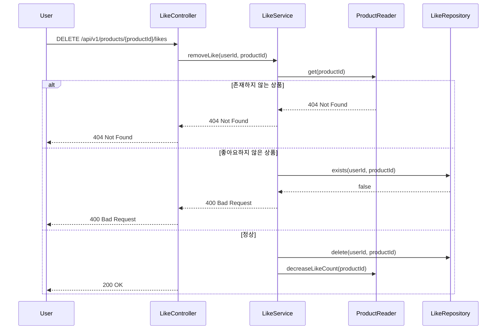
```mermaid
sequenceDiagram
    participant User
    participant LikeController
    participant LikeService
    participant ProductReader
    participant LikeRepository

    User->>LikeController: DELETE /api/v1/products/{productId}/likes
    LikeController->>LikeService: removeLike(userId, productId)
    LikeService->>ProductReader: get(productId)

    alt 존재하지 않는 상품
        ProductReader-->>LikeService: 404 Not Found
        LikeService-->>LikeController: 404 Not Found
        LikeController-->>User: 404 Not Found
    else 좋아요하지 않은 상품
        LikeService->>LikeRepository: exists(userId, productId)
        LikeRepository-->>LikeService: false
        LikeService-->>LikeController: 400 Bad Request
        LikeController-->>User: 400 Bad Request
    else 정상
        LikeService->>LikeRepository: delete(userId, productId)
        LikeService->>ProductReader: decreaseLikeCount(productId)
        LikeController-->>User: 200 OK
    end
```

---

### 3-3. 좋아요한 상품 목록 조회

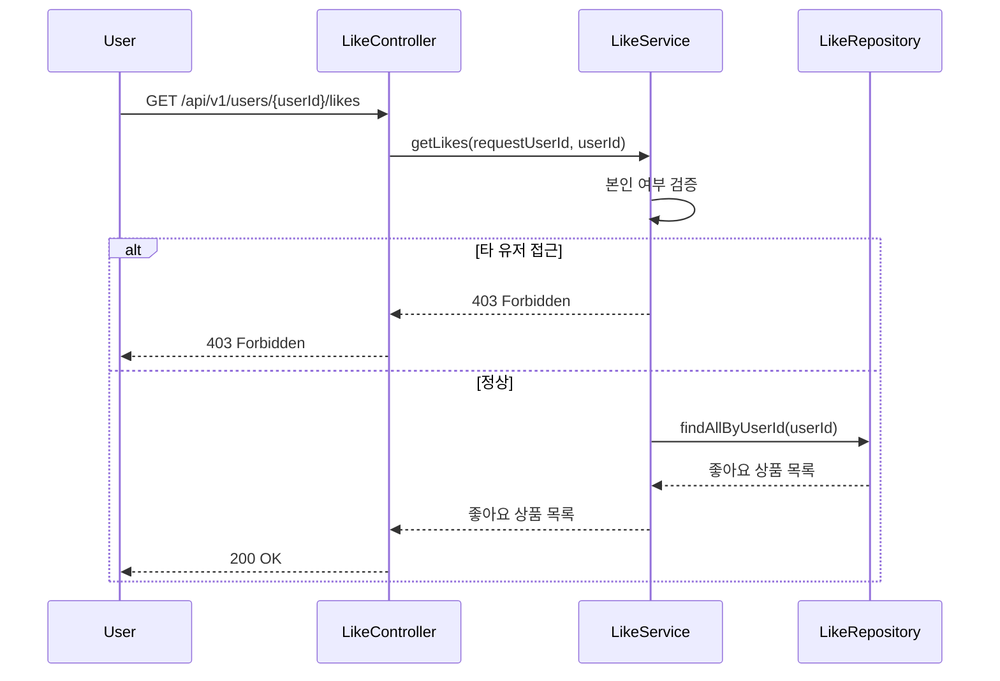
```mermaid
sequenceDiagram
    participant User
    participant LikeController
    participant LikeService
    participant LikeRepository

    User->>LikeController: GET /api/v1/users/{userId}/likes
    LikeController->>LikeService: getLikes(requestUserId, userId)
    LikeService->>LikeService: 본인 여부 검증

    alt 타 유저 접근
        LikeService-->>LikeController: 403 Forbidden
        LikeController-->>User: 403 Forbidden
    else 정상
        LikeService->>LikeRepository: findAllByUserId(userId)
        LikeRepository-->>LikeService: 좋아요 상품 목록
        LikeService-->>LikeController: 좋아요 상품 목록
        LikeController-->>User: 200 OK
    end
```

---

## 4. 주문 (Orders)

### 4-1. 주문 요청

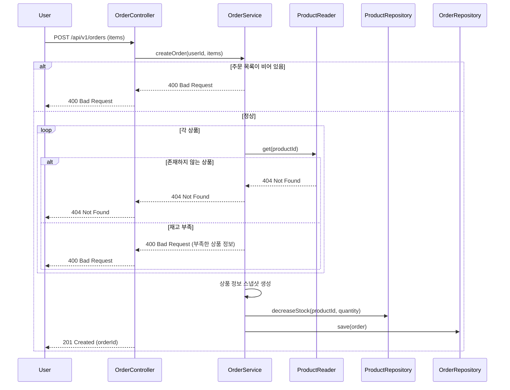
```mermaid
sequenceDiagram
    participant User
    participant OrderController
    participant OrderService
    participant ProductReader
    participant ProductRepository
    participant OrderRepository

    User->>OrderController: POST /api/v1/orders (items)
    OrderController->>OrderService: createOrder(userId, items)

    alt 주문 목록이 비어 있음
        OrderService-->>OrderController: 400 Bad Request
        OrderController-->>User: 400 Bad Request
    else 정상
        loop 각 상품
            OrderService->>ProductReader: get(productId)
            alt 존재하지 않는 상품
                ProductReader-->>OrderService: 404 Not Found
                OrderService-->>OrderController: 404 Not Found
                OrderController-->>User: 404 Not Found
            else 재고 부족
                OrderService-->>OrderController: 400 Bad Request (부족한 상품 정보)
                OrderController-->>User: 400 Bad Request
            end
        end
        OrderService->>OrderService: 상품 정보 스냅샷 생성
        OrderService->>ProductRepository: decreaseStock(productId, quantity)
        OrderService->>OrderRepository: save(order)
        OrderController-->>User: 201 Created (orderId)
    end
```

---

### 4-2. 주문 목록 조회

```mermaid
sequenceDiagram
    participant User
    participant OrderController
    participant OrderService
    participant OrderRepository

    User->>OrderController: GET /api/v1/orders?startAt=&endAt=
    OrderController->>OrderService: getOrders(userId, startAt, endAt)
    OrderService->>OrderService: 날짜 유효성 검증

    alt 날짜 형식 오류 또는 startAt > endAt
        OrderService-->>OrderController: 400 Bad Request
        OrderController-->>User: 400 Bad Request
    else 정상
        OrderService->>OrderRepository: findAllByUserIdAndPeriod(userId, startAt, endAt)
        OrderRepository-->>OrderService: 주문 목록
        OrderService-->>OrderController: 주문 목록
        OrderController-->>User: 200 OK
    end
```

---

### 4-3. 주문 상세 조회

```mermaid
sequenceDiagram
    participant User
    participant OrderController
    participant OrderService
    participant OrderRepository

    User->>OrderController: GET /api/v1/orders/{orderId}
    OrderController->>OrderService: getOrder(userId, orderId)
    OrderService->>OrderRepository: findById(orderId)

    alt 존재하지 않는 주문
        OrderService-->>OrderController: 404 Not Found
        OrderController-->>User: 404 Not Found
    else 타 유저 주문 접근
        OrderService-->>OrderController: 403 Forbidden
        OrderController-->>User: 403 Forbidden
    else 정상
        OrderRepository-->>OrderService: 주문 상세 (상품 스냅샷 포함)
        OrderService-->>OrderController: 주문 상세
        OrderController-->>User: 200 OK
    end
```

---

### 4-4. 주문 결제 내역 조회

```mermaid
sequenceDiagram
    participant User
    participant OrderController
    participant OrderService
    participant OrderRepository
    participant PaymentRepository

    User->>OrderController: GET /api/v1/orders/{orderId}/payments
    OrderController->>OrderService: getOrderPayments(userId, orderId)
    OrderService->>OrderRepository: findById(orderId)

    alt 존재하지 않는 주문
        OrderService-->>OrderController: 404 Not Found
        OrderController-->>User: 404 Not Found
    else 타 유저 주문 접근
        OrderService-->>OrderController: 403 Forbidden
        OrderController-->>User: 403 Forbidden
    else 정상
        OrderService->>PaymentRepository: findByOrderId(orderId)
        alt 미결제 주문
            PaymentRepository-->>OrderService: 빈 결제 내역
        else 결제 내역 있음
            PaymentRepository-->>OrderService: 결제 내역
            OrderService->>PaymentRepository: findCancelByOrderId(orderId)
            PaymentRepository-->>OrderService: 취소 내역 (있는 경우)
        end
        OrderService-->>OrderController: 결제 내역 + 취소 내역
        OrderController-->>User: 200 OK
    end
```

---

## 5. 장바구니 (Cart)

### 5-1. 장바구니 상품 추가

```mermaid
sequenceDiagram
    participant User
    participant CartController
    participant CartService
    participant ProductReader
    participant CartRepository

    User->>CartController: POST /api/v1/cart (productId, quantity)
    CartController->>CartService: addItem(userId, productId, quantity)
    CartService->>CartService: 수량 유효성 검증

    alt 수량이 0 이하
        CartService-->>CartController: 400 Bad Request
        CartController-->>User: 400 Bad Request
    else 정상
        CartService->>ProductReader: get(productId)
        alt 존재하지 않는 상품
            ProductReader-->>CartService: 404 Not Found
            CartService-->>CartController: 404 Not Found
            CartController-->>User: 404 Not Found
        else 이미 담긴 상품
            CartService->>CartRepository: findByUserIdAndProductId(userId, productId)
            CartService->>CartRepository: updateQuantity(cartItemId, quantity)
            CartController-->>User: 200 OK
        else 신규 상품
            CartService->>CartRepository: save(cartItem)
            CartController-->>User: 201 Created
        end
    end
```

---

### 5-2. 장바구니 목록 조회

```mermaid
sequenceDiagram
    participant User
    participant CartController
    participant CartService
    participant CartRepository

    User->>CartController: GET /api/v1/cart
    CartController->>CartService: getItems(userId)
    CartService->>CartRepository: findAllByUserId(userId)
    CartRepository-->>CartService: 장바구니 목록
    CartService-->>CartController: 장바구니 목록
    CartController-->>User: 200 OK
```

---

### 5-3. 장바구니 수량 변경

```mermaid
sequenceDiagram
    participant User
    participant CartController
    participant CartService
    participant CartRepository

    User->>CartController: PUT /api/v1/cart/{cartItemId} (quantity)
    CartController->>CartService: updateQuantity(userId, cartItemId, quantity)
    CartService->>CartRepository: findById(cartItemId)

    alt 존재하지 않는 항목
        CartService-->>CartController: 404 Not Found
        CartController-->>User: 404 Not Found
    else 수량이 0 이하
        CartService-->>CartController: 400 Bad Request
        CartController-->>User: 400 Bad Request
    else 정상
        CartService->>CartRepository: updateQuantity(cartItemId, quantity)
        CartController-->>User: 200 OK
    end
```

---

### 5-4. 장바구니 상품 제거

```mermaid
sequenceDiagram
    participant User
    participant CartController
    participant CartService
    participant CartRepository

    User->>CartController: DELETE /api/v1/cart/{cartItemId}
    CartController->>CartService: removeItem(userId, cartItemId)
    CartService->>CartRepository: findById(cartItemId)

    alt 존재하지 않는 항목
        CartService-->>CartController: 404 Not Found
        CartController-->>User: 404 Not Found
    else 타 유저 항목 접근
        CartService-->>CartController: 403 Forbidden
        CartController-->>User: 403 Forbidden
    else 정상
        CartService->>CartRepository: delete(cartItemId)
        CartController-->>User: 204 No Content
    end
```

---

## 6. 결제 (Payment)

### 6-1. 결제 요청

```mermaid
sequenceDiagram
    participant User
    participant PaymentController
    participant PaymentService
    participant OrderRepository
    participant CouponRepository
    participant PaymentRepository

    User->>PaymentController: POST /api/v1/payments (orderId, 카드 정보, couponId?)
    PaymentController->>PaymentService: pay(userId, command)
    PaymentService->>OrderRepository: findById(orderId)

    alt 존재하지 않는 주문
        PaymentService-->>PaymentController: 404 Not Found
        PaymentController-->>User: 404 Not Found
    else 이미 결제된 주문
        PaymentService-->>PaymentController: 400 Bad Request
        PaymentController-->>User: 400 Bad Request
    else 정상
        alt 쿠폰 있음
            PaymentService->>CouponRepository: findById(couponId)
            alt 유효하지 않은 쿠폰
                PaymentService-->>PaymentController: 400 Bad Request
                PaymentController-->>User: 400 Bad Request
            else 정상
                PaymentService->>PaymentService: 할인 금액 계산
            end
        end
        PaymentService->>PaymentService: 결제 처리
        alt 결제 실패
            PaymentService-->>PaymentController: 400 Bad Request
            PaymentController-->>User: 400 Bad Request
        else 결제 성공
            PaymentService->>PaymentRepository: save(payment)
            PaymentService->>OrderRepository: updateStatus(orderId, PAID)
            PaymentService->>CouponRepository: markAsUsed(couponId)
            PaymentController-->>User: 200 OK
        end
    end
```

---

### 6-2. 결제 취소

```mermaid
sequenceDiagram
    participant User
    participant PaymentController
    participant PaymentService
    participant PaymentRepository
    participant OrderRepository
    participant ProductRepository
    participant CouponRepository

    User->>PaymentController: POST /api/v1/payments/{paymentId}/cancel
    PaymentController->>PaymentService: cancel(userId, paymentId)
    PaymentService->>PaymentRepository: findById(paymentId)

    alt 존재하지 않는 결제
        PaymentService-->>PaymentController: 404 Not Found
        PaymentController-->>User: 404 Not Found
    else 타 유저 결제 접근
        PaymentService-->>PaymentController: 403 Forbidden
        PaymentController-->>User: 403 Forbidden
    else 이미 취소된 결제 또는 취소 불가 상태
        PaymentService-->>PaymentController: 400 Bad Request
        PaymentController-->>User: 400 Bad Request
    else 정상
        PaymentService->>PaymentRepository: saveCancel(paymentCancel)
        PaymentService->>OrderRepository: updateStatus(orderId, CANCELLED)
        PaymentService->>ProductRepository: restoreStock(items)
        PaymentService->>CouponRepository: restore(couponId)
        PaymentController-->>User: 200 OK
    end
```

---

## 4-ADMIN. 주문 ADMIN

### 4-ADMIN-1. 전체 주문 목록 조회

```mermaid
sequenceDiagram
    participant Admin
    participant AdminOrderController
    participant AdminOrderService
    participant OrderRepository

    Admin->>AdminOrderController: GET /api-admin/v1/orders?page=&size=
    AdminOrderController->>AdminOrderService: getOrders(pageable)
    AdminOrderService->>OrderRepository: findAll(pageable)
    OrderRepository-->>AdminOrderService: 전체 주문 목록
    AdminOrderService-->>AdminOrderController: 전체 주문 목록
    AdminOrderController-->>Admin: 200 OK
```

---

### 4-ADMIN-2. 전체 수익 조회

```mermaid
sequenceDiagram
    participant Admin
    participant AdminStatsController
    participant AdminStatsService
    participant PaymentRepository

    Admin->>AdminStatsController: GET /api-admin/v1/stats/revenue?startAt=&endAt=
    AdminStatsController->>AdminStatsService: getRevenue(startAt, endAt)
    AdminStatsService->>AdminStatsService: 날짜 유효성 검증

    alt 날짜 형식 오류 또는 startAt > endAt
        AdminStatsService-->>AdminStatsController: 400 Bad Request
        AdminStatsController-->>Admin: 400 Bad Request
    else 정상
        AdminStatsService->>PaymentRepository: sumByPeriod(startAt, endAt)
        PaymentRepository-->>AdminStatsService: 총 결제액, 총 할인액
        AdminStatsService->>AdminStatsService: 순 수익 계산
        AdminStatsService-->>AdminStatsController: 수익 통계
        AdminStatsController-->>Admin: 200 OK
    end
```

---

### 4-ADMIN-3. 유저 목록 조회

```mermaid
sequenceDiagram
    participant Admin
    participant AdminUserController
    participant AdminUserService
    participant UserRepository

    Admin->>AdminUserController: GET /api-admin/v1/users?page=&size=
    AdminUserController->>AdminUserService: getUsers(pageable)
    AdminUserService->>UserRepository: findAll(pageable)
    UserRepository-->>AdminUserService: 유저 목록
    AdminUserService-->>AdminUserController: 유저 목록
    AdminUserController-->>Admin: 200 OK
```

---

### 4-ADMIN-4. 유저 상세 조회

```mermaid
sequenceDiagram
    participant Admin
    participant AdminUserController
    participant AdminUserService
    participant UserRepository

    Admin->>AdminUserController: GET /api-admin/v1/users/{userId}
    AdminUserController->>AdminUserService: getUser(userId)
    AdminUserService->>UserRepository: findById(userId)

    alt 존재하지 않는 유저
        AdminUserService-->>AdminUserController: 404 Not Found
        AdminUserController-->>Admin: 404 Not Found
    else 정상
        UserRepository-->>AdminUserService: 유저 상세
        AdminUserService-->>AdminUserController: 유저 상세
        AdminUserController-->>Admin: 200 OK
    end
```

---

### 4-ADMIN-5. 특정 유저의 주문 내역 조회

```mermaid
sequenceDiagram
    participant Admin
    participant AdminUserController
    participant AdminUserService
    participant UserRepository
    participant OrderRepository

    Admin->>AdminUserController: GET /api-admin/v1/users/{userId}/orders?page=&size=
    AdminUserController->>AdminUserService: getUserOrders(userId, pageable)
    AdminUserService->>UserRepository: findById(userId)

    alt 존재하지 않는 유저
        AdminUserService-->>AdminUserController: 404 Not Found
        AdminUserController-->>Admin: 404 Not Found
    else 정상
        AdminUserService->>OrderRepository: findAllByUserId(userId, pageable)
        OrderRepository-->>AdminUserService: 주문 목록
        AdminUserService-->>AdminUserController: 주문 목록
        AdminUserController-->>Admin: 200 OK
    end
```
