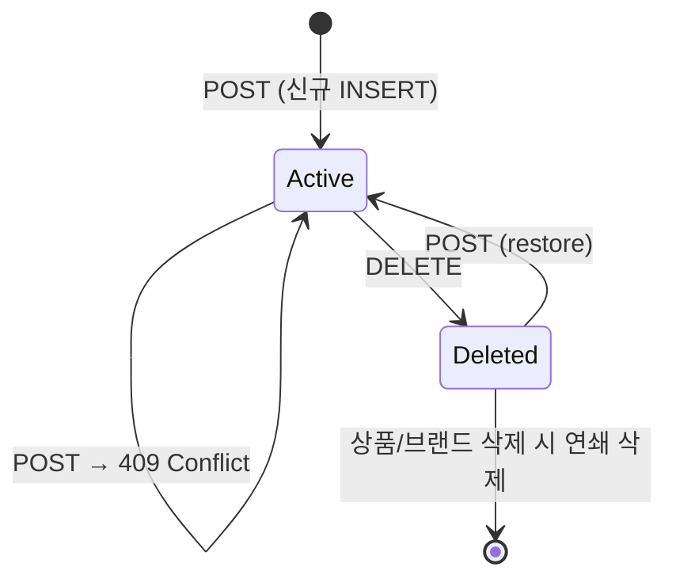
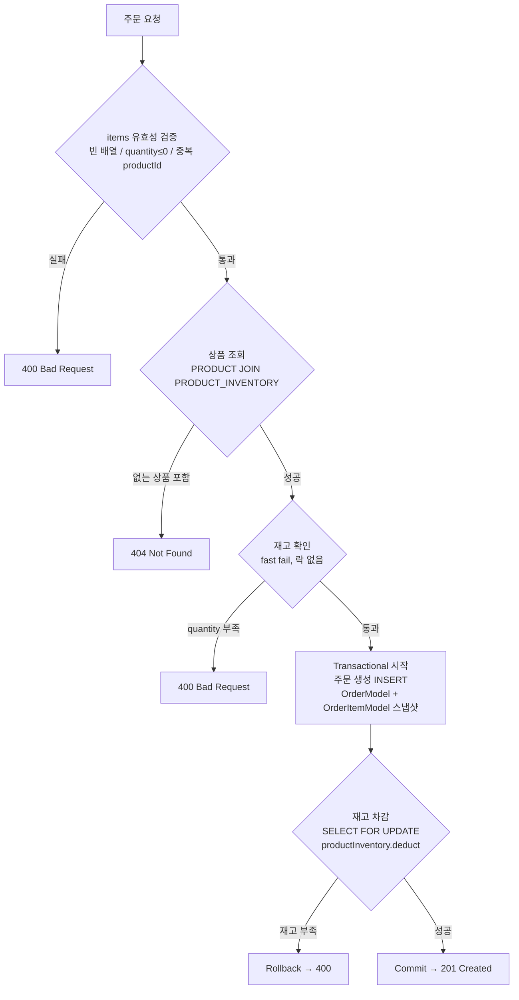

# Vol.2 소프트웨어 설계 문서

> 작성일: 2026-05-20
> 대상 요구사항: `docs/우리가 함께 만들어갈 단 하나의 감성 이커머스.md`

---

# 1부: 무엇을 만드나

## 1. 개요

Vol.1 에서 구현된 User 도메인을 기반으로, 아래 4개 도메인을 추가 구현한다.

| 도메인 | 주요 기능 |
|---|---|
| Brand | 어드민 CRUD, 고객 단건 조회 |
| Product (확장) | Brand 연결, 좋아요 수 표시 |
| Like | 상품 좋아요 등록 / 취소 / 목록 조회 |
| Order | 주문 생성 / 조회 (재고 차감 + 스냅샷) |

---

## 2. 도메인 모델

### 핵심 설계 결정 요약

| 관계 | 방식 | 근거 |
|---|---|---|
| Product → Brand | `@ManyToOne` (NO_CONSTRAINT) | 상품 조회 시 브랜드명 JOIN 필요 |
| Product.likeCount | DB 비정규화 컬럼 | SQL 원자적 증감으로 COUNT 쿼리 제거 ([ADR-003](./adr/003-like-count-query.md)) |
| Product.quantity | PRODUCT_INVENTORY JOIN 필드 | 상품 조회 시 재고 포함 반환 — 별도 재고 조회 불필요, 품절 여부 노출 |
| Like → User / Product | `userId`, `productId` Long | 존재 여부 확인만 필요, JPA 관계 불필요 |
| OrderItem → Order | `@ManyToOne` | 동일 Aggregate, 생명주기 공유 |
| OrderItem → Product | `productId` + 스냅샷 컬럼 | 주문 시점 정보 보존 (요구사항 명시) |
| Order → User | `userId` Long | 유저 변경과 주문 이력 분리 |

> 상세 결정 근거는 `docs/v3/adr/` 참고

---

## 3. ERD

→ [`docs/v3/04-erd.md`](./04-erd.md) 참고

---

## 4. 클래스 다이어그램

→ [`docs/v3/03-class-diagram.md`](./03-class-diagram.md) 참고

---

## 5. 레이어 구조 (도메인별)

기존 패턴(`interfaces → application → domain → infrastructure`)을 동일하게 따른다.

```
interfaces/api/
├── brand/
│   ├── BrandV1Controller         # Customer
│   ├── BrandAdminV1Controller    # Admin
│   └── BrandV1Dto
├── product/
│   ├── ProductV1Controller       # Customer
│   ├── ProductAdminV1Controller  # Admin
│   └── ProductV1Dto
├── like/
│   ├── LikeV1Controller
│   └── LikeV1Dto
└── order/
    ├── OrderV1Controller         # Customer
    ├── OrderAdminV1Controller    # Admin
    └── OrderV1Dto

application/
├── brand/   BrandFacade, BrandInfo
├── product/ ProductFacade, ProductInfo
├── like/    LikeFacade, LikeInfo
└── order/   OrderFacade, OrderInfo

domain/
├── brand/   BrandModel, BrandRepository, BrandService
├── product/ ProductModel, ProductInventoryModel,
│            ProductRepository, ProductInventoryRepository, ProductService
├── like/    LikeModel, LikeRepository, LikeService
└── order/   OrderModel, OrderItemModel, OrderRepository, OrderService

infrastructure/
├── brand/   BrandJpaRepository, BrandRepositoryImpl
├── product/ ProductJpaRepository, ProductRepositoryImpl,
│            ProductInventoryJpaRepository, ProductInventoryRepositoryImpl
├── like/    LikeJpaRepository, LikeRepositoryImpl
└── order/   OrderJpaRepository, OrderRepositoryImpl
```

---

# 2부: 무엇을 제공하나

## 6. API 엔드포인트

> **인증 컬럼 범례**
> | 값 | 의미 |
> |---|---|
> | `-` | 인증 불필요 |
> | `User` | X-Loopers-LoginId / X-Loopers-LoginPw 헤더 필요 |
> | `Admin` | X-Loopers-Ldap: loopers.admin 헤더 필요 |

### User

| Method | URI | 설명 | 인증 |
|---|---|---|:---:|
| POST | `/api/v1/users` | 회원가입 | - |
| GET | `/api/v1/users/me` | 내 정보 조회 | User |
| PUT | `/api/v1/users/me/password` | 비밀번호 수정 | User |

### Brand

| Method | URI | 설명 | 인증 |
|---|---|---|:---:|
| GET | `/api/v1/brands/{brandId}` | 브랜드 단건 조회 | - |
| GET | `/api-admin/v1/brands?page=0&size=20` | 브랜드 목록 | Admin |
| GET | `/api-admin/v1/brands/{brandId}` | 브랜드 단건 조회 | Admin |
| POST | `/api-admin/v1/brands` | 브랜드 등록 | Admin |
| PUT | `/api-admin/v1/brands/{brandId}` | 브랜드 수정 | Admin |
| DELETE | `/api-admin/v1/brands/{brandId}` | 브랜드 삭제 (연관 상품 함께 soft delete) | Admin |

### Product

| Method | URI | 설명 | 인증 |
|---|---|---|:---:|
| GET | `/api/v1/products?brandId=&sort=latest&page=0&size=20` | 상품 목록 | - |
| GET | `/api/v1/products/{productId}` | 상품 단건 조회 | - |
| GET | `/api-admin/v1/products?brandId=&page=0&size=20` | 상품 목록 (Admin) | Admin |
| GET | `/api-admin/v1/products/{productId}` | 상품 단건 조회 (Admin) | Admin |
| POST | `/api-admin/v1/products` | 상품 등록 (브랜드 존재 검증) | Admin |
| PUT | `/api-admin/v1/products/{productId}` | 상품 수정 (브랜드 변경 불가, 재고 수량 수정 포함) | Admin |
| DELETE | `/api-admin/v1/products/{productId}` | 상품 삭제 | Admin |

> **sort 파라미터 명세** (Customer 상품 목록)
> | 값 | 정렬 기준 |
> |---|---|
> | `latest` (기본값) | 등록일시 내림차순 |
> | `price_asc` | 가격 오름차순 |
> | `price_desc` | 가격 내림차순 |
> | `like_asc` | 좋아요 수 오름차순 |
> | `like_desc` | 좋아요 수 내림차순 |
>
> sort 파라미터가 없는 경우 `latest`로 대체한다. 알 수 없는 값인 경우 `400 Bad Request`를 반환한다.

### Like

| Method | URI | 설명 | 인증 |
|---|---|---|:---:|
| POST | `/api/v1/products/{productId}/likes` | 좋아요 등록 | User |
| DELETE | `/api/v1/products/{productId}/likes` | 좋아요 취소 | User |
| GET | `/api/v1/users/{userId}/likes` | 내가 좋아요한 상품 목록 | User |

### Order

| Method | URI | 설명 | 인증 |
|---|---|---|:---:|
| POST | `/api/v1/orders` | 주문 생성 | User |
| GET | `/api/v1/orders?startAt=&endAt=&page=0&size=20` | 내 주문 목록 | User |
| GET | `/api/v1/orders/{orderId}` | 주문 단건 조회 | User |
| GET | `/api-admin/v1/orders?page=0&size=20` | 주문 목록 (Admin) | Admin |
| GET | `/api-admin/v1/orders/{orderId}` | 주문 단건 조회 (Admin) | Admin |

---

## 7. 제공 정보 정책

> **HTTP 상태 코드 기준**
> - 단건/목록 조회 (GET): `200 OK`
> - 생성 (POST): `201 Created`, body: `{ "id": <생성된 id> }`
> - 수정 (PUT): `204 No Content` (body 없음)
> - 삭제 (DELETE): `204 No Content` (body 없음)
> - 좋아요 등록/취소 (POST/DELETE): `204 No Content` (body 없음)

---

### Like 목록 (`GET /api/v1/users/{userId}/likes`)

좋아요한 상품 목록은 Customer Product PLP와 동일한 필드셋을 반환한다.

| 필드 | 반환 여부 |
|---|:---:|
| id | ✅ |
| brandId | ✅ |
| brandName | ✅ |
| name | ✅ |
| price | ✅ |
| likeCount | ✅ |

> 삭제된 상품의 Like는 연쇄 Soft Delete로 제거되므로 별도 필터링 불필요 ([ADR-013](./adr/013-cascade-soft-delete.md))

---

### Brand

> Customer는 브랜드 단건 조회(`PDP`)만 제공. 목록 조회 없음.

| 필드 | Customer PDP | Admin PLP | Admin PDP |
|---|:---:|:---:|:---:|
| id | ✅ | ✅ | ✅ |
| name | ✅ | ✅ | ✅ |
| description | ✅ | ✅ | ✅ |
| createdAt | ❌ | ✅ | ✅ |
| updatedAt | ❌ | ✅ | ✅ |

---

### Product

| 필드 | Customer PLP | Customer PDP | Admin PLP | Admin PDP |
|---|:---:|:---:|:---:|:---:|
| id | ✅ | ✅ | ✅ | ✅ |
| brandId | ✅ | ✅ | ✅ | ✅ |
| brandName | ✅ | ✅ | ✅ | ✅ |
| name | ✅ | ✅ | ✅ | ✅ |
| price | ✅ | ✅ | ✅ | ✅ |
| likeCount | ✅ | ✅ | ✅ | ✅ |
| quantity | ❌ | ✅ | ✅ | ✅ |
| description | ❌ | ✅ | ❌ | ✅ |
| createdAt | ❌ | ❌ | ✅ | ✅ |
| updatedAt | ❌ | ❌ | ✅ | ✅ |

> PLP(Product Listing Page): 탐색 목적 — 구매 결정에 필요한 핵심 정보만 제공
> PDP(Product Detail Page): 상세 정보 — 재고·설명 포함 전체 정보 제공
> Admin PLP: 재고·수정 이력(updatedAt) 포함 — 운영 관리 목적

---

### Order

| 필드 | Customer 목록 | Customer 단건 | Admin 목록 | Admin 단건 |
|---|:---:|:---:|:---:|:---:|
| orderId | ✅ | ✅ | ✅ | ✅ |
| userId | ❌ | ❌ | ✅ | ✅ |
| status | ✅ | ✅ | ✅ | ✅ |
| totalAmount | ✅ | ✅ | ✅ | ✅ |
| items | ✅ | ✅ | ✅ | ✅ |
| createdAt | ✅ | ✅ | ✅ | ✅ |

> Customer: `userId` 미노출 — 자신의 주문만 조회 가능하므로 불필요
> Admin: `userId` 포함 — 전체 주문 관리 목적

---

## 8. 공통 응답 구조

모든 API 응답은 `ApiResponse<T>`로 감싸서 반환한다.

### 성공 응답

```json
// 단건/목록 조회 (GET 200, POST 201)
{
  "meta": { "result": "SUCCESS", "errorCode": null, "message": null },
  "data": { ... }
}

// 수정/삭제/좋아요 등록·취소 (204 No Content — body 없음)
```

### 페이지네이션 응답

페이지네이션이 적용된 API는 `data` 안에 아래 구조가 중첩된다.

```json
{
  "meta": { "result": "SUCCESS", "errorCode": null, "message": null },
  "data": {
    "content": [ ... ],
    "page": 0,
    "size": 20,
    "totalElements": 100
  }
}
```

### 에러 응답

```json
{
  "meta": { "result": "FAIL", "errorCode": "NOT_FOUND", "message": "주문을 찾을 수 없습니다." },
  "data": null
}
```

> `errorCode`는 `ErrorType` enum의 code 값 (예: `NOT_FOUND`, `BAD_REQUEST`, `FORBIDDEN`, `CONFLICT`)

---

# 3부: 어떻게 구현하나

## 9. 핵심 비즈니스 로직

### Brand 삭제

도메인 서비스 간 직접 호출은 금지한다. `BrandFacade`가 오케스트레이션을 담당한다.

```
BrandFacade.deleteBrand(brandId)
  ├── BrandService.delete(brandId) → brand 조회 후 brand.delete()
  ├── ProductService.findIdsByBrand(brandId) → List<productId>
  ├── ProductService.deleteAll(productIds)
  ├── ProductInventoryService.deleteAllByProducts(productIds)
  └── LikeService.deleteAllByProducts(productIds)
```

### 상품 삭제

`ProductFacade`가 오케스트레이션을 담당한다. 상품이 soft delete될 때 연관된 재고 행도 함께 soft delete한다.

```
ProductFacade.deleteProduct(productId)
  ├── ProductService.delete(productId)          → product.delete()
  └── ProductInventoryService.deleteByProduct(productId) → inventory.delete()
```

> 상품이 soft delete되면 ProductInventory도 동일하게 soft delete한다. 이후 재고 조회 시 `deleted_at IS NULL` 필터로 제외된다.

### Brand 등록 / 수정 검증

| 필드 | 규칙 |
|---|---|
| `name` | 필수, 빈 문자열 불가, 최대 100자, **중복 불가 (409 Conflict)** |
| `description` | 선택(nullable), 최대 500자 |

### 상품 등록 / 수정

- 등록: `brandId`로 Brand 존재 여부 검증 후 ProductModel 생성, ProductInventoryModel도 함께 생성
- 수정: 브랜드 변경 불가 — `brand` 필드는 update 메서드에서 제외
- `quantity` 검증: 0 이상 정수만 허용. 0은 품절 상태로 허용, 음수는 `400 Bad Request`
- 품절 상품(`quantity = 0`)은 Customer 목록/단건 조회에 정상 노출. 주문 시 재고 부족으로 `400 Bad Request` 처리

### 좋아요 등록 / 취소



- POST: `findByUserIdAndProductId` (deleted_at 포함 전체 조회)
  - active 존재 → 409 Conflict
  - soft-deleted 존재 → `restore()` [deleted_at = null]
  - 없음 → `save(new LikeModel)`
- DELETE: `findByUserIdAndProductId` (deleted_at IS NULL, active만)
  - 없으면 404 Not Found
  - 존재 → `like.delete()` [deleted_at = now()]

> **왜 Soft Delete + Restore인가?** ([ADR-008](./adr/008-likes-unique-constraint.md))
> `(user_id, product_id)` 복합 UNIQUE 제약을 유지하는 한, 취소 후 재좋아요를 새 INSERT로 처리하면 UNIQUE 위반이 발생한다.
> 기존 레코드를 `restore()`로 재활성화하면 UNIQUE 제약을 유지하면서 재좋아요를 처리할 수 있다.
> DB UNIQUE 제약은 동시 요청 시 최후 방어선 역할도 한다.


좋아요 수:
- `product` 테이블의 `like_count` 컬럼으로 관리 (DB 비정규화, [ADR-003](./adr/003-like-count-query.md))
- **등록**: `UPDATE product SET like_count = like_count + 1 WHERE id = ?` (SQL 원자적 처리)
- **취소**: `UPDATE product SET like_count = like_count - 1 WHERE id = ?` (SQL 원자적 처리)
- **조회**: `ProductModel.likeCount` 필드를 그대로 반환 — 별도 COUNT 쿼리 없음

### 주문 생성



> - 2번 fast fail은 명백한 재고 부족을 주문 INSERT 이전에 조기 차단하는 역할
> - 실제 동시성 보장은 FOR UPDATE 락이 담당
> - product_inventory 테이블에만 락이 걸리므로 상품 조회 성능에 영향 없음 ([ADR-006](./adr/006-product-inventory-table.md))

> **왜 이 순서인가?** ([ADR-007](./adr/007-order-creation-flow.md))
> 주문 INSERT를 재고 차감보다 먼저 수행하면, 재고 차감 실패 시 `@Transactional` 롤백으로 주문까지 함께 취소된다.
> 반대로 재고를 먼저 차감하면 주문 INSERT 실패 시 재고만 줄어드는 불일치가 발생한다.

> **왜 OrderItem에 상품명·가격을 복사하는가?** ([ADR-001](./adr/001-order-item-snapshot.md))
> 주문 이후 상품 가격이 변경되거나 상품이 soft delete되어도 주문 이력은 당시 정보를 보존해야 한다.
> `Product`를 `@ManyToOne`으로 참조하면 상품 삭제 시 주문 이력도 함께 깨진다.

> **왜 재고 차감 시 productId 오름차순으로 정렬하는가?** ([ADR-014](./adr/014-batch-query-and-lock-ordering.md))
> 여러 트랜잭션이 서로 다른 순서로 락을 획득하면 데드락이 발생할 수 있다.
> `WHERE product_id IN (...) ORDER BY product_id FOR UPDATE`로 락 획득 순서를 일관되게 유지한다.

> **주문 상태** ([ADR-015](./adr/015-order-status-single-value.md))
> 현재는 결제 기능이 없으므로 주문 생성 즉시 `COMPLETED` 단일 상태로 처리한다. 결제 기능 추가 시 상태 확장 예정.

### 어드민 인증

`X-Loopers-Ldap` 헤더 값 == `"loopers.admin"` 검증. 불일치 시 `403 Forbidden`.

---

## 10. 인증·인가 처리 구조

인증은 `support/auth/` 패키지의 `HandlerInterceptor`로 처리한다 ([ADR-011](./adr/011-auth-interceptor-location.md)).

### User 인증 — `UserAuthInterceptor`

적용 경로: `/api/v1/**` 중 아래 **제외 경로를 뺀 나머지 전체**

| 제외 경로 | 이유 |
|---|---|
| `POST /api/v1/users` | 회원가입 — 인증 전 단계 |
| `GET /api/v1/brands/{brandId}` | 브랜드 조회 — 비로그인 허용 |
| `GET /api/v1/products` | 상품 목록 조회 — 비로그인 허용 |
| `GET /api/v1/products/{productId}` | 상품 단건 조회 — 비로그인 허용 |

```
요청 수신
  → X-Loopers-LoginId 헤더 추출 → 없으면 401
  → X-Loopers-LoginPw 헤더 추출 → 없으면 401
  → UserService.getByLoginId(loginId) → 없으면 401
  → BCrypt.checkpw(loginPw, user.password) → 불일치 시 401
  → request attribute에 userId 저장
```

Controller는 `@LoginUser` 어노테이션으로 `userId`를 주입받는다. `LoginUserArgumentResolver`가 request attribute에서 `userId`를 꺼내 메서드 파라미터로 바인딩한다. `LoginUserArgumentResolver`와 인터셉터는 모두 `support/auth/` 패키지에 위치하며, `WebMvcConfig`에서 함께 등록한다.

### Admin 인증 — `AdminAuthInterceptor`

적용 경로: `/api-admin/v1/**` 전체

```
요청 수신
  → X-Loopers-Ldap 헤더 추출 → 없으면 403
  → "loopers.admin" 값과 비교 → 불일치 시 403
```

---

## 11. 유효성 검증 레이어 원칙

검증 책임은 두 레이어로 분리한다.

| 레이어 | 담당 | 예시 |
|---|---|---|
| Controller (`@Valid`) | 입력 형식 검증 | `@NotBlank`, `@Min(0)`, `@Size(max=100)`, null 체크 |
| Domain Model 생성자·메서드 | 비즈니스 규칙 검증 | 중복 불가, 상태 전이, 재고 부족 → `CoreException` throw |

> `@Valid`를 통과한 요청도 도메인 규칙에 위반되면 `CoreException`이 발생하며, `ApiControllerAdvice`가 처리한다.

---

## 12. 트랜잭션 경계 원칙

| 레이어 | 규칙 |
|---|---|
| Controller | `@Transactional` 미적용 |
| Facade | 기본적으로 미적용. 단, 여러 Service 쓰기 작업이 원자성을 요구하는 경우에 한해 적용 |
| Service (조회) | `@Transactional(readOnly = true)` |
| Service (쓰기) | `@Transactional` |

트랜잭션 경계는 원칙적으로 **Service** 레이어에서 시작한다. Facade는 Service에 위임하며 트랜잭션에 관여하지 않는다.

### 예외 — OrderFacade.createOrder()

주문 생성과 재고 차감은 반드시 하나의 트랜잭션으로 묶여야 한다. 두 작업은 서로 다른 Service(`OrderService`, `ProductInventoryService`)가 담당하므로, Facade에서 트랜잭션 경계를 감싼다.

> Service 간 직접 의존성 주입은 DDD 원칙에 어긋나므로 최대한 지양한다. 여러 Service를 조합해야 하는 원자적 작업은 Facade가 트랜잭션 경계를 갖는 방식으로 처리한다.

---

## 13. 연쇄 삭제 정책

모든 삭제는 Soft Delete(`deleted_at = now()`)이며, 연쇄 삭제는 **Facade** 레이어에서 오케스트레이션한다. JPA Cascade는 사용하지 않는다 — Like는 `productId`(Long) ID 참조 방식이라 JPA 관계가 없고, Like와 Product는 서로 다른 Aggregate이므로 ID 참조를 유지한다.

### Brand 삭제

```
BrandFacade.deleteBrand(brandId)
  ├── BrandService.delete(brandId)
  ├── ProductService.findIdsByBrand(brandId) → List<productId>
  ├── ProductService.deleteAll(productIds)
  ├── ProductInventoryService.deleteAllByProducts(productIds)
  └── LikeService.deleteAllByProducts(productIds)
```

### Product 삭제

```
ProductFacade.deleteProduct(productId)
  ├── ProductService.delete(productId)
  ├── ProductInventoryService.deleteByProduct(productId)
  └── LikeService.deleteAllByProduct(productId)
```

### Like 삭제 (좋아요 취소)

```
LikeFacade.removeLike(userId, productId)
  └── LikeService.delete(userId, productId)   ← 단독 삭제, 연쇄 없음
```

> **like_count 처리**: 좋아요 취소(`removeLike`) 시에는 `like_count`를 차감한다. Brand/Product 삭제로 인한 Like 연쇄 삭제 시에는 `like_count` 차감을 수행하지 않는다 — 상품 자체가 삭제되므로 `like_count` 정합성 유지가 불필요하다.

---

## 14. Soft Delete 범위 및 조회 정책

### 적용 범위

모든 엔티티는 `BaseEntity`의 `deletedAt` 컬럼으로 Soft Delete를 관리한다.

| 엔티티 | Soft Delete | 비고 |
|---|---|---|
| User | O | |
| Brand | O | |
| Product | O | |
| ProductInventory | O | Product 삭제 시 연쇄 삭제 |
| Like | O | Product/Brand 삭제 시 연쇄 삭제. 좋아요 재등록 시 Restore 패턴 적용 |
| Order | O | |
| OrderItem | O | Order 삭제 시 연쇄 삭제 (미구현, 향후 고려) |

### 조회 필터 적용 원칙

`deleted_at IS NULL` 조건은 Repository 구현체에서 **명시적으로** 포함한다. `@Where` 어노테이션이나 Hibernate Filter는 사용하지 않는다. 자동 적용되어 편리하지만, 의도치 않게 삭제된 데이터가 조회되거나 누락되는 버그를 발견하기 어렵기 때문이다.

### Like 예외 — Restore 패턴

좋아요 재등록 시에는 soft delete된 레코드를 포함한 전체 조회가 필요하다. 이를 위해 Repository에 아래 두 가지 조회 메서드를 분리한다.

| 메서드 | 조건 | 용도 |
|---|---|---|
| `findActive(userId, productId)` | `deleted_at IS NULL` | 일반 조회 |
| `findAny(userId, productId)` | 조건 없음 | Restore 전 존재 여부 확인 |

---

## 15. 페이지네이션 공통 정책

### 기본값

| 파라미터 | 기본값 | 설명 |
|---|---|---|
| `page` | `0` | 0-based 페이지 번호. 미전달 시 첫 번째 페이지 |
| `size` | `20` | 페이지당 항목 수. 미전달 시 20개 |

### 적용 API 목록

| API | 비고 |
|---|---|
| `GET /api-admin/v1/brands` | |
| `GET /api/v1/products` | `sort` 파라미터 추가 (섹션 7 참고) |
| `GET /api-admin/v1/products` | |
| `GET /api/v1/users/{userId}/likes` | |
| `GET /api/v1/orders` | `startAt` / `endAt` 날짜 필터 함께 사용 ([ADR-010](./adr/010-order-list-query-spec.md)) |
| `GET /api-admin/v1/orders` | |

### 예외

단건 조회, 생성(POST), 수정(PUT), 삭제(DELETE) API는 페이지네이션을 적용하지 않는다.

---

# 4부: 참고

## 16. 시퀀스 다이어그램

→ [`docs/v3/02-sequence-diagrams.md`](./02-sequence-diagrams.md) 참고 (전체 API 시퀀스 다이어그램)

---

## 17. 에러 처리

| 상황 | ErrorType | HTTP |
|---|---|---|
| 브랜드/상품/주문 없음 | `NOT_FOUND` | 404 |
| 타인의 주문 단건 조회 시도 | `NOT_FOUND` | 404 |
| 이미 좋아요한 상품 재등록 | `CONFLICT` | 409 |
| 브랜드명 중복 등록 | `CONFLICT` | 409 |
| 재고 부족 | `BAD_REQUEST` | 400 |
| 브랜드 변경 시도 (상품 수정) | `BAD_REQUEST` | 400 |
| quantity 음수 | `BAD_REQUEST` | 400 |
| 주문 items 빈 배열 | `BAD_REQUEST` | 400 |
| 주문 item quantity ≤ 0 | `BAD_REQUEST` | 400 |
| 주문 items 내 중복 productId | `BAD_REQUEST` | 400 |
| 어드민 헤더 불일치 | `FORBIDDEN` | 403 |
| 타인의 좋아요 목록 조회 시도 | `FORBIDDEN` | 403 |
| 알 수 없는 sort 파라미터 값 | `BAD_REQUEST` | 400 |

> `FORBIDDEN` / `CONFLICT` ErrorType 추가 필요

---

## 18. ADR 목록

| 번호 | 제목 | 파일 |
|---|---|---|
| ADR-001 | OrderItem 스냅샷 패턴 | `adr/001-order-item-snapshot.md` |
| ADR-002 | 어드민 인증 헤더 검증 | `adr/002-admin-auth-header.md` |
| ADR-003 | 좋아요 수 COUNT 쿼리 | `adr/003-like-count-query.md` |
| ADR-004 | 상품 응답에 브랜드명 포함 | `adr/004-product-brand-response.md` |
| ADR-005 | @ManyToOne FK 제약조건 제거 | `adr/005-jpa-no-fk-constraint.md` |
| ADR-006 | 재고 별도 테이블 분리 | `adr/006-product-inventory-table.md` |
| ADR-007 | 주문 생성 흐름 설계 | `adr/007-order-creation-flow.md` |
| ADR-008 | likes 테이블 UNIQUE 제약 | `adr/008-likes-unique-constraint.md` |
| ADR-009 | 좋아요 목록 소유권 검증 | `adr/009-likes-ownership-check.md` |
| ADR-010 | 내 주문 목록 조회 — 날짜 필터 + 페이지네이션 | `adr/010-order-list-query-spec.md` |
| ADR-011 | 인증 인터셉터 위치 — support/auth | `adr/011-auth-interceptor-location.md` |
| ADR-012 | 트랜잭션 경계 원칙 | `adr/012-transaction-boundary.md` |
| ADR-013 | 연쇄 삭제 정책 — Facade 오케스트레이션 + Like 연쇄 Soft Delete | `adr/013-cascade-soft-delete.md` |
| ADR-014 | 재고 차감 락 순서 정렬 — IN FOR UPDATE + Service 정렬 | `adr/014-batch-query-and-lock-ordering.md` |
| ADR-015 | orderStatus (보류) | `adr/015-order-status-single-value.md` |
| ADR-016 | Admin 인증 — 테이블 미생성, 헤더 고정값 검증 | `adr/016-admin-auth-header.md` |
| ADR-017 | 타인의 주문 접근 — 404 반환 정책 | `adr/017-order-ownership-check.md` |
