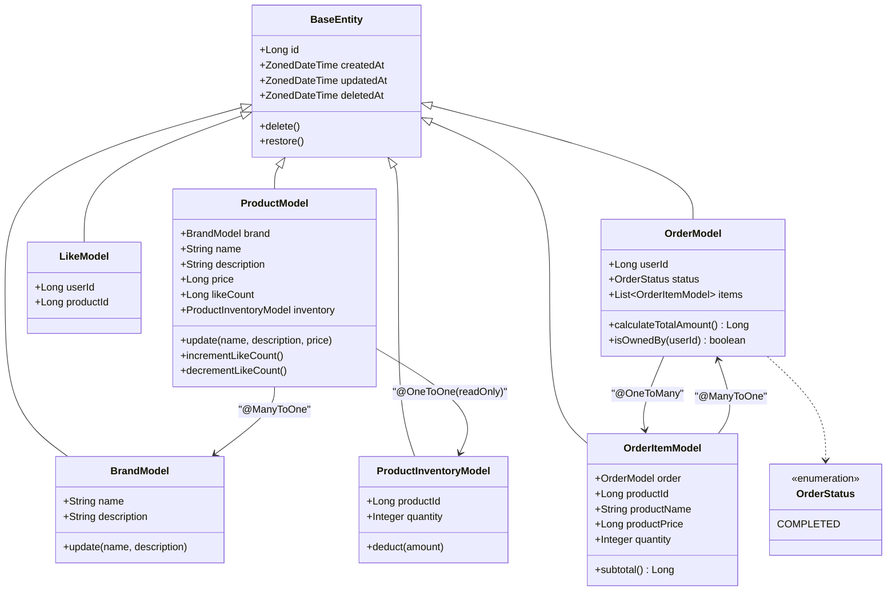

# 클래스 다이어그램

---

## 도메인 메서드 설명

| 클래스 | 메서드 | 역할 |
|---|---|---|
| `BaseEntity` | `delete()` | `deletedAt = now()` 설정 (Soft Delete) |
| `BaseEntity` | `restore()` | `deletedAt = null` 복구 |
| `BrandModel` | `update(name, description)` | 브랜드 정보 수정 (불변 조건 가드 포함) |
| `ProductModel` | `update(name, description, price)` | 상품 정보 수정 — 브랜드는 변경 불가 |
| `ProductModel` | `incrementLikeCount()` | 좋아요 등록 시 호출, SQL 원자적 UPDATE로 위임 |
| `ProductModel` | `decrementLikeCount()` | 좋아요 취소 시 호출, SQL 원자적 UPDATE로 위임 |
| `ProductModel` | `inventory` | 읽기 전용 `@OneToOne(fetch=LAZY, NO_CONSTRAINT)` — 상품 조회 시 자동 JOIN. 쓰기는 `ProductInventoryRepository` 직접 사용 |
| `ProductInventoryModel` | `deduct(amount)` | 재고 확인 + 차감 원자 수행 — `FOR UPDATE` 락 획득 후 호출 (ADR-006) |
| `OrderModel` | `calculateTotalAmount()` | `items.sum { subtotal() }` 총 주문 금액 계산 |
| `OrderModel` | `isOwnedBy(userId)` | `this.userId == userId` 소유권 검증 — 불일치 시 404 |
| `OrderItemModel` | `subtotal()` | `productPrice × quantity` 항목 금액 계산 |

---

## 관계 설명

| 관계 | 방식 | 근거 |
|---|---|---|
| `ProductModel → BrandModel` | `@ManyToOne` | 상품 조회 시 브랜드명 JOIN 필요 |
| `ProductModel → ProductInventoryModel` | 읽기 전용 `@OneToOne` | 상품 조회 시 재고 자동 JOIN. `NO_CONSTRAINT`(ADR-005), `insertable=false, updatable=false` |
| `OrderModel → OrderItemModel` | `@OneToMany` | 동일 Aggregate, 생명주기 공유 |
| `OrderItemModel → OrderModel` | `@ManyToOne` | 동일 Aggregate |
| `OrderItemModel → Product` | ID + 스냅샷 컬럼 | 주문 시점 정보 보존 (ADR-001) |
| `LikeModel → User/Product` | ID 참조 | 존재 여부 확인만 필요 |
