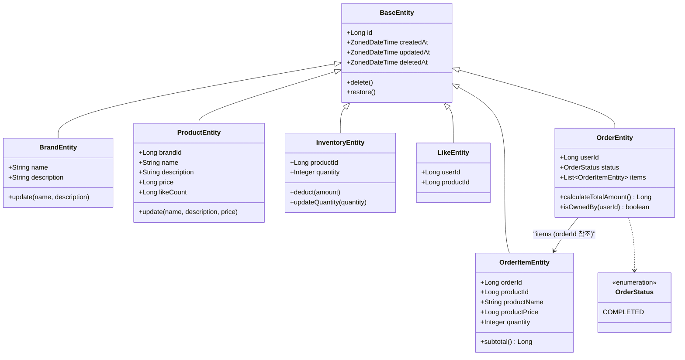

# 클래스 다이어그램

---

## 도메인 메서드 설명

| 클래스 | 메서드 | 역할 |
|---|---|---|
| `BaseEntity` | `delete()` | `deletedAt = now()` 설정 (Soft Delete) |
| `BaseEntity` | `restore()` | `deletedAt = null` 복구 |
| `BrandEntity` | `update(name, description)` | 브랜드 정보 수정 (불변 조건 가드 포함) |
| `ProductEntity` | `update(name, description, price)` | 상품 정보 수정 — 브랜드는 변경 불가 (`brandId` 고정) |
| `InventoryEntity` | `deduct(amount)` | 재고 확인 + 차감 — `FOR UPDATE` 락 획득 후 호출 (ADR-006) |
| `InventoryEntity` | `updateQuantity(quantity)` | 어드민 재고 수량 수정 |
| `OrderEntity` | `calculateTotalAmount()` | `items.sum { subtotal() }` 총 주문 금액 계산 |
| `OrderEntity` | `isOwnedBy(userId)` | `this.userId == userId` 소유권 검증 — 불일치 시 404 |
| `OrderItemEntity` | `subtotal()` | `productPrice × quantity` 항목 금액 계산 |

---

## 관계 설명

| 관계 | 방식 | 근거 |
|---|---|---|
| `ProductEntity → Brand` | `brandId Long` 참조 | JPA 관계 없음, 조회 시 Repository에서 JOIN |
| `ProductEntity → Inventory` | `productId Long` 참조 | 재고는 별도 InventoryRepository로 조회/관리 |
| `OrderEntity → OrderItemEntity` | `List<OrderItemEntity>` (도메인 집합) | 동일 Aggregate, RepositoryImpl에서 조합 반환 |
| `OrderItemEntity → Order` | `orderId Long` 참조 | JPA 관계 없음 |
| `OrderItemEntity → Product` | `productId` + 스냅샷 컬럼 | 주문 시점 정보 보존 (ADR-001) |
| `LikeEntity → User/Product` | ID 참조 | 존재 여부 확인만 필요 |

---

## 인프라스트럭처 — JpaEntity

도메인 Entity와 1:1 대응되는 JPA Entity가 `infrastructure/` 레이어에 위치한다.

| 도메인 Entity | JPA Entity | 역할 |
|---|---|---|
| `BrandEntity` | `BrandJpaEntity` | `@Entity`, DB 매핑, `from()` / `toDomain()` |
| `ProductEntity` | `ProductJpaEntity` | `@Entity`, DB 매핑, `from()` / `toDomain()` |
| `InventoryEntity` | `InventoryJpaEntity` | `@Entity`, DB 매핑, `FOR UPDATE` 락 지원 |
| `LikeEntity` | `LikeJpaEntity` | `@Entity`, DB 매핑, `from()` / `toDomain()` |
| `OrderEntity` | `OrderJpaEntity` | `@Entity`, DB 매핑, `from()` / `toDomain()` |
| `OrderItemEntity` | `OrderItemJpaEntity` | `@Entity`, DB 매핑, `from()` / `toDomain()` |

> `BaseJpaEntity` (`@MappedSuperclass`)가 `id`, `createdAt`, `updatedAt`, `deletedAt` 필드와 JPA 어노테이션을 제공한다.
> 도메인 `BaseEntity`는 JPA 없이 동일 필드 + `delete()` / `restore()` 메서드만 포함한다.
