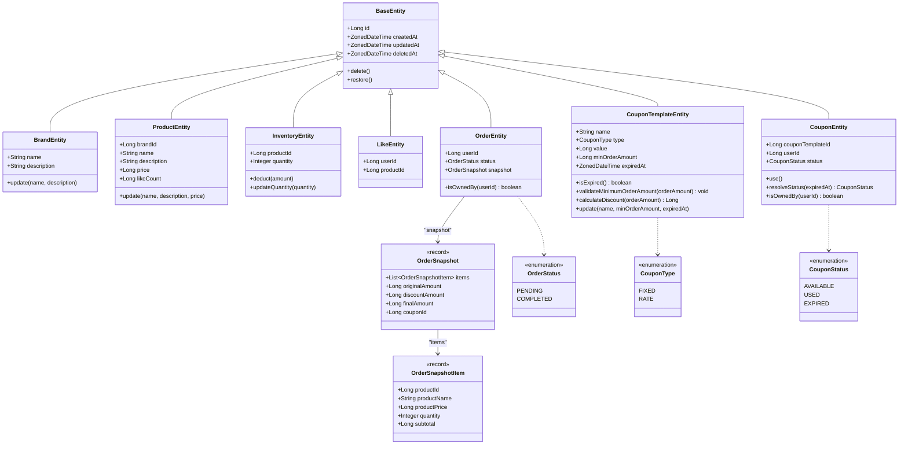

# 클래스 다이어그램

---

## 도메인 메서드 설명

| 클래스 | 메서드 | 역할 |
|---|---|---|
| `BaseEntity` | `delete()` | `deletedAt = now()` 설정 (Soft Delete) |
| `BaseEntity` | `restore()` | `deletedAt = null` 복구 |
| `BrandEntity` | `update(name, description)` | 브랜드 정보 수정 (불변 조건 가드 포함) |
| `ProductEntity` | `update(name, description, price)` | 상품 정보 수정 — 브랜드는 변경 불가 (`brandId` 고정) |
| `InventoryEntity` | `deduct(amount)` | 재고 확인 + 차감 — `FOR UPDATE` 락 획득 후 호출 (ADR-006) |
| `InventoryEntity` | `updateQuantity(quantity)` | 어드민 재고 수량 수정 |
| `OrderEntity` | `isOwnedBy(userId)` | `this.userId == userId` 소유권 검증 — 불일치 시 404 |
| `CouponTemplateEntity` | `update(name, minOrderAmount, expiredAt)` | 수정 가능 필드 업데이트 — `type`·`value`는 변경 불가 |
| `CouponTemplateEntity` | `isExpired()` | `ZonedDateTime.now() > expiredAt` 만료 여부 확인 |
| `CouponTemplateEntity` | `validateMinimumOrderAmount(orderAmount)` | `minOrderAmount != null && orderAmount < minOrderAmount` 시 `CoreException` |
| `CouponTemplateEntity` | `calculateDiscount(orderAmount)` | FIXED: `min(value, orderAmount)` / RATE: `orderAmount * value / 100` |
| `CouponEntity` | `use()` | `AVAILABLE → USED` 상태 전환, 그 외 CoreException |
| `CouponEntity` | `resolveStatus(expiredAt)` | `AVAILABLE`이고 만료일 지났으면 `EXPIRED` 반환 (lazy, DB 미반영) (ADR-029) |
| `CouponEntity` | `isOwnedBy(userId)` | 쿠폰 소유자 검증 |

---

## 관계 설명

| 관계 | 방식 | 근거 |
|---|---|---|
| `ProductEntity → Brand` | `brandId Long` 참조 | JPA 관계 없음, 조회 시 Repository에서 JOIN |
| `ProductEntity → Inventory` | `productId Long` 참조 | 재고는 별도 InventoryRepository로 조회/관리 |
| `OrderEntity → OrderSnapshot` | `OrderSnapshot` 직접 포함 | JSON 스냅샷으로 단일 컬럼 저장, ORDER_ITEM 테이블 대체 (ADR-028) |
| `CouponEntity → CouponTemplateEntity` | `templateId Long` 참조 | JPA 관계 없음, 조회 시 Repository에서 별도 조회 |
| `LikeEntity → User/Product` | ID 참조 | 존재 여부 확인만 필요 |

---

## 인프라스트럭처 — JpaEntity

도메인 Entity와 1:1 대응되는 JPA Entity가 `infrastructure/` 레이어에 위치한다.

| 도메인 Entity | JPA Entity | 역할 |
|---|---|---|
| `BrandEntity` | `BrandJpaEntity` | `@Entity`, DB 매핑 |
| `ProductEntity` | `ProductJpaEntity` | `@Entity`, DB 매핑 |
| `InventoryEntity` | `InventoryJpaEntity` | `@Entity`, DB 매핑, `FOR UPDATE` 락 지원 |
| `LikeEntity` | `LikeJpaEntity` | `@Entity`, DB 매핑 |
| `OrderEntity` | `OrderJpaEntity` | `@Entity`, `snapshot TEXT` 컬럼, `OrderSnapshotConverter` 적용 |
| `CouponTemplateEntity` | `CouponTemplateJpaEntity` | `@Entity`, DB 매핑 |
| `CouponEntity` | `CouponJpaEntity` | `@Entity`, DB 매핑, `PESSIMISTIC_WRITE` 락 지원 (ADR-031) |

> `BaseJpaEntity` (`@MappedSuperclass`)가 `id`, `createdAt`, `updatedAt`, `deletedAt` 필드와 JPA 어노테이션을 제공한다.
> 도메인 `BaseEntity`는 JPA 없이 동일 필드 + `delete()` / `restore()` 메서드만 포함한다.
