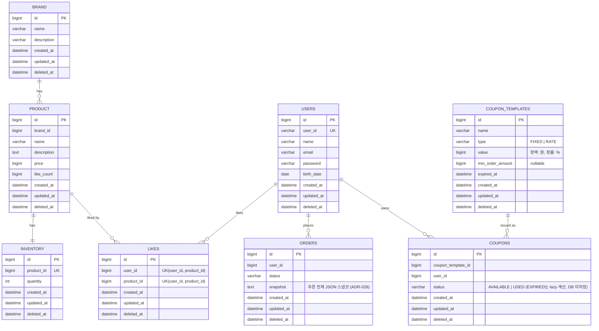

# ERD

---

## 설계 주의사항

| 컬럼 | 테이블 | 설명 |
|---|---|---|
| `brand_id` | PRODUCT | FK 컬럼 존재, DB 레벨 FK 제약조건 없음 (ADR-005) |
| `like_count` | PRODUCT | 좋아요 수 비정규화 컬럼, SQL 원자적 증감으로 관리 (ADR-003) |
| `product_id` | INVENTORY | 1:1 관계, ID만 저장, JPA 관계 없음 (ADR-006) |
| `user_id` | LIKES, ORDERS, COUPONS | ID만 저장, JPA 관계 없음 |
| `product_id` | LIKES | ID만 저장, JPA 관계 없음 |
| `snapshot` | ORDERS | 주문 전체 JSON 스냅샷 — items + 금액 + couponId (ADR-028). ORDER_ITEM 테이블 대체 |
| `UNIQUE(user_id, product_id)` | LIKES | 동일 유저의 중복 좋아요 방지 (DB 레벨 보장) |
| `UNIQUE(product_id)` | INVENTORY | 상품당 재고 행 1개 보장 |
| `status` | COUPONS | DB 값이 AVAILABLE이어도 expired_at 기준으로 lazy하게 EXPIRED 처리 (ADR-029) |
| `template_id` | COUPONS | FK 컬럼 존재, DB 레벨 FK 제약조건 없음 (ADR-005 원칙 준수) |
