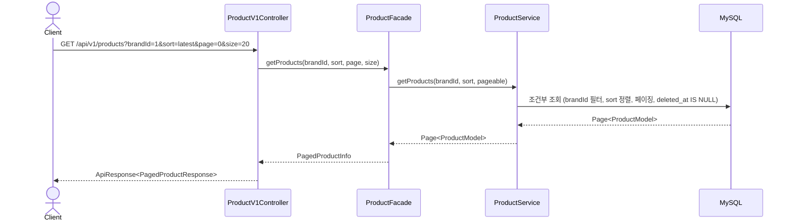
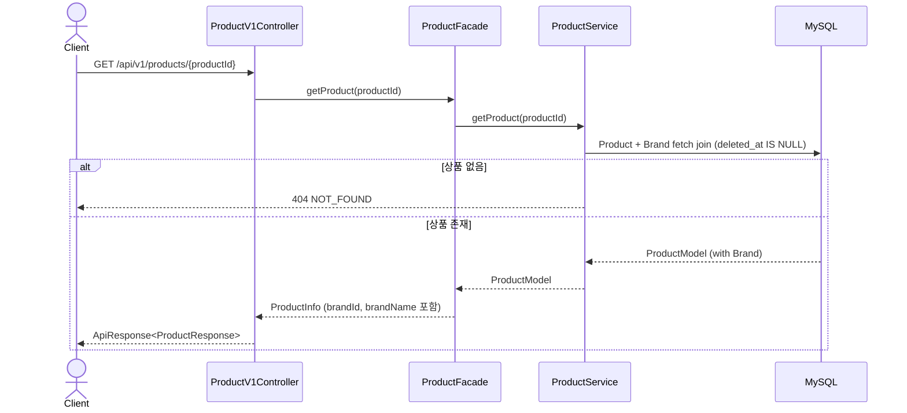
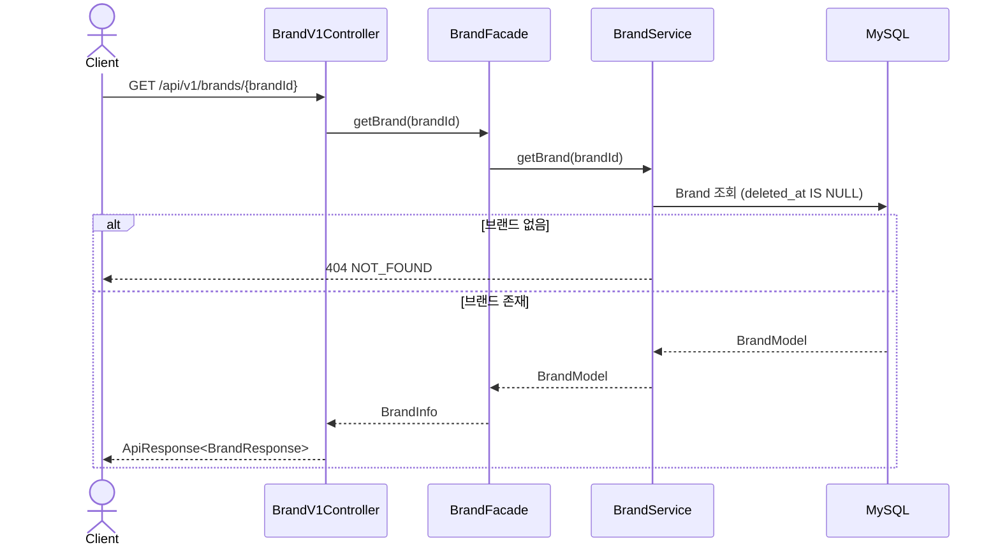
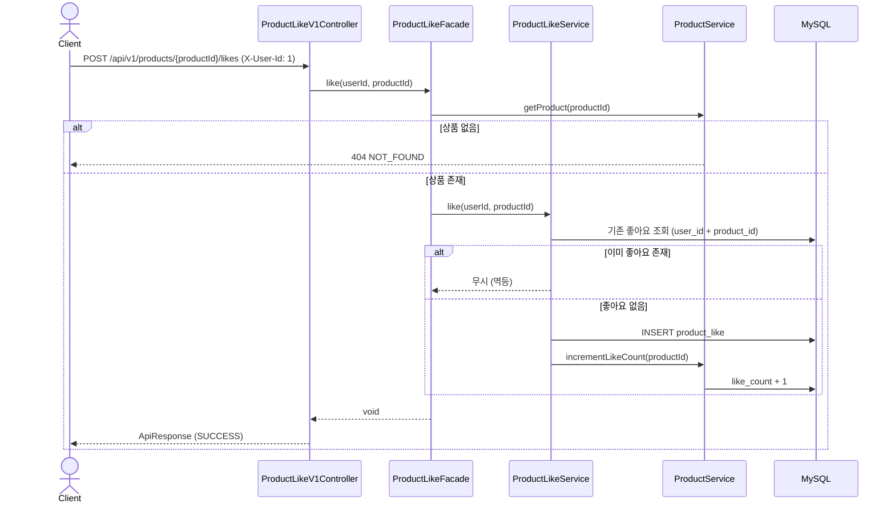
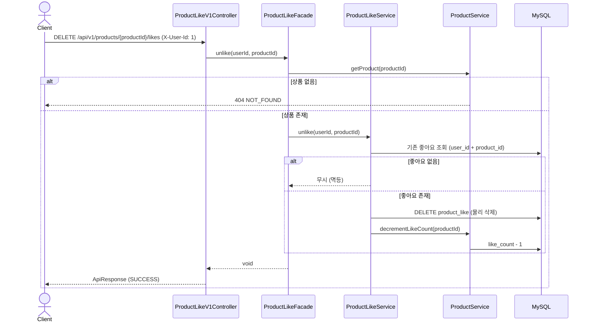
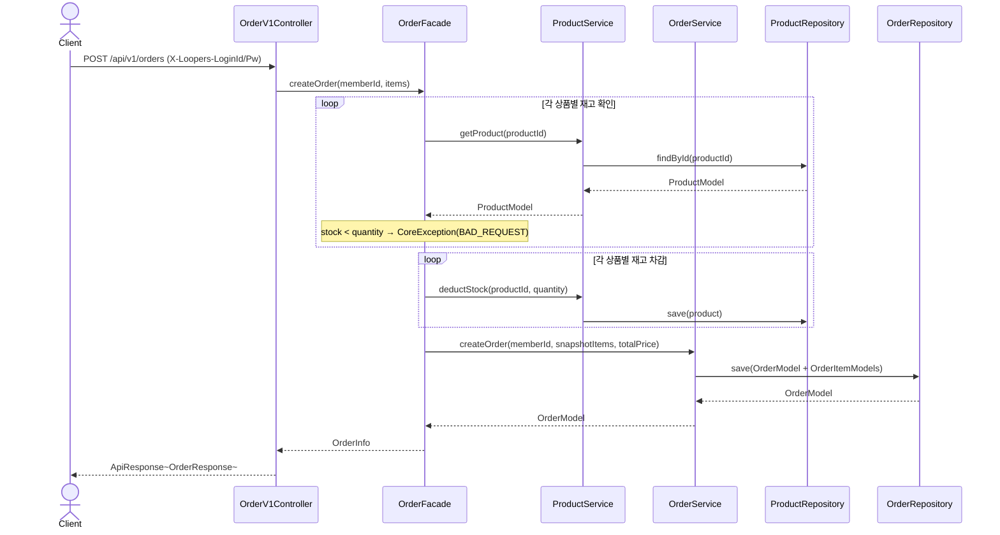
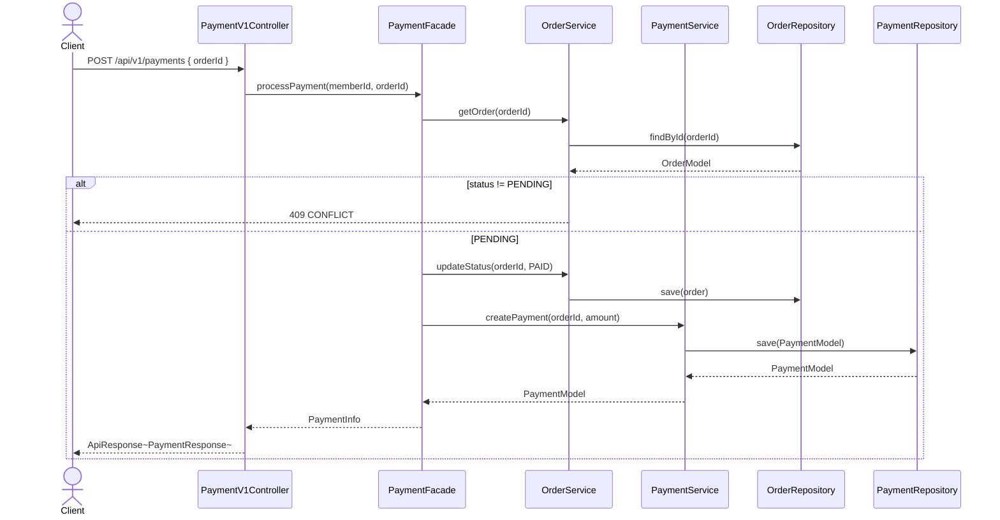
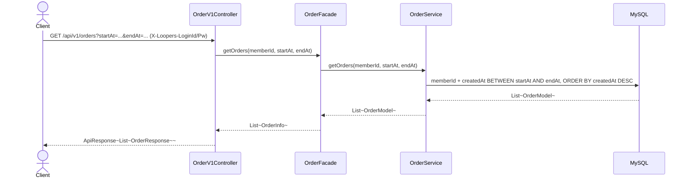
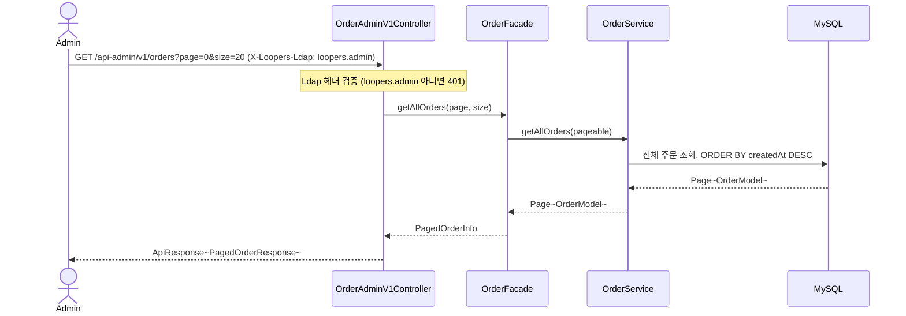
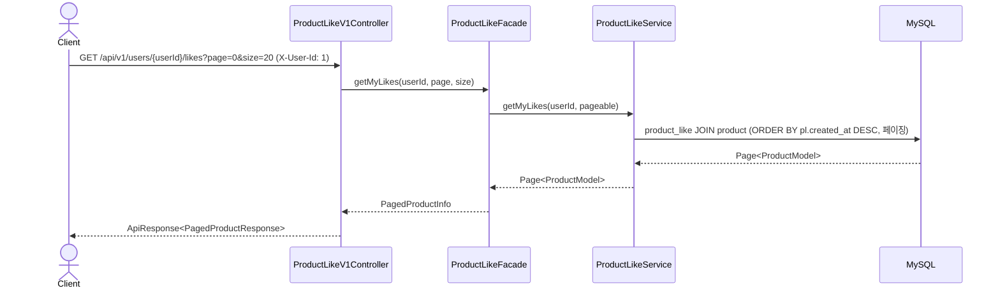

# 02. 시퀀스 다이어그램 — 상품 목록 / 상품 상세 / 브랜드 조회 / 상품 좋아요

## 1. 상품 목록 조회 (필터 + 정렬 + 페이징)

## 2. 상품 상세 조회

## 3. 브랜드 정보 조회

---

## 4. 상품 좋아요 등록 (멱등)

## 5. 상품 좋아요 취소 (멱등)

---

## 7. 주문 생성

## 8. 결제 요청 (stub)

## 9. 주문 목록 조회 (유저)

## 10. [Admin] 주문 목록 조회

## 6. 내가 좋아요한 상품 목록 조회

