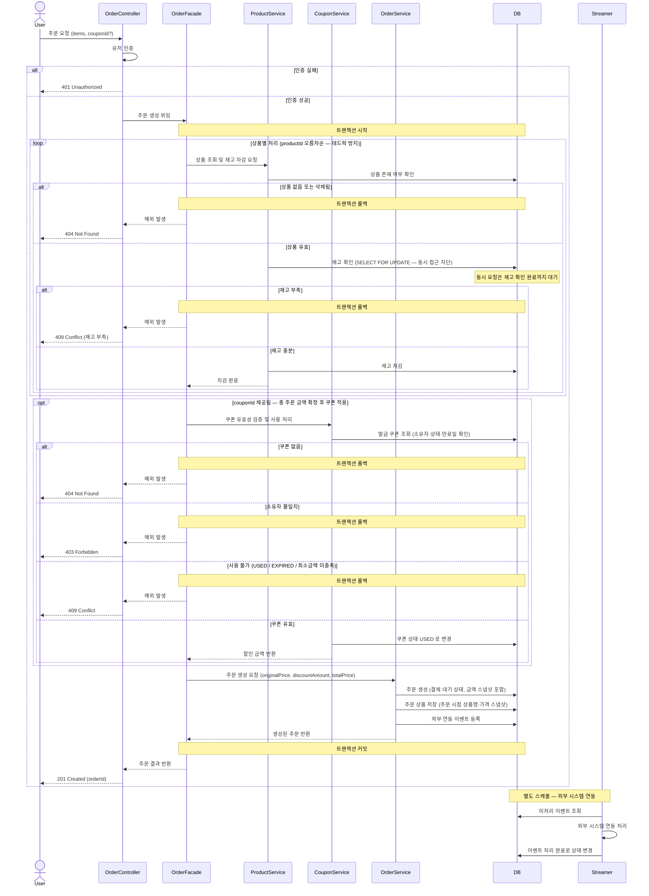
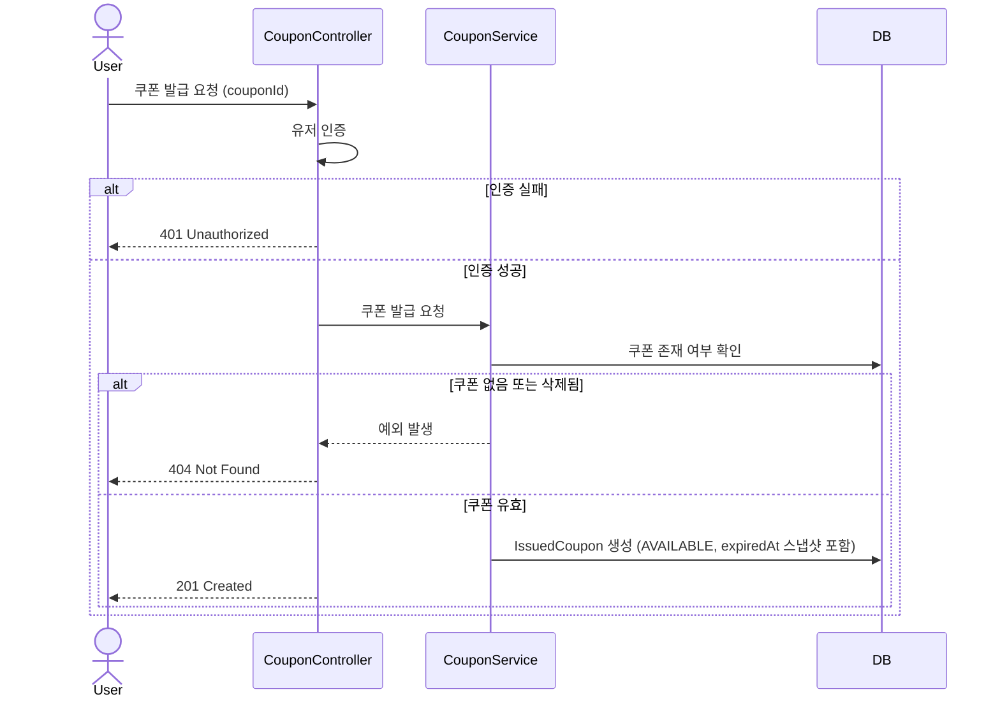
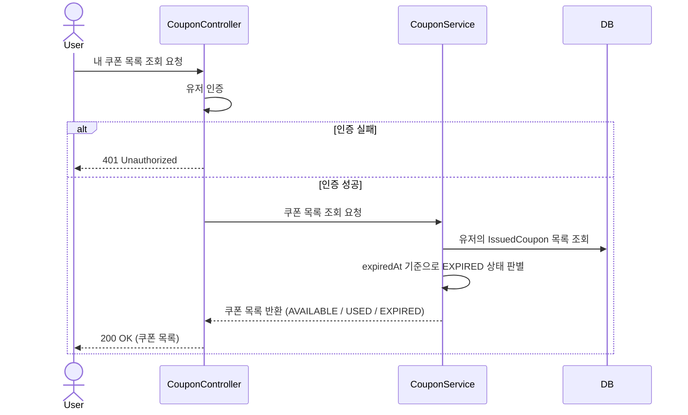
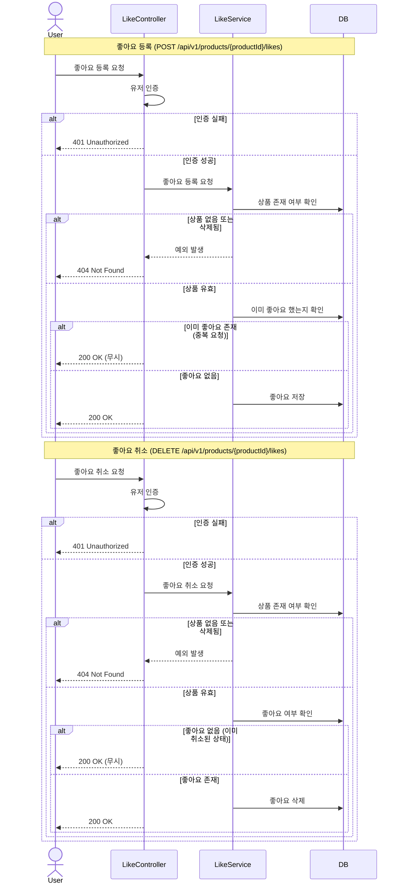
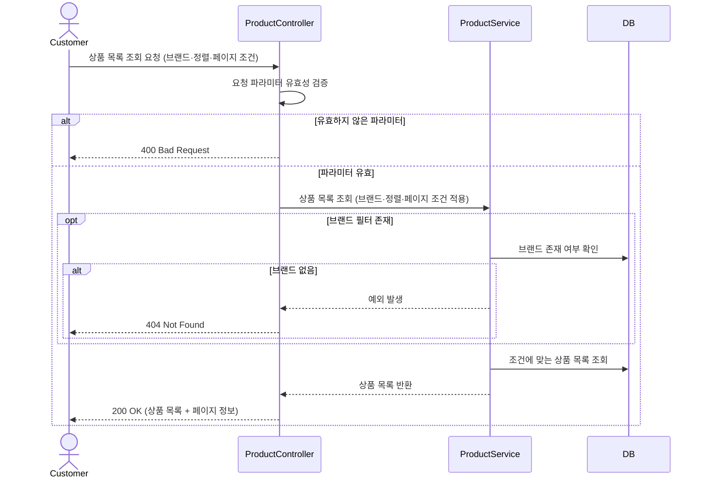
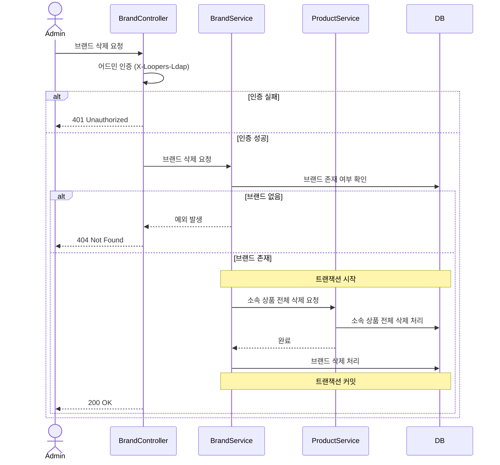

# 시퀀스 다이어그램

## 액터 정의

| 액터 | 설명 |
|---|---|
| `User` | 로그인한 회원 |
| `Customer` | 비로그인 포함 고객 (상품 조회 등 인증 불필요 기능) |
| `Admin` | 내부 관리자 (`X-Loopers-Ldap` 헤더 인증) |
| `DB` | MySQL (영속성 저장소) |
| `Streamer` | Commerce Streamer — Outbox 폴링 후 외부 시스템 연동 |

---

## 1. 주문 생성 (ORDER-001) — 동시성 제어

---

## 2. 쿠폰 발급 (COUPON-001)

---

## 3. 내 쿠폰 목록 조회 (COUPON-002)

---

## 4. 상품 좋아요 등록 / 취소 (LIKE-001, LIKE-002) — 멱등성 보장

---

## 5. 상품 목록 조회 (PRODUCT-001) — 필터 / 정렬 / 페이지네이션

---

## 6. 브랜드 삭제 (BRAND-ADMIN-005) — Soft Delete Cascade

