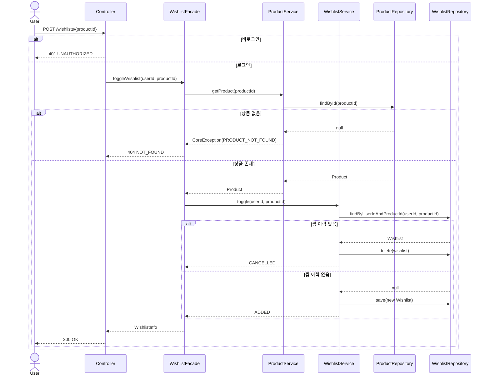
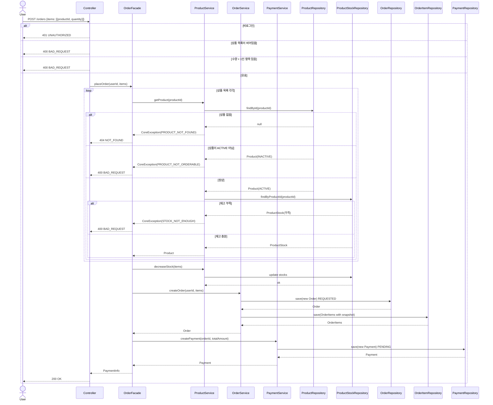
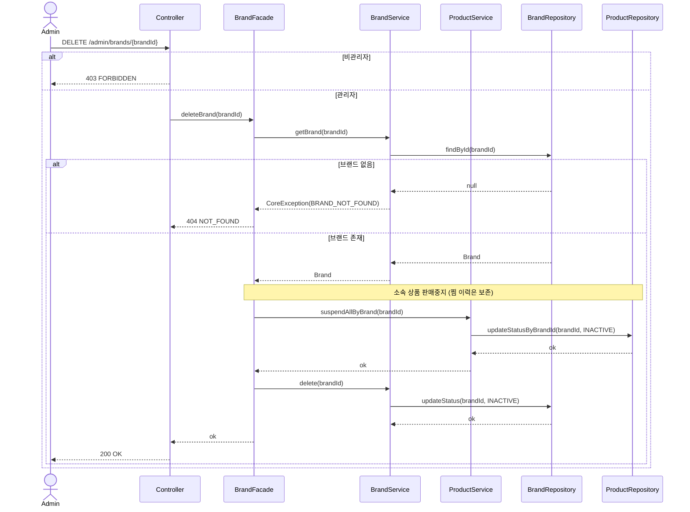
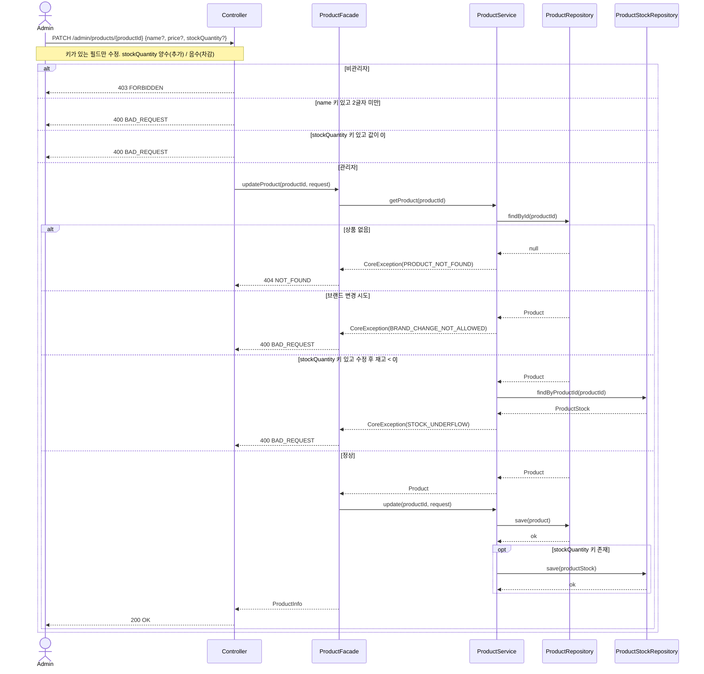

# 시퀀스 다이어그램

---

## UC-004: 상품 찜 / 찜 취소

```mermaid
sequenceDiagram
    actor User
    participant Controller
    participant WishlistFacade
    participant ProductService
    participant WishlistService
    participant ProductRepository
    participant WishlistRepository

    User->>Controller: POST /wishlists/{productId}

    alt 비로그인
        Controller-->>User: 401 UNAUTHORIZED
    else 로그인
        Controller->>WishlistFacade: toggleWishlist(userId, productId)

        WishlistFacade->>ProductService: getProduct(productId)
        ProductService->>ProductRepository: findById(productId)

        alt 상품 없음
            ProductRepository-->>ProductService: null
            ProductService-->>WishlistFacade: CoreException(PRODUCT_NOT_FOUND)
            WishlistFacade-->>Controller: 404 NOT_FOUND
        else 상품 존재
            ProductRepository-->>ProductService: Product
            ProductService-->>WishlistFacade: Product

            WishlistFacade->>WishlistService: toggle(userId, productId)
            WishlistService->>WishlistRepository: findByUserIdAndProductId(userId, productId)

            alt 찜 이력 있음
                WishlistRepository-->>WishlistService: Wishlist
                WishlistService->>WishlistRepository: delete(wishlist)
                WishlistService-->>WishlistFacade: CANCELLED
            else 찜 이력 없음
                WishlistRepository-->>WishlistService: null
                WishlistService->>WishlistRepository: save(new Wishlist)
                WishlistService-->>WishlistFacade: ADDED
            end

            WishlistFacade-->>Controller: WishlistInfo
            Controller-->>User: 200 OK
        end
    end
```

---

## UC-006: 주문 및 결제 요청

```mermaid
sequenceDiagram
    actor User
    participant Controller
    participant OrderFacade
    participant ProductService
    participant OrderService
    participant PaymentService
    participant ProductRepository
    participant ProductStockRepository
    participant OrderRepository
    participant OrderItemRepository
    participant PaymentRepository

    User->>Controller: POST /orders {items: [{productId, quantity}]}

    alt 비로그인
        Controller-->>User: 401 UNAUTHORIZED
    else 상품 목록이 비어있음
        Controller-->>User: 400 BAD_REQUEST
    else 수량 < 1인 항목 있음
        Controller-->>User: 400 BAD_REQUEST
    else 유효
        Controller->>OrderFacade: placeOrder(userId, items)

        loop 상품 목록 각각
            OrderFacade->>ProductService: getProduct(productId)
            ProductService->>ProductRepository: findById(productId)

            alt 상품 없음
                ProductRepository-->>ProductService: null
                ProductService-->>OrderFacade: CoreException(PRODUCT_NOT_FOUND)
                OrderFacade-->>Controller: 404 NOT_FOUND
            else 상품이 ACTIVE 아님
                ProductRepository-->>ProductService: Product(INACTIVE)
                ProductService-->>OrderFacade: CoreException(PRODUCT_NOT_ORDERABLE)
                OrderFacade-->>Controller: 400 BAD_REQUEST
            else 정상
                ProductRepository-->>ProductService: Product(ACTIVE)
                ProductService->>ProductStockRepository: findByProductId(productId)
                alt 재고 부족
                    ProductStockRepository-->>ProductService: ProductStock(부족)
                    ProductService-->>OrderFacade: CoreException(STOCK_NOT_ENOUGH)
                    OrderFacade-->>Controller: 400 BAD_REQUEST
                else 재고 충분
                    ProductStockRepository-->>ProductService: ProductStock
                    ProductService-->>OrderFacade: Product
                end
            end
        end

        OrderFacade->>ProductService: decreaseStock(items)
        ProductService->>ProductStockRepository: update stocks
        ProductStockRepository-->>ProductService: ok

        OrderFacade->>OrderService: createOrder(userId, items)
        OrderService->>OrderRepository: save(new Order) REQUESTED
        OrderRepository-->>OrderService: Order
        OrderService->>OrderItemRepository: save(OrderItems with snapshot)
        OrderItemRepository-->>OrderService: OrderItems
        OrderService-->>OrderFacade: Order

        OrderFacade->>PaymentService: createPayment(orderId, totalAmount)
        PaymentService->>PaymentRepository: save(new Payment) PENDING
        PaymentRepository-->>PaymentService: Payment
        PaymentService-->>OrderFacade: Payment

        OrderFacade-->>Controller: PaymentInfo
        Controller-->>User: 200 OK
    end
```

---

## UC-A003: 브랜드 삭제

```mermaid
sequenceDiagram
    actor Admin
    participant Controller
    participant BrandFacade
    participant BrandService
    participant ProductService
    participant BrandRepository
    participant ProductRepository

    Admin->>Controller: DELETE /admin/brands/{brandId}

    alt 비관리자
        Controller-->>Admin: 403 FORBIDDEN
    else 관리자
        Controller->>BrandFacade: deleteBrand(brandId)

        BrandFacade->>BrandService: getBrand(brandId)
        BrandService->>BrandRepository: findById(brandId)

        alt 브랜드 없음
            BrandRepository-->>BrandService: null
            BrandService-->>BrandFacade: CoreException(BRAND_NOT_FOUND)
            BrandFacade-->>Controller: 404 NOT_FOUND
        else 브랜드 존재
            BrandRepository-->>BrandService: Brand
            BrandService-->>BrandFacade: Brand

            Note over BrandFacade,ProductRepository: 소속 상품 판매중지 (찜 이력은 보존)
            BrandFacade->>ProductService: suspendAllByBrand(brandId)
            ProductService->>ProductRepository: updateStatusByBrandId(brandId, INACTIVE)
            ProductRepository-->>ProductService: ok
            ProductService-->>BrandFacade: ok

            BrandFacade->>BrandService: delete(brandId)
            BrandService->>BrandRepository: updateStatus(brandId, INACTIVE)
            BrandRepository-->>BrandService: ok

            BrandFacade-->>Controller: ok
            Controller-->>Admin: 200 OK
        end
    end
```

---

## UC-A005: 상품 수정

```mermaid
sequenceDiagram
    actor Admin
    participant Controller
    participant ProductFacade
    participant ProductService
    participant ProductRepository
    participant ProductStockRepository

    Admin->>Controller: PATCH /admin/products/{productId} {name?, price?, stockQuantity?}
    Note over Admin,Controller: 키가 있는 필드만 수정. stockQuantity 양수(추가) / 음수(차감)

    alt 비관리자
        Controller-->>Admin: 403 FORBIDDEN
    else name 키 있고 2글자 미만
        Controller-->>Admin: 400 BAD_REQUEST
    else stockQuantity 키 있고 값이 0
        Controller-->>Admin: 400 BAD_REQUEST
    else 관리자
        Controller->>ProductFacade: updateProduct(productId, request)

        ProductFacade->>ProductService: getProduct(productId)
        ProductService->>ProductRepository: findById(productId)

        alt 상품 없음
            ProductRepository-->>ProductService: null
            ProductService-->>ProductFacade: CoreException(PRODUCT_NOT_FOUND)
            ProductFacade-->>Controller: 404 NOT_FOUND
        else 브랜드 변경 시도
            ProductRepository-->>ProductService: Product
            ProductService-->>ProductFacade: CoreException(BRAND_CHANGE_NOT_ALLOWED)
            ProductFacade-->>Controller: 400 BAD_REQUEST
        else stockQuantity 키 있고 수정 후 재고 < 0
            ProductRepository-->>ProductService: Product
            ProductService->>ProductStockRepository: findByProductId(productId)
            ProductStockRepository-->>ProductService: ProductStock
            ProductService-->>ProductFacade: CoreException(STOCK_UNDERFLOW)
            ProductFacade-->>Controller: 400 BAD_REQUEST
        else 정상
            ProductRepository-->>ProductService: Product
            ProductService-->>ProductFacade: Product
            ProductFacade->>ProductService: update(productId, request)
            ProductService->>ProductRepository: save(product)
            ProductRepository-->>ProductService: ok
            opt stockQuantity 키 존재
                ProductService->>ProductStockRepository: save(productStock)
                ProductStockRepository-->>ProductService: ok
            end
            ProductFacade-->>Controller: ProductInfo
            Controller-->>Admin: 200 OK
        end
    end
```
