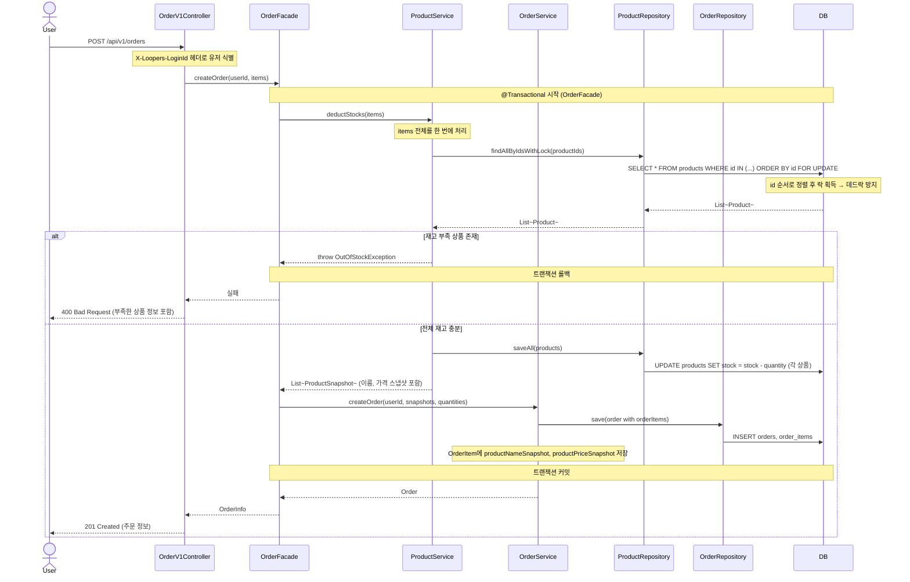
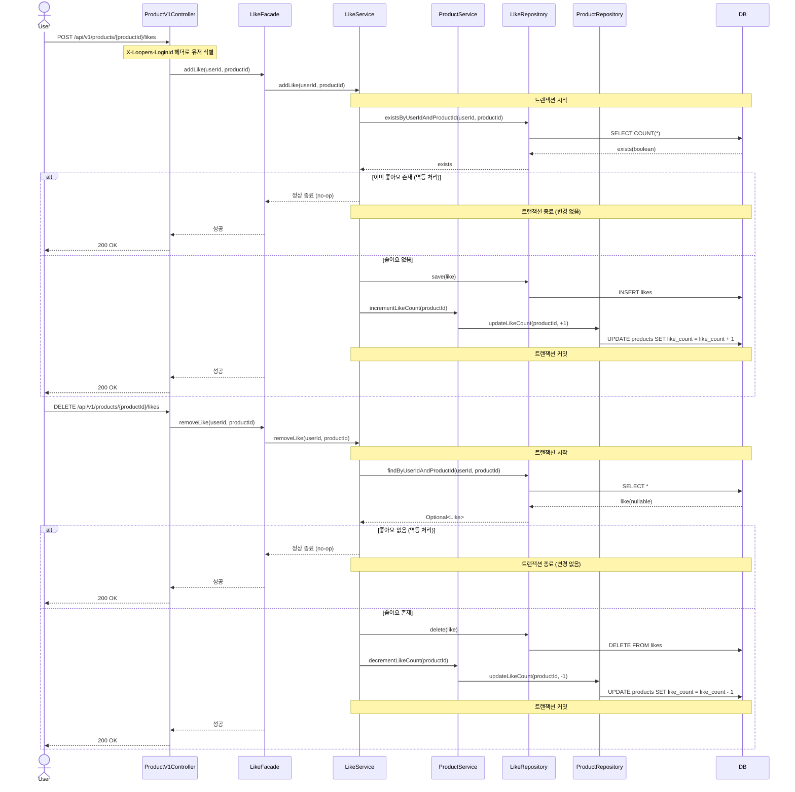
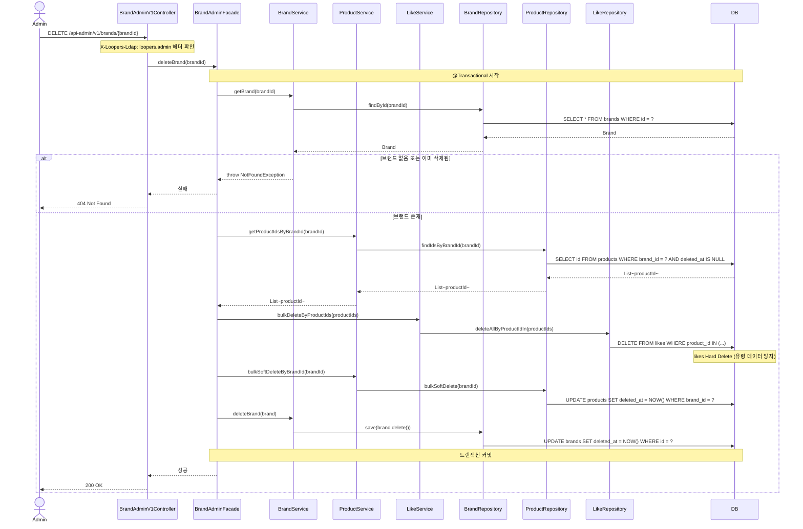
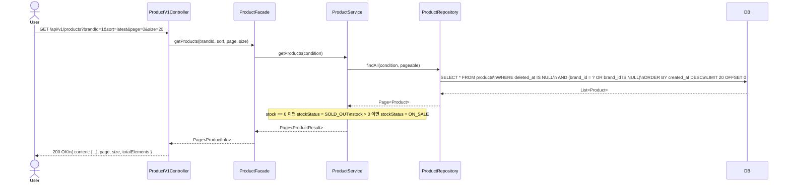

# 02. 시퀀스 다이어그램

---

## 다이어그램 1 — 주문 생성

### 왜 이 다이어그램이 필요한가?

주문 생성은 이번 설계에서 가장 복잡한 흐름이다.
"재고 확인 → 재고 차감 → 주문 저장"이 하나의 트랜잭션으로 묶여야 하며,
**동시성 처리와 트랜잭션 경계**를 명확히 할 필요가 있다.

**검증 목표**
- 재고 확인과 차감이 같은 트랜잭션 안에 있는가?
- 루프 내 개별 락 대신 배치로 락을 잡아 데드락 위험을 줄이는가?
- OrderService와 ProductService 간 의존 방향이 Facade를 통해 정리되는가?

> **설계 결정 — 트랜잭션 경계**
> `OrderFacade`에 `@Transactional`을 위치시키고, 재고 차감(`ProductService.deductStocks`)과
> 주문 저장(`OrderService.createOrder`)을 단일 트랜잭션 안에서 순차 처리한다.
> OrderService가 ProductService를 직접 호출하면 서비스 간 강한 결합이 생기고,
> 루프 내 개별 `SELECT FOR UPDATE`는 락 획득 순서에 따라 **데드락(Deadlock)** 을 유발할 수 있다.
> 따라서 재고 차감을 단일 벌크 호출로 먼저 처리한 뒤 주문을 생성한다.

### 다이어그램

### 읽는 법 — 포인트 3가지

1. **`SELECT ... IN (...) ORDER BY id FOR UPDATE`** — 여러 상품을 한 번에 락을 잡되, `id` 오름차순 정렬로 락 획득 순서를 고정한다. 락 순서가 일관되면 데드락이 발생하지 않는다. 루프 내 개별 락은 데드락의 주원인이다.
2. **트랜잭션 경계는 `OrderFacade`** — `OrderService`와 `ProductService`가 서로를 직접 참조하면 서비스 간 강한 결합이 생긴다. Facade가 `@Transactional`을 가지고 두 서비스를 조합하면, 서비스 레이어는 독립성을 유지하면서 단일 트랜잭션을 보장할 수 있다.
3. **스냅샷은 `ProductService`가 반환** — 재고 차감과 동시에 당시 상품명·가격을 `ProductSnapshot`으로 반환한다. `OrderService`는 이 스냅샷을 받아 `OrderItem`을 생성하므로, 상품 정보를 별도로 다시 조회하지 않아도 된다.

---

## 다이어그램 2 — 좋아요 등록 / 취소 (멱등 처리)

### 왜 이 다이어그램이 필요한가?

좋아요는 "멱등 동작"이 핵심 요구사항이다.
같은 요청이 두 번 들어와도 결과가 달라지지 않아야 하며,
`likeCount` 동기화가 어느 레이어에서 어떻게 이루어지는지 **책임 분리**를 확인할 필요가 있다.

**검증 목표**
- 중복 좋아요 등록 시 likeCount가 두 번 올라가지 않는가?
- 없는 좋아요 취소 시 likeCount가 내려가지 않는가?
- 멱등 처리 분기가 어느 레이어에 위치하는가?

### 다이어그램

### 읽는 법 — 포인트 3가지

1. **멱등 분기는 `LikeService`** — 중복 여부 확인과 no-op 처리가 서비스 레이어에서 이루어진다. Controller나 Facade는 항상 성공 응답을 내려주므로 클라이언트는 상태를 따로 관리하지 않아도 된다.
2. **`likeCount` 동기화는 `ProductService` 위임** — Like 도메인이 직접 Product 테이블을 건드리지 않고, ProductService를 통해 카운트를 변경한다. 도메인 간 직접 의존을 피하는 구조다.
3. **같은 트랜잭션 안에서 처리** — 좋아요 저장/삭제와 likeCount 변경이 하나의 트랜잭션으로 묶여 있어, 좋아요는 저장됐는데 카운트가 안 올라가는 불일치 상황이 발생하지 않는다.

---

## 다이어그램 3 — 브랜드 삭제 (어드민)

### 왜 이 다이어그램이 필요한가?

브랜드 삭제는 단순 삭제가 아니다. 단방향 참조 구조에서 Brand 도메인 객체가 자식 Product를 직접 지울 수 없고,
상품의 `likes` 데이터까지 연쇄 정리해야 한다. 이 흐름이 명시되지 않으면
구현 단계에서 책임 소재가 불명확해진다.

**검증 목표**
- 상품 벌크 Soft Delete가 어느 레이어에서 처리되는가?
- `likes` 연쇄 Hard Delete 규칙이 흐름에 포함되는가?
- 단방향 참조 구조에서 하위 엔티티 삭제 책임이 명확한가?

### 다이어그램

### 읽는 법 — 포인트 3가지

1. **삭제 순서: likes → products → brand** — 하위 데이터를 먼저 처리한 뒤 상위를 지운다. likes를 먼저 Hard Delete하지 않으면, 이후 동일 productId로 재등록 시 유령 좋아요 데이터가 남는다.
2. **벌크 쿼리는 서비스 레이어 책임** — `Brand.delete()` 도메인 메서드는 단방향 참조 구조상 자식 상품을 알 수 없다. 하위 엔티티 일괄 삭제는 `BrandAdminFacade`가 `ProductService`, `LikeService`를 명시적으로 호출해 처리한다.
3. **하나의 트랜잭션** — likes 삭제, 상품 Soft Delete, 브랜드 Soft Delete가 하나의 트랜잭션으로 묶인다. 중간에 실패하면 전체 롤백되어 부분 삭제 상태가 남지 않는다.

---

## 다이어그램 4 — 상품 목록 조회

### 왜 이 다이어그램이 필요한가?

상품 목록 조회는 가장 빈번하게 호출되는 API다.
Soft Delete 필터링(`deleted_at IS NULL`)이 어느 레이어에서 처리되는지,
브랜드 필터와 정렬이 어떻게 조합되는지 **책임 분리**를 확인한다.

**검증 목표**
- Soft Delete 필터링이 Repository에서 일관되게 처리되는가?
- 재고 0 상품의 `stockStatus` 변환이 어느 레이어에서 이루어지는가?
- 페이지네이션과 정렬이 DB 쿼리 레벨에서 처리되는가?

### 다이어그램

### 읽는 법 — 포인트 3가지

1. **`deleted_at IS NULL` 필터는 Repository 레이어** — Soft Delete 조건은 DB 쿼리에서 처리한다. Spring Data JPA의 `@Where(clause = "deleted_at IS NULL")` 또는 QueryDSL 조건으로 일관되게 적용해 Service에서 별도 필터링이 필요 없다.
2. **`stockStatus` 변환은 Service 레이어** — `stock` 수량이라는 도메인 데이터를 `SOLD_OUT / ON_SALE`이라는 표현 값으로 바꾸는 것은 비즈니스 로직이므로, DB가 아닌 Service에서 처리한다.
3. **정렬과 페이지네이션은 DB 레벨** — `ORDER BY`와 `LIMIT/OFFSET`을 애플리케이션에서 처리하면 전체 데이터를 메모리에 올려야 한다. 반드시 DB 쿼리로 위임해야 한다.
