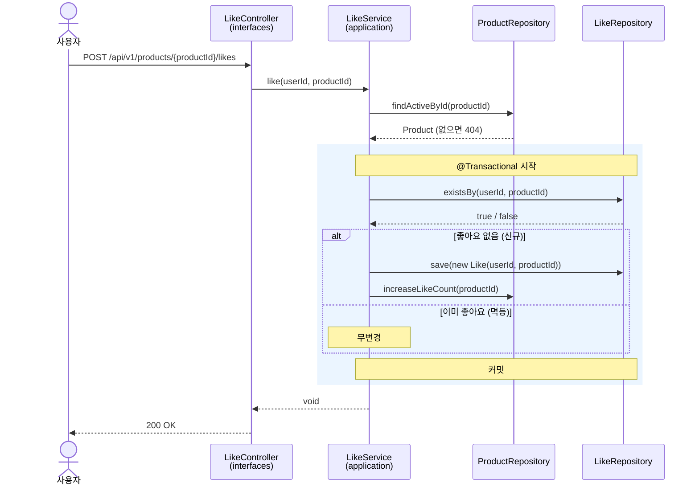
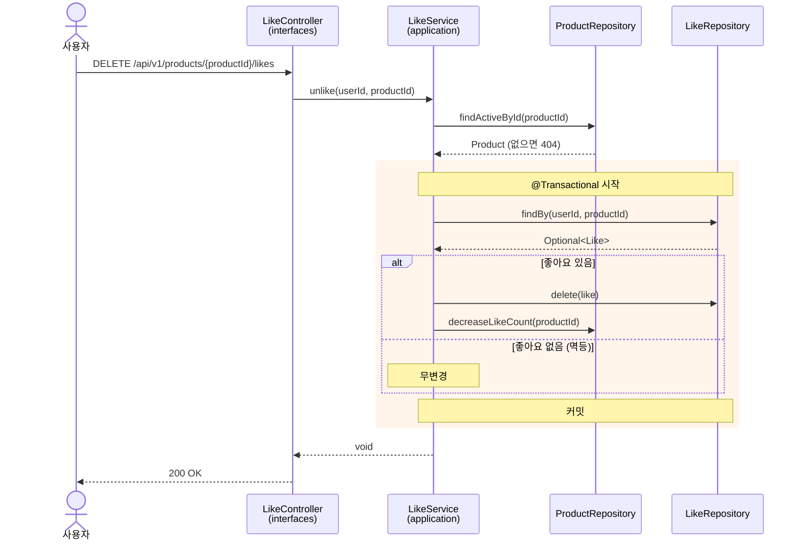
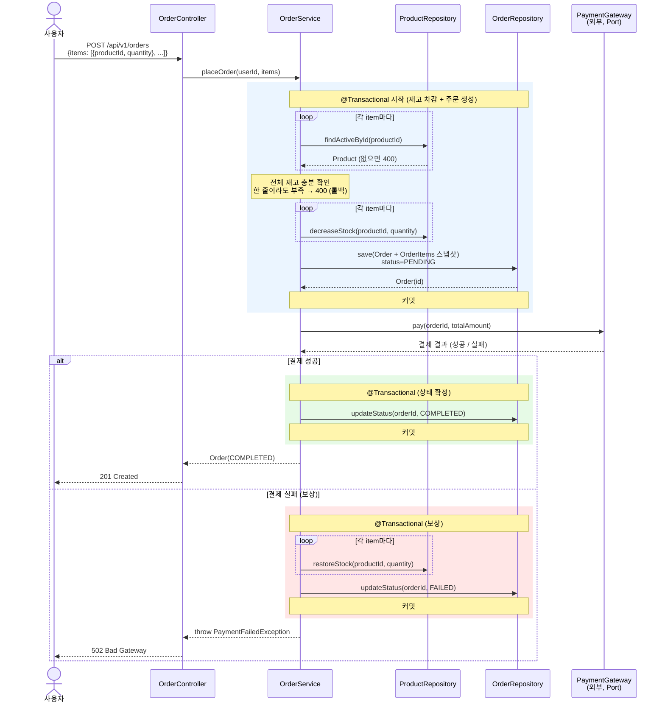
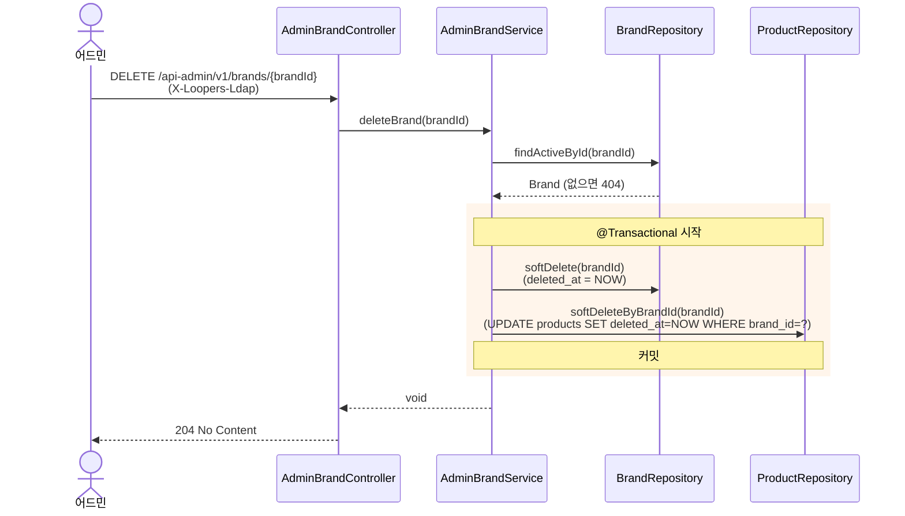
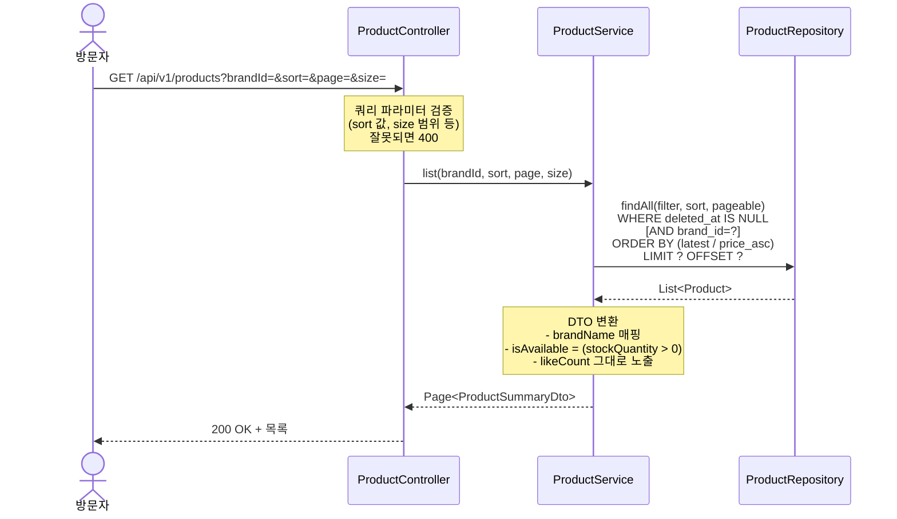

# 02. 시퀀스 다이어그램

본 문서는 핵심 협력 흐름 4개를 시퀀스 다이어그램으로 정리한다.
단순 조회(상품 상세, 주문 목록 등)는 패턴이 동일(`Controller → Service → Repository → 응답`)하여 별도로 표현하지 않는다.

| # | 시퀀스 | 핵심 가치 |
|---|---|---|
| 1 | 좋아요 등록·취소 (멱등) | 멱등 분기, likeCount 트랜잭션 정합성 |
| 2 | 주문 생성 + 결제 | 트랜잭션 경계 3분리, 외부 호출, 보상 |
| 3 | 어드민 브랜드 삭제 | 캐스케이드 soft delete |
| 4 | 상품 목록 조회 | 검증 위치, 도메인↔DTO 변환 |

---

## 1. 좋아요 등록·취소 (멱등)

### 1-A. 좋아요 등록 (POST)

> "이미 좋아요한 상태"여도 200 OK로 통과시키는 것이 멱등의 핵심.

### 1-B. 좋아요 취소 (DELETE)

### 봐야 할 포인트
1. **멱등 분기는 Service 책임** — Controller는 단순 라우팅, Service가 "현재 상태를 확인 → 필요할 때만 변경" 결정
2. **트랜잭션 경계** — `Like` 저장/삭제와 `Product.likeCount` 변경이 한 트랜잭션 (`rect` 박스 영역)
3. **무변경 분기도 200 OK** — 멱등의 핵심
4. **`findActiveById`** = soft delete 필터 포함 (`WHERE deleted_at IS NULL`)

### 잠재 리스크
- **동시성**: `existsBy` 체크와 `save` 사이에 다른 트랜잭션이 끼어들 수 있음 → DB unique 제약 (`UNIQUE(user_id, product_id)`)으로 방어. 락 전략은 다음 라운드
- **likeCount 정합성**: 고동시성에서 row lock 경합 가능 (다음 라운드 학습 주제)

---

## 2. 주문 생성 + 결제

> 외부 호출(PG)을 트랜잭션 안에 두지 않기 위해 **트랜잭션을 3개로 분리**한다.
> 결제 실패 시 보상 트랜잭션이 차감했던 재고를 복원한다.

### 봐야 할 포인트
1. **트랜잭션 3개로 분리** — 외부 호출(PG)은 트랜잭션 안에 두지 않음 (DB 락 시간 줄이기)
   - 🟦 1차 TX: 재고 차감 + 주문(`PENDING`) 저장
   - 🟩 2차 TX: 결제 성공 → `COMPLETED`로 상태 변경
   - 🟥 보상 TX: 결제 실패 → 재고 복원 + `FAILED`
2. **재고는 차감해놓고 결제 호출** — 결제 진행 중 다른 사용자가 같은 상품을 못 가져감
3. **스냅샷은 Order 생성 시점에 박제** — 결제 실패해서 `FAILED` 되어도 OrderItem의 가격/이름/이미지는 그 시점 그대로
4. **All-or-Nothing** — 한 상품 재고 부족이면 전체 거부 (트랜잭션 롤백)

### 잠재 리스크
- **동시성**: 두 사용자가 동시에 같은 상품 마지막 1개 주문 → 둘 다 재고 확인 통과 → 둘 다 차감 시도. 해결: row lock / 낙관적 락 — 다음 라운드
- **결제 콜백/타임아웃**: 결제가 비동기거나 타임아웃 시 처리 미정 (다음 라운드)
- **PENDING 무한 상태**: 결제 호출 후 서버 다운 → 영원히 PENDING. 해결: 만료 스케줄러 — 다음 라운드

---

## 3. 어드민 브랜드 삭제 (캐스케이드 soft delete)

> 브랜드와 소속 상품을 **한 트랜잭션으로 일괄** soft delete.

### 봐야 할 포인트
1. **브랜드 + 소속 상품 일괄 soft delete** — 한 트랜잭션으로 묶어 정합성 보장 (브랜드만 사라지고 상품이 남는 일 없음)
2. **벌크 UPDATE 한 번** — 상품마다 개별 update 안 하고 `WHERE brand_id=?`로 일괄 처리
3. **soft delete라 데이터는 남아있음** — 진행 중 주문의 OrderItem이 그 상품을 참조해도 스냅샷이 있어서 안전

### 잠재 리스크
- **소속 상품의 `Like` 처리**: Like 테이블은 그대로 두고 조회 시 필터로 제외 (요구사항 5.4)
- **벌크 UPDATE의 영향 범위**: 한 브랜드에 상품 10만 개라면 락 시간 길어짐. 운영 시 배치 처리 검토 (다음 라운드)

---

## 4. 상품 목록 조회 (정렬 / 필터 / 페이징)

> 검증은 Controller, 도메인↔DTO 변환은 Service.

### 봐야 할 포인트
1. **검증은 Controller에서** — 잘못된 sort 값 / size 범위 등은 비즈니스 로직 들어가기 전에 차단
2. **soft delete 필터는 Repository 기본 적용** — `WHERE deleted_at IS NULL`이 모든 조회 쿼리에 들어감
3. **`isAvailable` 변환은 Service 레이어** — 도메인 객체엔 `stockQuantity` (수치), 응답엔 `isAvailable` (boolean)
4. **`brandName`은 조인 또는 별도 조회** — Product 응답에 BrandName이 필요하니 함께 가져옴

### 잠재 리스크
- **느린 조회**: 상품 많아지면 정렬+페이징이 느려짐. 인덱스 설계 필요 (`created_at`, `price`) — 다음 라운드
- **N+1 문제**: 상품마다 별도로 Brand 조회하면 N+1. 페치 조인 / DTO 프로젝션 필요 — 다음 라운드
