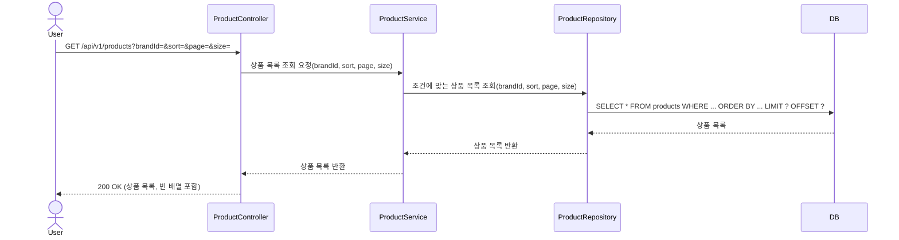
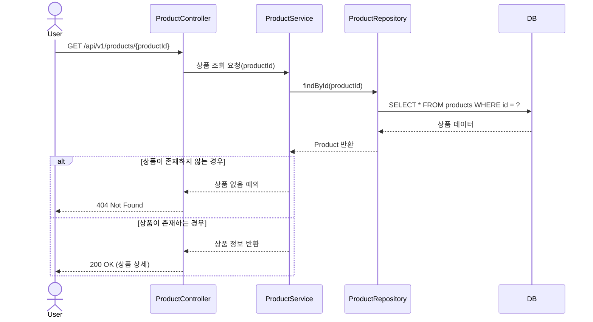
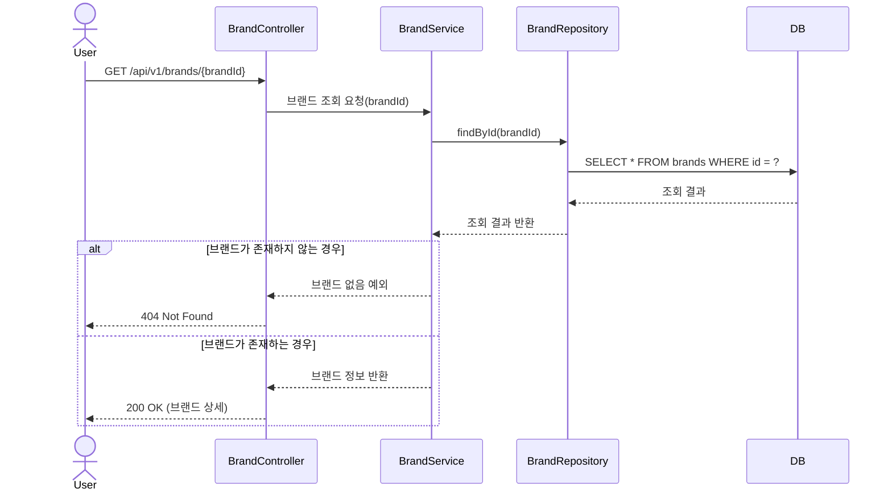
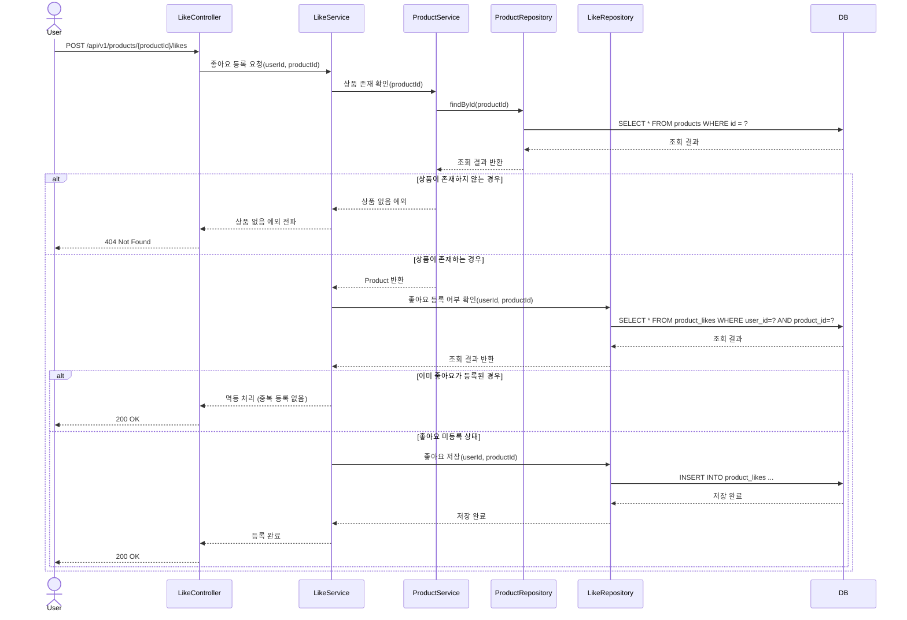
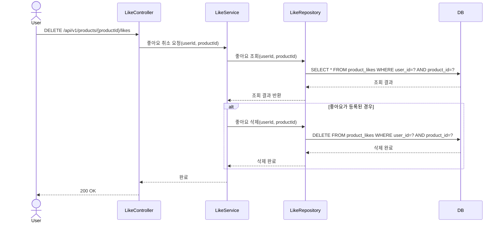
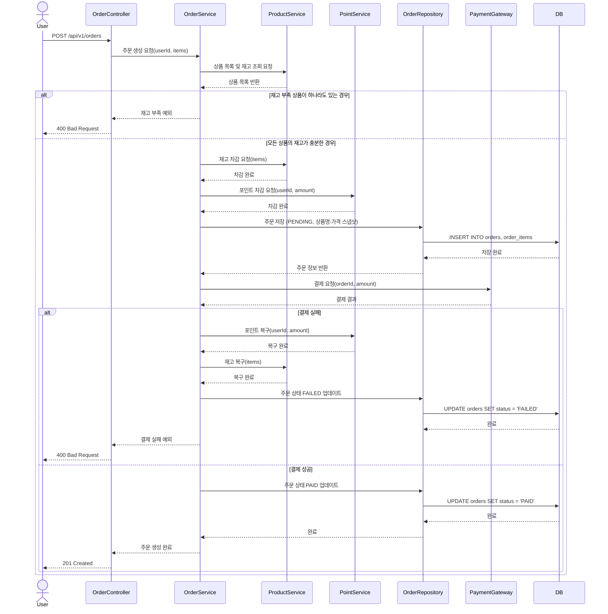
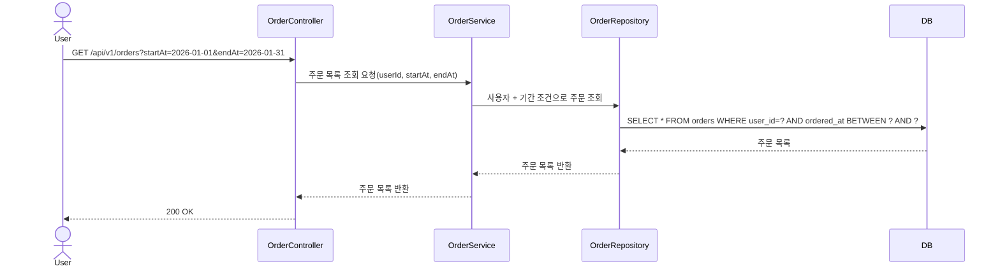
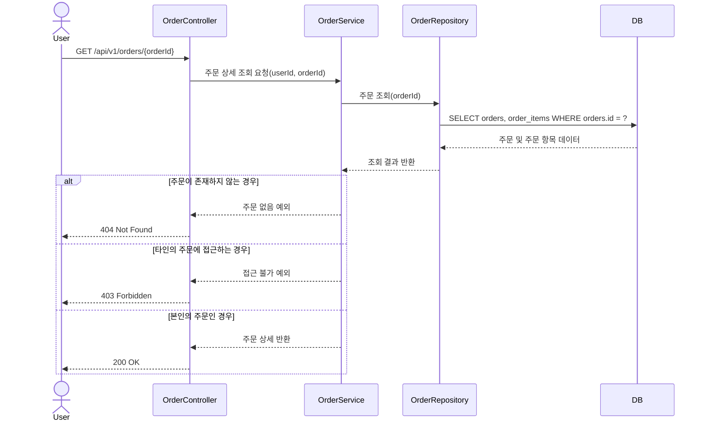
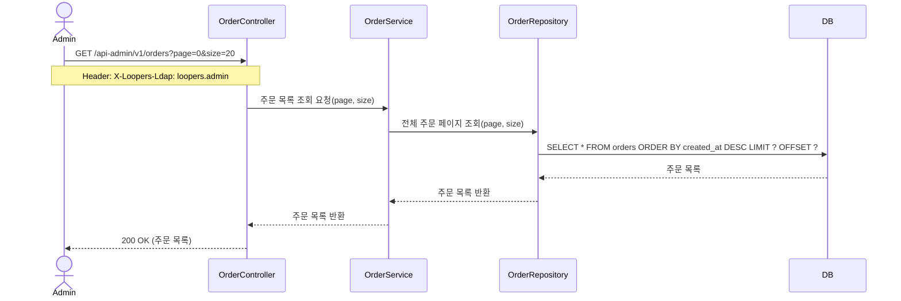
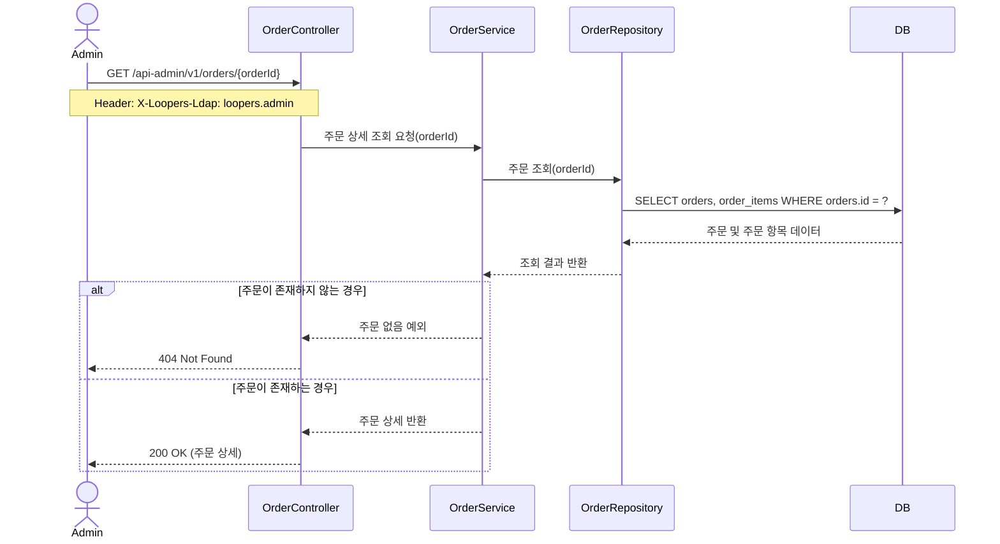

# 02. 시퀀스 다이어그램

## 1. 상품 목록 조회 시퀀스

### 목적

사용자가 브랜드 필터, 정렬 조건, 페이지 정보를 지정하여 상품 목록을 조회하는 흐름을 나타낸다.

### 다이어그램

---

## 2. 상품 상세 조회 시퀀스

### 목적

사용자가 상품 목록에서 특정 상품을 선택했을 때, 상품 상세 정보가 어떻게 조회되어 반환되는지 나타낸다.

### 다이어그램

---

## 3. 브랜드 조회 시퀀스

### 목적

사용자가 브랜드 ID로 브랜드 상세 정보를 조회하는 흐름을 나타낸다.

### 다이어그램

---

## 4. 상품 좋아요 등록 시퀀스

### 목적

사용자가 상품에 좋아요를 등록할 때, 중복 등록 없이 멱등하게 처리되는 흐름을 나타낸다.

### 다이어그램

---

## 5. 상품 좋아요 취소 시퀀스

### 목적

사용자가 좋아요를 취소할 때, 좋아요가 없는 상태에서도 오류 없이 멱등하게 처리되는 흐름을 나타낸다.

### 다이어그램

---

## 6. 주문 생성 시퀀스

### 목적

사용자가 여러 상품을 한 번에 주문 요청할 때, 재고 차감 → 포인트 차감 → 결제 요청 순서로 처리되는 흐름과 결제 실패 시 보상 처리를 나타낸다.

### 다이어그램

---

## 7. 주문 목록 조회 시퀀스

### 목적

사용자가 기간 조건으로 자신의 주문 목록을 조회하는 흐름을 나타낸다.

### 다이어그램

---

## 8. 주문 상세 조회 시퀀스

### 목적

사용자가 특정 주문의 상세 정보를 조회할 때, 본인 소유 여부를 확인하는 흐름을 나타낸다.

### 다이어그램

---

## 9. 어드민 주문 목록 조회 시퀀스

### 목적

어드민이 페이지네이션으로 전체 주문 목록을 조회하는 흐름을 나타낸다.

### 다이어그램

---

## 10. 어드민 주문 상세 조회 시퀀스

### 목적

어드민이 특정 주문의 상세 정보를 조회하는 흐름을 나타낸다.

### 다이어그램

