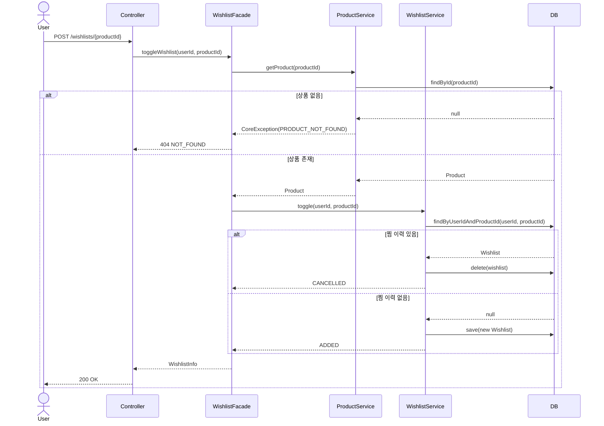
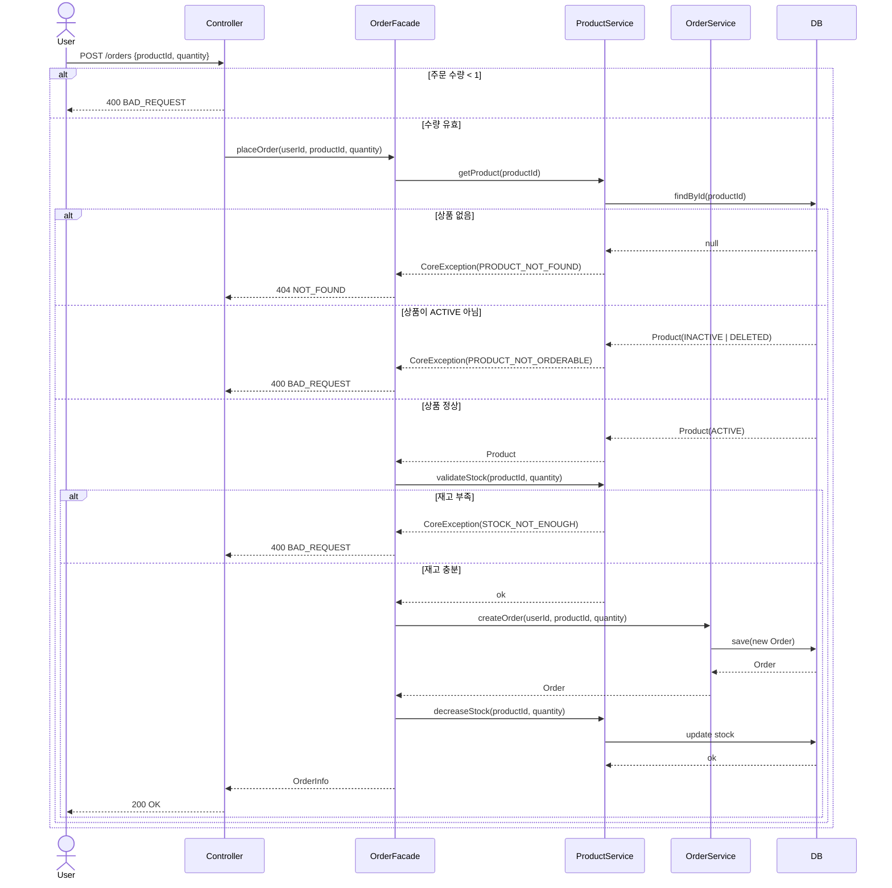
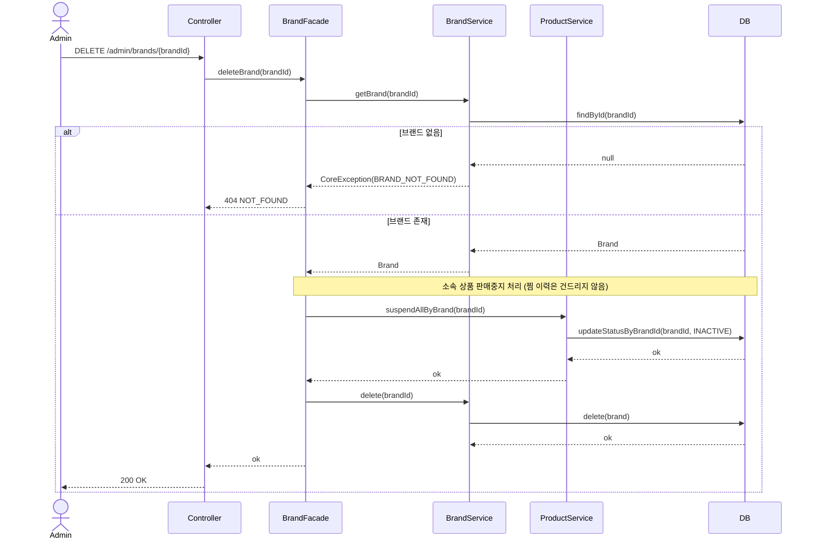
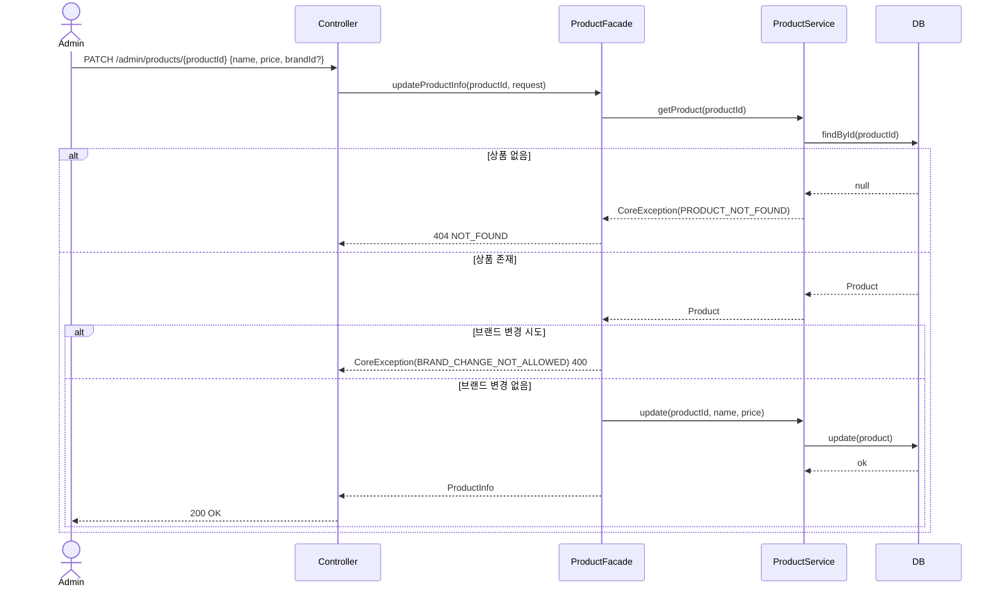
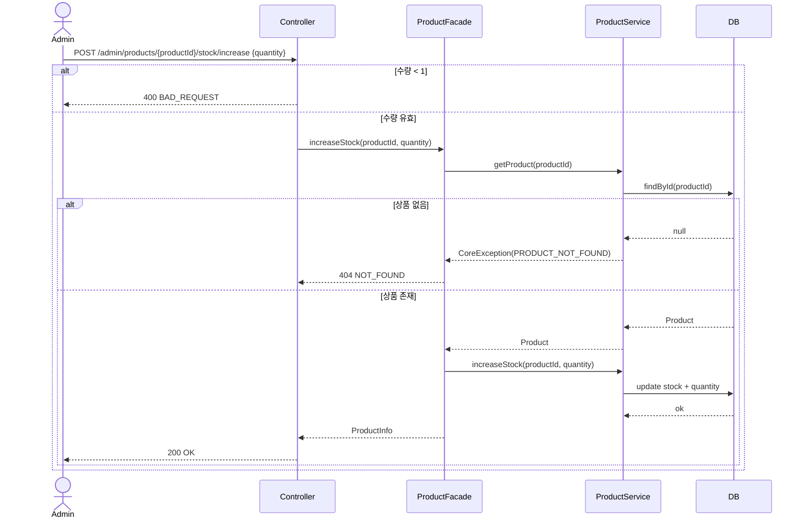
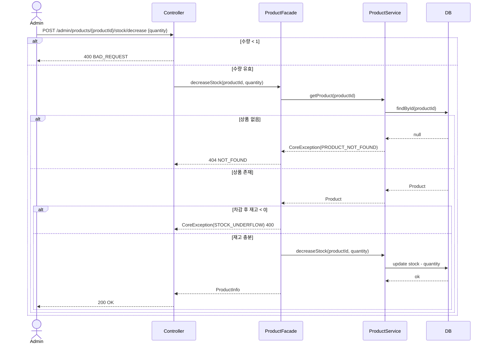

# 시퀀스 다이어그램

> 레이어 표기 규칙
> - **Controller**: interfaces/api 레이어
> - **Facade**: application 레이어
> - **Service**: domain 레이어
> - **DB**: infrastructure(Repository) 레이어

---

## UC-004: 상품 찜 / 찜 취소

---

## UC-006: 주문 요청

---

## UC-A003: 브랜드 삭제

---

## UC-A005: 상품 수정

### Main Flow — 정보 수정 (이름 / 가격)

### Alternate Flow A — 재고 추가

### Alternate Flow B — 재고 차감

