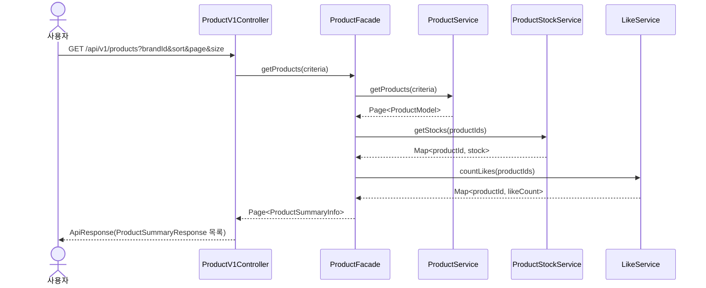
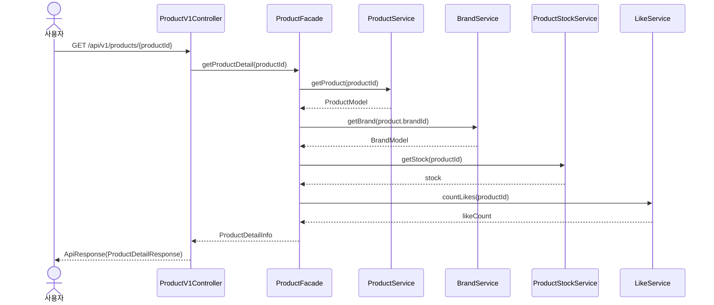
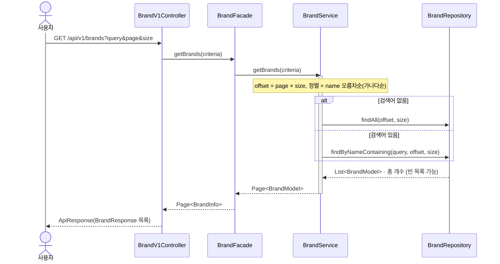
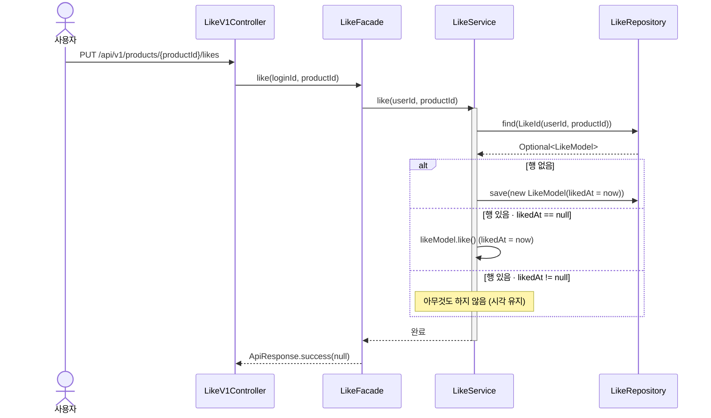
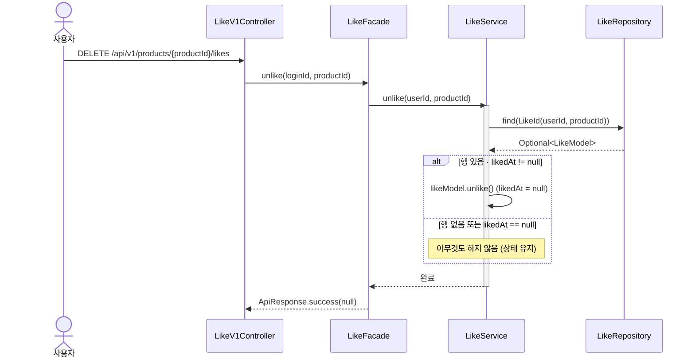
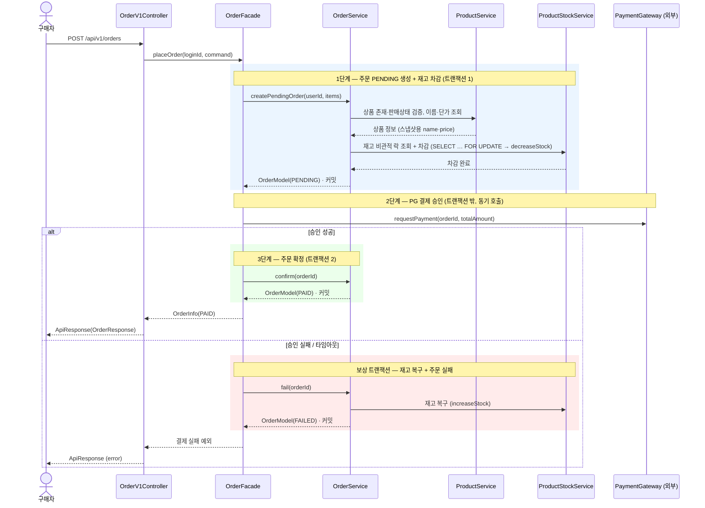

# 02. 시퀀스 다이어그램

기능별 호출 순서·책임 분리·트랜잭션 경계를 검증하기 위한 시퀀스 다이어그램이다. 모든 다이어그램은 Mermaid 문법으로 작성한다.

## F-01. 상품 목록 조회

**목적.** 목록 조회 시 좋아요 수·재고 집계가 어디서 일어나는지, 정렬 책임이 어디에 있는지 확인한다.

**흐름 해석.**
- 좋아요 수는 비정규화 컬럼이 없으므로 `LikeService`가 집계한다. 목록은 상품 N건의 카운트를 한 번에 조회해 N+1을 피한다 (`Map<productId, likeCount>`).
- 재고는 `Product`에서 분리돼 `ProductStockService`가 보유한다. 좋아요 수와 마찬가지로 상품 N건의 재고를 한 번에(`getStocks`) 조회해 N+1을 피하며, 재고 0이면 품절로 표시한다.
- 조회이므로 트랜잭션을 묶지 않는다. Facade는 무 트랜잭션, 각 서비스는 `readOnly` 트랜잭션을 자체적으로 잡는다.

## F-02. 상품 상세 조회

**목적.** 상품·브랜드·재고·좋아요 정보를 조합하는 책임이 Facade에 모이는지 확인한다.

**흐름 해석.**
- 조회는 트랜잭션을 묶을 필요가 없으므로 `ProductFacade`는 무 트랜잭션이다. 각 도메인 서비스가 `readOnly` 트랜잭션을 자체적으로 잡는다.
- 재고는 `ProductStockService`에서 따로 조회한다(`getStock`). `Product`는 이름·설명·가격만 들고, 재고가 0이면 품절로 표시한다.
- 상품 상세는 인증이 필요 없다. 좋아요 수만 노출하고 "내 좋아요 여부"는 응답에 포함하지 않는다.

## F-03. 브랜드 목록·검색 조회

**목적.** 검색어 유무 분기·정렬·페이지네이션이 어느 계층에서 일어나는지, 일치 결과가 없을 때 빈 목록으로 끝나는지 확인한다.

**흐름 해석.**
- 검색어 유무로 분기한다. 없으면 전체 브랜드를, 있으면 브랜드명이 검색어를 부분 포함하는(`name LIKE %query%`) 브랜드를 조회한다. 두 갈래 모두 같은 정렬·페이지네이션 규약을 따른다.
- 정렬은 브랜드명 오름차순(가나다순) 고정이다. 페이지네이션은 F-01과 동일한 offset 방식으로, 컨트롤러는 `page`·`size`를 받고 `BrandService`가 `offset = page × size`로 환산해 조회한다.
- 일치하는 브랜드가 없으면 `CoreException`이 아니라 빈 목록(`Page` 0건)으로 정상 응답한다. 단건 조회의 `NOT_FOUND`와 달리, 목록·검색에는 "없음"이 에러가 아니다.
- 조회이므로 트랜잭션을 묶지 않는다. Facade는 무 트랜잭션, `BrandService`는 `readOnly` 트랜잭션을 자체적으로 잡는다.

## F-04. 상품 좋아요 등록 (멱등)

**목적.** "멱등하게"가 조건 분기로 어떻게 떨어지는지, 반복 요청이 동일 결과를 내는지 확인한다.

**흐름 해석.**
- 세 갈래 모두 동일한 성공 응답으로 끝난다. "이미 좋아요" 상태에서 다시 눌러도 에러가 아니다.
- 세 번째 갈래에서 `likedAt`을 갱신하지 않는다. 멱등 정책이 "유지"이므로 관측 상태가 완전히 동일하다.
- 트랜잭션 경계는 `LikeService.like` 메서드(`@Transactional`)다. Facade는 조립만 한다.

## F-05. 상품 좋아요 취소 (멱등)

**목적.** 취소가 행 삭제가 아니라 `likedAt` 토글임을 확인한다.

**흐름 해석.**
- 취소는 행을 삭제하지 않고 `likedAt`을 `null`로 만든다. 행이 보존되므로 재등록은 UPDATE로 처리되어 복합키 충돌이 발생하지 않는다.
- 등록(F-04) 시퀀스의 거울 구조다. 멱등 분기도 대칭이다.

## F-06. 주문 생성 및 결제

**목적.** "단계 분리 + 보상 트랜잭션" 결정이 실제로 어디서 트랜잭션을 열고 닫는지, PG 호출이 트랜잭션 밖에 있는지, 그리고 존재·가격 검증(`ProductService`)과 재고 락·차감(`ProductStockService`)이 어떻게 나뉘는지 확인한다.

**흐름 해석.**
- 색칠된 박스 3개가 각각 독립된 트랜잭션이다. PG 호출(2단계)은 어느 박스에도 들어있지 않다 — 외부 호출이 커넥션을 점유하지 않도록 트랜잭션 밖에 둔다.
- `OrderFacade.placeOrder`에는 `@Transactional`이 없다. Facade는 "1단계 → PG → 분기"를 조율할 뿐이며, 트랜잭션 경계는 각 도메인 서비스 메서드가 잡는다.
- 1단계에서 주문 생성과 재고 차감을 한 트랜잭션으로 묶는다. 둘이 갈라지면 주문은 생겼는데 재고가 안 빠지는 정합성 구멍이 생긴다. `OrderService`가 `ProductService`(존재·가격)와 `ProductStockService`(재고)를 한 경계 안으로 끌어들인다.
- 존재·판매상태·단가 검증은 `ProductService`, 재고 검증·차감은 `ProductStockService`가 맡는다. 재고를 분리해 비관적 락이 `ProductStock` 행에만 걸리고, 상품 메타데이터 갱신과 같은 행을 두고 경합하지 않는다. 락은 1단계 트랜잭션이 커밋될 때까지 유지된다.
- 보상 박스는 1단계의 거울이다. 1단계가 `ProductStockService.decreaseStock`이면 보상은 `ProductStockService.increaseStock`이다.

> 한계. PG 승인은 성공했으나 3단계 `confirm` 트랜잭션이 실패하면, 결제는 됐는데 주문은 `PENDING`에 멈춘다. 보상으로 메우지 못하는 구간이며, `PENDING` 장기 방치 주문에 대한 별도 정리 정책이 필요하다.