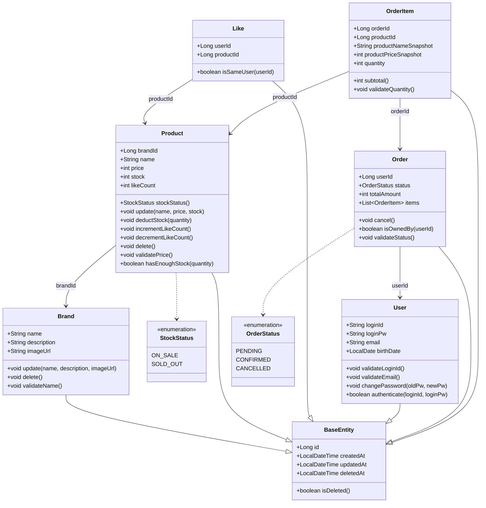
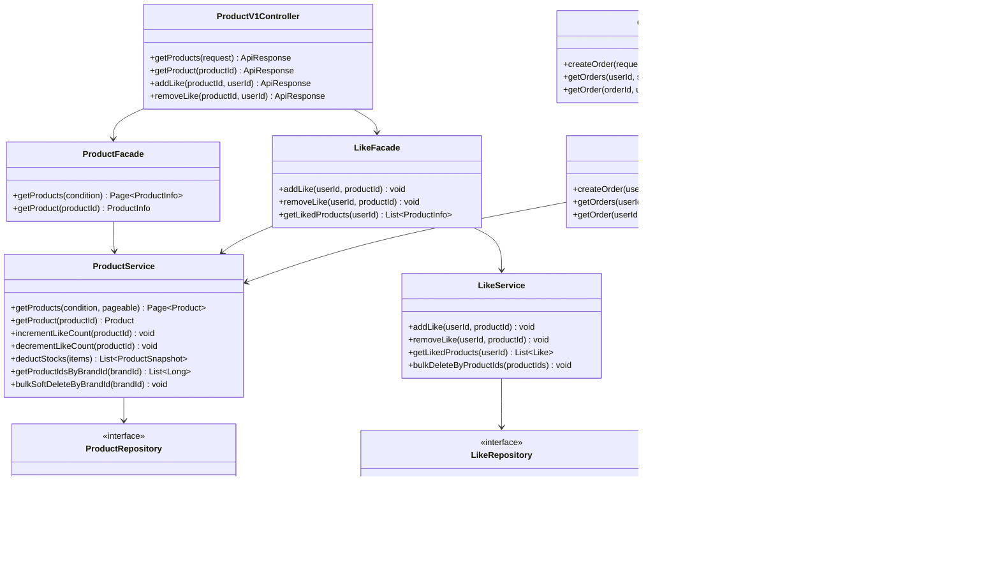

# 03. 클래스 다이어그램

---

## 왜 이 다이어그램이 필요한가?

시퀀스 다이어그램에서 호출 흐름을 확인했다면, 클래스 다이어그램에서는
**각 도메인 객체의 책임, 속성, 의존 방향**을 검증한다.

검증 목표:
- 도메인 객체 간 의존이 단방향으로 흐르는가?
- `OrderItem`의 스냅샷 필드가 도메인 객체와 분리되어 있는가?
- `Like`와 `Product.likeCount`의 관계가 구조상 드러나는가?
- 레이어(Controller → Facade → Service → Repository)가 일관되게 분리되어 있는가?

---

## 도메인 클래스 다이어그램

---

### 읽는 법 — 포인트 3가지

1. **`OrderItem`의 스냅샷 필드** — `productNameSnapshot`, `productPriceSnapshot`은 주문 시점의 상품 정보를 복사한 값이다. `productId`는 참조용으로 남아 있지만, 조회 시에는 스냅샷 필드를 우선 사용한다. 상품이 수정되거나 Soft Delete되어도 주문 내역은 영향받지 않는 이유가 여기 있다.

2. **`Product.likeCount`는 Product 도메인이 관리** — `incrementLikeCount()` / `decrementLikeCount()` 메서드가 Product 안에 있다. 즉, 카운트 변경의 주체는 Product 객체 자신이며, LikeService는 ProductService를 통해 이 메서드를 호출한다. Like 도메인이 Product 테이블을 직접 조작하지 않는 구조다.

3. **의존 방향은 단방향** — `Product → Brand`, `Like → Product`, `Order → User`, `OrderItem → Order/Product` 로 흐른다. 역방향 참조(Brand가 Product 목록을 들고 있는 등)는 없다. 조회가 필요한 경우 Repository에서 처리한다.

---

## 레이어 구조 다이어그램

---

### 읽는 법 — 포인트 3가지

1. **Facade가 트랜잭션 경계** — `OrderFacade`에 `@Transactional`을 두고 `ProductService.deductStocks()`와 `OrderService.createOrder()`를 순차 호출한다. `OrderService`가 `ProductService`를 직접 호출하면 서비스 간 강한 결합이 생기므로, Facade가 두 서비스를 조합하는 역할을 맡는다.

2. **`LikeFacade`도 `ProductService`를 직접 참조** — 좋아요 등록/취소 시 `likeCount` 변경이 필요하기 때문이다. Like 도메인과 Product 도메인 간 결합이 Facade 레벨에서만 발생하고, Service 레이어끼리는 직접 의존하지 않는다.

3. **Repository는 인터페이스** — 구현체(`JpaRepository`, `QueryDSL`)는 infrastructure 레이어에 위치하고, domain 레이어는 인터페이스만 바라본다. 이 경계 덕분에 테스트 시 가짜 구현체(Fake)로 교체가 가능하다.

---

## 잠재 리스크

| 리스크 | 설명 | 선택지 |
|--------|------|--------|
| **Facade @Transactional 범위** | `OrderFacade`에 트랜잭션을 두면 `ProductService.deductStocks()`와 `OrderService.createOrder()` 전체가 하나의 커넥션을 점유한다. 외부 API 호출이 추가되면 커넥션 점유 시간이 길어진다 | 현재: 단순 DB 작업만이므로 허용 범위 / 향후 결제 API 연동 시: 재고 차감과 결제를 별도 트랜잭션으로 분리 |
| **배치 락 순서** | `findAllByIdsWithLock`에서 `ORDER BY id`로 락 순서를 고정하지 않으면 데드락 발생 | Repository 구현 시 반드시 `ORDER BY id ASC` 포함 |
| **likeCount 정합성** | 동시 좋아요 요청 시 `like_count` 컬럼 경합 발생 가능 | A. 현재: DB UPDATE로 단순 처리 / B. 향후: Redis 카운터로 외부화 |
| **OrderItem의 productId 참조** | Soft Delete된 상품의 productId가 OrderItem에 남아 있어 JOIN 시 주의 필요 | 조회 시 스냅샷 필드 우선 사용, productId는 통계/추적 용도로만 활용 |
| **브랜드 삭제 시 likes 정리** | Brand → Product → Like의 연쇄 삭제를 Facade가 명시적으로 처리하지 않으면 유령 likes 데이터가 남는다 | `BrandAdminFacade`에서 likes 벌크 삭제 → 상품 벌크 Soft Delete → 브랜드 Soft Delete 순서를 강제 |
