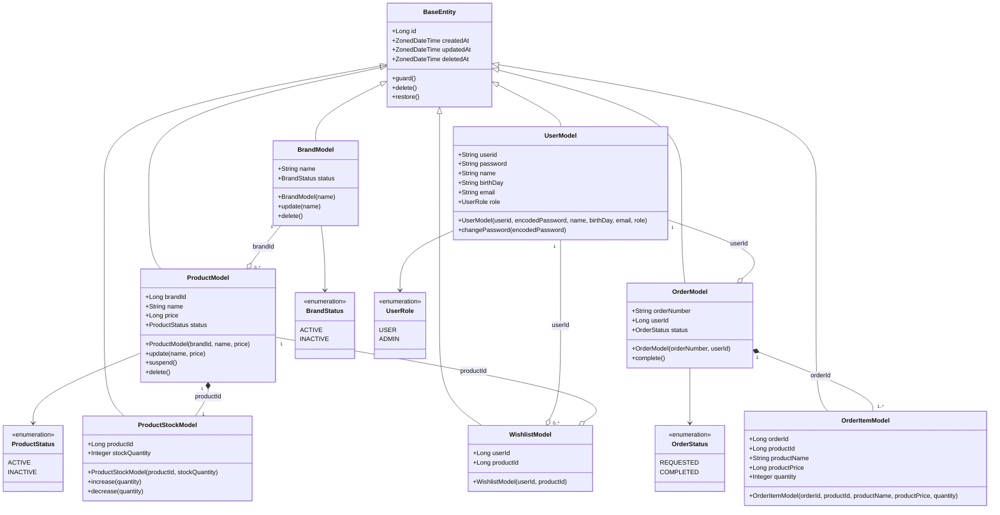

# 도메인 클래스 다이어그램

> 설계 기준
> - 모든 Model은 `BaseEntity`를 상속한다
> - 도메인 유효성 검증은 생성자에서 수행한다 (`CoreException` throw)
> - Soft Delete는 `BaseEntity.deletedAt`으로 처리한다
> - 상태 전이는 Model 내부 메서드로만 수행한다

---



---

## 도메인 규칙 (생성자 검증)

### BrandModel
| 필드 | 규칙 |
|------|------|
| name | null 불허, 2글자 이상 |
| status | 생성 시 `ACTIVE` 고정 |

### ProductModel
| 필드 | 규칙 |
|------|------|
| brandId | null 불허, 등록 후 변경 불가 |
| name | null 불허, 2글자 이상 |
| price | null 불허, 0 이상 |
| status | 생성 시 `ACTIVE` 고정 |

### ProductStockModel
| 필드 | 규칙 |
|------|------|
| productId | null 불허, 상품 생성 시 함께 생성, 변경 불가 |
| stockQuantity | null 불허, 0 이상 |

### OrderModel
| 필드 | 규칙 |
|------|------|
| orderNumber | 주문 생성 시 자동 발급. 포맷: `ORD-YYYYMMDD-NNNN` (일별 시퀀스). 유니크 제약 |
| userId | null 불허 |
| status | 생성 시 `REQUESTED` 고정. 결제 승인(`APPROVED`) 후 `COMPLETED`로 전이 |

### OrderItemModel
| 필드 | 규칙 |
|------|------|
| orderId | null 불허 |
| productId | null 불허 (상품 삭제 후에도 이력 보존용으로 유지) |
| productName | 주문 시점 상품명 스냅샷 |
| productPrice | 주문 시점 단가 스냅샷 |
| quantity | 1 이상 |

### WishlistModel
| 필드 | 규칙 |
|------|------|
| userId | null 불허 |
| productId | null 불허 |
| (userId, productId) | 유니크 제약 |

---

## 상태 전이

### BrandStatus
```
ACTIVE → INACTIVE : delete()
```

### ProductStatus
```
ACTIVE → INACTIVE : suspend()   (브랜드 삭제 시 연쇄)
ACTIVE → INACTIVE : delete()    (관리자 직접 삭제)
```

### OrderStatus
```
REQUESTED → COMPLETED : complete()
```
