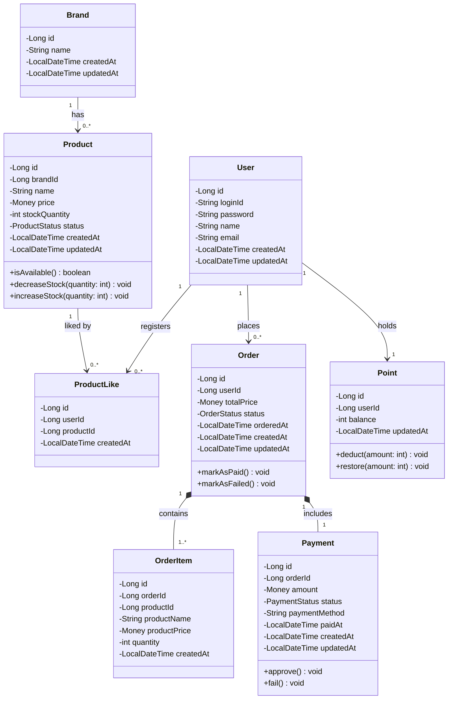

# 03. 클래스 다이어그램

## 1. 개요

본 문서는 이커머스 서비스를 구성하는 핵심 도메인 객체와 객체 간 관계를 정리한다.

단순 DB 컬럼 나열이 아니라 각 객체의 책임과 행위를 중심으로 작성하며, UML 2.5 표기법을 따른다.

| 표기 | 의미 |
| --- | --- |
| `+` | public |
| `-` | private |
| `*--` | Composition (생명주기 종속) |
| `-->` | Association (단방향 참조) |
| `..>` | Dependency (사용 관계) |
| `<<enumeration>>` | 열거형 |

---

## 2. 핵심 도메인 객체

| 객체 | 설명 |
| --- | --- |
| `User` | 서비스를 사용하는 일반 사용자 |
| `Brand` | 상품이 속한 브랜드 |
| `Product` | 판매 상품. 재고 관리와 판매 상태 판단의 책임을 가진다 |
| `ProductLike` | 사용자와 상품 간의 좋아요 관계를 표현하는 객체 |
| `Order` | 사용자가 생성한 주문. 상태 전이를 관리한다 |
| `OrderItem` | 주문 당시의 상품 정보를 스냅샷으로 저장하는 주문 항목 |
| `Payment` | 주문에 대한 결제 정보를 표현하는 객체 |
| `Point` | 사용자의 포인트 잔액과 차감·복구 책임을 가지는 객체 |
| `Money` | 금액을 표현하는 값 객체(VO). ID가 없고 값으로 동등성을 판단한다 |

---

## 3. 클래스 다이어그램

---

## 4. 객체별 책임

### User

서비스를 이용하는 일반 사용자를 표현하는 객체이다.

#### 주요 책임

- 로그인 ID와 비밀번호로 사용자를 식별한다.
- 요청 헤더(`X-Loopers-LoginId`, `X-Loopers-LoginPw`)를 통해 식별된다.
- 타 사용자의 주문·좋아요 정보에 직접 접근할 수 없다.

#### 주요 속성

| 속성 | 타입 | 설명 |
| --- | --- | --- |
| id | Long | 사용자 ID |
| loginId | String | 로그인 ID |
| password | String | 비밀번호 |
| name | String | 사용자명 |
| email | String | 이메일 |

---

### Brand

상품이 속한 브랜드를 표현하는 객체이다.

#### 주요 책임

- 브랜드명 정보를 제공한다.
- 브랜드 삭제 시 해당 브랜드의 모든 상품도 함께 삭제된다.

#### 주요 속성

| 속성 | 타입 | 설명 |
| --- | --- | --- |
| id | Long | 브랜드 ID |
| name | String | 브랜드명 |

---

### Product

판매 상품을 표현하는 핵심 도메인 객체이다.

#### 주요 책임

- 상품명, 가격, 재고 수량, 판매 상태를 관리한다.
- 판매 가능 여부를 판단한다 (`isAvailable`).
- 주문 생성 시 재고를 차감한다 (`decreaseStock`).
- 결제 실패 시 재고를 복구한다 (`increaseStock`).
- 재고 수량은 0 미만이 될 수 없다.

#### 주요 속성

| 속성 | 타입 | 설명 |
| --- | --- | --- |
| id | Long | 상품 ID |
| brandId | Long | 브랜드 ID |
| name | String | 상품명 |
| price | int | 상품 가격 |
| stockQuantity | int | 재고 수량 (0 이상) |
| status | ProductStatus | 판매 상태 |

#### ProductStatus

| 값 | 설명 |
| --- | --- |
| ON_SALE | 판매 중 |
| SOLD_OUT | 품절 |
| DISCONTINUED | 판매 중단 |

---

### ProductLike

사용자와 상품 간의 좋아요 관계를 표현하는 객체이다.

#### 주요 책임

- 특정 사용자가 특정 상품에 좋아요를 등록한 사실을 기록한다.
- `(userId, productId)` 조합은 유일하다. 동일한 사용자가 동일한 상품에 중복 등록할 수 없다.

#### 주요 속성

| 속성 | 타입 | 설명 |
| --- | --- | --- |
| id | Long | 좋아요 ID |
| userId | Long | 사용자 ID |
| productId | Long | 상품 ID |
| createdAt | LocalDateTime | 등록 일시 |

---

### Order

사용자가 생성한 주문을 표현하는 객체이다.

#### 주요 책임

- 주문 총액과 현재 상태를 관리한다.
- 결제 성공 시 상태를 PAID로 전이한다 (`markAsPaid`).
- 결제 실패 시 상태를 FAILED로 전이한다 (`markAsFailed`).
- 주문 항목(`OrderItem`)의 생명주기를 책임진다. 주문이 삭제되면 항목도 함께 삭제된다.

#### 주요 속성

| 속성 | 타입 | 설명 |
| --- | --- | --- |
| id | Long | 주문 ID |
| userId | Long | 사용자 ID |
| totalPrice | int | 주문 총액 |
| status | OrderStatus | 주문 상태 |
| orderedAt | LocalDateTime | 주문 일시 |

#### OrderStatus

| 값 | 설명 |
| --- | --- |
| PENDING | 결제 대기 중 (주문 저장 직후) |
| PAID | 결제 완료 |
| FAILED | 결제 실패 |

---

### OrderItem

주문 당시 상품 정보를 스냅샷으로 저장하는 객체이다.

#### 주요 책임

- 주문 시점의 상품명과 가격을 별도로 저장한다. 이후 상품 정보가 변경되어도 주문 당시 정보는 유지된다.
- Order의 Composition 구성 요소로, Order 없이는 존재하지 않는다.

#### 주요 속성

| 속성 | 타입 | 설명 |
| --- | --- | --- |
| id | Long | 주문 항목 ID |
| orderId | Long | 주문 ID |
| productId | Long | 상품 ID (참조용) |
| productName | String | 주문 당시 상품명 (스냅샷) |
| productPrice | Money | 주문 당시 상품 가격 (스냅샷) |
| quantity | int | 주문 수량 |

---

### Payment

주문에 대한 결제 정보를 표현하는 객체이다.

#### 주요 책임

- 외부 결제 게이트웨이 연동 결과를 기록한다.
- 결제 승인 시 상태를 APPROVED로 전이한다 (`approve`).
- 결제 실패 시 상태를 FAILED로 전이한다 (`fail`).
- Order의 Composition 구성 요소로, 하나의 주문에 하나의 결제만 존재한다.

#### 주요 속성

| 속성 | 타입 | 설명 |
| --- | --- | --- |
| id | Long | 결제 ID |
| orderId | Long | 주문 ID |
| amount | Money | 결제 금액 |
| status | PaymentStatus | 결제 상태 |
| paymentMethod | String | 결제 수단 |
| paidAt | LocalDateTime | 결제 완료 일시 |

#### PaymentStatus

| 값 | 설명 |
| --- | --- |
| PENDING | 결제 요청 전 |
| APPROVED | 결제 승인 |
| FAILED | 결제 실패 |

---

### Point

사용자의 포인트 잔액과 차감·복구 책임을 가지는 객체이다.

#### 주요 책임

- 사용자의 포인트 잔액을 관리한다.
- 주문 생성 시 포인트를 차감한다 (`deduct`).
- 결제 실패 시 차감된 포인트를 복구한다 (`restore`).
- 잔액은 0 미만이 될 수 없다.

#### 주요 속성

| 속성 | 타입 | 설명 |
| --- | --- | --- |
| id | Long | 포인트 ID |
| userId | Long | 사용자 ID |
| balance | int | 포인트 잔액 (0 이상) |

---

### Money

금액을 표현하는 값 객체(Value Object)이다.

#### 주요 책임

- `int` 타입 금액 값을 감싸 의미를 명확히 한다.
- 금액이 양수인지 검증한다 (`isPositive`).
- 두 금액을 합산한다 (`add`).
- ID가 없으며, 값이 같으면 동일한 객체로 취급한다.

#### 주요 속성

| 속성 | 타입 | 설명 |
| --- | --- | --- |
| amount | int | 금액 (0 이상) |

#### 사용처

| 객체 | 속성 | 설명 |
| --- | --- | --- |
| Product | price | 상품 판매 가격 |
| Order | totalPrice | 주문 총액 |
| OrderItem | productPrice | 주문 당시 상품 가격 스냅샷 |
| Payment | amount | 결제 금액 |

---

## 5. 주요 설계 판단

### OrderItem은 Product와 Composition이 아닌 Dependency 관계이다

`OrderItem`은 `productId`를 참조하지만, 주문 당시 상품명과 가격을 별도 컬럼(`productName`, `productPrice`)에 스냅샷으로 저장한다. 이후 상품이 수정되거나 삭제되어도 주문 항목의 정보는 변경되지 않는다. 따라서 `OrderItem`과 `Product`의 관계는 런타임 Association이 아니라 생성 시점의 Dependency(`..>`)로 표현하는 것이 적합하다.

### Order와 OrderItem은 Composition 관계이다

`OrderItem`은 특정 `Order`에 종속되는 객체이다. 주문이 삭제되면 주문 항목도 함께 삭제된다. 이처럼 생명주기가 완전히 종속되는 경우 UML 2.5 Composition(`*--`)으로 표현한다.

### Order와 Payment도 Composition 관계이다

`Payment`는 특정 `Order`에 종속된다. 하나의 주문에는 하나의 결제만 존재하며, 주문 삭제 시 결제 정보도 함께 삭제된다. 생명주기 종속이므로 Composition으로 표현한다.

### Point는 User와 별개의 도메인 객체이다

포인트 차감과 복구는 주문 생성 흐름에서 `PointService`가 독립적으로 처리한다. 포인트 정책(잔액 검증, 차감 한도 등)이 변경될 때 `User` 객체에 영향을 주지 않도록 `Point`를 별도 객체로 분리한다.

### Money는 int가 아닌 VO로 분리한다

`price`, `amount`, `totalPrice`를 `int`로 표현하면 단위 오류(원 vs 달러), 음수 허용 등의 오용 가능성이 생긴다. `Money` VO로 감싸면 유효성 검증과 금액 연산을 한 곳에서 관리할 수 있고, 코드에서 금액 개념이 명확해진다. `Money`는 ID가 없고 값으로 동등성을 판단하므로 UML 2.5 `<<Value Object>>` 스테레오타입으로 표현한다.
