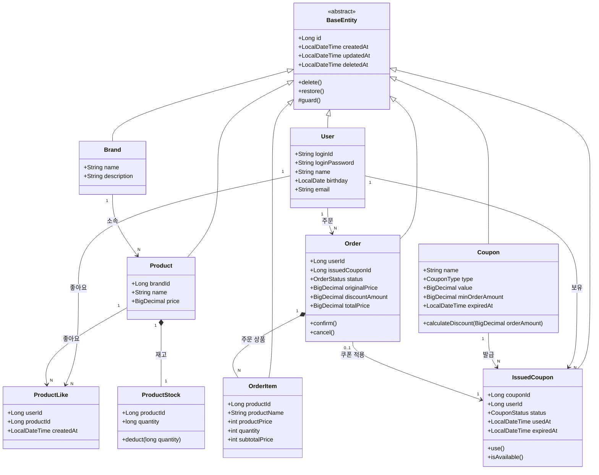

# 클래스 다이어그램

## 도메인 모델 관계도

---

## 도메인 객체 설명

### Brand & Product

  - `Brand` 브랜드 정보 보유. 삭제 시 소속 `Product` 전체가 함께 Soft Delete
- `Product`는 `brandId`로 `Brand`를 참조. 직접 객체 참조 대신 ID 참조 사용

---

### ProductStock

`Product`와 1:1로 대응되는 재고 모델. 재고는 주문마다 빈번하게 갱신되므로 `ProductStock`에만 비관적 락을 적용해 락 범위를 최소화

- `deduct(quantity)` — 재고 차감. 차감 후 수량이 0 미만이면 `CoreException`을 던짐

---

### ProductLike

유저 - 상품 좋아요 관계 표현.

- 등록 시 이미 존재하면 무시, 취소 시 존재하지 않으면 무시 — **멱등성**은 `LikeService`에서 존재 여부를 확인 후 분기 처리

---

### Order & OrderItem

- `Order`는 주문 단위. `status`는 `PENDING → CONFIRMED → CANCELED` 흐름
- `OrderItem`은 주문 시점의 상품명·가격을 스냅샷으로 저장. `Product` 정보가 변경되어도 주문 내역은 영향받지 않음.

---

### OutboxEvent

주문 완료 후 외부 시스템 연동을 위한 트랜잭션 아웃박스. 주문 생성 트랜잭션 내에서 함께 저장되어 이벤트 유실을 방지.

- `PENDING` 상태의 이벤트를 폴링해 처리 후 상태를 `PROCESSED`로 전환.

---

### Coupon & IssuedCoupon

- `Coupon`은 어드민이 정의하는 쿠폰 마스터. `FIXED`(정액) / `RATE`(정률) 두 가지 타입 존재.
  - `calculateDiscount(orderAmount)` — 타입에 따라 할인 금액 계산. 최소 주문 금액 조건 미충족 시 예외 발생.
- `IssuedCoupon`은 `Coupon`을 기반으로 유저에게 발급된 인스턴스. 1회 사용 후 재사용 불가.
  - `use()` — 상태를 `USED`로 변경. 이미 사용되었거나 만료된 경우 `CoreException` 발생.
  - `isAvailable()` — `AVAILABLE`이고 `expiredAt`이 현재 시각 이후인지 확인.
- `Order`는 `issuedCouponId`를 통해 사용된 쿠폰을 참조하며, 쿠폰 적용 전 금액(`originalPrice`), 할인 금액(`discountAmount`), 최종 결제 금액(`totalPrice`)을 스냅샷으로 보유.
