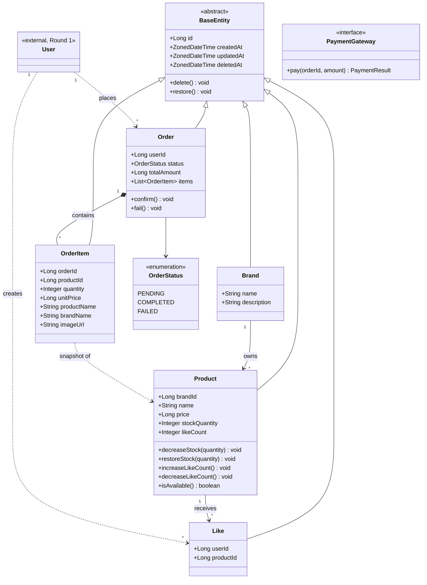

# 03. 도메인 클래스 다이어그램

본 문서는 Round 2 설계 범위의 도메인 클래스 구조를 정리한다.
디테일한 필드/타입/제약은 [04-erd.md](./04-erd.md)에서 다루고, 본 문서는 **책임 분리, 의존 방향, 응집도**에 집중한다.

---

## 1. 전체 다이어그램

---

## 2. 클래스별 책임

| 클래스 | 책임 |
|---|---|
| **BaseEntity** | 모든 엔티티의 공통 메타 필드(id, createdAt, updatedAt, deletedAt) + soft delete 동작 (`delete()`, `restore()`). 멱등하게 동작한다. |
| **User** | Round 1에서 구현된 사용자 도메인. 본 라운드는 `userId`로 참조만 한다 (외부). |
| **Brand** | 브랜드 정보 보유. 상품을 소유한다. |
| **Product** | 상품 정보 + **재고 관리** + **좋아요 수 캐시 유지** + **노출용 가용성 판단**. 상태 변경 책임을 도메인 객체에 응집시켜 Service에서 setter를 직접 호출하지 않게 한다. |
| **Like** | 사용자-상품 좋아요 기록. `(userId, productId)` 조합이 unique. |
| **Order** | 주문 집계 루트. 자기 상태 전이(`confirm`, `fail`)와 OrderItem 컬렉션 소유. |
| **OrderItem** | 주문 시점의 상품 정보를 **스냅샷으로 박제** 보관. Product의 변경/삭제에 영향받지 않는다. |
| **OrderStatus** | 주문 상태값 enum (`PENDING`/`COMPLETED`/`FAILED`). |
| **PaymentGateway** | 외부 결제 호출 추상화 (Port). 실제 구현(Adapter)은 인프라 계층. |

---

## 3. 관계 설명

### 상속

| 관계 | 의미 |
|---|---|
| `BaseEntity <\|-- 각 엔티티` | 모든 도메인 엔티티는 공통 메타 필드와 soft delete 동작을 상속받는다. |

### 도메인 간 관계

| 관계 | 화살표 | 의미 |
|---|---|---|
| `Brand → Product` | 1:N Association (단방향) | 한 브랜드에 여러 상품. Product가 `brandId` 보유. 양방향 매핑은 JPA 복잡도가 커져서 단방향으로 충분. |
| `Product → Like` | 1:N Association (단방향) | 한 상품에 여러 좋아요. Like가 `productId` 보유. `likeCount` 캐시 컬럼으로 응집. |
| `Order ◆— OrderItem` | 1:N **Composition** | OrderItem은 Order 없이 존재 불가. Order 삭제 시 함께 사라짐 (`cascade=ALL, orphanRemoval=true`). |
| `Order → OrderStatus` | enum 참조 | 상태 전이는 Order의 메서드(`confirm`, `fail`)로만 가능. status setter 직접 노출 X. |
| `OrderItem ⇢ Product` | **Dependency (스냅샷)** | OrderItem이 Product 객체를 직접 참조하지 X. 주문 시점 데이터(`productName`, `unitPrice` 등)를 자기 안에 복사 보관. |
| `User ⇢ Like, User ⇢ Order` | Dependency (ID 참조) | Like/Order는 `userId`만 보유. User 객체 자체에 대한 참조 X. 도메인 간 결합도 낮춤. |

### 화살표 종류 한눈에

| 화살표 | Java 코드 형태 | 의미 |
|---|---|---|
| `<\|--` | `extends BaseEntity` | 상속 |
| `*--` | `private List<OrderItem> items` (강한 소유) | Composition |
| `-->` | `private SomeEntity field` | Association (객체 참조) |
| `..>` | `private Long someId` (ID만) 또는 메서드 인자 | Dependency (약한 의존) |

---

## 4. 봐야 할 포인트

1. **도메인 책임 응집** — Product가 `decreaseStock`, `increaseLikeCount`, `isAvailable` 등을 직접 들고 있다. Service가 setter로 필드를 직접 건드리지 않는다.
2. **스냅샷 패턴** — OrderItem이 Product를 참조하지 않고 데이터를 복사 보관. 주문 내역의 불변성 보장.
3. **외부 의존 추상화** — PaymentGateway는 인터페이스. 도메인은 외부 PG 구현을 모른다. 테스트 시 `FakePaymentGateway`로 교체 가능.
4. **상태 전이 캡슐화** — Order의 status는 외부에서 직접 못 바꾸고, `confirm()`/`fail()` 메서드만 노출.
5. **외부 도메인 ID 참조** — User는 외부라 객체가 아닌 ID(`userId`)로만 연결. 도메인 간 결합도 최소화.

---

## 5. 잠재 리스크

- **`Brand → Product` 단방향의 한계**: 브랜드에서 "내 상품 목록"을 가져오려면 별도 Repository 호출 필요. 양방향 매핑은 JPA 복잡도가 크니 단방향이 현실적 선택. 양방향 매핑이 필요한 비즈니스 요구가 생기면 그때 결정.
- **`Product.likeCount` 캐시 컬럼 정합성**: 실제 `Like` 행 수와 어긋날 가능성. 좋아요 등록/취소와 같은 트랜잭션 내에서 처리하여 방어. 고동시성 상황에서의 row lock 경합은 다음 라운드 학습 주제.
- **`Order.totalAmount` 중복 저장**: OrderItem의 `unitPrice * quantity` 합과 같아야 함. 생성 시점에 계산하여 저장한 뒤 불변 처리. 정합성 깨질 가능성 차단.
- **OrderItem 스냅샷 누락 위험**: 신규 표시 정보(예: 할인가, 옵션명)가 추가되면 스냅샷 컬럼도 함께 추가해야 함. 누락하면 과거 주문 화면이 깨질 수 있음.
- **PaymentGateway 인터페이스 변경 비용**: 외부 PG가 바뀌면 Port 시그니처도 영향. Port를 단순하게 유지하여 변경 비용 최소화.
