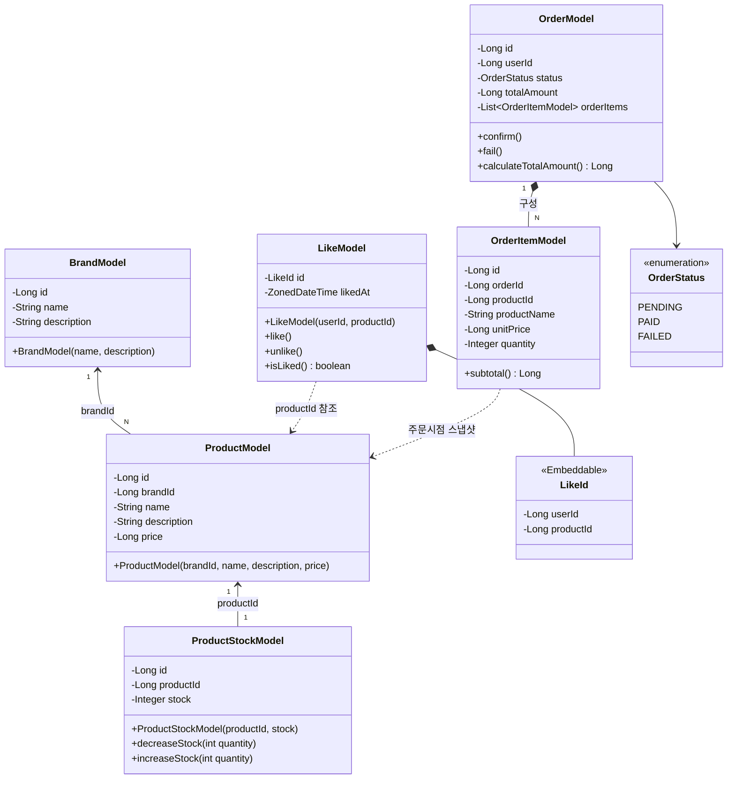
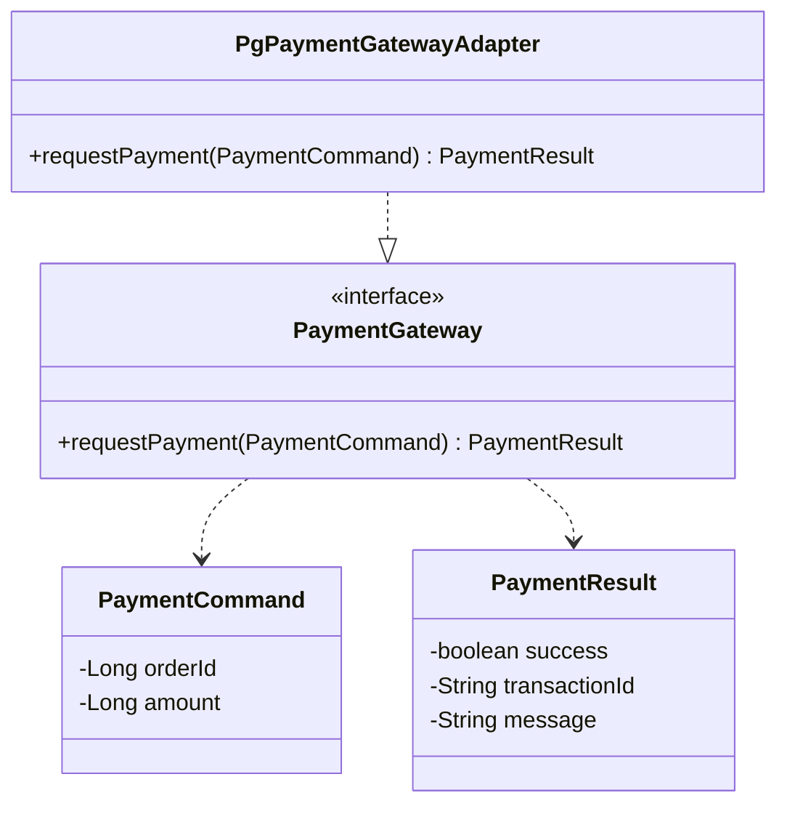
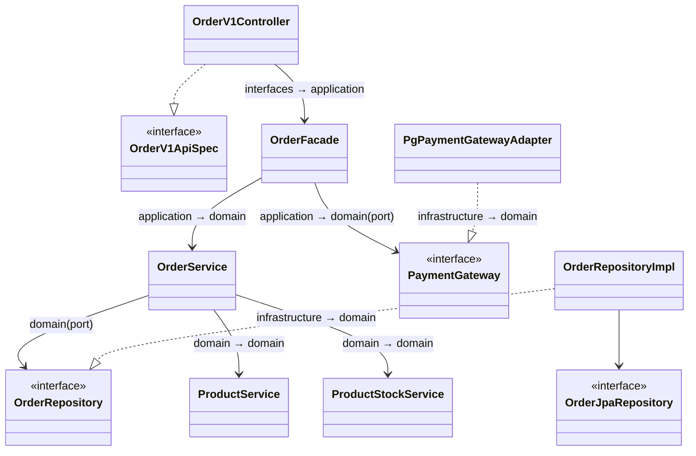

# 03. 클래스 다이어그램

도메인 객체의 책임·관계·의존 방향을 검증하기 위한 클래스 다이어그램이다. 모든 다이어그램은 Mermaid 문법으로 작성한다.

## 1. 도메인 모델

**목적.** 도메인 모델들이 서로를 어떻게 참조하는지, "재고 차감"·"상태 전이" 같은 행위가 어느 모델의 책임인지 확인한다.

**구조 해석.**
- 화살표는 전부 한 방향이다. `Product → Brand`, `ProductStock → Product`, `Like → Product`, `OrderItem → Product`. 참조당하는 쪽(Brand, Product)은 누구도 알지 못한다. 도메인 결합이 단방향이라 한 도메인 변경이 역방향으로 번지지 않는다.
- `ProductStockModel`은 `ProductModel`에서 재고를 떼어낸 1:1 모델이다. `Product`는 이름·설명·가격(거의 안 변함)을, `ProductStock`은 재고(주문마다 변함)를 든다. 변경 빈도와 비관적 락 경합 범위를 분리하려는 의도다.
- `LikeModel`은 `BaseEntity`를 상속하지 않는다. `@EmbeddedId LikeId(userId, productId)`를 PK로 가지며, `likedAt`은 "좋아요한 시각"이자 "현재 좋아요 여부" 플래그를 겸한다.
- `OrderItemModel`은 `ProductModel`을 런타임에 들고 있지 않다. 주문 시점의 `productName`·`unitPrice`를 복사(스냅샷)한다. 점선(`..>`)이 그 의도다 — 상품가가 바뀌어도 과거 주문 금액은 불변이다.
- 행위가 모델 안에 있다. 재고 차감은 `ProductStockModel.decreaseStock`, 상태 전이는 `OrderModel.confirm/fail`이다. invariant 검증은 모델 책임이며, Service는 트랜잭션과 조율만 한다.

## 2. 외부 연동 포트

**목적.** PG 연동이 도메인 안의 포트 인터페이스로 추상화되고, 구현(어댑터)이 `infrastructure`에 위치하는지 확인한다.

**구조 해석.**
- `PaymentGateway`는 `domain.order`의 포트 인터페이스다. 도메인은 "결제를 요청한다"는 계약만 알고, 어떤 PG인지는 모른다.
- `PgPaymentGatewayAdapter`는 `infrastructure.order`의 어댑터다. 의존 화살표가 어댑터 → 인터페이스 방향(`..|>`)이므로 의존성 역전이 지켜진다.

## 3. 계층 의존 구조 (Order 슬라이스 예시)

**목적.** 5계층(interfaces → application → domain ← infrastructure) 의존 방향이 지켜지는지 확인한다.

**구조 해석.**
- `domain`(OrderService, OrderRepository, PaymentGateway)은 어떤 화살표도 밖으로 내보내지 않는다. `infrastructure`의 구현체들이 `domain`의 인터페이스를 향해 들어온다 — 의존 방향이 항상 `domain`을 가리킨다.
- `OrderFacade`는 `OrderService`와 `PaymentGateway`를 조율한다. 트랜잭션은 `OrderService`가 잡고, Facade는 무 트랜잭션이다.
- `OrderService`는 `ProductService`(존재·가격)와 `ProductStockService`(재고 차감)를 함께 호출한다. 둘은 별도 슬라이스가 아니라 같은 `product` 슬라이스 안의 도메인 서비스이며(재고는 상품에 종속적), 주문 생성과 재고 차감을 한 트랜잭션으로 묶기 위한 의존이다.
- 표준 파일 구성은 다른 도메인(Brand, Product, Like)에도 동일하게 적용된다 — `interfaces.api.{도메인}`, `application.{도메인}`, `domain.{도메인}`, `infrastructure.{도메인}`. `ProductStock`의 모델·서비스·리포지토리는 새 슬라이스가 아니라 `product` 슬라이스 안에 함께 둔다.