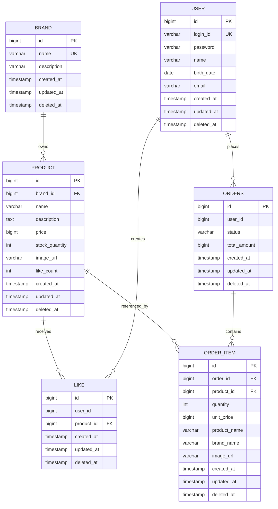

# 04. ERD

본 문서는 Round 2 설계 범위 도메인의 테이블 구조와 관계를 정의한다.
도메인 책임/관계는 [03-class-diagram.md](./03-class-diagram.md), 동작 흐름은 [02-sequence-diagrams.md](./02-sequence-diagrams.md) 참고.

---

## 1. 전체 ERD

> **참고**: `order`, `like`는 SQL 예약어라 실제 테이블명은 `orders`, `likes`로 사용. Mermaid 그림에서는 대문자 표기.

---

## 2. 테이블별 상세

### 2.1 user (Round 1, 외부 도메인)

| 컬럼 | 타입 | 제약 | 설명 |
|---|---|---|---|
| id | BIGINT | PK, AUTO_INCREMENT | |
| login_id | VARCHAR(50) | NOT NULL, UNIQUE | 로그인 ID |
| password | VARCHAR(255) | NOT NULL | 인코딩된 비밀번호 |
| name | VARCHAR(50) | NOT NULL | |
| birth_date | DATE | NULL | |
| email | VARCHAR(100) | NULL | |
| created_at, updated_at, deleted_at | TIMESTAMP | | BaseEntity 공통 |

본 라운드는 참조만. 회원가입/내정보/비번 변경은 Round 1에서 구현됨.

### 2.2 brand

| 컬럼 | 타입 | 제약 | 설명 |
|---|---|---|---|
| id | BIGINT | PK, AUTO_INCREMENT | |
| name | VARCHAR(50) | NOT NULL, UNIQUE | 브랜드명 (1~50자) |
| description | VARCHAR(500) | NULL | 브랜드 설명 |
| created_at, updated_at, deleted_at | TIMESTAMP | | BaseEntity 공통 |

**인덱스:**
- `UNIQUE(name)` — 중복 브랜드명 거부 (어드민 정책)

### 2.3 product

| 컬럼 | 타입 | 제약 | 설명 |
|---|---|---|---|
| id | BIGINT | PK, AUTO_INCREMENT | |
| brand_id | BIGINT | FK → brand.id, NOT NULL | 소속 브랜드 |
| name | VARCHAR(100) | NOT NULL | 상품명 (1~100자) |
| description | TEXT | NULL | 상품 설명 |
| price | BIGINT | NOT NULL, ≥ 0 | 가격 (원 단위) |
| stock_quantity | INT | NOT NULL DEFAULT 0, ≥ 0 | 재고 수량 |
| image_url | VARCHAR(500) | NULL | 대표 이미지 URL |
| like_count | INT | NOT NULL DEFAULT 0 | **좋아요 수 캐시 컬럼** |
| created_at, updated_at, deleted_at | TIMESTAMP | | BaseEntity 공통 |

**인덱스:**
- `INDEX(brand_id)` — 브랜드별 상품 조회
- `INDEX(created_at)` — `latest` 정렬
- `INDEX(price)` — `price_asc` 정렬

### 2.4 likes

| 컬럼 | 타입 | 제약 | 설명 |
|---|---|---|---|
| id | BIGINT | PK, AUTO_INCREMENT | |
| user_id | BIGINT | NOT NULL | (FK 안 둠 — 외부 도메인 참조) |
| product_id | BIGINT | FK → product.id, NOT NULL | |
| created_at, updated_at, deleted_at | TIMESTAMP | | BaseEntity 공통 |

**인덱스 / 제약:**
- `UNIQUE(user_id, product_id)` — **멱등 보장 핵심**. 같은 (사용자, 상품) 쌍 중복 저장 방지
- `INDEX(user_id)` — "내 좋아요 목록" 조회
- `INDEX(product_id)` — 상품별 좋아요 집계 (드물게 사용)

### 2.5 orders

| 컬럼 | 타입 | 제약 | 설명 |
|---|---|---|---|
| id | BIGINT | PK, AUTO_INCREMENT | |
| user_id | BIGINT | NOT NULL | (FK 안 둠) |
| status | VARCHAR(20) | NOT NULL | `PENDING`/`COMPLETED`/`FAILED` |
| total_amount | BIGINT | NOT NULL, ≥ 0 | 총 결제 금액 (생성 시점 계산) |
| created_at, updated_at, deleted_at | TIMESTAMP | | BaseEntity 공통 |

**인덱스:**
- `INDEX(user_id, created_at)` — "내 주문 목록 기간 조회"의 핵심 인덱스
- `INDEX(created_at)` — 어드민 전체 주문 목록

### 2.6 order_item

| 컬럼 | 타입 | 제약 | 설명 |
|---|---|---|---|
| id | BIGINT | PK, AUTO_INCREMENT | |
| order_id | BIGINT | FK → orders.id, NOT NULL | 소속 주문 |
| product_id | BIGINT | FK → product.id, NOT NULL | 어떤 상품이었는지 ID (스냅샷 식별용) |
| quantity | INT | NOT NULL, > 0 | 주문 수량 |
| unit_price | BIGINT | NOT NULL, ≥ 0 | **스냅샷: 주문 시점 단가** |
| product_name | VARCHAR(100) | NOT NULL | **스냅샷: 주문 시점 상품명** |
| brand_name | VARCHAR(50) | NOT NULL | **스냅샷: 주문 시점 브랜드명** |
| image_url | VARCHAR(500) | NULL | **스냅샷: 주문 시점 이미지 URL** |
| created_at, updated_at, deleted_at | TIMESTAMP | | BaseEntity 공통 |

**인덱스:**
- `INDEX(order_id)` — 주문 상세 조회 시 항목 조인

> **스냅샷 의도**: `product_id`로 어느 상품인지는 알 수 있지만, 실제 응답에는 OrderItem의 `product_name`, `brand_name`, `unit_price`, `image_url`만 사용. Product 테이블을 조인하지 않는다 (변경에 영향받지 않도록).

---

## 3. 관계 / 제약 요약

| 관계 | 다중도 | FK 위치 | ON DELETE |
|---|---|---|---|
| Brand → Product | 1 : N | `product.brand_id` | 어드민 정책 — 애플리케이션 레벨에서 일괄 soft delete (DB CASCADE 안 씀) |
| Product → Like | 1 : N | `likes.product_id` | soft delete만 (FK 제약은 RESTRICT) |
| Order → OrderItem | 1 : N (Composition) | `order_item.order_id` | 애플리케이션 레벨 Cascade (도메인 책임) |
| Product → OrderItem | 1 : N (스냅샷) | `order_item.product_id` | RESTRICT (Product 진짜 삭제 일어나지 않음. soft delete만 발생) |
| User → Like | 1 : N | `likes.user_id` | FK 제약 없음 (외부 도메인) |
| User → Orders | 1 : N | `orders.user_id` | FK 제약 없음 |

### Soft Delete
모든 테이블에 `deleted_at TIMESTAMP NULL` 컬럼. `IS NULL`이 "활성" 상태. 조회 시 `WHERE deleted_at IS NULL` 기본 적용.

### 멱등성 핵심 제약
- `UNIQUE(likes.user_id, likes.product_id)` — 같은 사용자가 같은 상품에 좋아요 한 행만 존재 가능. 멱등 보장의 DB 레벨 안전망.

---

## 4. 봐야 할 포인트

1. **`product.like_count` 캐시 컬럼** — 매번 `COUNT(*)` 안 하고 컬럼으로 보유. 좋아요 등록/취소 트랜잭션 내에서 ±1.
2. **OrderItem의 스냅샷 컬럼들** — `product_name`, `brand_name`, `unit_price`, `image_url`이 Product와 별도로 저장됨. Product가 변경/삭제돼도 주문 내역 보존.
3. **`UNIQUE(user_id, product_id)` on likes** — 동시 요청에서도 DB 레벨로 멱등 보장.
4. **`(user_id, created_at)` 복합 인덱스 on orders** — "내 주문 기간 조회"가 핵심 쿼리. 단일 컬럼 인덱스보다 복합이 효율적.
5. **FK는 같은 BoundedContext 내에서만** — User → Like/Orders는 FK 제약 안 둠 (외부 도메인 결합 회피).

---

## 5. 잠재 리스크

- **`like_count` 정합성**: 실제 `likes` 행 수와 어긋날 가능성. 트랜잭션 묶음으로 1차 방어, 고동시성 정합성(분산 락, 비동기 집계)은 다음 라운드.
- **`UNIQUE(user_id, product_id)` 제약 vs soft delete**: 좋아요 취소(soft delete) 후 같은 사용자가 다시 좋아요 누르면? 우리 구현은 좋아요는 hard delete로 처리(요구사항 메모) → UNIQUE 제약과 충돌 없음. 만약 좋아요도 soft delete로 가면 `UNIQUE(user_id, product_id, deleted_at)` 같은 변형 필요.
- **인덱스 비대화**: Product에 정렬용 인덱스 여러 개 → 쓰기 성능 영향. 실제 트래픽 측정 후 정리 필요.
- **OrderItem의 `product_id` FK**: soft delete 모델이라 무결성 깨질 일 없지만, hard delete 정책으로 바뀌면 FK 제약과 충돌. 정책 변경 시 재검토.
- **`status` VARCHAR로 저장**: 잘못된 값(`"COMPLETED1"` 같은 오타) 들어갈 위험. 애플리케이션 레이어에서 enum 변환 필수. DB CHECK 제약 또는 ENUM 타입 고려 가능.
- **`total_amount` 중복 저장**: OrderItem 합과 어긋날 위험. 생성 시점에 계산 후 불변 처리.
