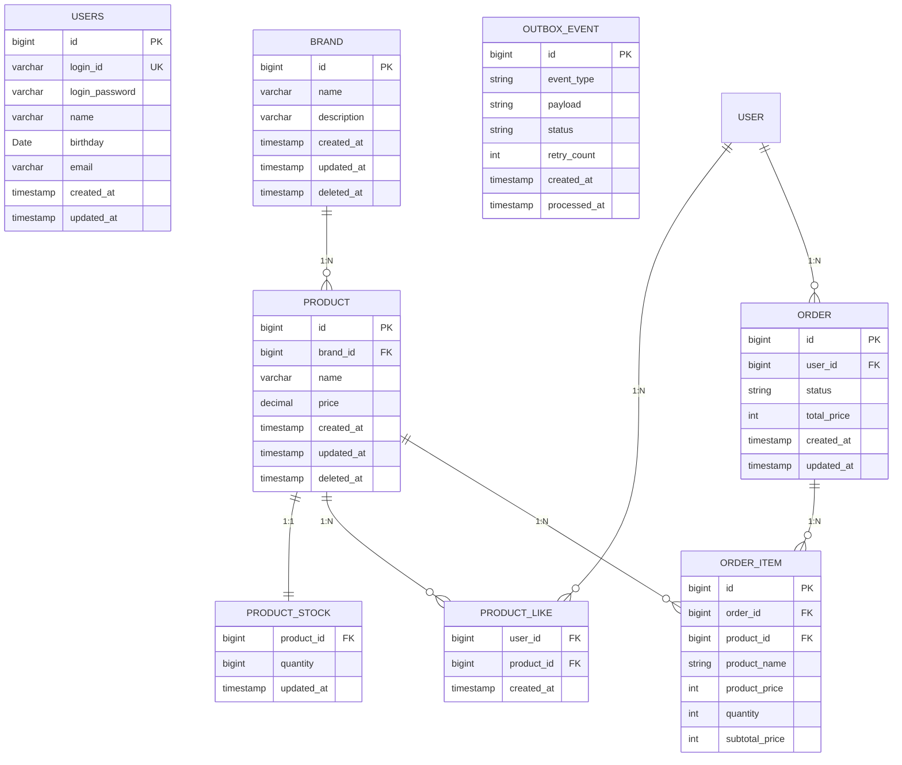

```mermaid
erDiagram
  USERS {
    bigint id PK
    varchar login_id UK
    varchar login_password
    varchar name
    Date birthday
    varchar email
    timestamp created_at
    timestamp updated_at
  }

  BRAND {
    bigint id PK
    varchar name
    varchar description
    timestamp created_at
    timestamp updated_at
    timestamp deleted_at
  }

  PRODUCT {
    bigint id PK
    bigint brand_id FK
    varchar name
    decimal price
    timestamp created_at
    timestamp updated_at
    timestamp deleted_at
  }

  PRODUCT_STOCK {
    bigint product_id FK
    bigint quantity
    timestamp updated_at
  }

  PRODUCT_LIKE {
    bigint user_id FK
    bigint product_id FK
    timestamp created_at
  }

  ORDER {
    bigint id PK
    bigint user_id FK
    string status
    int total_price
    timestamp created_at
    timestamp updated_at
  }

  ORDER_ITEM {
    bigint id PK
    bigint order_id FK
    bigint product_id FK
    string product_name
    int product_price
    int quantity
    int subtotal_price
  }

  OUTBOX_EVENT {
    bigint id PK
    string event_type
    string payload
    string status
    int retry_count
    timestamp created_at
    timestamp processed_at
  }

  BRAND ||--o{ PRODUCT : "1:N"
	PRODUCT ||--|| PRODUCT_STOCK : "1:1"
	USER ||--o{ PRODUCT_LIKE : "1:N"
	PRODUCT ||--o{ PRODUCT_LIKE : "1:N"
	USER ||--o{ ORDER : "1:N"
	ORDER ||--o{ ORDER_ITEM : "1:N"
	PRODUCT ||--o{ ORDER_ITEM : "1:N"
```