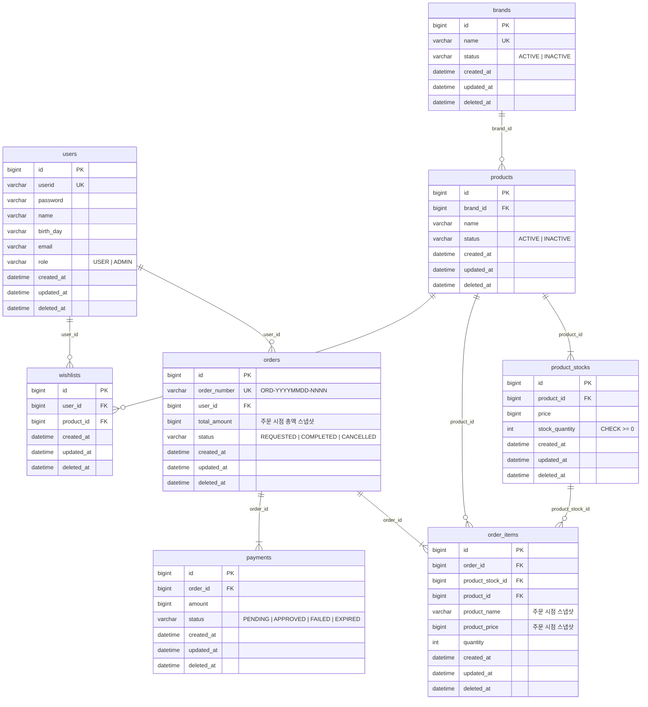

# ERD (Entity Relationship Diagram)

> 설계 기준
> - 모든 테이블은 `id`, `created_at`, `updated_at`, `deleted_at` 컬럼을 가진다 (BaseEntity)
> - Soft Delete는 `deleted_at`으로 처리한다
> - `status` 컬럼은 VARCHAR로 저장한다 (애플리케이션 레벨 Enum)

---

---

## 제약 조건

| 테이블 | 제약 | 설명 |
|--------|------|------|
| users | UNIQUE (userid) | 로그인 ID 중복 불가 |
| brands | UNIQUE (name) | 브랜드명 중복 불가 |
| orders | UNIQUE (order_number) | 주문 번호 중복 불가 |
| product_stocks | CHECK (stock_quantity >= 0) | 재고 수량 음수 불가 (DB 레벨 보장) |
| payments | INDEX (order_id) | 주문별 결제 이력 조회 (재시도로 인해 1:N) |
| wishlists | UNIQUE (user_id, product_id) | 동일 사용자 찜 중복 불가 |

## 관계 요약

| 관계 | 설명 |
|------|------|
| users → orders | 한 사용자는 여러 주문을 가질 수 있다 |
| users → wishlists | 한 사용자는 여러 찜을 가질 수 있다 |
| brands → products | 한 브랜드는 여러 상품을 가질 수 있다 |
| products → product_stocks | 한 상품은 하나 이상의 재고 레코드를 가진다 (1:N, 옵션 단위 관리) |
| orders → order_items | 한 주문은 하나 이상의 주문 항목을 가진다 |
| orders → payments | 한 주문은 여러 결제 시도를 가질 수 있다 (1:N, 재시도 허용) |
| product_stocks → order_items | 주문 항목은 주문 시점의 특정 옵션(재고)을 참조한다 |
| products → order_items | 상품은 주문 항목에 이력 보존용으로 참조된다 |
| products → wishlists | 한 상품은 여러 사용자에게 찜될 수 있다 |
