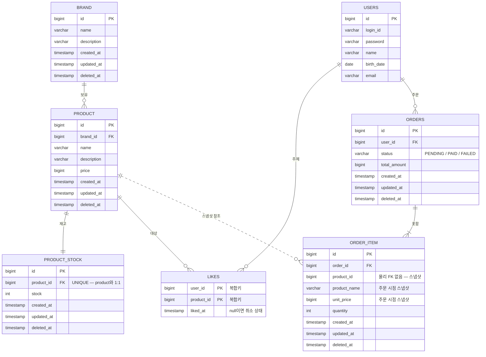

# 04. ERD

전체 테이블 구조와 관계를 정리한 ERD다. Mermaid 문법으로 작성한다.

## 1. 전체 ERD

## 2. 테이블 설명

| 테이블 | 역할 | PK |
|---|---|---|
| `brand` | 상품이 소속되는 브랜드 마스터 | `id` |
| `product` | 상품. 이름·설명·가격 보유 | `id` |
| `product_stock` | 상품 재고. `product`와 1:1 (`product_id` UNIQUE) | `id` |
| `likes` | 사용자-상품 좋아요. 한 쌍당 1행 | `(user_id, product_id)` 복합키 |
| `orders` | 주문 헤더. 상태와 총액 보유 | `id` |
| `order_item` | 주문 항목. 주문 시점 가격 스냅샷 | `id` |
| `users` | 사용자 (기존 도메인) | `id` |

## 3. 관계의 주인

| 관계 | 카디널리티 | FK 보유 (주인) |
|---|---|---|
| Brand — Product | 1 : N | `product.brand_id` |
| Product — ProductStock | 1 : 1 | `product_stock.product_id` (UNIQUE) |
| User — Like | 1 : N | `likes.user_id` (복합 PK 일부) |
| Product — Like | 1 : N | `likes.product_id` (복합 PK 일부) |
| User — Order | 1 : N | `orders.user_id` |
| Order — OrderItem | 1 : N (최소 1) | `order_item.order_id` |
| Product — OrderItem | 1 : N | `order_item.product_id` (논리 참조, 물리 FK 없음) |

## 4. 설계 포인트

- **재고는 `product_stock`으로 분리한다.** `product`에서 `stock`을 떼어 `product`와 1:1(`product_id` UNIQUE)인 `product_stock`에 둔다. 상품 메타데이터(거의 안 변함)와 재고(주문마다 변함)의 변경 빈도를 나누고, 재고 차감 시 비관적 락이 `product_stock` 행에만 걸려 상품 갱신과 경합하지 않게 한다.
- **`product_stock` 운영 규칙.** 상품 생성 시 `product`와 `product_stock` 두 행을 한 트랜잭션으로 함께 만들어 "재고 행 없는 상품"을 막고, 재고는 목록·상세에서 별도 조회하며, 상품을 소프트 삭제하면 재고 행도 함께 소프트 삭제한다.
- **`likes` 테이블은 surrogate `id`가 없다.** `(user_id, product_id)`가 PK 그 자체이므로 중복 좋아요가 DB 차원에서 불가능하다 — 멱등성이 스키마로 보장된다.
- **테이블명은 `likes`로 둔다.** `like`는 SQL 예약어와 충돌해 DDL·쿼리에서 식별자 quoting이 없으면 오류가 날 수 있다. 이미 복수형으로 둔 `orders`·`users`와 같은 규약을 따른다.
- **`likes` 테이블은 `BaseEntity`를 상속하지 않는다.** `created_at`·`updated_at`·`deleted_at`이 없고 `liked_at` 한 컬럼만 둔다. `liked_at IS NOT NULL`이 좋아요 상태, `NULL`이 취소 상태다. 취소는 행 삭제가 아니라 `liked_at`을 `NULL`로 토글하는 것이며, 행은 보존되어 재등록이 UPDATE로 처리된다.
- **좋아요 수는 컬럼으로 두지 않는다.** `product`에 `like_count` 비정규화 컬럼이 없다. 좋아요 수는 항상 `COUNT(*) WHERE product_id = ? AND liked_at IS NOT NULL`로 계산한다 (집계 방식 A).
- **`order_item.product_id`는 물리 FK가 아니다.** 상품이 삭제·변경돼도 과거 주문은 보존돼야 하므로, `product_name`·`unit_price`를 주문 시점에 복사해 스냅샷으로 보관한다. ERD에서 점선 관계(`||..o{`)로 구분했다.
- **`orders ||--|{ order_item`** — 주문은 항목을 최소 1개 가진다. 빈 주문은 허용하지 않는다.
- **소프트 삭제.** `brand`·`product`·`product_stock`·`orders`·`order_item`은 `BaseEntity`를 상속해 `deleted_at` 기반 소프트 삭제를 따른다. `likes`만 예외다.

## 5. 인덱스 권장 (구현 시 검토)

| 테이블 | 인덱스 | 목적 |
|---|---|---|
| `product` | `brand_id` | 브랜드별 상품 목록 조회 (F-01 필터) |
| `product_stock` | `product_id` (UNIQUE) | 상품별 재고 조회·1:1 보장 (F-01, F-02, F-06) |
| `likes` | `product_id` | 상품별 좋아요 수 집계 (F-01, F-02) |
| `orders` | `user_id` | 사용자별 주문 조회 |
| `order_item` | `order_id` | 주문 항목 조회 |

> `likes`의 복합 PK가 `(user_id, product_id)` 순이면 `product_id` 단독 조회(좋아요 수 집계)에 PK 인덱스를 못 쓴다. `product_id` 보조 인덱스를 별도로 두는 것을 권장한다.