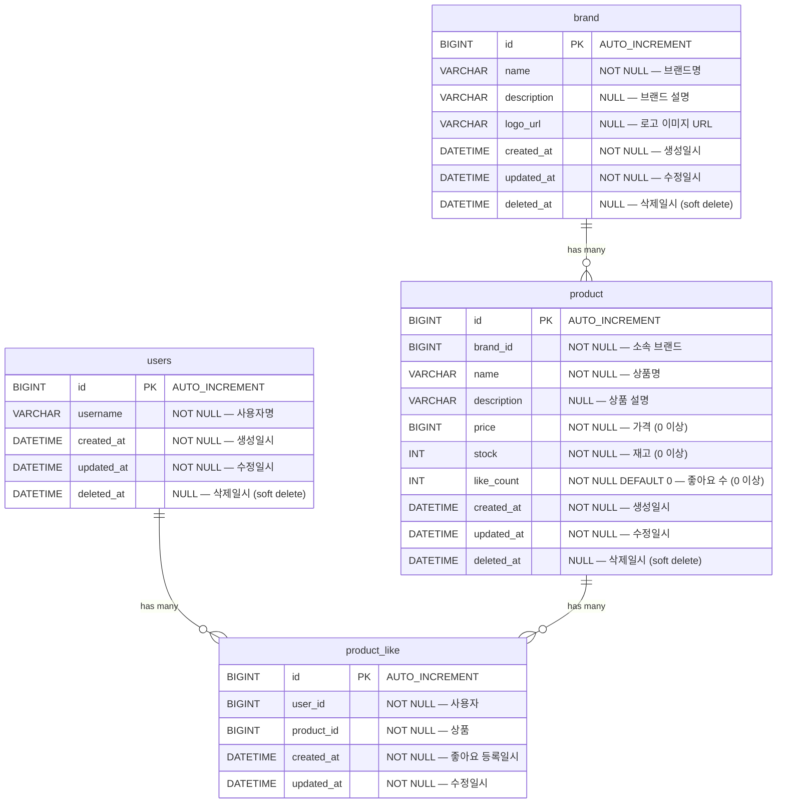
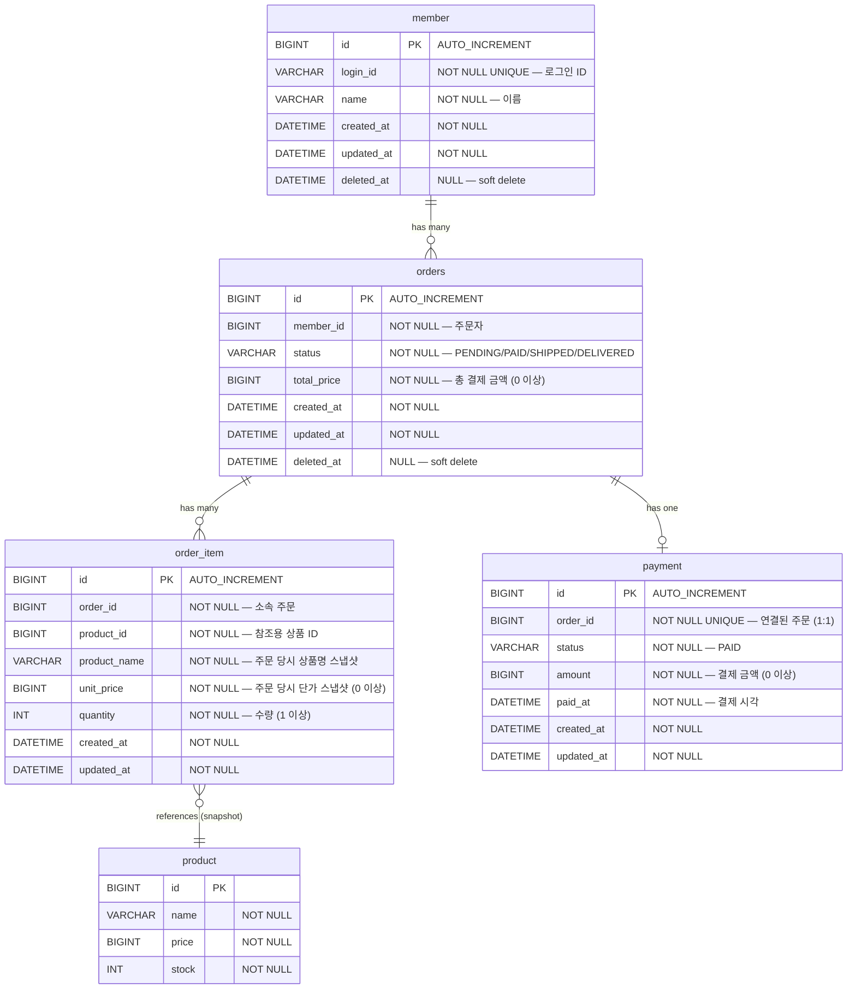

# 04. ERD — 상품 목록 / 상품 상세 / 브랜드 조회 / 상품 좋아요

## 전체 ERD



## 테이블 상세

### brand 테이블

| 컬럼 | 타입 | 제약조건 | 설명 |
|------|------|----------|------|
| `id` | BIGINT | PK, AUTO_INCREMENT | 브랜드 고유 식별자 |
| `name` | VARCHAR(255) | NOT NULL | 브랜드명 |
| `description` | VARCHAR(500) | NULL | 브랜드 설명 |
| `logo_url` | VARCHAR(500) | NULL | 로고 이미지 URL |
| `created_at` | DATETIME | NOT NULL | 생성일시 (BaseEntity 자동 관리) |
| `updated_at` | DATETIME | NOT NULL | 수정일시 (BaseEntity 자동 관리) |
| `deleted_at` | DATETIME | NULL | 삭제일시 — NULL이면 활성, 값이 있으면 삭제됨 |

### product 테이블 (변경 사항)

| 컬럼 | 타입 | 제약조건 | 설명 | 변경 |
|------|------|----------|------|------|
| `id` | BIGINT | PK, AUTO_INCREMENT | 상품 고유 식별자 | 기존 |
| `brand_id` | BIGINT | 참조: brand(id), NOT NULL | 소속 브랜드 | **신규** |
| `name` | VARCHAR(255) | NOT NULL | 상품명 | 기존 |
| `description` | VARCHAR(500) | NULL | 상품 설명 | 기존 |
| `price` | BIGINT | NOT NULL, >= 0 | 가격 | 기존 |
| `stock` | INT | NOT NULL, >= 0 | 재고 | 기존 |
| `like_count` | INT | NOT NULL, DEFAULT 0, >= 0 | 좋아요 수 | **신규** |
| `created_at` | DATETIME | NOT NULL | 생성일시 | 기존 |
| `updated_at` | DATETIME | NOT NULL | 수정일시 | 기존 |
| `deleted_at` | DATETIME | NULL | 삭제일시 | 기존 |

## 관계 정의

| 관계 | 카디널리티 | FK | 필수 | 설명 |
|------|------------|-----|------|------|
| brand → product | 1:N | `product.brand_id` → `brand.id` | 필수 | 모든 상품은 반드시 하나의 브랜드에 속함 |

## 인덱스 권장

| 테이블 | 인덱스 | 컬럼 | 용도 |
|--------|--------|------|------|
| product | `idx_product_brand_id` | `brand_id` | 브랜드별 상품 필터링 |
| product | `idx_product_created_at` | `created_at` | 최신순 정렬 |
| product | `idx_product_price` | `price` | 가격순 정렬 |
| product | `idx_product_like_count` | `like_count` | 인기순 정렬 |
| product | `idx_product_deleted_at` | `deleted_at` | soft delete 필터 |
| brand | `idx_brand_deleted_at` | `deleted_at` | soft delete 필터 |

> 인덱스는 실제 쿼리 패턴과 데이터 규모를 고려하여 구현 시 결정한다. 위는 권장 사항이며, 복합 인덱스 구성은 쿼리 실행 계획 분석 후 최적화한다.

## JPA 매핑 참고

### BrandModel
```
@Entity
@Table(name = "brand")
public class BrandModel extends BaseEntity {
    private String name;          // NOT NULL
    private String description;   // nullable
    private String logoUrl;       // nullable, @Column(name = "logo_url")
}
```

### ProductModel 변경
```
@Entity
@Table(name = "product")
public class ProductModel extends BaseEntity {
    private String name;
    private String description;
    private Long price;
    private Integer stock;

    // 신규 필드
    @ManyToOne(fetch = FetchType.LAZY)
    @JoinColumn(name = "brand_id", nullable = false)
    private BrandModel brand;     // N:1 필수

    @Column(name = "like_count", nullable = false)
    private Integer likeCount = 0;  // 기본값 0
}
```

### users 테이블 (신규)

| 컬럼 | 타입 | 제약조건 | 설명 |
|------|------|----------|------|
| `id` | BIGINT | PK, AUTO_INCREMENT | 사용자 고유 식별자 |
| `username` | VARCHAR(255) | NOT NULL | 사용자명 |
| `created_at` | DATETIME | NOT NULL | 생성일시 |
| `updated_at` | DATETIME | NOT NULL | 수정일시 |
| `deleted_at` | DATETIME | NULL | 삭제일시 |

### product_like 테이블 (신규)

| 컬럼 | 타입 | 제약조건 | 설명 |
|------|------|----------|------|
| `id` | BIGINT | PK, AUTO_INCREMENT | 좋아요 고유 식별자 |
| `user_id` | BIGINT | 참조: users(id), NOT NULL | 사용자 |
| `product_id` | BIGINT | 참조: product(id), NOT NULL | 상품 |
| `created_at` | DATETIME | NOT NULL | 좋아요 등록일시 |
| `updated_at` | DATETIME | NOT NULL | 수정일시 |

> product_like는 취소 시 물리 삭제(hard delete)하므로 `deleted_at` 없음

## 관계 정의 (추가)

| 관계 | 카디널리티 | FK | 필수 | 설명 |
|------|------------|-----|------|------|
| users → product_like | 1:N | `product_like.user_id` → `users.id` | 필수 | 사용자별 좋아요 이력 |
| product → product_like | 1:N | `product_like.product_id` → `product.id` | 필수 | 상품별 좋아요 이력 |

## 인덱스 권장 (추가)

| 테이블 | 인덱스 | 컬럼 | 용도 |
|--------|--------|------|------|
| product_like | `uk_product_like_user_product` | `user_id, product_id` (UNIQUE) | 중복 좋아요 방지 + 멱등성 보장 |
| product_like | `idx_product_like_user_id` | `user_id` | 내 좋아요 목록 조회 |
| product_like | `idx_product_like_created_at` | `created_at` | 최신순 정렬 |

## FK 정책

- DB 레벨의 FK 제약조건은 **설정하지 않는다**
- 관계는 애플리케이션 레벨(JPA `@ManyToOne` 등)에서 관리한다
- 참조 컬럼에는 **인덱스만** 설정한다
- 이유: FK 제약조건에 의한 데드락/성능 이슈 방지, 유연한 데이터 관리

## Soft Delete 정책

- 조회 API에서 `deleted_at IS NULL` 조건으로 삭제된 데이터를 제외한다
- Product 조회 시 연관된 Brand가 삭제된 경우의 처리는 이번 범위에서 미결정 (Brand 삭제 API가 없으므로 발생 가능성 낮음)

---

# 04-2. ERD — 주문 생성 및 결제 흐름

## 전체 ERD



## 테이블 상세

### orders 테이블

| 컬럼 | 타입 | 제약조건 | 설명 |
|------|------|----------|------|
| `id` | BIGINT | PK, AUTO_INCREMENT | 주문 고유 식별자 |
| `member_id` | BIGINT | NOT NULL | 주문자 ID (참조: member.id) |
| `status` | VARCHAR(20) | NOT NULL | 주문 상태 (PENDING / PAID / SHIPPED / DELIVERED) |
| `total_price` | BIGINT | NOT NULL, >= 0 | 총 결제 금액 |
| `created_at` | DATETIME | NOT NULL | 생성일시 |
| `updated_at` | DATETIME | NOT NULL | 수정일시 |
| `deleted_at` | DATETIME | NULL | 삭제일시 (soft delete) |

### order_item 테이블

| 컬럼 | 타입 | 제약조건 | 설명 |
|------|------|----------|------|
| `id` | BIGINT | PK, AUTO_INCREMENT | 주문 아이템 고유 식별자 |
| `order_id` | BIGINT | NOT NULL | 소속 주문 ID (참조: orders.id) |
| `product_id` | BIGINT | NOT NULL | 상품 ID (참조용, 스냅샷과 별개) |
| `product_name` | VARCHAR(255) | NOT NULL | 주문 당시 상품명 스냅샷 |
| `unit_price` | BIGINT | NOT NULL, >= 0 | 주문 당시 단가 스냅샷 |
| `quantity` | INT | NOT NULL, >= 1 | 주문 수량 |
| `created_at` | DATETIME | NOT NULL | 생성일시 |
| `updated_at` | DATETIME | NOT NULL | 수정일시 |

> `order_item`은 주문 취소 외 삭제 시나리오가 없으므로 `deleted_at` 미포함

### payment 테이블

| 컬럼 | 타입 | 제약조건 | 설명 |
|------|------|----------|------|
| `id` | BIGINT | PK, AUTO_INCREMENT | 결제 고유 식별자 |
| `order_id` | BIGINT | NOT NULL, UNIQUE | 연결된 주문 ID (1:1 관계) |
| `status` | VARCHAR(20) | NOT NULL | 결제 상태 (PAID) |
| `amount` | BIGINT | NOT NULL, >= 0 | 결제 금액 |
| `paid_at` | DATETIME | NOT NULL | 결제 시각 |
| `created_at` | DATETIME | NOT NULL | 생성일시 |
| `updated_at` | DATETIME | NOT NULL | 수정일시 |

## 관계 정의

| 관계 | 카디널리티 | FK 컬럼 | 필수 | 설명 |
|------|------------|---------|------|------|
| member → orders | 1:N | `orders.member_id` → `member.id` | 필수 | 사용자별 주문 이력 |
| orders → order_item | 1:N | `order_item.order_id` → `orders.id` | 필수 | 주문별 아이템 목록 |
| product → order_item | 1:N | `order_item.product_id` → `product.id` | 참조용 | 스냅샷 별도 저장, FK 필수 아님 |
| orders → payment | 1:1 | `payment.order_id` → `orders.id` (UNIQUE) | 선택 | PENDING 상태에서는 payment 없음 |

## 인덱스 권장

| 테이블 | 인덱스 | 컬럼 | 용도 |
|--------|--------|------|------|
| orders | `idx_orders_member_id` | `member_id` | 사용자별 주문 조회 |
| orders | `idx_orders_created_at` | `created_at` | 날짜 범위 필터, 최신순 정렬 |
| orders | `idx_orders_member_created` | `member_id, created_at` | 사용자별 + 날짜 복합 조건 |
| order_item | `idx_order_item_order_id` | `order_id` | 주문별 아이템 조회 |
| payment | `uk_payment_order_id` | `order_id` (UNIQUE) | 중복 결제 방지 |

## JPA 매핑 참고

### OrderModel
```
@Entity
@Table(name = "orders")
public class OrderModel extends BaseEntity {
    @Column(name = "member_id", nullable = false)
    private Long memberId;

    @Enumerated(EnumType.STRING)
    @Column(nullable = false)
    private OrderStatus status = OrderStatus.PENDING;

    @Column(name = "total_price", nullable = false)
    private Long totalPrice;
}
```

### OrderItemModel
```
@Entity
@Table(name = "order_item")
public class OrderItemModel extends BaseEntity {
    @Column(name = "order_id", nullable = false)
    private Long orderId;

    @Column(name = "product_id", nullable = false)
    private Long productId;

    @Column(name = "product_name", nullable = false)
    private String productName;   // 스냅샷

    @Column(name = "unit_price", nullable = false)
    private Long unitPrice;       // 스냅샷

    @Column(nullable = false)
    private Integer quantity;
}
```

### PaymentModel
```
@Entity
@Table(name = "payment")
public class PaymentModel extends BaseEntity {
    @Column(name = "order_id", nullable = false, unique = true)
    private Long orderId;

    @Enumerated(EnumType.STRING)
    @Column(nullable = false)
    private PaymentStatus status = PaymentStatus.PAID;

    @Column(nullable = false)
    private Long amount;

    @Column(name = "paid_at", nullable = false)
    private LocalDateTime paidAt;
}
```
