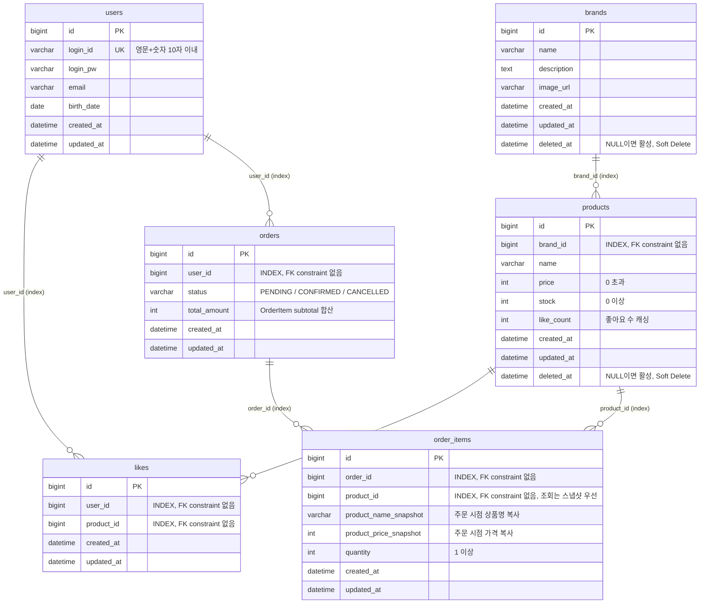

# 04. ERD (Entity Relationship Diagram)

---

## 왜 이 다이어그램이 필요한가?

클래스 다이어그램이 도메인 객체의 책임과 의존 방향을 정의했다면,
ERD는 **실제 데이터가 어떻게 저장되고 연결되는지** 영속성 구조를 검증한다.

검증 목표:
- Soft Delete 컬럼(`deleted_at`)이 어느 테이블에 위치하는가?
- `order_items`의 스냅샷 컬럼이 원본 상품 정보와 명확히 분리되어 있는가?
- `likes` 테이블의 unique constraint가 중복 좋아요를 DB 레벨에서 막는가?
- 관계의 주인(FK를 가진 쪽)이 올바른가?

---

## ERD

---

## 읽는 법 — 포인트 3가지

1. **Soft Delete는 `brands`와 `products`에만 위치** — `users`, `orders`, `order_items`, `likes`는 Soft Delete 없이 논리적으로 상태를 관리한다. 주문은 `status` 컬럼으로, 좋아요는 행 삭제(Hard Delete)로 처리한다. 모든 테이블에 `deleted_at`을 두면 조회 쿼리가 복잡해지므로, 필요한 곳에만 적용한다.
   - **주의**: `products`가 Soft Delete될 때, 해당 `product_id`를 참조하는 `likes` 행은 반드시 Hard Delete해야 한다. 그렇지 않으면 DB에 유효한 `likes` 행이 남아 동일 상품 재등록 시 유령 좋아요 데이터로 남는다. 이 처리는 애플리케이션 서비스 레이어(`BrandAdminFacade`)에서 명시적으로 수행한다.

2. **`likes` 테이블은 `(user_id, product_id)` 복합 unique constraint** — 다이어그램에 표기되진 않지만, 이 제약이 없으면 애플리케이션 레벨의 멱등 처리가 경쟁 조건(race condition)에서 깨진다. DB unique constraint가 최후 방어선이다.

3. **`order_items.product_id`는 참조용** — 조회 시에는 `product_name_snapshot`, `product_price_snapshot`을 우선 사용한다. `product_id`는 향후 통계(어떤 상품이 많이 팔렸는지)나 재주문 기능을 위한 참조 키로 남겨둔다. 상품이 Soft Delete되어도 과거 주문 조회에는 영향 없다.

---

## 제약 조건 정리

> **FK constraint는 DB에 걸지 않는다.**
> 참조 무결성은 애플리케이션 레벨에서 보장하고, DB에는 조회 성능을 위한 인덱스만 적용한다.
> FK constraint는 INSERT/DELETE 시 참조 검사 오버헤드, 배치 작업 시 제약, Soft Delete 구조에서의 삭제 순서 제약 등을 유발한다.

| 테이블 | 제약 종류 | 컬럼 | 설명 |
|--------|---------|------|------|
| `users` | UNIQUE | `login_id` | 중복 가입 방지 |
| `products` | INDEX | `brand_id` | 브랜드별 상품 조회 성능 |
| `products` | INDEX | `deleted_at` | Soft Delete 필터 성능 |
| `likes` | UNIQUE | `(user_id, product_id)` | 중복 좋아요 방지 (DB 최후 방어선) |
| `likes` | INDEX | `user_id` | 내 좋아요 목록 조회 성능 |
| `orders` | INDEX | `user_id` | 유저별 주문 조회 성능 |
| `orders` | INDEX | `created_at` | 날짜 범위 필터 성능 |
| `order_items` | INDEX | `order_id` | 주문별 상품 조회 성능 |

---

## 잠재 리스크

| 리스크 | 설명 | 선택지 |
|--------|------|--------|
| **`likes` 유령 데이터** | `products` Soft Delete 시 `likes` 행이 Hard Delete되지 않으면, DB에 유효 상태로 남아 데이터 무결성 훼손 | 애플리케이션 서비스 레이어에서 상품 삭제 시 `likes` 벌크 삭제를 명시적으로 수행 |
| **`like_count` 정합성** | `likes` 행과 `products.like_count`가 두 곳에 나뉘어 저장되므로, 동시 요청 시 불일치 가능 | A. 현재: 단일 트랜잭션으로 동기화 / B. 향후: `SELECT COUNT(*) FROM likes` 집계로 대체 또는 Redis 외부화 |
| **`order_items.product_id` 참조** | Soft Delete이므로 FK가 끊기지는 않지만, `products` 조회 시 `deleted_at IS NULL` 조건 없이 JOIN하면 삭제된 상품이 노출될 수 있음 | 조회 쿼리에서 반드시 `deleted_at IS NULL` 조건 명시 또는 `@Where` 글로벌 적용 |
| **`orders` 상태 전이 관리** | `status` 컬럼만으로는 상태 변경 이력을 추적할 수 없음 | A. 현재: 단순 상태 컬럼으로 시작 / B. 향후: `order_status_histories` 테이블로 이력 분리 |
