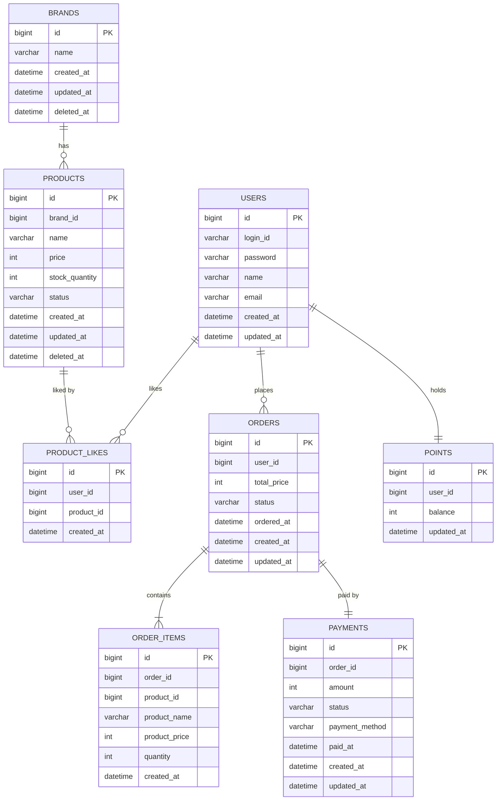

# 04. ERD

## 1. ERD

```mermaid
erDiagram
    USERS {
        bigint id PK
        varchar login_id
        varchar password
        varchar name
        varchar email
        datetime created_at
        datetime updated_at
    }

    BRANDS {
        bigint id PK
        varchar name
        datetime created_at
        datetime updated_at
        datetime deleted_at
    }

    PRODUCTS {
        bigint id PK
        bigint brand_id        varchar name
        int price
        int stock_quantity
        varchar status
        datetime created_at
        datetime updated_at
        datetime deleted_at
    }

    PRODUCT_LIKES {
        bigint id PK
        bigint user_id        bigint product_id        datetime created_at
    }

    ORDERS {
        bigint id PK
        bigint user_id        int total_price
        varchar status
        datetime ordered_at
        datetime created_at
        datetime updated_at
    }

    ORDER_ITEMS {
        bigint id PK
        bigint order_id        bigint product_id
        varchar product_name
        int product_price
        int quantity
        datetime created_at
    }

    PAYMENTS {
        bigint id PK
        bigint order_id        int amount
        varchar status
        varchar payment_method
        datetime paid_at
        datetime created_at
        datetime updated_at
    }

    POINTS {
        bigint id PK
        bigint user_id        int balance
        datetime updated_at
    }

    USERS ||--o{ PRODUCT_LIKES : "likes"
    USERS ||--o{ ORDERS : "places"
    USERS ||--|| POINTS : "holds"
    BRANDS ||--o{ PRODUCTS : "has"
    PRODUCTS ||--o{ PRODUCT_LIKES : "liked by"
    ORDERS ||--|{ ORDER_ITEMS : "contains"
    ORDERS ||--|| PAYMENTS : "paid by"
```
