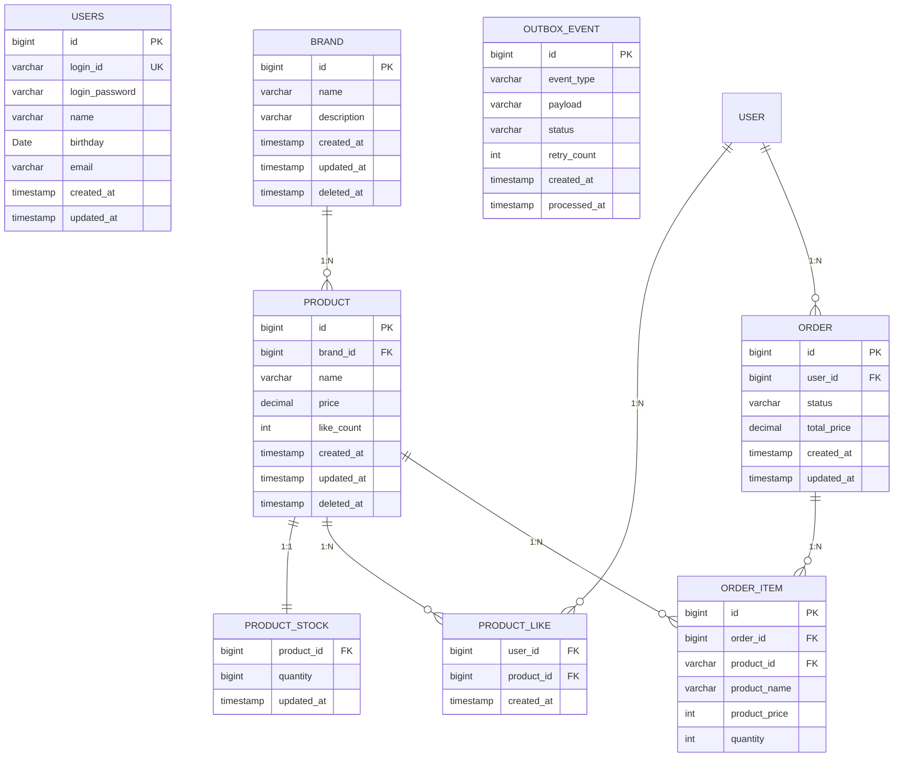

## 인덱스 제안

| 테이블 | 인덱스명 | 컬럼(들) | 타입 | 용도 |
|---|---|---|---|---|
| USERS | `uk_users_login_id` | `login_id` | UNIQUE | 로그인 조회 |
| PRODUCT | `idx_product_brand_id` | `brand_id` | INDEX | 브랜드별 상품 조회 |
| PRODUCT | `idx_product_price` | `price` | INDEX | 가격순 정렬 + 페이지네이션 |
| PRODUCT_LIKE | `uk_product_like_user_product` | `(user_id, product_id)` | UNIQUE | 중복 좋아요 방지, 유저별 좋아요 조회 |
| PRODUCT_LIKE | `idx_product_like_product_id` | `product_id` | INDEX | 상품별 좋아요 수 집계 |
| ORDER | `idx_order_user_id_created_at` | `(user_id, created_at)` | COMPOSITE | 사용자 주문 내역 최신순 조회 |
| ORDER | `idx_order_status` | `status` | INDEX | 주문 상태별 조회 |
| ORDER_ITEM | `idx_order_item_order_id` | `order_id` | INDEX | 주문 상세 조회 |
| OUTBOX_EVENT | `idx_outbox_status` | `status` | INDEX | 미처리 이벤트 폴링 |