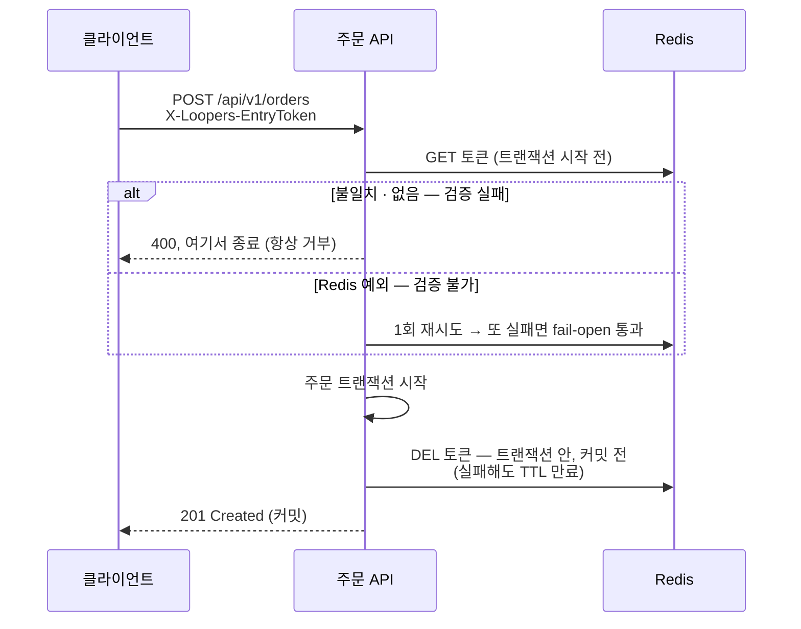
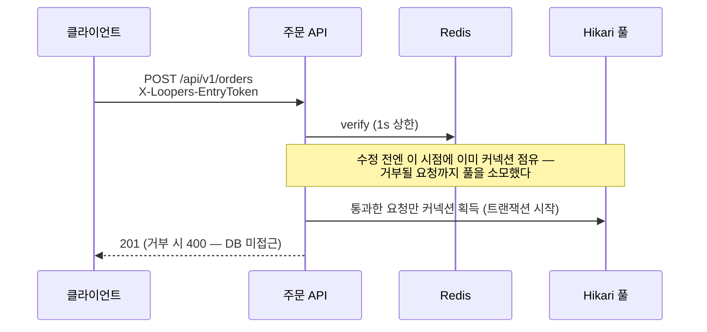

# Redis가 죽으면 주문은 어떻게 되는가 — 주문 대기열 설계

> **TL;DR** — 대기열은 주문 경로에 새 단일장애점(Redis)을 추가하므로 "죽으면 어떻게 되는가"를 먼저 정했다: **가용성 우선 fail-open(1회 재시도) · 자동 해제 없는 수동 스위치 · commandTimeout 1초 · 유저 여정을 살리는 클라이언트 계약** — 그리고 리뷰에서 이 정책의 전제 두 개(트랜잭션 내 verify 의 커넥션 점유, Lettuce 기본 60초)가 설정과 어긋남을 발견해 고쳤다. 장애 정책은 catch 문이 아니라 전제 검증이다.

## Introduction & Goals

- **Context / Background**:
  블랙 프라이데이 시나리오(평시 100 TPS → 10,000 TPS)에서 주문 API 는 무방비다 — 유입 조절 장치가 없고, 하류 한계는 커넥션 풀 40(주문 1건 ~200ms → 이론 최대 200 TPS)뿐이다. 초과 트래픽은 풀 고갈 → 재시도 폭풍 → 전면 장애로 이어지고, 순서와 무관하게 운 좋은 요청만 성공한다.
  8주차에 Redis Sorted Set 대기열 + 입장 토큰으로 back-pressure 를 도입했다. 그런데 이 장치는 주문 경로에 **새 단일장애점(Redis)** 을 추가한다 — 그래서 이 문서는 기능 설계와 함께 **"이 장치가 죽으면 주문은 어떻게 되는가"** 를 중심에 둔다. 결론 한 줄: **장애 정책은 catch 문이 아니라 전제 검증이다.**

- **Goals**:
  - 진입 순서 보장 + 중복 진입 방지, **산정된 속도(140 TPS)로만** 유저를 입장시킨다
  - 순번·예상 대기 시간을 실시간 제공하되, 폴링 부하가 대기 인원에 비례 폭증하지 않게 한다
  - **Redis 장애 시의 동작을 사전 정의**한다 (가용성 우선) — 장애가 난 뒤 판단하면 늦다
  - 검증 3종(동시 진입 순서 / 토큰 만료 / 처리량 초과)과 운영 런북·지표까지 완결한다

## Detailed Design

### System Architecture

```
클라이언트 → POST /queue/enter ─┐
          → GET /queue/position ─┤→ QueueFacade ──→ Redis (ZSET + 토큰)
                                 │        ↑ peek→SET→ZREM (100ms × 14명)
                                 │  QueueAdmissionScheduler
클라이언트 → POST /orders ───────→ EntryTokenGate(verify, 트랜잭션 밖) → 주문 트랜잭션
```

- **QueueFacade** — 진입(ZADD NX)·순번(ZRANK)·예상 대기 계산. 게이트 off 면 enter/position 을 400 으로 명시 거부(스케줄러 없는 줄에 영원히 서는 함정 차단).
- **QueueAdmissionScheduler** — 100ms 마다 맨 앞 14명에게 토큰 발급. 배출 순서는 **발급 먼저(peek→SET) → 제거 나중(ZREM)**: 제거를 먼저 하면 "큐에도 토큰에도 없는" 윈도에 걸린 유저가 재진입해 ghost 엔트리(1인 2입장)가 된다. 발급을 먼저 하면 윈도가 "둘 다 보유"가 되고, 조회가 토큰을 우선 확인하므로 무해하다.
- **EntryTokenGate** — 주문 진입 검증. **verify 는 주문 트랜잭션 시작 전**에 실행된다: 기본 jpa 설정은 트랜잭션 시작 시점에 커넥션을 즉시 획득하므로, 트랜잭션 안 verify 는 거부될 요청까지 풀을 점유시킨다(아래 Constraints 의 "함정" 참조). 주문 성공 시 토큰을 소모(DEL)한다.
- **행사 스위치** — `queue.order-gate.enabled` 하나가 게이트·스케줄러·대기열 API 세 컴포넌트의 수명을 함께 결정한다(기동 시 고정 — 전환은 재기동).

**주문 게이트 흐름 — 검증 실패 vs 검증 불가**



**커넥션 획득 시점 (수정 후)**



### Data Models

| 키 | 타입 | 연산 | 설계 포인트 |
|---|---|---|---|
| `queue:order:waiting` | ZSET | `ZADD NX` (score=진입 시각 ms, member=loginId), `ZRANK`, `ZCARD`, `ZRANGE`+`ZREM` | **NX 필수** — 재진입 시 score 갱신으로 줄 뒤로 밀리는 버그 방지(멱등). TTL 없음 → 행사 종료 시 수동 DEL 필요 |
| `queue:order:token:{loginId}` | STRING | `SET ... EX 300` (UUID), `GET`, `DEL` | TTL 5분 — 미소비 허가 누적을 유계로 만드는 값. 1회용: 주문 성공 시 DEL, 실패 시 보존(TTL 내 재시도 가능) |

- 식별자는 전 구간 **loginId** 로 명명 — 이 코드베이스에서 `userId` 는 Long PK 를 뜻하므로, String 헤더 식별자를 userId 로 부르면 혼동 벡터가 된다.

### API Design

| API | 요청 | 응답 |
|---|---|---|
| `POST /api/v1/queue/enter` | X-Loopers-LoginId | `{position, waitingCount, estimatedWaitSeconds}` — 재진입 시 기존 순번 반환(멱등) |
| `GET /api/v1/queue/position` | X-Loopers-LoginId | 대기 중: `{position, estimatedWaitSeconds, suggestedPollIntervalSeconds}` / 입장: `{position: 0, entryToken}` / 미진입: 404 |
| `POST /api/v1/orders` | + `X-Loopers-EntryToken` | 게이트 on 시 토큰 검증 — 부재·불일치 400, 성공 시 소모 |

- **예상 대기 시간** = `⌈순번 × 배출 주기 ÷ 배치 크기⌉` — 산정값을 유저 피드백에 그대로 재사용.
- **폴링 부하 자가 조절**: 서버가 제안 주기를 응답에 실어(순번 1~100 → 1초, ~1000 → 3초, 그 너머 → 5초) 대기 인원이 많을수록 조회 빈도가 스스로 줄어든다. 대기열이 폴링 폭탄으로 무너지는 것 역시 "대기열의 장애"다.
- **게이트 off(평시)**: enter/position 은 400("대기열 미운영 — 바로 주문 가능"). 현재는 메시지 문자열뿐이라 전용 코드 또는 `200 + status: BYPASS` 구조화가 백로그.
- **클라이언트 계약 (전면 장애 시 유저 여정)**: fail-open 은 주문 API 에 직행한 요청만 살린다 — 정상 플로우 유저는 폴링 5xx 에 갇힌다. 그래서 계약으로 정의한다: **순번 폴링이 연속 3회 5xx 면 토큰 없이 주문을 시도한다** (게이트가 fail-open 으로 수용). 이 한 줄이 없으면 '우회' 전략이 실제로는 "수동 전환 전까지 대부분 유저 차단"으로 동작한다.

### Constraints

**산정 (처리량 상한)**

```
이론 최대 TPS = 풀 40 / 주문 1건 평균 0.2s = 200   ← 강의 예시(50)가 아닌 실측 풀 크기
안전 마진 70%  = 140 TPS
스케줄러       = 100ms 마다 14명 (Thundering Herd 완화 분할)
```

- 주문 200ms 전제는 6주차 record-first(PG 호출이 트랜잭션 밖) 덕에 성립 — 커넥션을 물었다면 40/3s ≈ 13 TPS 에서 시작했을 것이다.
- 주문의 병목은 용량이 아니라 **경합**(행사 상품 재고 행 락 직렬화)이라 DB 스케일업이 대안이 못 되고, 재고를 Redis 로 옮겨도 정합성 이원화 비용과 나머지 쓰기 파이프라인이 남는다 — **어디선가는 줄을 세워야 한다(back-pressure 보존).**

**장애 정책의 전제 — 리뷰에서 발견한 함정 2개**

- Lettuce 기본 commandTimeout 은 60초 — Redis 행(hang)이면 재시도 포함 요청당 최대 120초 블록. "fail-open 이라 괜찮다"는 타임아웃이 짧을 때만 참이다 → **1초로 명시**.
- 게이트 verify 가 `@Transactional` 안에 있었다 — 거부될 요청까지 커넥션 점유 → 풀 고갈 → 전 서비스 마비의 역전 구조 → **verify 를 트랜잭션 밖으로**(TransactionTemplate, self-invocation 함정 회피).
- 1초로 줄여도 행 지속 시 요청당 최대 2초씩 톰캣 워커 스레드를 점유한다(기본 200 스레드 → 상한 ≈ 100 req/s, 전 엔드포인트 공유) — 호출 자체를 건너뛰는 서킷 브레이커가 다음 단계(백로그: 정책 자동 전환과 달리 flapping 논거에 걸리지 않음 — 브레이커가 열려도 결과는 같은 fail-open, 제거되는 건 대기 시간뿐).

**한계 (수용한 것들)**

- **단일 인스턴스는 하드 전제** — 배출이 peek→SET→ZREM 이라 다중 인스턴스는 같은 배치를 중복 peek 하고, 두 번째 SET 이 토큰을 덮어써 첫 토큰 유저가 400 을 맞을 수 있다. 스케일아웃 전 분산 락/원자 배출(Lua) 선행 필수.
- **back-pressure 는 소프트** — 140 TPS 는 발급 속도지 주문 도착 속도가 아니다. 미사용 토큰이 이론상 140/s × 300s = 42,000개까지 누적 가능(사람의 행동 분산이 완화 — 하드 보장은 outstanding 상한이 정석).
- **토큰 소진이 커밋 전** — 쿠폰 @Version 커밋 충돌과 겹치면 "토큰 소진 + 주문 롤백" 가능(fail-safe 방향이라 수용, afterCommit 이동은 백로그). 토큰 1회용도 원자 강제 없음(verify~consume 사이 병렬 통과 가능 — GETDEL/Lua 백로그).
- **Redis 데이터 유실은 "정상"으로 위장** — 토큰 증발 시 보유 유저가 400 정상 거부로 차단되고 WARN 도 없다. 조기 신호는 Token Conversion Rate 급락뿐 (운영 런북 참조).

**운영 런북 · 지표**

| 상황 | 행동 |
|---|---|
| 행사 시작/종료 | `queue.order-gate.enabled` 토글 + 재기동. 종료 시 `DEL queue:order:waiting` (잔존자가 다음 행사 첫 배치 선점 방지) |
| Redis 간헐 장애 | 개입 불요 — 재시도+fail-open 흡수, WARN 추이 관찰 |
| Redis 전면 장애 | fail-open + 클라이언트 계약이 주문을 살리는 동안 판단 → 게이트 off 전환 |
| Redis 데이터 유실 | 정상 거부로 위장되는 장애 — Conversion Rate 급락이 유일 신호, 대응은 게이트 off 가 사실상 유일 |

지표: **Token Conversion Rate** (조기 신호 — 대기열 지표는 멀쩡한데 하류가 죽는 함정 대비) · Token Expiry Rate · Scheduler Health · fail-open WARN 수(알림 승격 백로그).

## Alternatives Considered

**결정 1 — Redis 전면 장애 시 정책**

| 옵션 | Pros | Cons |
|------|------|------|
| A. 전면 차단 | 하류 절대 안전 | 행사 매출 0, 유저 이탈 + 재시도 폭풍 |
| B. fallback 큐 (로컬 메모리 등) | 서비스 유지 + 형식적 순번 | 구현 복잡도, 다중 인스턴스에서 순번 부정확 |
| **선택: C. 우회 (fail-open)** | 매출·유저 경험 유지, 기존 스로틀(풀·락)이 방어선으로 잔존 | 장애 중 대기열의 보호를 잠시 포기 |

**선택 근거:** 블프에서 "잠시 후 다시 시도"는 정상 유저의 손해다(거부 vs 보관 판단 기준). 우회 상태는 무방비가 아니다 — 커넥션 대기는 `connection-timeout: 3000`(jpa.yml 실측값)에 잘리고 재고 락이 직렬화한다. 단 전환은 자동이 아닌 **수동 스위치**: Redis 순단마다 게이트가 여닫히는 flapping 이 더 위험하며, fail-open 이 판단할 시간을 벌어준다. fail-open 이 살리는 건 게이트뿐이므로 **클라이언트 계약**(폴링 3연속 5xx → 직행 주문)으로 유저 여정까지 살린다.

**결정 2 — 스케줄러 배출 방식**

| 옵션 | Pros | Cons |
|------|------|------|
| A. `ZPOPMIN` 후 토큰 발급 | 원자적 제거 (다중 인스턴스 중복 없음) | 제거~발급 사이 "큐에도 토큰에도 없는" 윈도 → 재진입 시 ghost 엔트리(1인 2입장) |
| **선택: B. peek → SET → ZREM** | 윈도가 "둘 다 보유"로 바뀌어 무해 (조회가 토큰 우선 확인) | 단일 인스턴스 하드 전제 (다중이면 중복 peek) |

**선택 근거:** A 의 윈도는 폴링 계약을 지키는 클라이언트일수록 잘 걸리는 함정이고(404 → 안내대로 재진입 → ghost), B 의 비용(단일 인스턴스 전제)은 기존 스케줄러 3종과 동일한 전제라 추가 비용이 없다. 스케일아웃 시점에 Lua 원자 배출로 갚는다.
