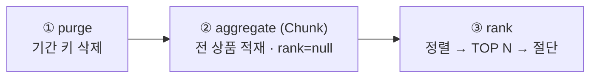

# 좋아요는 왜 더할 수 없는가 — 주간/월간 랭킹 배치 설계

> **TL;DR** — 일간 집계를 주간/월간으로 압착하는 배치는 **더할 수 있는 값(증분)과 더할 수 없는 값(스냅샷)을 가르는 데서** 시작한다: `like_count` 를 7일치 SUM 하면 같은 좋아요를 7번 세므로 순증감 `like_delta` 를 신설했고, 랭킹은 "전체를 본 뒤 상위 N"이라 청크 스트리밍만으로 확정되지 않아 **purge → aggregate(Chunk) → rank** 3-Step 으로 쪼갰다. 사전 집계의 값은 조회 시점의 계산을 0으로 만드는 것이다.

## Introduction & Goals

- **Context / Background**:
  9주차에 Kafka Consumer 와 Redis ZSET 으로 **실시간 일간 랭킹**을 만들었다. 그런데 이 구조는 주간/월간으로 그대로 늘어나지 않는다 — 일간 키의 TTL 이 2일이라 30일치가 애초에 남아있지 않고, 매 요청마다 수억 건을 집계하면 DB/Redis 부하가 서비스 전체를 흔든다.
  더 근본적인 문제가 하나 더 있었다. 과제는 *"하루치 메트릭 테이블을 읽어"* 집계하라고 하는데, 우리 `product_metrics` 는 **일자 구분이 없는 누적 합계** 테이블이었다. 즉 집계할 "하루치"가 존재하지 않았다. 그래서 이 문서는 배치 구현보다 앞선 질문에서 출발한다: **무엇을 더할 수 있고 무엇을 더할 수 없는가.**

- **Goals**:
  - `product_metrics` 를 **기간 집계가 성립하는 형태**로 바꾼다 (일자 차원 + 가산 가능한 지표)
  - Chunk 지향 배치로 대량 집계하되, **같은 파라미터 재실행이 멱등**하게 만든다
  - 주간/월간 TOP 100 을 조회 전용 MV 로 적재한다
  - 랭킹 API 를 기간(일간/주간/월간)으로 확장하되, **조회 시점의 집계 계산은 0** 으로 유지한다

## Detailed Design

### System Architecture

```
Kafka ──→ commerce-streamer ──→ product_metrics       (일자별 증분, streamer 소유)
                                       │ 읽기 (Chunk)
                               commerce-batch  productRankAggregationJob
                                 purge → aggregate → rank
                                       │ 적재
                               mv_product_rank_{weekly,monthly}  (batch 소유)
                                       │ 읽기 (projection)
                               commerce-api  GET /api/v1/rankings?period=
```

- **commerce-streamer** — 이벤트를 `(product_id, metric_date)` 로 upsert 한다. 일자는 `RankingKeys.dateOf(occurredAt)` 의 KST 날짜로 양자화 — 9주차 Redis 일간 키와 **같은 기준**이라 일간/주간 점수 해석이 어긋나지 않는다.
- **commerce-batch** — 기간 집계의 유일한 생산자. 파라미터 `baseDate`(yyyyMMdd) + `period`(WEEKLY|MONTHLY) 하나로 "어디까지 읽어 어떤 키로 적재할지"가 정해진다(`AggregationTarget`). 이 해석을 Reader/Processor/Tasklet 이 각자 하면 어긋나므로 한 곳에 모았다.
- **commerce-api** — 일간은 실시간 ZSET, 주간/월간은 MV. 어디서 읽는지만 갈리고 그 뒤 상품정보 aggregation 은 공통 경로다.

**3-Step 으로 나눈 이유**



> 랭킹은 **전체를 본 뒤에야** 상위 N 이 정해진다. 청크는 스트리밍이라 그 판단을 할 수 없어, 적재(②)와 확정(③)을 분리했다.

### Data Models

**핵심 구분 — 기간 SUM 이 성립하는 지표와 아닌 지표**

| 지표 | 성격 | 기간 집계 | 이유 |
|---|---|---|---|
| `sales_count` / `view_count` | 그날의 **증분** | `SUM` | 발생 건수의 누적이라 구간 합이 그대로 의미를 갖는다 |
| `like_delta` (신설) | 그날의 **순증감** | `SUM` | 좋아요 +1 / 취소 −1. 구간 합 = 그 기간의 순수 관심 증감 |
| `like_count` | 그날 마지막 **스냅샷** | **불가** | SUM 하면 같은 좋아요를 일수만큼 중복 계산. 기간 점수에서 쓰지 않는다 |

| 테이블 | 키 | 설계 포인트 |
|---|---|---|
| `product_metrics` | `UNIQUE(product_id, metric_date)` | 스냅샷(`like_count`)은 `version` 가드로 최신만 반영, 증분(`like_delta`)은 이벤트마다 누적 — 중복은 `event_handled` 가 이미 차단하므로 무조건 더해도 안전 |
| `mv_product_rank_weekly` | `UNIQUE(period_key, product_id)`, `period_key` = `2026-W30` | **ISO 주 기준 연도**(`WEEK_BASED_YEAR`) 사용 — 달력 연도를 쓰면 연말 한 주가 두 키로 쪼개진다(2027-01-01 은 2026-W53) |
| `mv_product_rank_monthly` | 동일, `period_key` = `2026-07` | 구간은 그 달 1일~말일 |

- MV 컬럼 `like_count` 는 **기간 내 순증감 합**(음수 가능)이다 — 과제 스펙의 컬럼명을 따르되 의미는 delta 다.
- `rank_no` 는 적재 시점에 null 이고 ③에서 상위 N 에만 부여된다. **최종 상태에서는 항상 non-null** (나머지는 삭제).
- 점수 = `0.1×Σview + 0.2×Σlike_delta + 0.7×Σsales` — 9주차 실시간 랭킹과 **동일한 가중치**(크로스-앱 계약).

### API Design

| API | 파라미터 | 응답 |
|---|---|---|
| `GET /api/v1/rankings` | `period`(DAILY 기본), `date`(yyyyMMdd), `page`(1-based), `size`(≤100) | `{period, periodKey, page, size, totalCount, items[]}` |

- **`periodKey` 를 응답에 노출**한다 — 기준일이 어느 구간으로 해석됐는지(`20260722` / `2026-W30` / `2026-07`)를 클라이언트가 되짚을 수 있어야 "왜 이 랭킹이 나왔는지"가 자명해진다.
- `period` 미지정은 DAILY — 기존 API 호환. 알 수 없는 값은 400.
- 아직 배치가 돌지 않은 기간은 **빈 목록**(예외 아님). 배치 지연이 조회 장애로 번지지 않게 한다.
- 실행: `--job.name=productRankAggregationJob baseDate=20260722 period=WEEKLY`

### Constraints

**재실행 전략 — 부분 롤백이 아니라 전체 재적재**

- ①이 기간 키를 통째로 지우고 시작하므로, 어느 단계에서 실패하든 **다시 돌리면 같은 결과**가 된다. 청크 단위 부분 롤백을 이어붙이는 대신 "구간 전체를 다시 만든다"를 택했다 — 집계 결과는 원천(`product_metrics`)이 불변인 한 언제든 재현 가능하기 때문이다.
- `RunIdIncrementer` 로 같은 `baseDate`/`period` 재실행을 허용한다.
- 같은 주의 **어떤 날짜를 기준일로 줘도** 같은 `period_key` 로 수렴한다(테스트로 고정).

**수용한 비용들**

- **쓰기 증폭** — ②가 전 상품을 적재하고 ③이 상위 N 밖을 지운다. 상품 수가 N 보다 훨씬 크면 버리는 쓰기가 대부분이다. 스테이징 테이블을 두면 줄지만 테이블이 하나 늘고, 이 규모에선 단순함이 낫다고 판단했다.
- **GROUP BY 페이징의 offset 비용** — `MySqlPagingQueryProvider` 는 그룹 쿼리를 매 페이지 재실행한다(파생 테이블 materialize). 상품 수가 커지면 페이지 수에 비례해 누적되므로, 키셋 페이징이나 `JdbcCursorItemReader` 스트리밍이 다음 단계다.
- **`JpaItemWriter` 는 merge** — 로우당 SELECT 가 붙는다. `BaseEntity.id` 가 `0L` 로 초기화돼 있어 `persist` 전환은 detached 판정 위험이 있고, 이 레포의 저장 관용구(`save()` = merge)와도 일치해 그대로 뒀다. 진짜 대량 구간에서는 `JdbcBatchItemWriter` 가 정답이다.
- **지연 도착 이벤트** — `metric_date` 가 처리 시각이 아닌 `occurredAt` 기준이라, 자정을 넘겨 도착한 이벤트는 **과거 일자에 반영**된다. 이미 집계된 MV 와 어긋나지만 재실행하면 정정된다(전체 재적재 방식의 부수 이득).
- **스케줄링은 범위 밖** — Job 은 파라미터로 수동 실행한다. 운영에서는 Cron/K8s Job 이 `baseDate=어제`로 호출하는 형태가 된다.

**MV 스키마 소유권 — 조회 앱이 엔티티를 들면 안 되는 이유**

- 이 레포는 마이그레이션 도구 없이 **엔티티가 곧 스키마**(`ddl-auto`)다. commerce-api 에 MV 엔티티를 두면 **API 를 로컬 재기동할 때마다 `create` 가 배치 적재분을 drop** 한다.
- 그래서 MV 는 생산자인 commerce-batch 가 엔티티로 소유하고, commerce-api 는 `JdbcTemplate` projection 으로만 읽는다. 배치 로컬 프로필은 `ddl-auto: update` 로 고정해 배치 재기동도 적재분을 지우지 않게 했다.
- 대가: commerce-api 테스트가 MV 테이블 DDL 스크립트를 직접 들어야 한다(`mv-product-rank-schema.sql`).

**검증**

| 항목 | 방법 |
|---|---|
| 기간 경계 | 전주 일요일 메트릭이 주간에서 빠지고 월간에는 들어오는지 |
| 상품 단위 합산 | 여러 일자 로우가 하나로 합쳐지는지 |
| TOP N 절단 | `top-n=3` 으로 낮춰 상위 3건만 남고 순위가 1..3 인지 |
| **청크 경계** | `chunk-size=2` 로 낮춰 `readCount=5`, `commitCount>1` — 기본값(500)이면 이 시나리오가 한 페이지에 끝나 **페이징 버그가 상품 500개를 넘기기 전까지 드러나지 않는다** |
| 재실행 멱등 | 같은 주의 다른 기준일로 재실행 시 중복 없이 동일 결과 |
| 파라미터 | `period` 누락·`DAILY` 지정 시 Job FAILED |

결과: commerce-batch 28 / commerce-api 401 통과. commerce-streamer 는 46 중 45 통과 — 실패 1건(`CouponIssueConcurrencyTest`)은 clean HEAD 에서도 재현되는 7주차 기존 이슈다.

> 작업 중 `CommerceBatchApplicationTest` 가 HEAD 부터 깨져 있던 것을 발견해 함께 고쳤다 — `spring.batch.job.name` 기본값이 `NONE` 이라 `JobLauncherApplicationRunner` 가 그 이름의 Job 을 찾다 기동에 실패했다(`${job.name:}` 로 수정).

## Alternatives Considered

**결정 1 — "하루치"를 어떻게 확보할 것인가**

| 옵션 | Pros | Cons |
|------|------|------|
| A. 배치가 매일 누적 스냅샷 저장 → 전일 대비 차분 | streamer 무변경 | 하루라도 실패하면 델타가 **영구 왜곡**, 과거 구간 재계산 불가 |
| B. 누적 테이블 유지 + `product_metrics_daily` 신설 (dual write) | 누적·일간 둘 다 보존 | 아무도 읽지 않는 테이블을 계속 유지, 쓰기 경로 2배 |
| **선택: C. `product_metrics` 에 `metric_date` + `like_delta` 추가** | 원천이 불변이라 **어떤 구간도 언제든 재계산** 가능 → 재실행이 안전해짐 | 스키마 변경(upsert 3개 수정), 로우 수 = 상품 × 일수 |

**선택 근거:** A 는 배치 실패가 데이터 손상으로 남는 구조라 "재실행하면 낫는다"는 이 설계의 기반과 정면으로 충돌한다. B 와 C 의 차이는 결국 **죽은 누적 테이블을 남길 이유가 있는가**인데, 확인해보니 `product_metrics` 를 읽는 코드가 **하나도 없었다**(streamer 가 쓰기만 했다) — 파괴적 변경의 비용이 사실상 0이었다. 여기에 `like_delta` 를 함께 넣은 것이 이번 설계의 핵심이다: 날짜만 쪼개고 `like_count` 를 그대로 SUM 했다면 주간 랭킹은 **조용히 틀린 값**을 내놨을 것이다.

**결정 2 — 상위 N 을 언제 확정할 것인가**

| 옵션 | Pros | Cons |
|------|------|------|
| A. Reader 가 `ORDER BY score DESC LIMIT 100` 으로 100건만 읽음 | 쓰기 최소, 단계 하나 | 집계+정렬 전체가 한 쿼리에 몰려 **청크 지향의 대량 처리 의미가 사라진다** |
| B. 청크를 돌며 우선순위 큐로 상위 N 유지 | 쓰기 최소 | 스텝 상태를 메모리에 들고 감 → 재시작 안전성이 깨지고 청크 트랜잭션의 의미도 사라짐 |
| **선택: C. 전량 적재 후 rank Tasklet 이 정렬·절단** | 청크는 순수 스트리밍 유지(재시작 안전), 정렬은 집합 연산으로 한 번에 | 상위 N 밖을 썼다 지우는 쓰기 증폭 |

**선택 근거:** 이번 과제의 학습 목표가 "대량 데이터를 청크로 흘려보내는 것"인데 A 는 그 흐름을 DB 한 방으로 대체해버린다. B 는 더 나빠서, 청크가 트랜잭션 단위라는 전제를 스텝 메모리 상태가 무너뜨린다 — 중간 실패 시 큐가 사라져 재시작이 무의미해진다. C 의 비용은 순수하게 쓰기 증폭 하나뿐이고, 그건 상품 규모가 커질 때 스테이징 테이블로 갚을 수 있는 종류다. **"청크로 못 하는 일이 있다"를 인정하고 단계를 나눈 것**이 이 결정의 요지다.

**결정 3 — MV 스키마는 누가 소유하는가**

| 옵션 | Pros | Cons |
|------|------|------|
| A. commerce-api 가 엔티티로 소유 | 조회 앱 테스트가 자동 구성됨 | API 로컬 재기동 때마다 `ddl-auto: create` 가 **배치 적재분을 drop** |
| B. 어느 앱도 엔티티를 두지 않고 SQL 파일로 소유 | 소유권이 가장 명시적 | 이 레포에 없는 새 패턴(`spring.sql.init`) 도입 |
| **선택: C. commerce-batch 가 엔티티로 소유, api 는 projection** | 생산자가 스키마를 소유 + 기존 컨벤션(엔티티=스키마) 유지 | api 테스트가 DDL 스크립트를 직접 들어야 함 |

**선택 근거:** MV 는 배치가 만들어내는 산출물이므로 스키마 소유권도 생산자에 있는 게 자연스럽다. A 는 "조회 편의"를 위해 **데이터가 사라지는 함정**을 사는 거래고, B 는 이득에 비해 새 패턴 학습 비용이 크다. C 를 택한 뒤 배치 로컬 프로필을 `ddl-auto: update` 로 고정해, 소유자인 배치조차 재기동으로 적재분을 지우지 않게 못박았다.
