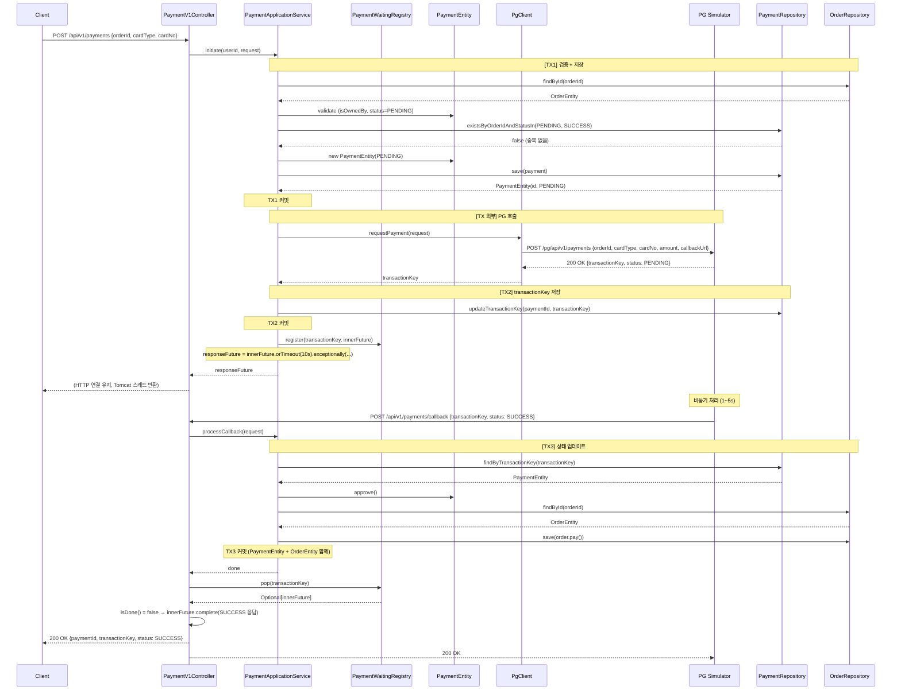
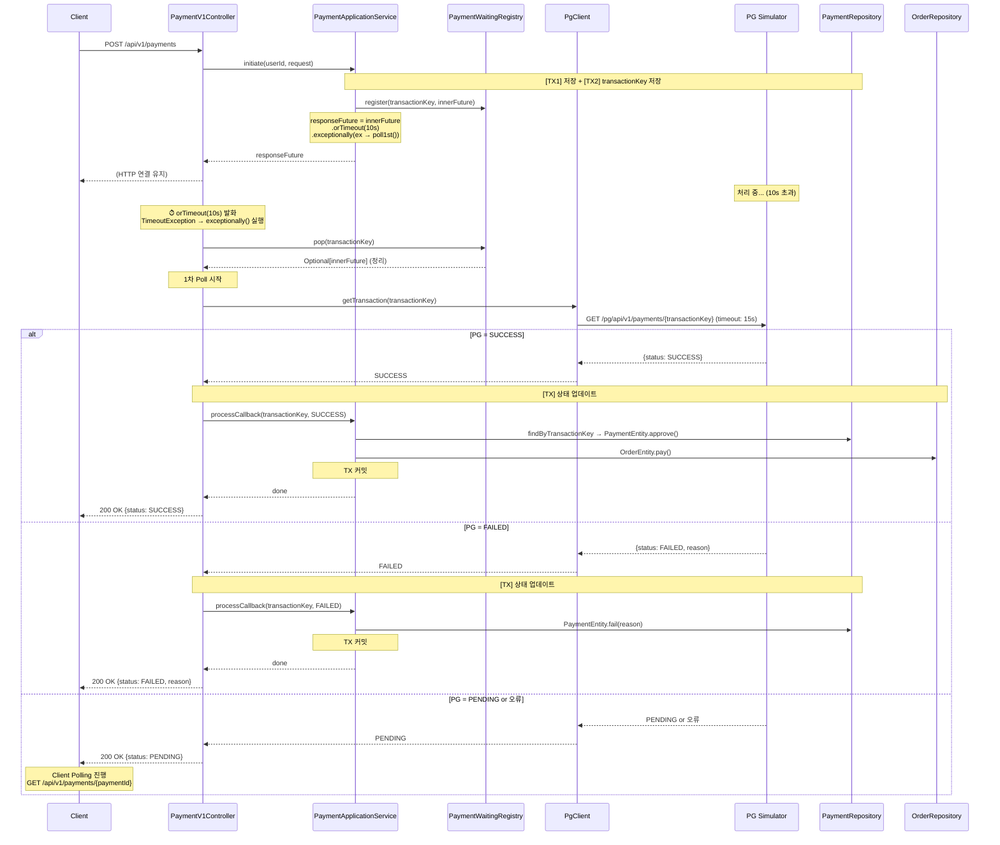
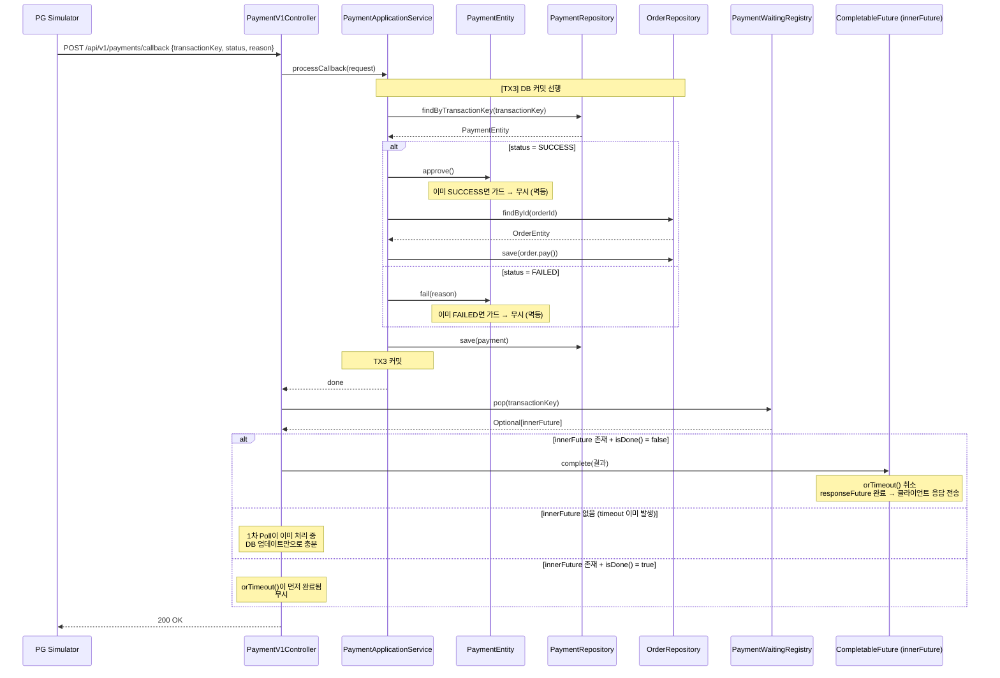
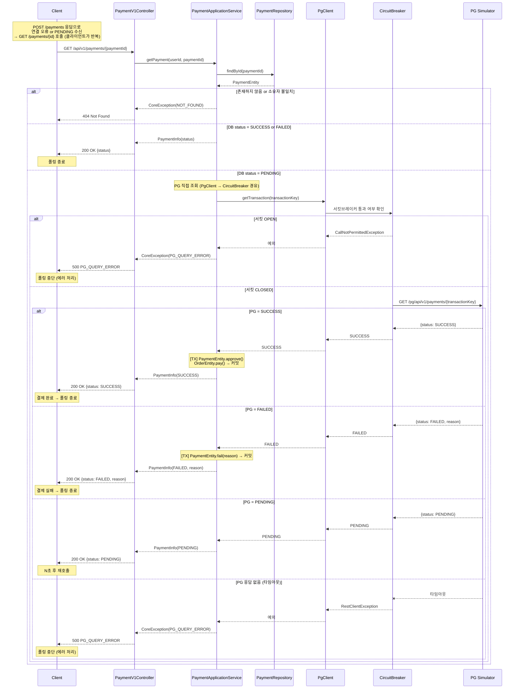
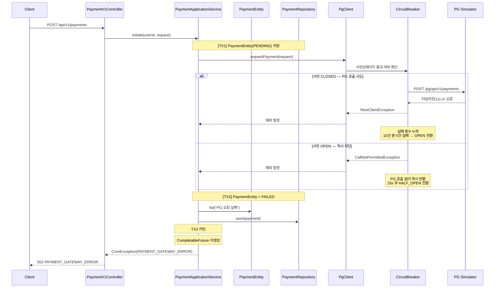
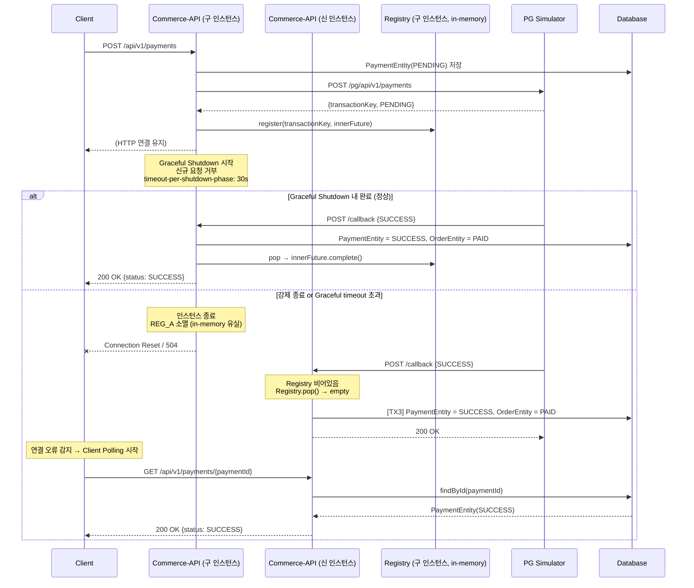
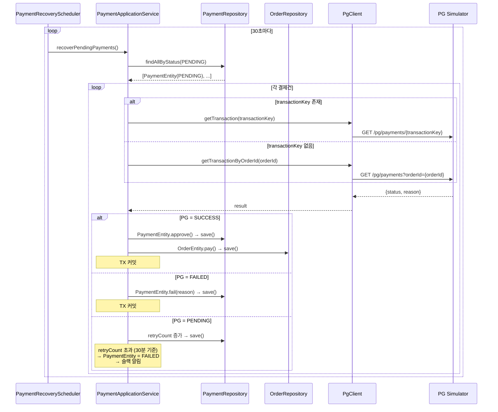

# Payment 도메인 시퀀스 다이어그램

- 작성일: 2026-06-24
- 최종 수정: 2026-06-25

---

## 1. POST /api/v1/payments — 정상 흐름 (콜백 10초 내 수신)

---

## 2. POST /api/v1/payments — timeout + 1차 Poll (10초 초과)

---

## 3. POST /api/v1/payments/callback — PG 콜백 수신

---

## 4. GET /api/v1/payments/{paymentId} — Client Polling (연결 끊김 fallback)

POST /api/v1/payments 응답으로 연결 오류 또는 PENDING을 수신한 경우 클라이언트가 호출한다.  
DB status가 PENDING인 경우 PG를 직접 조회하여 최신 상태를 반환한다.  
PG 조회는 PgClient를 경유하므로 서킷브레이커가 동일하게 적용된다.

> **클라이언트 반복 정책**: 서버는 요청 1건을 독립적으로 처리한다.  
> 클라이언트가 PENDING 응답을 받으면 N초 후 재호출하며, SUCCESS / FAILED / 에러 수신 시 중단한다.

---

## 5. POST /api/v1/payments — PG 요청 실패 (서킷브레이커)

---

## 6. 재배포 유실 + Client Polling fallback (Layer 2 + Layer 3)

---

## 7. Scheduler 복구 흐름 (미구현 — 추후 commerce-batch)

