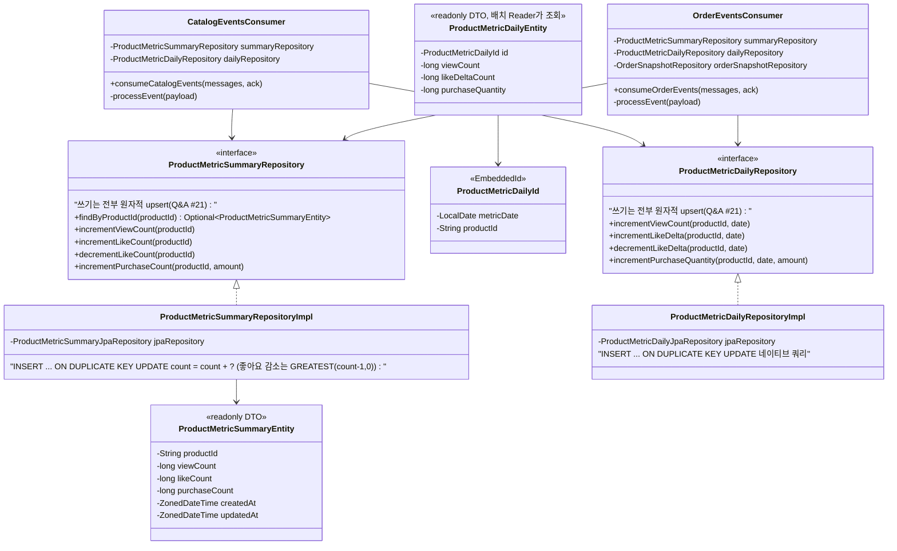
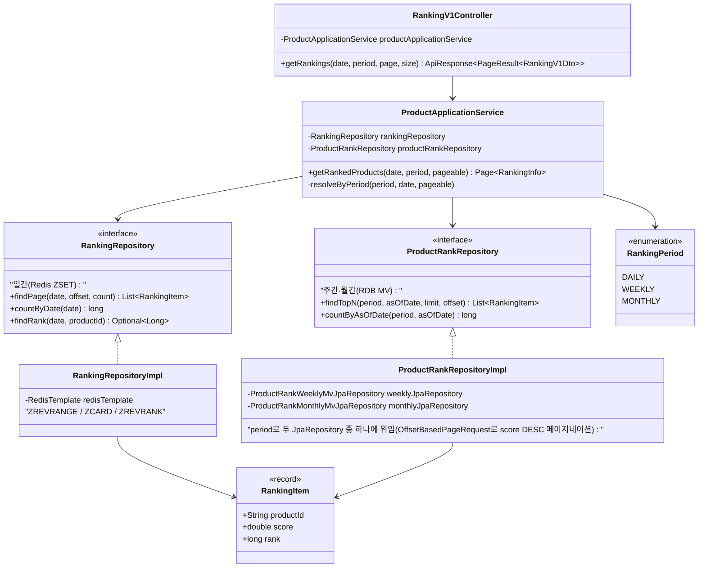

# 주간/월간 랭킹 배치 & MV — ERD / 클래스 다이어그램

- 작성일: 2026-07-23
- 관련 문서: [`01-design.md`](./01-design.md)

## 1. ERD

```mermaid
erDiagram
    product_metric_daily {
        date metric_date PK "일자"
        varchar product_id PK "FK 아님, 상품 참조용 문자열 ID"
        bigint view_count "조회수 (그날)"
        bigint like_delta_count "좋아요 증감 합 (+1/-1 누적, 음수 가능)"
        bigint purchase_quantity "구매 수량 (그날)"
        datetime created_at
        datetime updated_at
    }

    product_metric_summary {
        varchar product_id PK "ref_product_id, 상품 생성 시 1건 최초 insert"
        bigint view_count "누적 조회수"
        bigint like_count "누적 좋아요 수"
        bigint purchase_count "누적 구매 수량"
        datetime created_at "상품 생성(최초 insert) 시점"
        datetime updated_at "마지막 이벤트 반영 시점"
    }

    mv_product_rank_weekly {
        date as_of_date PK "배치 실행 기준일 (스냅샷)"
        varchar product_id PK "상품 참조용 문자열 ID"
        double score "최근 7일(어제 기준) 가중합 score"
        bigint view_sum "최근 7일 조회수 합"
        bigint like_delta_sum "최근 7일 좋아요 증감 합"
        bigint purchase_quantity_sum "최근 7일 구매 수량 합"
        datetime created_at
    }

    mv_product_rank_monthly {
        date as_of_date PK "배치 실행 기준일 (스냅샷)"
        varchar product_id PK "상품 참조용 문자열 ID"
        double score "최근 30일(어제 기준) 가중합 score"
        bigint view_sum "최근 30일 조회수 합"
        bigint like_delta_sum "최근 30일 좋아요 증감 합"
        bigint purchase_quantity_sum "최근 30일 구매 수량 합"
        datetime created_at
    }
```

> 참고: `product_id`는 `product` 테이블 PK를 가리키지만 CLAUDE.md 컨벤션상 실제 FK 제약 없이 문자열로 보관합니다 (기존 `product_metrics`, Redis 랭킹과 동일 관례).
> `view_sum` / `like_delta_sum` / `purchase_quantity_sum`은 `score` 산출의 구성요소를 그대로 노출해두어, 향후 가중치 정책이 바뀌어도 배치 재실행 없이 재계산할 수 있게 합니다 (`01-design.md` #10 관련, score 공식이 현재는 선형이라 필수는 아니지만 감사성/디버깅 목적으로 유지).

인덱스:
- `product_metric_daily`: PK `(metric_date, product_id)` — upsert 및 배치 Reader의 기간 범위 스캔에 사용.
- `mv_product_rank_weekly` / `mv_product_rank_monthly`: PK `(as_of_date, product_id)` + 보조 인덱스 `(as_of_date, score DESC)` — TOP 100 조회 시 `ORDER BY score DESC LIMIT 100` 성능 확보.

## 2. 클래스 다이어그램

### 2.1 commerce-streamer — 컨슈머 → daily/summary 쓰기

### 2.2 commerce-batch — 주간/월간 롤업 Job

```mermaid
classDiagram
    class ProductRankWeeklyJobConfig {
        +productRankWeeklyJob() Job
        +productRankWeeklyCleanupStep() Step
        +productRankWeeklyStep() Step
        +dailyMetricReader(requestDate) JdbcCursorItemReader~ProductMetricDailyRow~
        +productRankMvUpsertWriter(requestDate) ProductRankMvUpsertWriter
        +productRankMvCleanupTasklet(requestDate) ProductRankMvCleanupTasklet
    }
    class ProductRankMonthlyJobConfig {
        +productRankMonthlyJob() Job
        +productRankMonthlyCleanupStep() Step
        +productRankMonthlyStep() Step
        +dailyMetricReader(requestDate) JdbcCursorItemReader~ProductMetricDailyRow~
        +productRankMvUpsertWriter(requestDate) ProductRankMvUpsertWriter
        +productRankMvCleanupTasklet(requestDate) ProductRankMvCleanupTasklet
    }
    class ProductRankJobSupport {
        <<static helper>>
        "Weekly/Monthly가 공유하는 Step·Reader 조립 로직 (윈도우 일수·테이블만 파라미터로 다름)"
        +cleanupStep(...) Step
        +aggregateStep(...) Step
        +dailyMetricReader(...) JdbcCursorItemReader~ProductMetricDailyRow~
    }
    class ProductRankMvTable {
        <<enumeration>>
        "SQL에 삽입되는 테이블명을 제한하기 위한 enum"
        WEEKLY
        MONTHLY
    }

    class ProductMetricDailyRow {
        <<record>>
        +String productId
        +LocalDate metricDate
        +long viewCount
        +long likeDeltaCount
        +long purchaseQuantity
    }

    class ProductRankScoreProcessor {
        -double VIEW_WEIGHT
        -double LIKE_WEIGHT
        -double PURCHASE_WEIGHT
        +process(row) ProductRankScoreDelta
    }

    class ProductRankScoreDelta {
        <<record>>
        +String productId
        +double scoreDelta
        +long viewDelta
        +long likeDeltaDelta
        +long purchaseDelta
    }

    class ProductRankMvUpsertWriter {
        -JdbcTemplate jdbcTemplate
        -LocalDate asOfDate
        -ProductRankMvTable table
        +write(chunk~ProductRankScoreDelta~)
        "INSERT ... ON DUPLICATE KEY UPDATE score = score + new_row.score (row-alias 문법)"
    }

    class ProductRankMvCleanupTasklet {
        <<batch.job.productrank.step>>
        -JdbcTemplate jdbcTemplate
        -ProductRankMvTable table
        +execute(contribution, chunkContext)
        "DELETE FROM mv_product_rank_* WHERE as_of_date = ?"
    }

    class JobListener
    class StepMonitorListener
    class ChunkListener

    ProductRankWeeklyJobConfig --> ProductRankJobSupport
    ProductRankWeeklyJobConfig --> ProductRankMvCleanupTasklet : beforeStep
    ProductRankWeeklyJobConfig --> ProductRankScoreProcessor
    ProductRankWeeklyJobConfig --> ProductRankMvUpsertWriter
    ProductRankMonthlyJobConfig --> ProductRankJobSupport
    ProductRankMonthlyJobConfig --> ProductRankMvCleanupTasklet : beforeStep
    ProductRankMonthlyJobConfig --> ProductRankScoreProcessor
    ProductRankMonthlyJobConfig --> ProductRankMvUpsertWriter
    ProductRankMvUpsertWriter --> ProductRankMvTable
    ProductRankMvCleanupTasklet --> ProductRankMvTable
    ProductRankScoreProcessor --> ProductMetricDailyRow
    ProductRankScoreProcessor --> ProductRankScoreDelta
    ProductRankMvUpsertWriter --> ProductRankScoreDelta
    ProductRankWeeklyJobConfig --> JobListener
    ProductRankWeeklyJobConfig --> StepMonitorListener
    ProductRankWeeklyJobConfig --> ChunkListener
```

### 2.3 commerce-api — Ranking 조회 (일간/주간/월간 통합)

