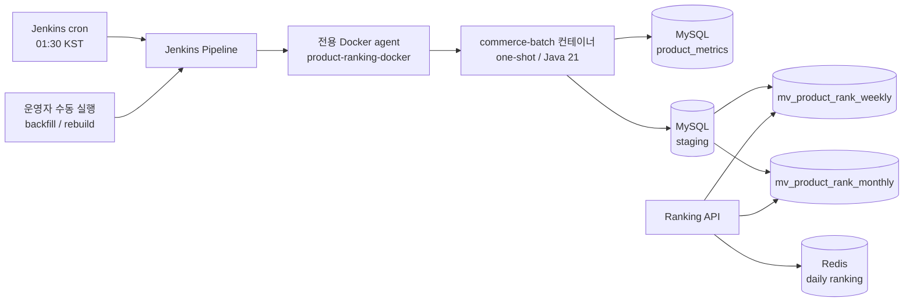

# 주·월간 상품 랭킹 Batch Design

## Introduction & Goals

### Context / Background

상품 조회·좋아요·주문 이벤트는 Kafka를 거쳐 `product_metrics`에 일간 단위로 누적된다. 기존 Ranking API는 Redis의 일간 랭킹을 제공하지만, 주간·월간 조회를 요청할 때마다 원천 메트릭을 집계하면 데이터 증가에 따라 조회 비용과 응답 지연이 함께 커진다.

이번 설계에서는 주·월간 TOP 100을 미리 계산한 물리 테이블을 조회 전용 Materialized View(MV)로 사용한다. MySQL 자체의 Materialized View 기능에 의존하는 것이 아니라, Spring Batch가 스냅샷 테이블을 명시적으로 갱신하는 방식이다. Batch 애플리케이션은 실행할 Job과 기준일을 받아 처리한 뒤 종료하는 one-shot 프로세스로 유지한다.

일간 랭킹은 이벤트 반영 지연을 작게 유지하는 것이 중요하므로 기존 Redis 실시간 처리 경로를 유지한다. 반면 주·월간 랭킹은 초 단위 최신성보다 넓은 기간의 반복 집계 비용과 조회 안정성이 중요하므로 배치 사전 집계를 선택한다. API는 이 차이를 감추고 같은 응답 계약으로 각 저장소를 라우팅한다.

현재 운영 단위는 단일 Docker 호스트이며 Kubernetes 클러스터는 없다. 따라서 Batch 하나의 스케줄을 위해 Kubernetes를 도입하지 않고, Docker 실행이 가능한 외부 Jenkins agent가 매일 컨테이너를 실행한다. Jenkins controller와 agent 설치 구성은 이 저장소의 범위에 포함하지 않는다.

### Goals

- `product_metrics`를 Chunk-Oriented 방식으로 읽어 대량 데이터에서도 재시작 가능한 주·월간 집계를 수행한다.
- 요청 기준일이 속한 주의 월요일부터 기준일까지, 해당 월의 1일부터 기준일까지를 각각 집계한다.
- `조회수 × 0.1 + 좋아요수 × 0.2 + 주문건수 × 1.0`을 상품 점수로 계산한다.
- 주·월간 TOP 100을 조회 전용 스냅샷으로 원자적으로 게시해 API 조회 비용을 제한한다.
- 기존 Redis 일간 랭킹과 API 응답 구조를 유지하면서 `daily`, `weekly`, `monthly`를 한 API로 제공한다.
- 매일 01:30 KST에 전일 기준 집계를 실행하고, 실패한 JobInstance를 같은 파라미터로 재시작할 수 있게 한다.
- 자격증명을 코드·이미지·저장소에 포함하지 않고 Jenkins Credentials에서 런타임에만 전달한다.

## Detailed Design

### System Architecture



Jenkins Pipeline은 전역 agent를 `product-ranking-docker` label로 고정한다. 따라서 controller에서는 checkout, Gradle 빌드, Docker 빌드, Batch 실행 중 어느 것도 수행하지 않는다. 하나의 Pipeline 실행은 다음 순서를 따른다.

1. 예약 실행 여부와 파라미터를 검증하고 `targetDate`를 결정한다.
2. 운영자가 `REFRESH_IMAGE=true`로 수동 실행한 경우에만 테스트, BootJar 생성, 이미지 빌드를 수행한다.
3. 예약 실행은 agent에 이미 존재하는 `BATCH_IMAGE`를 재빌드하거나 pull하지 않고 사용한다.
4. Jenkins Credentials의 DB 계정을 환경변수로 바인딩한다.
5. 기존 `docker/infra-compose.yml`과 `docker/batch-compose.yml`을 기존 기본 project 이름인 `docker`로 병합해 one-shot 컨테이너를 실행한다.
6. Java 프로세스의 종료 코드를 Docker Compose와 Jenkins에 그대로 전달한다. 0이 아니면 Pipeline은 실패한다.

자동 실행에는 임의의 `run.id`를 추가하지 않는다. `targetDate`가 동일한 실패 실행은 같은 JobInstance로 인식되므로, 원인을 제거한 뒤 같은 파라미터로 실행하면 완료된 Step 다음부터 재시작한다. 완료된 기준일의 원천 정정이 필요할 때만 운영자가 증가한 `rebuildSequence`를 지정해 새 JobInstance를 만든다.

#### Batch flow

`productRankingAggregationJob`은 다음 Step을 순차 실행한다.

1. staging 초기화 Tasklet
2. 주간 Reader / Processor / Writer Chunk Step
3. 주간 게시 Tasklet
4. 월간 Reader / Processor / Writer Chunk Step
5. 월간 게시 Tasklet

Reader는 `(metric_date, product_id)` 순서로 `product_metrics`를 페이징한다. Processor는 `BigDecimal`로 점수를 계산하고, Writer는 JobInstance·기간·상품별 점수를 staging에 누적한다. 게시 Tasklet은 대상 날짜의 기존 스냅샷 삭제와 TOP 100 삽입을 하나의 DB 트랜잭션으로 처리한다. 정렬은 `score DESC, product_id ASC`이고 동점에도 `ROW_NUMBER` 방식으로 1부터 연속 순위를 부여한다.

Chunk 또는 게시가 실패하면 기존 MV 스냅샷은 유지된다. 원천 데이터가 비어 있는 정상 실행에서는 해당 기준일의 기존 스냅샷을 삭제해 빈 결과를 게시한다. 주간 게시와 월간 게시는 각각 독립적인 원자적 트랜잭션이다.

### Data Models

물리 테이블과 Spring Batch 메타 테이블은 애플리케이션 배포 전에 명시적 DDL로 생성한다. 이번 범위에서는 Flyway를 도입하지 않고 `dev`, `qa`, `prd` 프로필의 스키마 자동 생성 설정도 변경하지 않는다.

#### Source: `product_metrics`

| 컬럼 | 역할 |
|---|---|
| `metric_date` | 일간 메트릭 기준일 |
| `product_id` | 상품 ID |
| `view_count` | 조회수 |
| `like_count` | 좋아요수 |
| `order_count` | 주문건수 |

집계 범위는 모두 양 끝 날짜를 포함한다.

- 주간: 기준일이 속한 주의 월요일 `~ targetDate`
- 월간: 기준일이 속한 달의 1일 `~ targetDate`

#### Snapshot: `mv_product_rank_weekly`, `mv_product_rank_monthly`

| 컬럼 | 타입/제약 | 역할 |
|---|---|---|
| `aggregation_date` | `DATE`, PK 일부 | API가 정확히 일치시킬 집계 기준일 |
| `period_start_date` | `DATE` | 실제 집계 시작일 |
| `period_end_date` | `DATE` | 실제 집계 종료일. `aggregation_date`와 동일 |
| `rank_position` | `SMALLINT`, PK 일부 | 1~100 연속 순위 |
| `product_id` | `BIGINT` | 상품 ID |
| `score` | `DECIMAL(30, 1)` | 소수 오차 없는 랭킹 점수 |
| `generated_at` | `DATETIME(6)` | 스냅샷 생성 시각 |

- Primary Key: `(aggregation_date, rank_position)`
- Unique Key: `(aggregation_date, product_id)`
- 한 기준일의 데이터는 최대 100행이다.
- 상품 삭제나 변경과 무관하게 집계 당시 순위를 보존하기 위해 상품 테이블 FK는 두지 않는다.

#### Staging: `stg_product_rank_aggregation`

| 컬럼 | 키 | 역할 |
|---|---|---|
| `job_instance_id` | PK 일부 | Spring Batch JobInstance 식별자 |
| `period_type` | PK 일부 | `WEEKLY` 또는 `MONTHLY` |
| `product_id` | PK 일부 | 상품별 누적 단위 |
| `score` |  | Chunk별 계산 점수의 누적값 |
| `created_at` |  | staging 행 최초 생성 시각 |
| `updated_at` |  | 마지막 Chunk 누적 시각 |

Primary Key는 `(job_instance_id, period_type, product_id)`다. Chunk 커밋 단위로 staging에 누적해 실패 후 재시작 시 이미 커밋된 Chunk를 다시 합산하지 않는다. Batch 메타 데이터 정리 정책과 staging 보존 기간이 다를 수 있으므로 메타 테이블에 물리 FK는 두지 않는다.

#### Job parameters

| 이름 | 필수 | 식별 여부 | 규칙 |
|---|---:|---:|---|
| `targetDate` | 예 | 예 | `yyyyMMdd`; 자동 실행은 서울 기준 전일 |
| `rebuildSequence` | 아니요 | 예 | 완료 JobInstance를 다시 만들 때만 증가한 양의 정수 |

일반 재시작에서는 `rebuildSequence`를 새로 만들거나 변경하지 않는다. 같은 `targetDate`와 같은 `rebuildSequence` 조합으로 다시 실행한다.
Job은 두 이름 이외의 파라미터를 거부하므로 `run.id` 같은 임의 식별자로 재집계 정책을 우회할 수 없다.

### API Design

```http
GET /api/v1/rankings?period=daily|weekly|monthly&date=yyyyMMdd&page=1&size=20
```

| 파라미터 | 기본값 | 규칙 |
|---|---|---|
| `period` | `daily` | `daily`, `weekly`, `monthly`만 허용 |
| `date` | 일간은 오늘, 주·월간은 전일 | `yyyyMMdd`; 주·월간 생략 시 서울 기준 전일 배치 스냅샷 조회 |
| `page` | `1` | 1-base 페이지 |
| `size` | `20` | 기존 최대 크기 검증 유지 |

- `daily`는 기존 Redis 일간 랭킹을 조회한다.
- `weekly`는 `mv_product_rank_weekly`, `monthly`는 `mv_product_rank_monthly`에서 `aggregation_date=date`인 스냅샷을 조회한다.
- 주·월간 스냅샷이 아직 생성되지 않았다면 오류 대신 빈 목록과 `totalCount=0`을 200으로 반환한다.
- 기존 응답 DTO, 시간별 랭킹 API, 상품 상세의 일간 순위는 변경하지 않는다.
- 테이블 이름은 검증된 기간 enum으로만 선택하고 사용자 입력을 SQL 식별자로 직접 연결하지 않는다.

### Constraints

- 이 변경은 이전 라운드에서 `product_metrics` 물리 테이블과 적재 consumer, Redis 일간·시간 랭킹 producer가 이미 배포되어 있다는 전제다. 현재 브랜치만 새 데이터베이스에 단독 배포할 때는 해당 선행 스키마와 애플리케이션을 먼저 배포해야 한다.
- `product_metrics`의 명시적인 일 마감 신호가 없다. 01:30 KST는 Kafka 소비 지연을 흡수하기 위한 초기 운영값이며, consumer lag와 일 마감 SLA가 정의되면 조정한다.
- Reader 재시작 키는 원천의 UNIQUE `(metric_date, product_id)`를 전제로 한다. Batch 실행 중 또는 실패 후 재시작 전에 이미 읽은 날짜의 원천이 바뀌면 기존 staging과 변경된 원천이 섞일 수 있으므로, 일 마감 이후에는 해당 범위를 고정하고 지연 이벤트는 완료 후 명시적 `rebuildSequence`로 반영한다.
- Pipeline의 `cron('30 1 * * *')`은 Jenkins controller 시간대가 `Asia/Seoul`이라는 전제다. controller와 agent의 시간대 설정을 배포 전 점검한다.
- Batch는 상시 실행 서버가 아니라 한 Job을 처리하고 종료하는 one-shot 애플리케이션이다.
- `docker/batch-compose.yml`은 단독 인프라가 아니다. 기존 `docker/infra-compose.yml`과 동일한 Compose project로 실행해 `mysql`, `redis-master`, `redis-readonly` 서비스 DNS를 사용한다.
- 예약 실행은 Docker agent 로컬의 승인 이미지를 사용하고 Registry에서 pull하지 않는다. 전용 agent가 여러 대가 되거나 agent가 휘발성으로 바뀌기 전에 이미지 Registry 도입이 선행되어야 한다.
- Jenkins의 Docker socket 접근은 호스트 제어 권한에 준한다. 전용 agent는 보호된 브랜치의 검토된 Pipeline만 실행하도록 권한과 label 사용 범위를 제한한다.
- DB 사용자명과 비밀번호는 Jenkins의 `product-ranking-mysql` Username/Password Credential에서 주입한다. 로그에 `docker compose config`의 전체 결과나 환경변수를 출력하지 않는다.
- Spring Batch 메타 테이블, MV, staging DDL은 애플리케이션보다 먼저 배포한다. 운영 프로필에서는 런타임 스키마 생성을 사용하지 않는다.
- `disableConcurrentBuilds()`는 이 Jenkins Job 안의 중복 실행을 막지만, 다른 Job이나 운영자가 같은 파라미터로 직접 컨테이너를 실행하는 것까지 막지는 않는다. Spring Batch JobRepository의 JobInstance 식별과 MV 트랜잭션이 마지막 방어선이다.
- 전체 Pipeline timeout은 2시간이다. 업무 Batch stage에 자동 전체 재시도를 두지 않으며 실패 원인 확인 후 동일 파라미터로 재실행한다.
- Jenkins cron은 agent 장기 중단 중의 누락 날짜를 자동 보충하지 않는다. 복구 시 `BATCH_JOB_EXECUTION_PARAMS`와 MV의 최신 `aggregation_date`를 서울 기준 전일까지 대조하고, 누락된 `targetDate`를 오래된 날짜부터 수동 backfill한다.
- timeout, agent 장애, 호스트 강제 종료로 Java 프로세스가 정상적인 실패 상태를 기록하지 못하면 JobExecution이 `STARTED`로 남을 수 있다. 동일 파라미터 재실행 전에 실제 Batch 컨테이너가 종료됐는지 확인하고, 스키마 버전에 맞춰 승인된 메타데이터 복구 절차로 해당 JobExecution과 실행 중이던 StepExecution을 `FAILED`로 정리한다. `JobOperator.stop()`은 죽은 프로세스의 상태를 `FAILED`로 확정하지 않으며 `abandon()`은 재시작을 금지하므로 이 복구 수단으로 사용하지 않는다. 실행 중인 컨테이너가 확인되면 메타데이터를 먼저 수정하지 않는다.

#### Deployment and operations

1. `database/schema/product-ranking-aggregation.sql`과 `database/schema/spring-batch-mysql.sql`을 MySQL에 적용한다.
2. Jenkins controller 시간대를 `Asia/Seoul`로 설정한다.
3. 단일 agent에 `product-ranking-docker` label과 Docker/Compose 권한을 부여하고, `product-ranking-mysql` Credential을 등록한다.
4. 예약 트리거를 비활성화한 상태에서 `REFRESH_IMAGE=true` 수동 실행으로 테스트·BootJar·이미지 빌드와 dry-run을 수행한다.
5. 필요한 `TARGET_DATE`를 지정해 backfill하고 일간·주간·월간 API 결과를 비교한다.
6. 예약 실행을 활성화하고 01:30 KST 실행을 확인한다.
7. Jenkins 결과, 컨테이너 로그, `BATCH_JOB_EXECUTION`의 최종 상태를 실패 알림 기준으로 연결한다.

인프라는 Batch 실행 전에 같은 Compose project로 기동되어 있어야 한다.

```bash
docker compose --project-name docker \
  --file docker/infra-compose.yml \
  up -d mysql redis-master redis-readonly
```

Compose 병합 구성을 비밀값을 출력하지 않고 검증하려면 테스트용 환경변수를 명시한다.

```bash
MYSQL_USER=application \
MYSQL_PWD=application \
docker compose --project-name docker \
  --file docker/infra-compose.yml \
  --file docker/batch-compose.yml \
  --profile batch \
  config --quiet
```

수동 backfill은 `TARGET_DATE`를 지정하고 `REFRESH_IMAGE=false`로 기존 승인 이미지를 사용한다. 실패한 실행은 같은 `TARGET_DATE`와 같은 `REBUILD_SEQUENCE`로 재실행한다. 완료된 날짜를 원천 정정 때문에 재생성할 때만 이전보다 큰 `REBUILD_SEQUENCE`를 지정한다.

## Performance & Operational Validation

### Workload model

일평균 `product_metrics` 행 수를 `A`라고 하면 월말 최악 조건에서 주간 Reader는 `7A`, 월간 Reader는 `31A`를 처리한다. 현재 Job은 두 기간을 독립적으로 읽으므로 총 처리 item 수는 최대 `38A`다.

```text
required items/s = 38 × daily product_metrics rows / allowed batch window seconds
chunk commits     = ceil(38 × daily product_metrics rows / chunk size)
```

예를 들어 일간 10만 행, Chunk 100이면 최대 380만 item과 약 38,000번의 Chunk 커밋이 발생한다. 따라서 Job 전체 시간만이 아니라 Reader 페이지 조회, Writer upsert, 커밋, Batch 메타데이터 갱신과 Chunk 로그 비용을 함께 측정한다.

### Executable performance harness

성능 테스트는 운영 Jenkins Pipeline과 분리된 로컬·전용 Docker 실행 경로를 사용한다.

| 하네스 | 경로 | 역할 |
|---|---|---|
| Batch | `performance/product-ranking/batch/run.sh` | 전용 DB 생성, 합성 원천 적재, one-shot Batch 실행, 결과 검증·수집 |
| API | `performance/product-ranking/k6/run-ranking-api.sh` | `daily`, `weekly`, `monthly` constant-arrival-rate 부하 및 threshold 판정 |

Batch 하네스는 DB 이름이 `_perf`로 끝나고 `PERF_CONFIRM_DATABASE_RESET` 값이 DB 이름과 정확히 일치할 때만 실행된다. 기본 DB `loopers`나 운영·공유 QA DB를 대상으로 실행하지 않는다. 합성 `product_metrics`는 이전 라운드와 같은 surrogate PK, UNIQUE `(metric_date, product_id)`, 날짜 인덱스와 부가 컬럼을 사용한다.

`2026-05-31`은 일요일이자 월말이므로 주간 7일과 월간 31일을 모두 읽는 최대 경계를 재현한다.

```bash
PERF_DATABASE_NAME=loopers_product_ranking_perf \
PERF_CONFIRM_DATABASE_RESET=loopers_product_ranking_perf \
PERF_TARGET_DATE=20260531 \
PERF_DAILY_PRODUCTS=100000 \
PERF_DAYS=31 \
PERF_DATA_SEED=42 \
PERF_CHUNK_SIZE=1000 \
PERF_LOG_INTERVAL=100 \
PERF_CPUS=2.0 \
PERF_MEMORY=2g \
PERF_BUILD_IMAGE=true \
./performance/product-ranking/batch/run.sh
```

`PERF_CHUNK_SIZE`는 Step의 commit 크기와 Reader의 page/fetch 크기에 동일하게 적용된다. 운영 기본값은 100이다. 일반 비교 실행은 새 `rebuildSequence`를 사용하고, 실패한 JobInstance 재시작만 기존 결과의 `rebuildSequence`, Chunk 크기, seed와 원천 데이터를 그대로 재사용한다. 재시작 도중 Chunk 크기를 바꾸면 저장된 Reader 위치와 커밋 경계 비교가 무효가 되므로 금지한다.

API 동시 부하처럼 Batch 시작 시점을 정렬해야 하는 비교 실행은 성공한 데이터 준비 실행 뒤 `PERF_RESET_DATABASE=false PERF_PREPARE_DATASET=false`를 사용한다. 이 모드는 합성 원천을 다시 삭제·생성하지 않고 대상 날짜 범위, 행 수, 상품 수, 상품 ID 범위와 UNIQUE 인덱스를 검증한 뒤 기존 원천을 재사용한다. 전용 DB를 새로 만드는 `PERF_RESET_DATABASE=true`와는 함께 사용할 수 없다.

Chunk 지연 분포를 구할 때는 `PERF_LOG_INTERVAL=1`로 모든 `PERF_CHUNK` 로그를 `chunk-metrics.csv`로 수집한다. 순수 처리량 기준선은 로그 I/O 영향을 줄이기 위해 `100` 또는 `0`으로 별도 실행한다. 두 결과를 같은 benchmark로 취급하지 않는다.

Batch 결과는 `build/performance/product-ranking/<run-id>/`에 생성되며 Git에 포함하지 않는다.

| 결과 파일 | 내용 |
|---|---|
| `manifest.env` | Git SHA, 이미지 ID, 입력 규모, Chunk, 자원 제한, 종료 코드와 상태 |
| `job-execution.csv`, `step-executions.csv` | Job·Step 시간, read/write/commit/rollback/skip, items/s |
| `chunk-metrics.csv` | 수집된 Chunk별 시간과 read/write delta |
| `container-stats.tsv`, `container-result.tsv` | CPU·메모리·I/O 시계열, 종료 상태와 OOM 여부 |
| `mysql-status-delta.tsv` | buffer pool, fsync, redo, 임시 테이블 등 실행 전후 차이 |
| `database-report.tsv` | MV checksum, 원천·테이블 크기와 Batch 메타데이터 요약 |
| `batch.log` | 구조화된 Job·Step·Chunk 로그와 실패 원인 |

API 부하는 실행 중인 `commerce-api`와 해당 날짜의 활성 상품·브랜드, Redis 일간 ZSET, 주·월간 MV 스냅샷을 전제로 한다. Ranking API가 상품을 bulk 조회한 뒤 존재하지 않는 상품을 제외하므로, MV와 Redis의 상품 ID가 실제 활성 상품 ID와 일치해야 한다.

로컬 DB에 MV DDL과 활성 상품이 준비된 경우 다음 명령은 요청 날짜의 주·월간 스냅샷과 Redis 일간 키만 같은 상품 ID로 교체한다. 기본 DB는 `loopers`이며, 다른 DB는 안전을 위해 이름이 `_perf`로 끝나야 한다. 다른 날짜와 상품 원본은 변경하지 않으며 명시적 확인값 없이는 실행되지 않는다.

```bash
PERF_CONFIRM_API_FIXTURE=YES \
PERF_API_DATABASE_NAME=loopers_product_ranking_perf \
TARGET_DATE=20260531 \
FIXTURE_COUNT=100 \
./performance/product-ranking/k6/prepare-ranking-api-fixture.sh
```

```bash
TARGET_DATE=20260531 \
BASE_URL=http://localhost:8080 \
DURATION=10m \
DAILY_RPS=70 \
WEEKLY_RPS=20 \
MONTHLY_RPS=10 \
EXPECTED_DAILY_TOTAL_COUNT=100 \
EXPECTED_WEEKLY_TOTAL_COUNT=100 \
EXPECTED_MONTHLY_TOTAL_COUNT=100 \
./performance/product-ranking/k6/run-ranking-api.sh
```

k6는 기간별 `period` 태그를 붙이고 상태·응답 계약·데이터 존재 여부를 검증한다. 기본 threshold는 기간별 p95 `< 100ms`, p99 `< 250ms`, 실패율 `< 0.1%`, check 성공률 `> 99.9%`, dropped iteration `0`이다. 결과는 기본적으로 `build/reports/k6/ranking-api-summary.json`에 저장되고 threshold 위반은 0이 아닌 종료 코드로 전달된다.

### Test scenarios

| 시나리오 | 검증 목적 |
|---|---|
| Smoke, 일간 1천 행 | 데이터 생성부터 결과 수집까지 실행 경로 확인 |
| 운영 예상 P99 | 정상 완료시간과 처리량 기준선 |
| P99의 1.5배·2배 | 용량 여유와 Jenkins 2시간 timeout 한계 |
| Chunk 100/500/1,000/5,000 | 페이지·commit 비용과 메모리·재처리량 비교 |
| warm/cold MySQL | buffer pool 의존성 확인 |
| 전체 동점·점수 편향 | TOP 100 window 정렬 비용과 tie-breaker 검증 |
| API baseline / Batch 중 / 게시 중 / 종료 후 | MySQL 자원 경쟁과 latency 회복 확인 |
| Writer 실패 후 restart | 커밋 이후 재개, 중복 누적 방지와 복구시간 |
| 게시 실패 | 기존 MV 보존과 재시작 게시시간 |
| SIGTERM / SIGKILL | 정상 실패와 `STARTED` 잔류 복구 절차 분리 |

Batch와 API 공존 테스트는 같은 RPS·데이터·warm 상태로 Batch 전, 실행 중, 게시 구간, 종료 후를 각각 측정한다. Redis 일간도 상품·브랜드 bulk 조회를 위해 MySQL을 사용하므로 모든 기간이 Batch와 DB 자원을 경쟁한다.

### Metrics and initial acceptance criteria

실제 P99 원천량과 야간 API SLO가 확정되기 전까지 다음 값은 임시 기준으로 사용한다.

| 영역 | 지표 | 초기 기준 |
|---|---|---|
| Batch | 운영 P99 / 1.5배 / 2배 월말 Job 시간 | 60분 / 90분 / 120분 이내 |
| 처리량 | Step별 items/s와 데이터 증가 선형성 | 데이터 10배 증가 시 시간 12배 이내 |
| Chunk | p50/p95/p99, commit·rollback | rollback·skip 0, 예상 read/write와 일치 |
| JVM·컨테이너 | CPU, peak RSS, GC | CPU p95 `< 80%`, RSS `< limit 75%`, GC 시간 `< 5%` |
| MySQL | rows examined, disk temp table, lock·deadlock, pool wait | connection timeout·deadlock 0, 장시간 lock 없음 |
| 게시 | 주·월간 게시 Step 시간과 API 관찰 결과 | 각 5초 이내, 부분 스냅샷 0건 |
| API | 기간별 p95/p99, 오류율, dropped iterations | p95 `< 100ms`, p99 `< 250ms`, 오류 `< 0.1%`, drop 0 |
| 공존 영향 | Batch 전 대비 API latency | p95 증가 `< 20%`, p99 증가 `< 30%` |
| 재시작 | 재처리량, 시간, 최종 checksum | 미커밋 Chunk 외 재처리 0, 정상 실행과 checksum 동일 |

Reader는 `EXPLAIN ANALYZE`에서 `(metric_date, product_id)` 유니크 인덱스의 range scan을 사용하는지 확인한다. 게시 쿼리는 `ROW_NUMBER()`가 디스크 임시 테이블로 전환되는지, staging의 score 보조 인덱스 갱신 비용이 Writer 처리량을 제한하는지 함께 확인한다.

### Result record

성능 결과에는 수치뿐 아니라 테스트 환경을 함께 기록한다. 아래 값은 2026-07-23 KST에 실행한 로컬 합성 부하 결과이며 운영 용량을 의미하지 않는다.

- 기준 Git SHA: `2410150a6a369b01b1fc7d9f05f7144caa76399e`, `git_dirty=true`
- Host: macOS 15.5, Apple M2 Pro 10 core, 16GB, arm64
- Docker Desktop Engine 28.1.1: VM 10 vCPU, 8,322,686,976 bytes memory
- Batch: Eclipse Temurin Java 21, Spring Boot 3.4.4, 이미지 `sha256:d7e17ffb20bfac8e1b87182b68fe24a0121621e53f338f15203456b7556c956c`, 2 vCPU / 2GiB 제한
- API: Amazon Corretto 21.0.2 host JVM, `show-sql=false`, `ddl-auto=none`; JVM heap/GC 옵션은 별도로 고정하지 않음
- MySQL 8.0.46: buffer pool 128MiB, `max_connections=151`, Performance Schema 활성화
- Hikari: maximum 40, minimum idle 30
- 원천: 기준일 `2026-05-31`, 31일 × 100,000행 = 3,100,000행, 상품 100,000개 반복, seed 42, API 상품 ID와 맞추기 위해 `PERF_PRODUCT_ID_BASE=0`
- Batch 총 read/write: 주간 700,000 + 월간 3,100,000 = 각각 3,800,000건
- API: page 1, size 20, 200 RPS, `daily:weekly:monthly=140:40:20`, 사전 VU `80:30:20`
- 캐시 상태: 데이터 적재 직후 또는 기존 데이터 재사용 상태이며 cold/warm buffer pool을 강제로 통제하지 않음

Docker CPU는 한 개 core를 100%로 표시하므로 2 vCPU 제한의 최대값을 200%로 해석한다. 아래 괄호 안 값은 2 vCPU 제한에 대해 정규화한 비율이다. CPU p95에는 JVM 시작 구간이 포함되며, 짧은 one-shot Job에서 시작 샘플의 영향이 크므로 median과 시계열을 함께 확인해야 한다. 메모리는 Docker stats의 container memory usage이며 프로세스 RSS와 완전히 같은 값은 아니다.

| 시나리오 | Batch read | Chunk | Job / 컨테이너 시간 | items/s | CPU p95 | Peak container memory | 주간 / 월간 게시 | 결과 |
|---|---:|---:|---:|---:|---:|---:|---:|---|
| 합성 월말, 기본 Chunk | 3,800,000 | 100 | 362.728s / 369s | 10,476 | 44.05% (22.0%) | 288.7MiB | 482.8ms / 493.0ms | 기능·60분 기준 PASS |
| 합성 월말, 비교 기준 | 3,800,000 | 1,000 | 108.500s / 115s | 35,023 | 164.45% (82.2%) | 310.2MiB | 577.3ms / 417.1ms | 기능·시간 PASS, CPU 임시 기준 경계 초과 |
| 합성 월말 + API 주요 처리 구간 | 3,800,000 | 1,000 | 140.377s / 148s | 27,070 | 202.44% (101.2%) | 304.3MiB | 620.5ms / 443.1ms | 기능·시간 PASS, CPU·공존 p95 임시 기준 FAIL |
| 운영 P99 / 1.5배 / 2배 | - | - | - | - | - | - | - | 실제 원천 분포 미확정으로 미측정 |
| 실패 후 restart | - | - | - | - | - | - | - | 미측정 |

Chunk 1,000은 같은 310만 원천에서 기본 Chunk 100보다 Job 시간을 68.74% 줄이고 처리량을 3.20배 높였다. 두 실행 모두 read/write 수가 3,800,000으로 일치했고 rollback·skip은 0이었다. 주·월간 스냅샷은 각각 100행, 순위 1~100이며 모든 Batch 실행의 checksum은 weekly `224757281584`, monthly `173202675288`로 동일했다. `Created_tmp_disk_tables`, `Innodb_log_waits`, 누적 row lock wait와 최대 연결 수 오류는 0이었다.

`PERF_LOG_INTERVAL=100` 샘플에서 기본 Chunk 100의 월간 Chunk p95는 13.105ms였다. 동일 이미지·데이터의 Chunk 1,000 비교 기준은 weekly 30.629ms, monthly 32.134ms였고, API 주요 처리 구간 동시 실행에서는 75.882ms, 66.961ms로 증가했다. 이는 모든 Chunk가 아니라 매 100번째 Chunk 표본의 분포다.

API 단독 기준은 2분간 정확히 24,000건을 실행했다. 주요 처리 구간 동시 실행은 API 시작 약 8초 뒤 Batch 컨테이너가 시작되도록 정렬하고 150초간 30,003건을 실행했다. 이 구간은 JVM 시작, 주간 Chunk·게시와 월간 300만/310만 건까지 포함했지만, API 부하는 월간 게시 약 4초 전에 끝났다. 이를 보완하는 별도 2분 tail 실행은 월간 집계 후반, 월간 게시와 Batch 종료 후 구간을 포함해 24,003건을 측정했다.

| API 시나리오 | daily p95 / p99 | weekly p95 / p99 | monthly p95 / p99 | 실패 / drop | 판정 |
|---|---:|---:|---:|---:|---|
| 단독 200 RPS, 2분 | 9.37 / 49.22ms | 13.21 / 60.99ms | 13.03 / 65.14ms | 0 / 0 | 절대 SLO PASS |
| Batch 주요 구간 동시 200 RPS, 150초 | 12.96 / 35.48ms | 17.99 / 44.42ms | 18.40 / 44.47ms | 0 / 0 | 절대 SLO PASS |
| p95 변화 | +38.36% | +36.17% | +41.21% | - | 공존 `< 20%` 기준 FAIL |

두 동시 실행의 54,006개 응답은 모두 `totalCount=100`과 응답 계약을 만족해 주간·월간 게시를 포함한 행 개수 기준의 부분 MV 스냅샷 관찰은 0건이었다. 다만 이 검증은 100행 내부의 상품·점수가 구·신 스냅샷 중 어느 것인지까지 판별하지 않으므로 Batch checksum 검증으로 보완했다. 주요 처리 구간 동시 실행 시 Batch Job 시간은 같은 이미지·원천의 무부하 기준보다 29.38% 증가하고 처리량은 22.71% 감소했다. API p99가 기준선보다 낮게 나온 값은 실행 간 분산과 캐시 영향이 섞인 결과이므로 개선으로 해석하지 않는다.

첫 200 RPS 실행은 사전 VU 70에서 응답 실패는 없었지만 k6가 14개 iteration을 시작하지 못해 FAIL이었다. 사전 VU를 130으로 고정한 재실행과 동시 실행은 drop 0이었다. 따라서 200 RPS 재현 명령에는 `DAILY_VUS=80`, `WEEKLY_VUS=30`, `MONTHLY_VUS=20`을 명시한다.

원시 결과는 Git에 포함하지 않고 다음 로컬 경로에 보존한다.

- Chunk 100: `build/performance/product-ranking/20260531-900100-20260722205036-18887/`
- Chunk 1,000 비교 기준: `build/performance/product-ranking/20260531-901003-20260722212355-34089/`
- 주요 처리 구간 동시 Batch: `build/performance/product-ranking/20260531-901002-20260722211941-32201/`
- API 단독: `build/performance/product-ranking/api-baseline-200rps-retry-20260723.json`
- API 주요 처리 구간 동시: `build/performance/product-ranking/api-concurrent-full-batch-200rps-20260723.json`
- API 게시·종료 tail 동시: `build/performance/product-ranking/api-concurrent-batch-200rps-20260723.json`

현재 결과에서 Chunk 1,000을 다음 운영 후보로 선택할 수 있지만, 공존 p95와 시작 구간 CPU 임시 기준은 통과하지 못했다. 운영 채택 전 실제 야간 API RPS와 원천 P99를 확보하고 MySQL·API·Batch를 운영과 같은 자원 격리 조건에서 재측정해야 한다. MySQL buffer pool이 원천 테이블·인덱스보다 작고 load generator와 API가 같은 호스트에 있다는 점도 이번 수치를 운영 한계로 일반화할 수 없는 이유다. 이번 실행은 JVM GC 시간을 별도로 수집하지 않았으므로 GC `< 5%` 기준도 아직 판정하지 않는다.

Batch는 HTTP 서버 없이 종료되는 one-shot 프로세스이므로 Prometheus pull만으로 실행 메트릭 수집을 보장할 수 없다. Batch 합격 판정의 기준 데이터는 Spring Batch 메타 테이블, 컨테이너 로그, Docker stats와 격리된 MySQL Performance Schema의 실행 전후 차이다. 성능 runner는 컨테이너를 detached·고정 이름으로 실행하고 종료 전에 stats·inspect·logs를 수집한 뒤 실제 종료 코드를 보존해 컨테이너를 제거한다. API JVM·HTTP·Hikari 지표는 기존 Prometheus를 사용할 수 있다.

## Alternatives Considered

| 옵션 | Pros | Cons |
|---|---|---|
| A. 애플리케이션 `@Scheduled` | 별도 스케줄러 없이 구현이 단순하고 로컬 실행이 쉽다. | API/Batch 인스턴스 수에 따라 중복 실행될 수 있고, 재시작·실행 이력·수동 backfill·배포와 스케줄의 분리가 약하다. 상시 실행 프로세스가 필요하다. |
| B. Kubernetes CronJob | 스케줄, 동시성 정책, 리소스 제한, Job 이력과 컨테이너 실행 모델이 자연스럽게 결합된다. | 현재 없는 Kubernetes 클러스터를 Batch 하나 때문에 도입·운영해야 하며 단일 Docker 호스트 환경에는 비용이 과하다. CronJob도 중복·누락 가능성을 전제로 멱등성을 구현해야 한다. |
| **선택: C. Jenkins Pipeline** | 기존 Docker 호스트에서 cron, 동시 실행 제한, 수동 파라미터 backfill, 자격증명, 로그와 성공/실패 이력을 제공한다. 이미지 갱신과 업무 실행을 분리할 수 있다. | controller/agent 운영과 Docker socket 권한 관리가 필요하다. 로컬 이미지 방식은 단일 고정 agent에 종속된다. |

**선택 근거:** 현재의 배포 단위와 운영 역량은 단일 Docker 호스트에 맞춰져 있다. Jenkins는 새로운 오케스트레이션 플랫폼을 도입하지 않고도 외부 스케줄러, 실행 이력, 동시 실행 방지, 수동 파라미터 실행이라는 요구를 충족한다. [Spring Batch 공식 FAQ](https://docs.spring.io/spring-batch/reference/faq.html)가 설명하는 것처럼 Spring Batch는 스케줄러가 아니라 재시작 가능한 Job 실행 엔진에 집중하고, 실행 시점은 [Jenkins Pipeline](https://www.jenkins.io/doc/book/pipeline/syntax/)이 책임지도록 경계를 나눈다.

전체 애플리케이션이 Kubernetes로 이전되면 Jenkins는 이미지 빌드·Registry push·배포만 담당하고 실행 스케줄은 [Kubernetes CronJob](https://kubernetes.io/docs/concepts/workloads/controllers/cron-jobs/)으로 옮긴다. 이때도 `targetDate`/`rebuildSequence`의 멱등 JobInstance, staging 기반 재시작, MV 원자 교체 구조는 그대로 재사용한다. CronJob의 `concurrencyPolicy`와 deadline은 추가 방어 수단으로 설정하되 중복·누락이 절대 없다고 가정하지 않는다.
