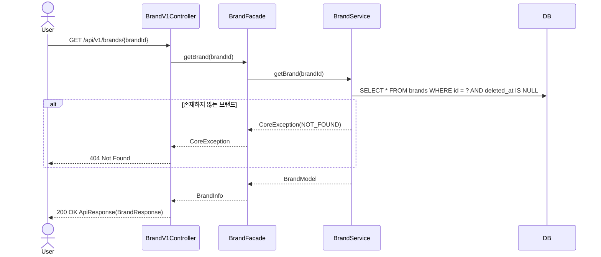
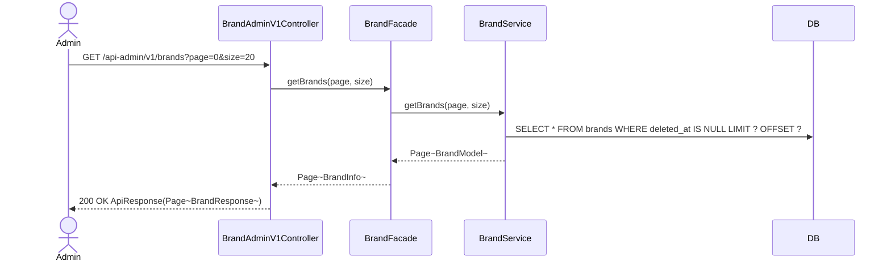
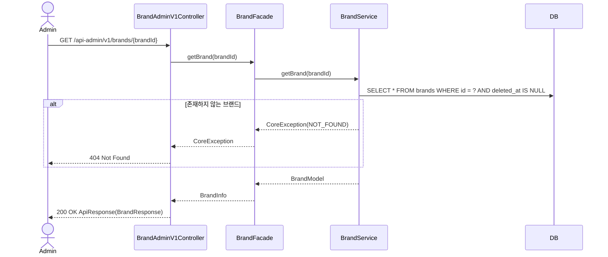
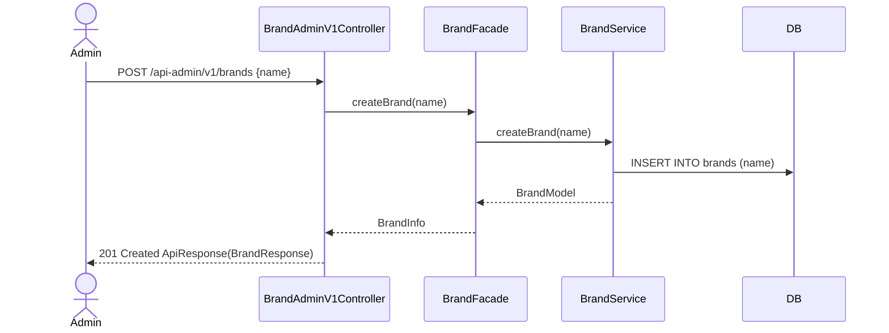
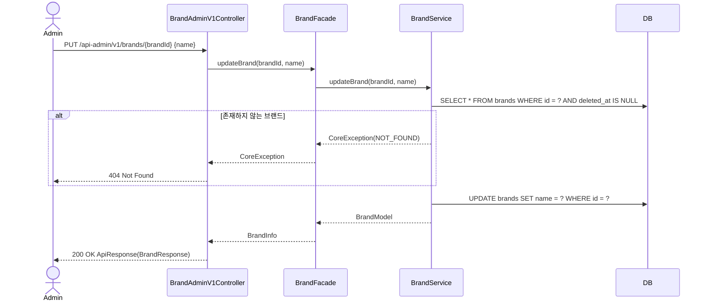
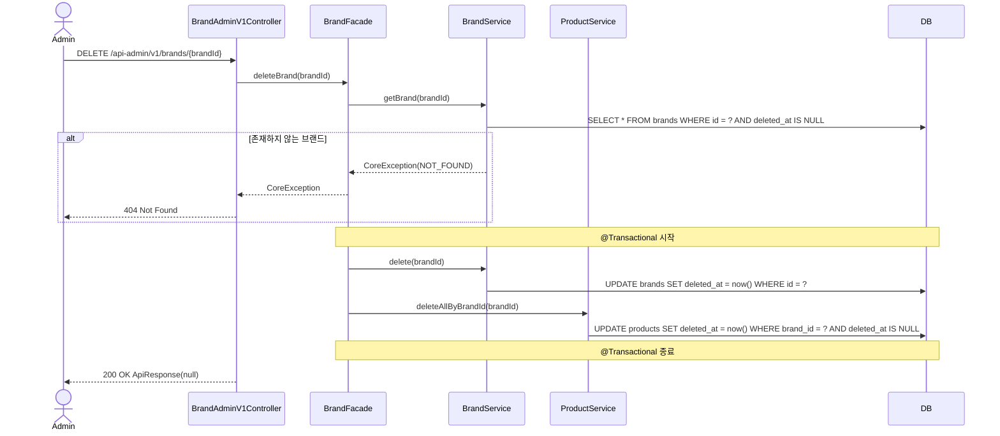

# Brand Sequence Diagrams

## GET /api/v1/brands/{brandId}

---

## GET /api-admin/v1/brands

---

## GET /api-admin/v1/brands/{brandId}

---

## POST /api-admin/v1/brands

---

## PUT /api-admin/v1/brands/{brandId}

---

## DELETE /api-admin/v1/brands/{brandId}

