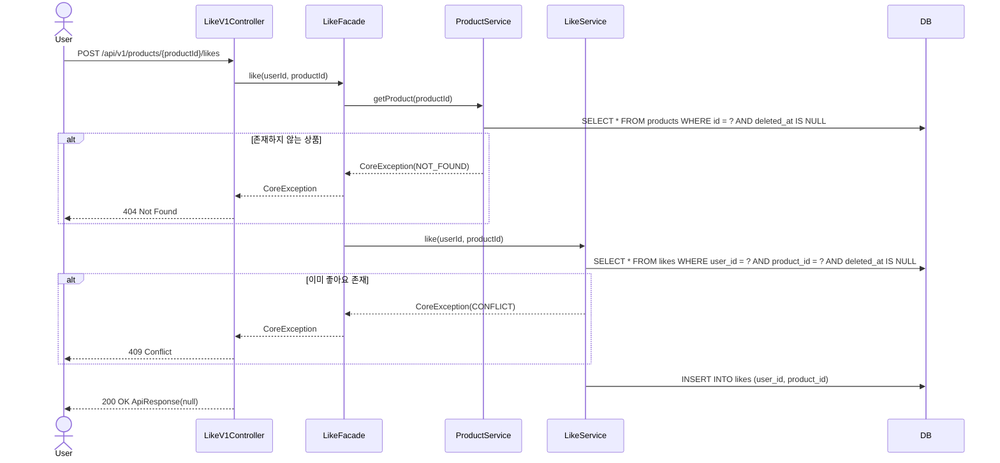
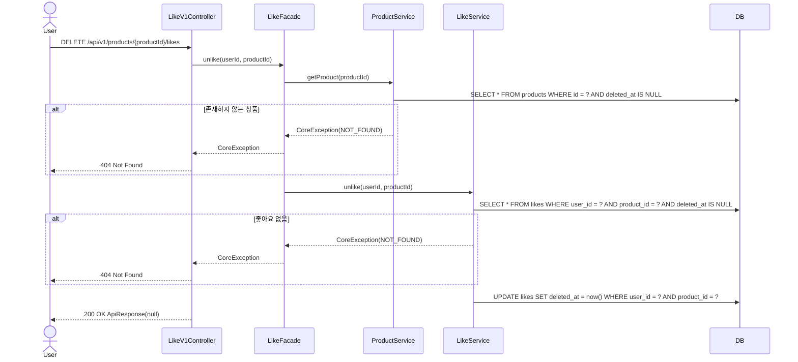
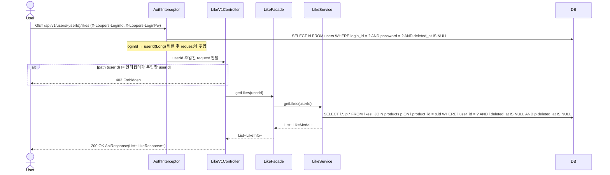

# Like Sequence Diagrams

## POST /api/v1/products/{productId}/likes

```mermaid
sequenceDiagram
    actor User
    participant Controller as LikeV1Controller
    participant Facade as LikeFacade
    participant ProductService
    participant LikeService
    participant DB

    User->>Controller: POST /api/v1/products/{productId}/likes
    Controller->>Facade: like(userId, productId)
    Facade->>ProductService: getProduct(productId)
    ProductService->>DB: SELECT * FROM products WHERE id = ? AND deleted_at IS NULL
    alt 존재하지 않는 상품
        ProductService-->>Facade: CoreException(NOT_FOUND)
        Facade-->>Controller: CoreException
        Controller-->>User: 404 Not Found
    end
    Facade->>LikeService: like(userId, productId)
    LikeService->>DB: SELECT * FROM likes WHERE user_id = ? AND product_id = ? AND deleted_at IS NULL
    alt 이미 좋아요 존재
        LikeService-->>Facade: CoreException(CONFLICT)
        Facade-->>Controller: CoreException
        Controller-->>User: 409 Conflict
    end
    LikeService->>DB: INSERT INTO likes (user_id, product_id)
    Controller-->>User: 200 OK ApiResponse(null)
```

---

## DELETE /api/v1/products/{productId}/likes

```mermaid
sequenceDiagram
    actor User
    participant Controller as LikeV1Controller
    participant Facade as LikeFacade
    participant ProductService
    participant LikeService
    participant DB

    User->>Controller: DELETE /api/v1/products/{productId}/likes
    Controller->>Facade: unlike(userId, productId)
    Facade->>ProductService: getProduct(productId)
    ProductService->>DB: SELECT * FROM products WHERE id = ? AND deleted_at IS NULL
    alt 존재하지 않는 상품
        ProductService-->>Facade: CoreException(NOT_FOUND)
        Facade-->>Controller: CoreException
        Controller-->>User: 404 Not Found
    end
    Facade->>LikeService: unlike(userId, productId)
    LikeService->>DB: SELECT * FROM likes WHERE user_id = ? AND product_id = ? AND deleted_at IS NULL
    alt 좋아요 없음
        LikeService-->>Facade: CoreException(NOT_FOUND)
        Facade-->>Controller: CoreException
        Controller-->>User: 404 Not Found
    end
    LikeService->>DB: UPDATE likes SET deleted_at = now() WHERE user_id = ? AND product_id = ?
    Controller-->>User: 200 OK ApiResponse(null)
```

---

## GET /api/v1/users/{userId}/likes

```mermaid
sequenceDiagram
    actor User
    participant Interceptor as AuthInterceptor
    participant Controller as LikeV1Controller
    participant Facade as LikeFacade
    participant LikeService
    participant DB

    User->>Interceptor: GET /api/v1/users/{userId}/likes (X-Loopers-LoginId, X-Loopers-LoginPw)
    Interceptor->>DB: SELECT id FROM users WHERE login_id = ? AND password = ? AND deleted_at IS NULL
    note over Interceptor: loginId → userId(Long) 변환 후 request에 주입
    Interceptor->>Controller: userId 주입된 request 전달

    alt path {userId} != 인터셉터가 주입한 userId
        Controller-->>User: 403 Forbidden
    end

    Controller->>Facade: getLikes(userId)
    Facade->>LikeService: getLikes(userId)
    LikeService->>DB: SELECT l.*, p.* FROM likes l JOIN products p ON l.product_id = p.id WHERE l.user_id = ? AND l.deleted_at IS NULL AND p.deleted_at IS NULL
    LikeService-->>Facade: List~LikeModel~
    Facade-->>Controller: List~LikeInfo~
    Controller-->>User: 200 OK ApiResponse(List~LikeResponse~)
```
