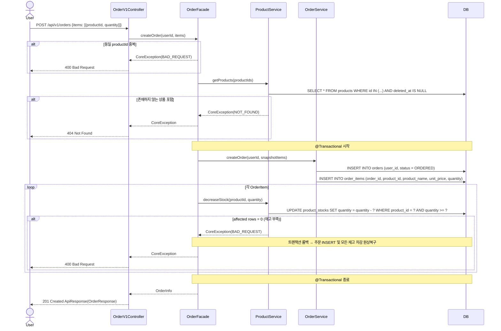
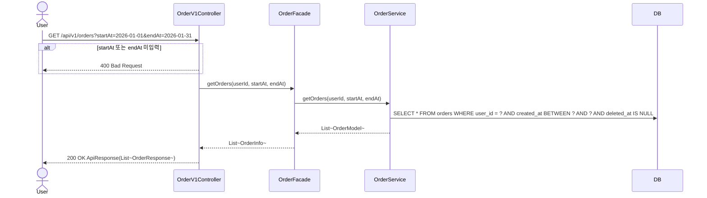
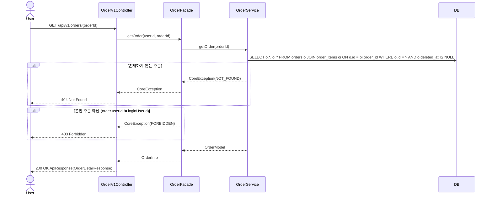
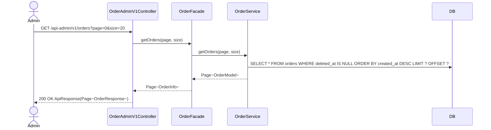
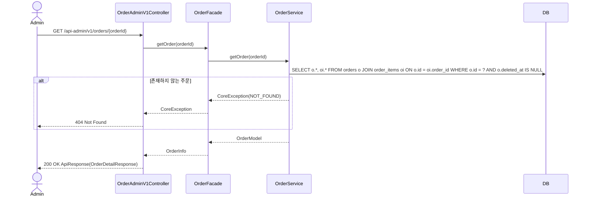

# Order Sequence Diagrams

## POST /api/v1/orders

---

## GET /api/v1/orders

---

## GET /api/v1/orders/{orderId}

---

## GET /api-admin/v1/orders

---

## GET /api-admin/v1/orders/{orderId}

