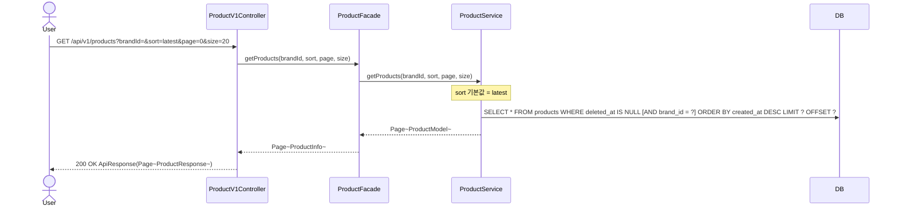
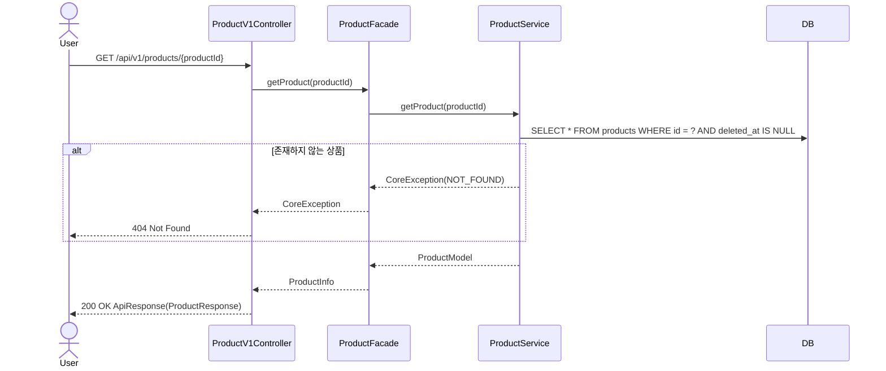
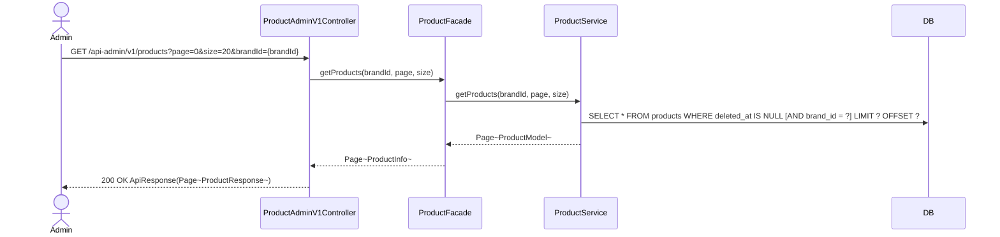
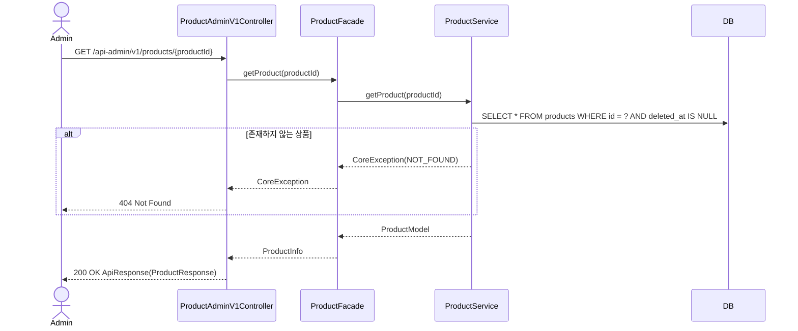
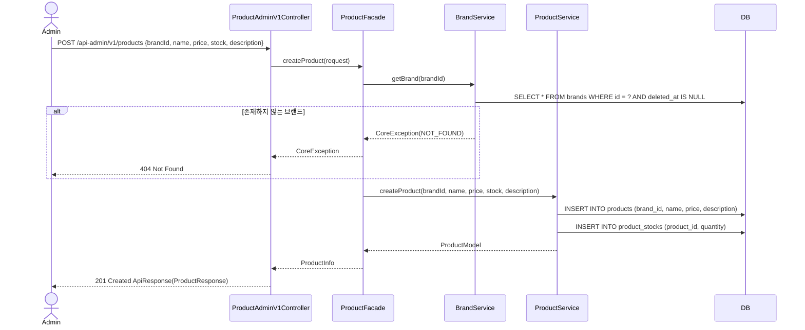
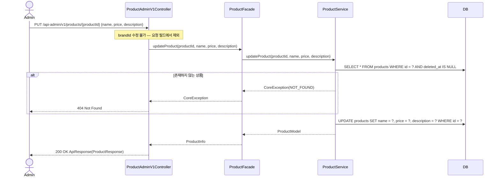
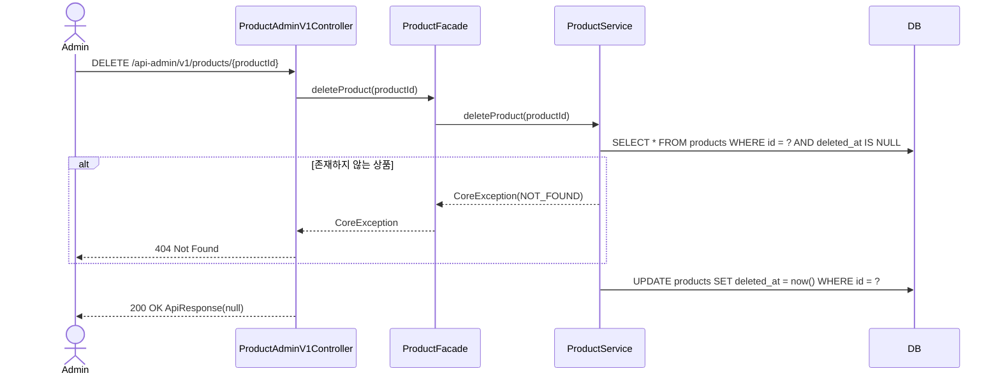

# Product Sequence Diagrams

## GET /api/v1/products

---

## GET /api/v1/products/{productId}

---

## GET /api-admin/v1/products

---

## GET /api-admin/v1/products/{productId}

---

## POST /api-admin/v1/products

---

## PUT /api-admin/v1/products/{productId}

---

## DELETE /api-admin/v1/products/{productId}

