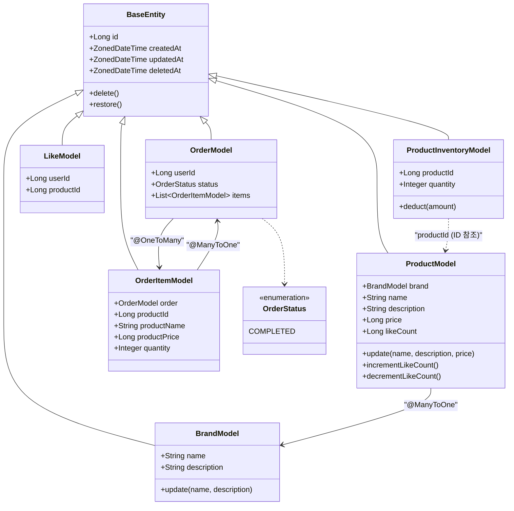

# 클래스 다이어그램

---

## 관계 설명

| 관계 | 방식 | 근거 |
|---|---|---|
| `ProductModel → BrandModel` | `@ManyToOne` | 상품 조회 시 브랜드명 JOIN 필요 |
| `ProductInventoryModel → ProductModel` | ID 참조 | 재고 테이블 분리, JPA 관계 불필요 (ADR-006) |
| `OrderModel → OrderItemModel` | `@OneToMany` | 동일 Aggregate, 생명주기 공유 |
| `OrderItemModel → OrderModel` | `@ManyToOne` | 동일 Aggregate |
| `OrderItemModel → Product` | ID + 스냅샷 컬럼 | 주문 시점 정보 보존 (ADR-001) |
| `LikeModel → User/Product` | ID 참조 | 존재 여부 확인만 필요 |
