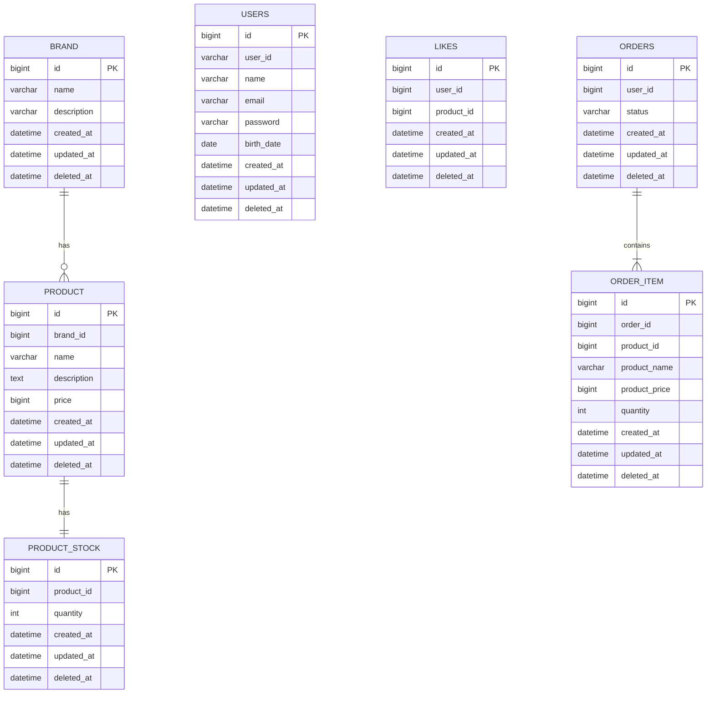
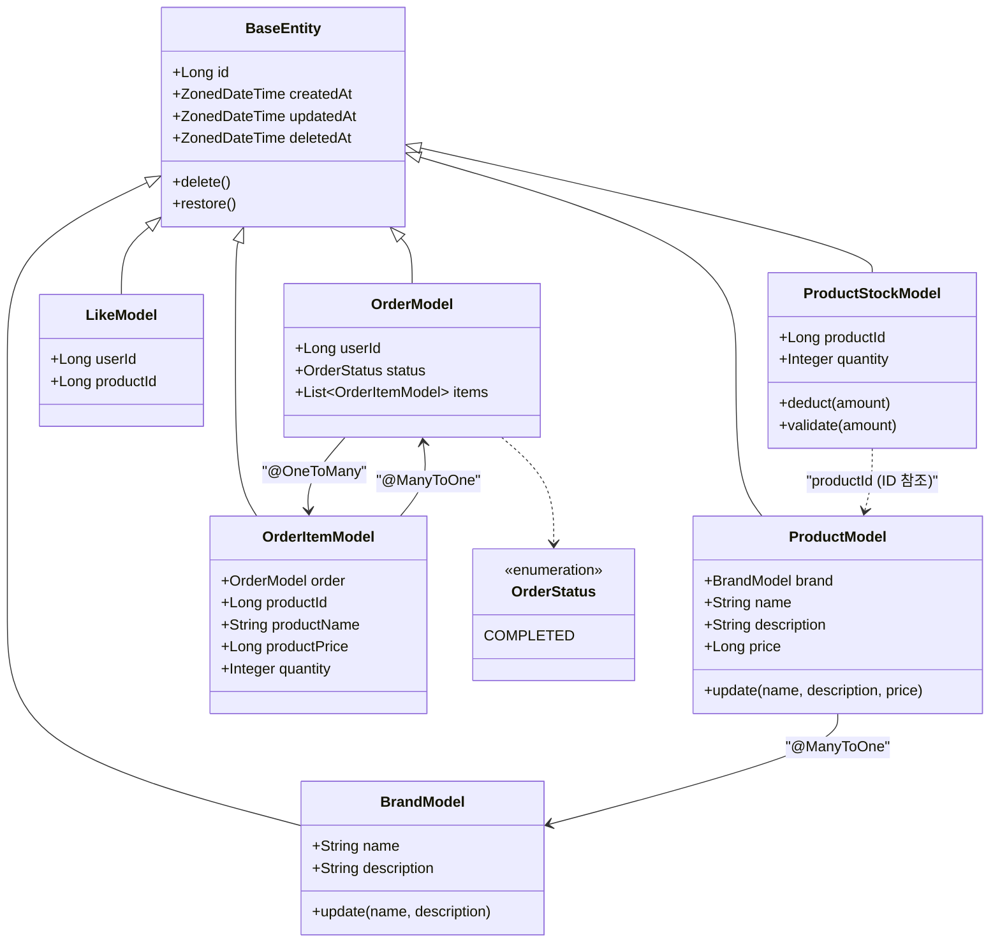

# Vol.2 소프트웨어 설계 문서

> 작성일: 2026-05-20
> 대상 요구사항: `docs/우리가 함께 만들어갈 단 하나의 감성 이커머스.md`

---

## 1. 개요

Vol.1 에서 구현된 User 도메인을 기반으로, 아래 4개 도메인을 추가 구현한다.

| 도메인 | 주요 기능 |
|---|---|
| Brand | 어드민 CRUD, 고객 단건 조회 |
| Product (확장) | Brand 연결, 좋아요 수 표시 |
| Like | 상품 좋아요 등록 / 취소 / 목록 조회 |
| Order | 주문 생성 / 조회 (재고 차감 + 스냅샷) |

---

## 2. 도메인 모델

### 핵심 설계 결정 요약

| 관계 | 방식 | 근거 |
|---|---|---|
| Product → Brand | `@ManyToOne` (NO_CONSTRAINT) | 상품 조회 시 브랜드명 JOIN 필요 |
| Like → User / Product | `userId`, `productId` Long | 존재 여부 확인만 필요, JPA 관계 불필요 |
| OrderItem → Order | `@ManyToOne` | 동일 Aggregate, 생명주기 공유 |
| OrderItem → Product | `productId` + 스냅샷 컬럼 | 주문 시점 정보 보존 (요구사항 명시) |
| Order → User | `userId` Long | 유저 변경과 주문 이력 분리 |

> 상세 결정 근거는 `docs/v3/adr/` 참고

---

## 3. ERD



> - `brand_id` (PRODUCT): FK 컬럼은 존재하나 DB 레벨 FK 제약조건 없음 (soft delete 환경 일관성 유지, ADR-005 참고)
> - `product_id` (PRODUCT_STOCK): 1:1 관계, ID만 저장, JPA 관계 없음 (ADR-006 참고)
> - `user_id` (LIKES / ORDERS): ID만 저장, JPA 관계 없음
> - `product_id` (LIKES / ORDER_ITEM): ID만 저장, JPA 관계 없음

---

## 4. 클래스 다이어그램



---

## 5. 레이어 구조 (도메인별)

기존 패턴(`interfaces → application → domain → infrastructure`)을 동일하게 따른다.

```
interfaces/api/
├── brand/
│   ├── BrandV1Controller         # Customer
│   ├── BrandAdminV1Controller    # Admin
│   └── BrandV1Dto
├── product/
│   ├── ProductV1Controller       # Customer
│   ├── ProductAdminV1Controller  # Admin
│   └── ProductV1Dto
├── like/
│   ├── LikeV1Controller
│   └── LikeV1Dto
└── order/
    ├── OrderV1Controller         # Customer
    ├── OrderAdminV1Controller    # Admin
    └── OrderV1Dto

application/
├── brand/   BrandFacade, BrandInfo
├── product/ ProductFacade, ProductInfo
├── like/    LikeFacade, LikeInfo
└── order/   OrderFacade, OrderInfo

domain/
├── brand/   BrandModel, BrandRepository, BrandService
├── product/ ProductModel, ProductStockModel,
│            ProductRepository, ProductStockRepository, ProductService
├── like/    LikeModel, LikeRepository, LikeService
└── order/   OrderModel, OrderItemModel, OrderRepository, OrderService

infrastructure/
├── brand/   BrandJpaRepository, BrandRepositoryImpl
├── product/ ProductJpaRepository, ProductRepositoryImpl,
│            ProductStockJpaRepository, ProductStockRepositoryImpl
├── like/    LikeJpaRepository, LikeRepositoryImpl
└── order/   OrderJpaRepository, OrderRepositoryImpl
```

---

## 6. API 엔드포인트

### Brand

**Customer**

| Method | URI | 설명 |
|---|---|---|
| GET | `/api/v1/brands/{brandId}` | 브랜드 단건 조회 |

**Admin**

| Method | URI | 설명 |
|---|---|---|
| GET | `/api-admin/v1/brands?page=0&size=20` | 브랜드 목록 |
| GET | `/api-admin/v1/brands/{brandId}` | 브랜드 단건 조회 |
| POST | `/api-admin/v1/brands` | 브랜드 등록 |
| PUT | `/api-admin/v1/brands/{brandId}` | 브랜드 수정 |
| DELETE | `/api-admin/v1/brands/{brandId}` | 브랜드 삭제 (연관 상품 함께 soft delete) |

### Product

**Customer**

| Method | URI | 설명 |
|---|---|---|
| GET | `/api/v1/products?brandId=&sort=latest&page=0&size=20` | 상품 목록 |
| GET | `/api/v1/products/{productId}` | 상품 단건 조회 |

**Admin**

| Method | URI | 설명 |
|---|---|---|
| GET | `/api-admin/v1/products?brandId=&page=0&size=20` | 상품 목록 |
| GET | `/api-admin/v1/products/{productId}` | 상품 단건 조회 |
| POST | `/api-admin/v1/products` | 상품 등록 (브랜드 존재 검증) |
| PUT | `/api-admin/v1/products/{productId}` | 상품 수정 (브랜드 변경 불가) |
| DELETE | `/api-admin/v1/products/{productId}` | 상품 삭제 |

### Like

**Customer**

| Method | URI | 설명 |
|---|---|---|
| POST | `/api/v1/products/{productId}/likes` | 좋아요 등록 |
| DELETE | `/api/v1/products/{productId}/likes` | 좋아요 취소 |
| GET | `/api/v1/users/{userId}/likes` | 내가 좋아요한 상품 목록 |

### Order

**Customer**

| Method | URI | 설명 |
|---|---|---|
| POST | `/api/v1/orders` | 주문 생성 |
| GET | `/api/v1/orders?startAt=&endAt=` | 내 주문 목록 |
| GET | `/api/v1/orders/{orderId}` | 주문 단건 조회 |

**Admin**

| Method | URI | 설명 |
|---|---|---|
| GET | `/api-admin/v1/orders?page=0&size=20` | 주문 목록 |
| GET | `/api-admin/v1/orders/{orderId}` | 주문 단건 조회 |

---

## 7. 응답 DTO 스펙

### Brand

```json
// GET /api/v1/brands/{brandId}
{ "id": 1, "name": "Nike", "description": "나이키입니다" }

// GET /api-admin/v1/brands/{brandId}
{ "id": 1, "name": "Nike", "description": "나이키입니다", "createdAt": "2026-05-20T10:00:00" }
```

### Product

```json
// GET /api/v1/products/{productId}  |  GET /api-admin/v1/products/{productId}
{
  "id": 1,
  "brandId": 2,
  "brandName": "Nike",
  "name": "에어맥스",
  "description": "편안한 러닝화",
  "price": 150000,
  "stock": 10,
  "likeCount": 42
}
```

### Like

```json
// GET /api/v1/users/{userId}/likes
{
  "content": [
    { "id": 1, "brandId": 2, "brandName": "Nike", "name": "에어맥스", "price": 150000, "likeCount": 42 }
  ],
  "page": 0,
  "size": 20,
  "totalElements": 1
}
```

### Order

```json
// POST /api/v1/orders 요청
{
  "items": [
    { "productId": 1, "quantity": 2 },
    { "productId": 3, "quantity": 1 }
  ]
}

// GET /api/v1/orders/{orderId} 응답
{
  "orderId": 10,
  "status": "COMPLETED",
  "items": [
    { "productId": 1, "productName": "에어맥스", "productPrice": 150000, "quantity": 2 }
  ],
  "createdAt": "2026-05-20T10:00:00"
}
```

---

## 8. 핵심 비즈니스 로직

### Brand 삭제

도메인 서비스 간 직접 호출은 금지한다. `BrandFacade`가 오케스트레이션을 담당한다.

```
BrandFacade.deleteBrand(brandId)
  ├── BrandService.delete(brandId) → brand 조회 후 brand.delete()
  └── ProductService.deleteAllByBrand(brandId) → 연관 상품 각각 product.delete()
```

### 상품 등록 / 수정

- 등록: `brandId`로 Brand 존재 여부 검증 후 ProductModel 생성
- 수정: 브랜드 변경 불가 — `brand` 필드는 update 메서드에서 제외

### 좋아요 등록 / 취소

```
POST  → userId + productId 조합 중복 확인 → 존재하면 409 Conflict
DELETE → userId + productId 조합 없으면 404 Not Found
```

좋아요 수: `LikeRepository.countByProductId(productId)` COUNT 쿼리 사용

### 주문 생성

```
1. 유저 인증 (X-Loopers-LoginId / LoginPw)
2. 요청 상품 목록 전체 조회 (product 테이블)
3. 각 상품의 ProductStock 조회 → 재고 확인
   → 하나라도 부족하면 전체 실패 (400 Bad Request)
4. 재고 차감 (productStock.deduct(quantity)) — product_stock 테이블에만 락
5. OrderModel + OrderItemModel 생성 (productName, productPrice 스냅샷)
6. @Transactional로 3~5 원자적 처리
```

> product 테이블과 product_stock 테이블이 분리되어 있으므로,
> 재고 차감 락이 상품 조회(product 테이블)에 영향을 주지 않는다.

### 어드민 인증

`X-Loopers-Ldap` 헤더 값 == `"loopers.admin"` 검증. 불일치 시 `403 Forbidden`.

---

## 9. 시퀀스 다이어그램

→ [`docs/v3/sequence.md`](./sequence.md) 참고 (전체 API 시퀀스 다이어그램)

---

## 10. 에러 처리

| 상황 | ErrorType | HTTP |
|---|---|---|
| 브랜드/상품/주문 없음 | `NOT_FOUND` | 404 |
| 이미 좋아요한 상품 재등록 | `CONFLICT` | 409 |
| 재고 부족 | `BAD_REQUEST` | 400 |
| 브랜드 변경 시도 (상품 수정) | `BAD_REQUEST` | 400 |
| 어드민 헤더 불일치 | `FORBIDDEN` | 403 |

> `FORBIDDEN` ErrorType 추가 필요

---

## 11. ADR 목록

| 번호 | 제목 | 파일 |
|---|---|---|
| ADR-001 | OrderItem 스냅샷 패턴 | `adr/001-order-item-snapshot.md` |
| ADR-002 | 어드민 인증 헤더 검증 | `adr/002-admin-auth-header.md` |
| ADR-003 | 좋아요 수 COUNT 쿼리 | `adr/003-like-count-query.md` |
| ADR-004 | 상품 응답에 브랜드명 포함 | `adr/004-product-brand-response.md` |
| ADR-005 | @ManyToOne FK 제약조건 제거 | `adr/005-jpa-no-fk-constraint.md` |
| ADR-006 | 재고 별도 테이블 분리 | `adr/006-product-stock-table.md` |
