# 시퀀스 다이어그램

> 인증(유저 헤더 검증, 어드민 LDAP 검증) 로직은 핵심 비즈니스 흐름에 집중하기 위해 흐름에서 생략한다.
> 인증 필요 여부는 제목 배지와 다이어그램 상단 Note로 표시한다.

| 배지 | 의미 |
|---|---|
| `🔐 User` | X-Loopers-LoginId / X-Loopers-LoginPw 헤더 필요 |
| `🔐 Admin` | X-Loopers-Ldap: loopers.admin 헤더 필요 |
| (없음) | 인증 불필요 |

---

## Brand

### GET /api/v1/brands/{brandId} — 브랜드 단건 조회

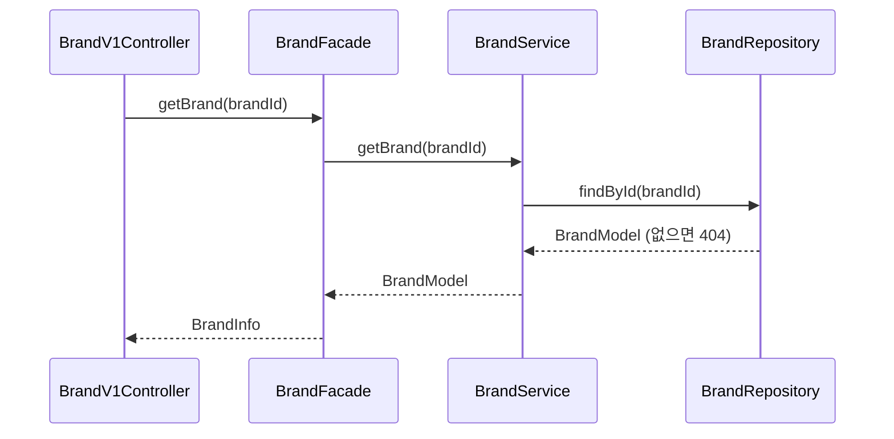

---

### GET /api-admin/v1/brands — 브랜드 목록 조회 `🔐 Admin`


---

### GET /api-admin/v1/brands/{brandId} — 브랜드 단건 조회 `🔐 Admin`

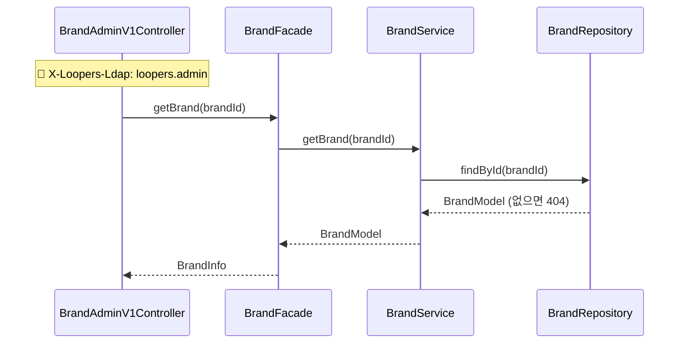

---

### POST /api-admin/v1/brands — 브랜드 등록 `🔐 Admin`

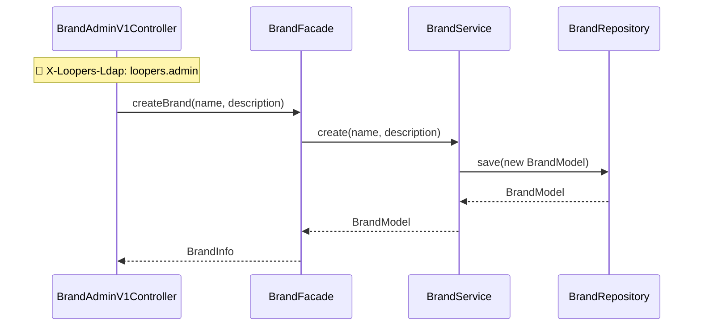

---

### PUT /api-admin/v1/brands/{brandId} — 브랜드 수정 `🔐 Admin`

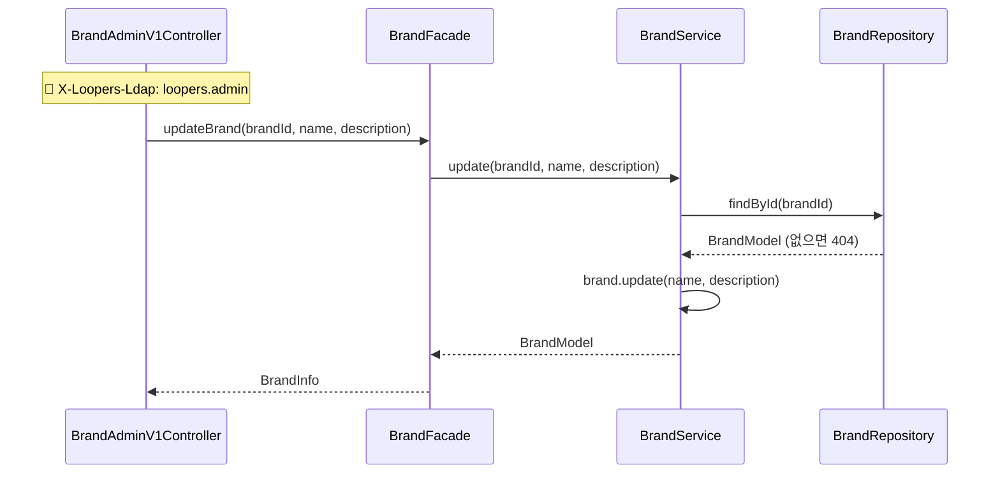

---

### DELETE /api-admin/v1/brands/{brandId} — 브랜드 삭제 `🔐 Admin`

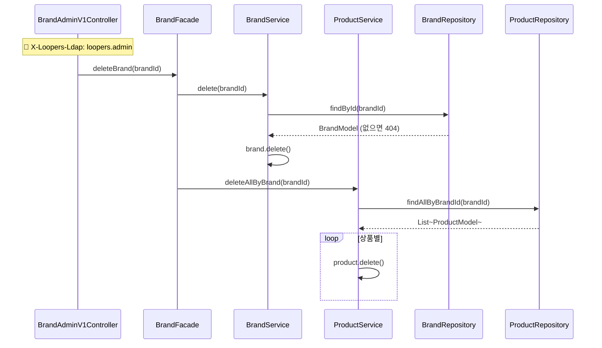

---

## Product

### GET /api/v1/products — 상품 목록 조회

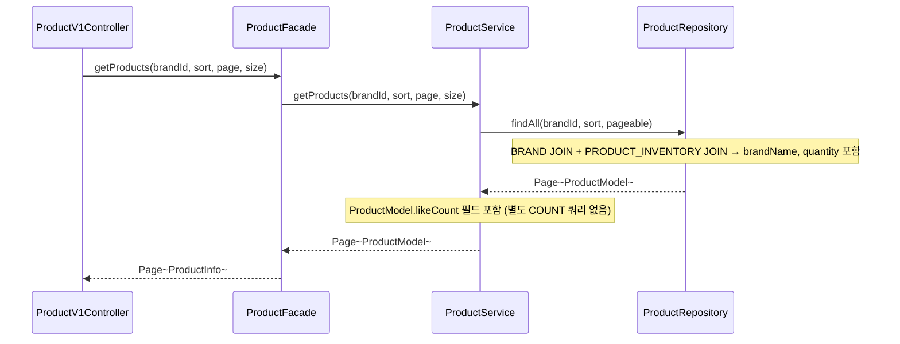

---

### GET /api/v1/products/{productId} — 상품 단건 조회

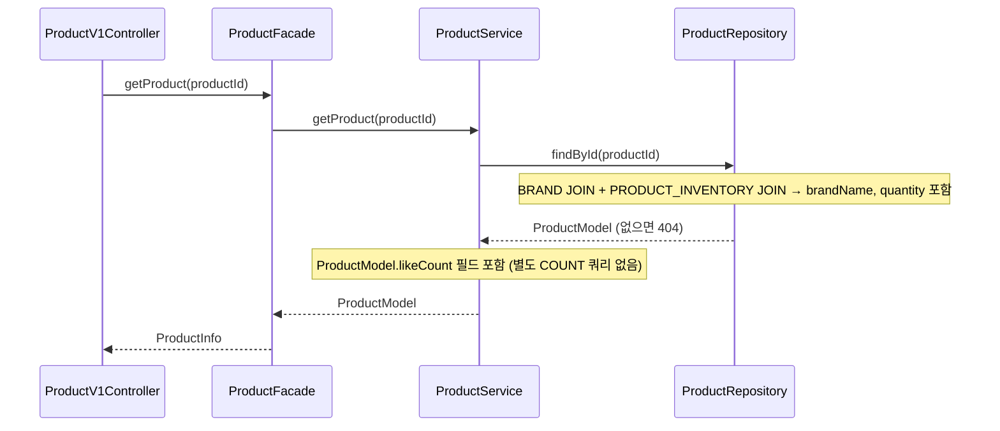

---

### GET /api-admin/v1/products — 상품 목록 조회 `🔐 Admin`

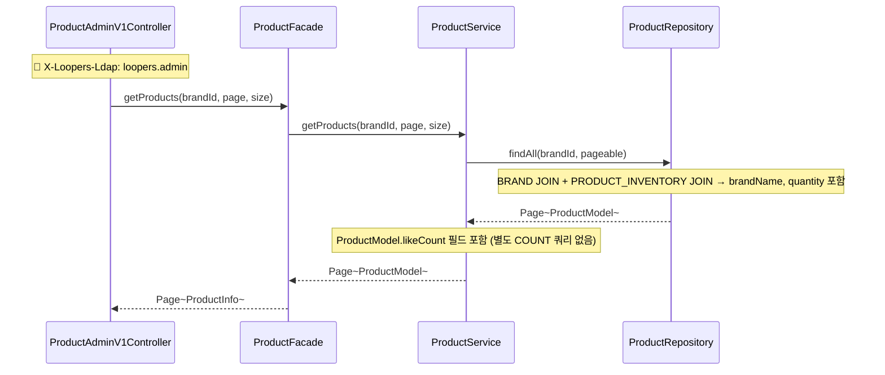

---

### GET /api-admin/v1/products/{productId} — 상품 단건 조회 `🔐 Admin`

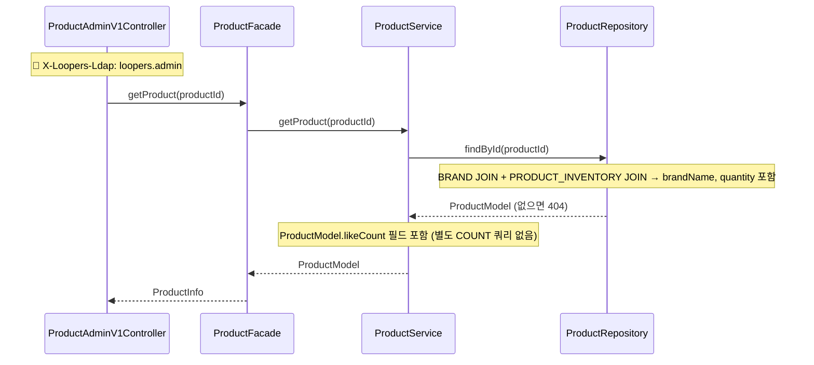

---

### POST /api-admin/v1/products — 상품 등록 `🔐 Admin`

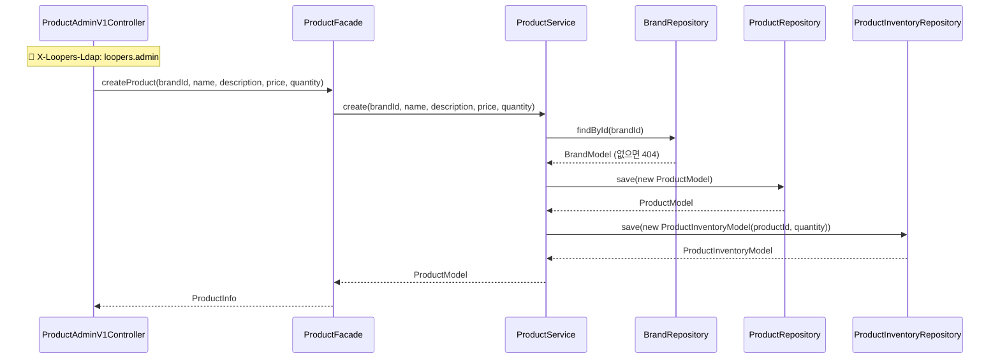

---

### PUT /api-admin/v1/products/{productId} — 상품 수정 `🔐 Admin`

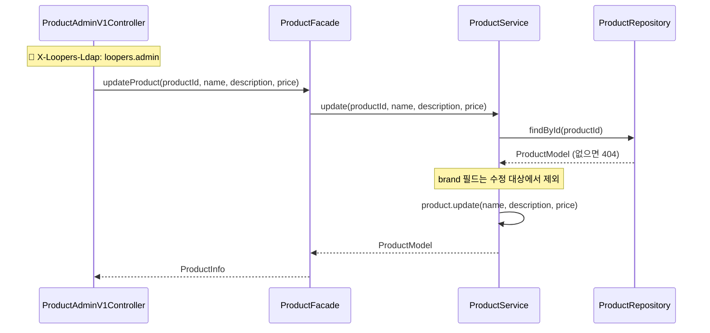

---

### DELETE /api-admin/v1/products/{productId} — 상품 삭제 `🔐 Admin`

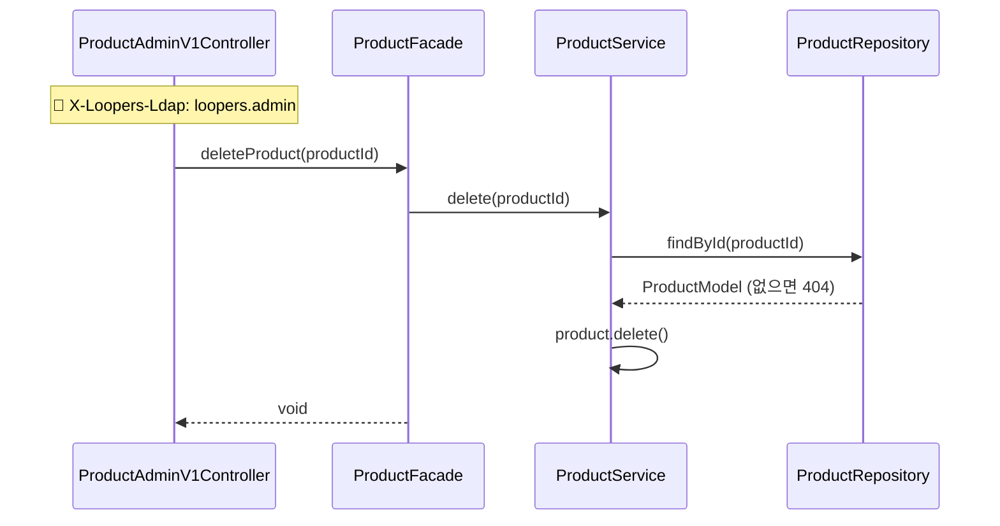

---

## Like

### POST /api/v1/products/{productId}/likes — 좋아요 등록 `🔐 User`

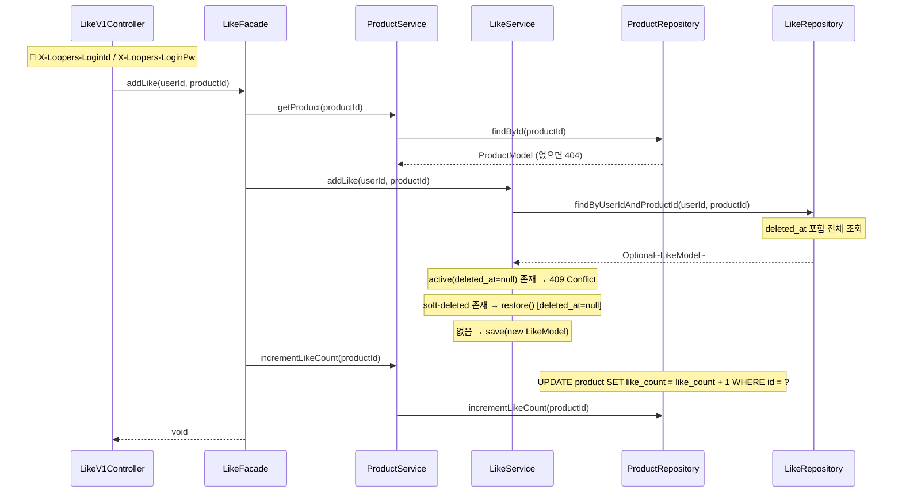

---

### DELETE /api/v1/products/{productId}/likes — 좋아요 취소 `🔐 User`

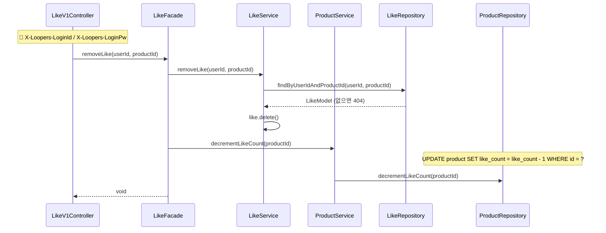

---

### GET /api/v1/users/{userId}/likes — 내가 좋아요한 상품 목록 `🔐 User`

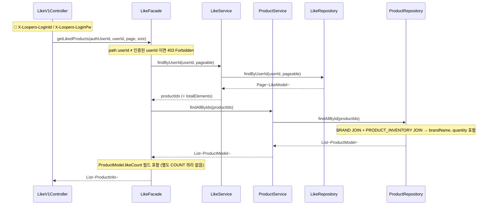

---

## Order

### POST /api/v1/orders — 주문 생성 `🔐 User`

> 흐름: 상품 조회(재고 포함) → 재고 확인(fast fail) → 주문 생성 → 재고 차감
> 상품 조회 시 PRODUCT_INVENTORY JOIN으로 quantity를 함께 가져오므로 별도 재고 조회 불필요.
> fast-fail은 명백한 재고 부족을 조기 차단하는 역할이며, 실제 원자성은 재고 차감 단계의 FOR UPDATE 락이 보장한다.
> 재고 차감 실패 시 @Transactional로 주문 생성까지 전체 롤백된다.

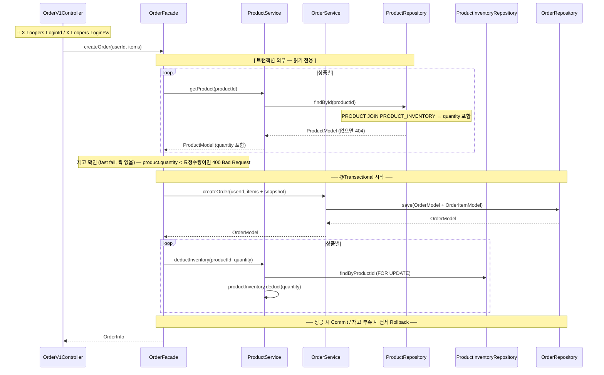

---

### GET /api/v1/orders — 내 주문 목록 조회 `🔐 User`

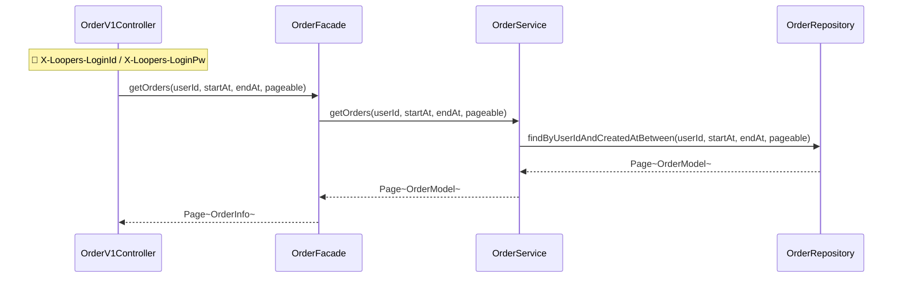

---

### GET /api/v1/orders/{orderId} — 주문 단건 조회 `🔐 User`

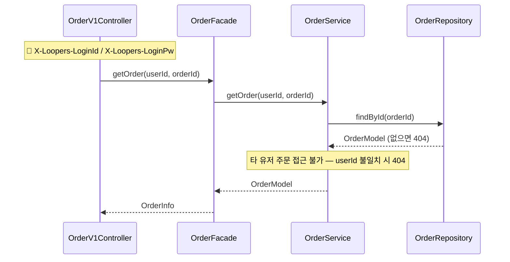

---

### GET /api-admin/v1/orders — 주문 목록 조회 `🔐 Admin`

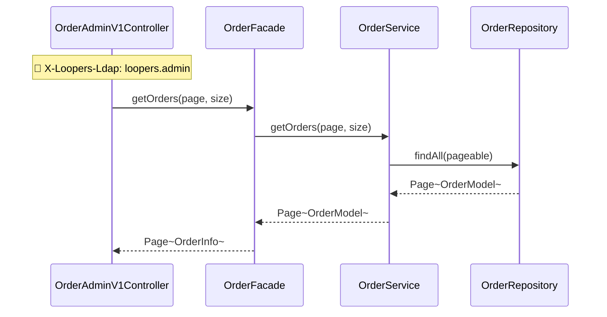

---

### GET /api-admin/v1/orders/{orderId} — 주문 단건 조회 `🔐 Admin`

```mermaid
sequenceDiagram
    Note over OrderAdminV1Controller: 🔐 X-Loopers-Ldap: loopers.admin
    participant OrderAdminV1Controller
    participant OrderFacade
    participant OrderService
    participant OrderRepository

    OrderAdminV1Controller->>OrderFacade: getOrder(orderId)
    OrderFacade->>OrderService: getOrder(orderId)
    OrderService->>OrderRepository: findById(orderId)
    OrderRepository-->>OrderService: OrderModel (없으면 404)
    OrderService-->>OrderFacade: OrderModel
    OrderFacade-->>OrderAdminV1Controller: OrderInfo
```
