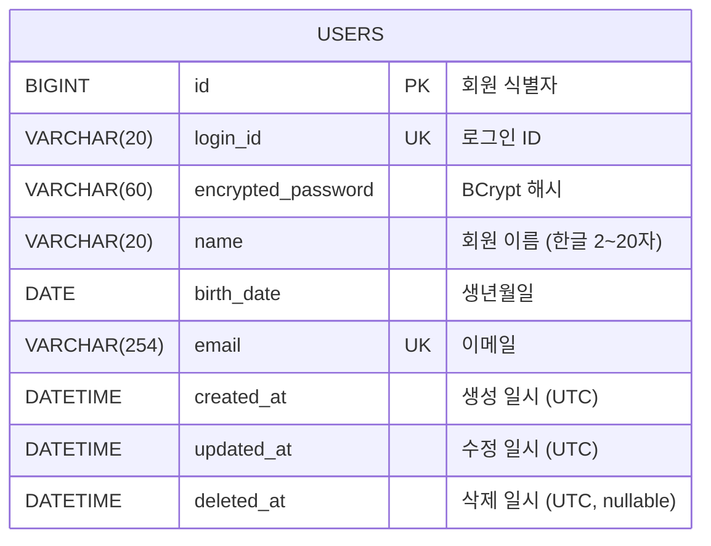

# volume-1 ERD

본 문서는 volume-1 전체 기능에서 사용되는 RDB 스키마를 누적 관리한다.

## 공통 컨벤션

- 엔진: `InnoDB`
- 문자셋 / Collation: `utf8mb4` / `utf8mb4_unicode_ci`
- PK: `BIGINT AUTO_INCREMENT`
- 시간 컬럼: `DATETIME`. 모든 행은 **UTC wall-clock** 시각을 저장한다. Hibernate의 `spring.jpa.properties.hibernate.timezone.default_storage=NORMALIZE_UTC` + `hibernate.jdbc.time_zone=UTC` 설정에 의해 보장된다.
- Soft delete: 모든 테이블이 `BaseEntity`(`modules/jpa`)를 상속받아 `created_at`, `updated_at`, `deleted_at`(nullable) 세 컬럼을 공통 보유한다.

## 다이어그램



## 테이블 정의

### `users` — 회원

회원가입(volume-1 / 회원가입)에서 추가.

```sql
CREATE TABLE users (
    id                 BIGINT       NOT NULL AUTO_INCREMENT COMMENT '회원 식별자',
    login_id           VARCHAR(20)  NOT NULL COMMENT '로그인 ID (영문 대소문자/숫자, 4~20자)',
    encrypted_password VARCHAR(60)  NOT NULL COMMENT 'BCrypt 해시 비밀번호 (60자 고정)',
    name               VARCHAR(20)  NOT NULL COMMENT '회원 이름 (한글 완성형, 2~20자)',
    birth_date         DATE         NOT NULL COMMENT '생년월일',
    email              VARCHAR(254) NOT NULL COMMENT '이메일 주소 (RFC 5322, 최대 254자)',
    created_at         DATETIME     NOT NULL COMMENT '생성 일시 (UTC)',
    updated_at         DATETIME     NOT NULL COMMENT '수정 일시 (UTC)',
    deleted_at         DATETIME     NULL     COMMENT '삭제 일시 (UTC, soft delete. NULL이면 활성)',
    PRIMARY KEY (id),
    UNIQUE KEY uk_users_login_id (login_id),
    UNIQUE KEY uk_users_email    (email)
) ENGINE=InnoDB
  DEFAULT CHARSET=utf8mb4
  COLLATE=utf8mb4_unicode_ci
  COMMENT='회원';
```

**비고**

- `user`는 일부 RDBMS에서 예약어이고 MySQL에서도 함수와 충돌 가능성이 있어 복수형 `users`로 채택.
- `encrypted_password`는 BCrypt 출력 길이 60자에 맞춰 `VARCHAR(60)`로 고정.
- `email`은 RFC 5321 path 제한인 254자에 맞춰 `VARCHAR(254)`.
- `name` 길이는 한글 완성형 20자 기준. `utf8mb4`에서 `VARCHAR(N)`은 N개 문자 단위이므로 추가 마진 불필요.
